# RAFlow 实时语音转文字工具详细设计文档

## 1. 项目概述

RAFlow 是一个基于 ElevenLabs Scribe v2 Realtime API 和 Tauri 2.0 框架构建的系统级实时语音转文字工具。该工具实现系统托盘常驻、全局热键响应、实时音频流处理以及智能文本注入机制，为用户提供类似 Wispr Flow 的无缝语音输入体验。

### 1.1 核心目标

- **超低延迟转录**：利用 Scribe v2 的 150ms 延迟实现近实时转录
- **系统级集成**：通过全局热键和智能文本注入实现跨应用无缝使用
- **高准确度**：支持 90+ 种语言和专业术语识别
- **轻量级驻留**：利用 Tauri 2.0 实现低资源占用的后台常驻

### 1.2 技术栈版本（2025年12月最新）

| 组件 | 技术选型 | 版本 | 说明 |
|------|---------|------|------|
| 桌面框架 | Tauri | 2.0+ | 跨平台桌面应用框架 |
| 前端框架 | React + TypeScript | 18.x | UI 层实现 |
| 后端语言 | Rust | 1.90+ | 系统交互和音频处理 |
| 语音转文字 | ElevenLabs Scribe v2 | Realtime | WebSocket 实时转录 |
| 音频采集 | cpal | 0.17 | 跨平台音频 I/O |
| 键盘模拟 | enigo | 0.6.1 | 跨平台输入模拟 |
| 全局热键 | tauri-plugin-global-shortcut | 2.0.0 | 全局快捷键 |
| 剪贴板 | tauri-plugin-clipboard-manager | 2.0.0 | 剪贴板管理 |
| JS SDK | @elevenlabs/client | 0.12.2 | ElevenLabs 官方 SDK |

## 2. 系统架构设计

### 2.1 整体架构

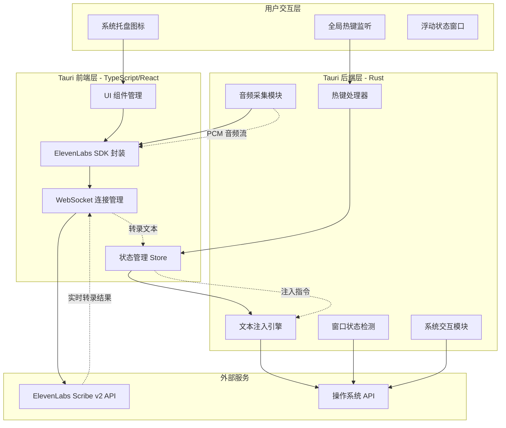

### 2.2 分层架构设计

```mermaid
graph LR
    subgraph "表示层"
        UI[React UI 组件]
        Tray[托盘菜单]
        Float[浮动窗口]
    end

    subgraph "业务逻辑层"
        State[状态管理]
        Trans[转录协调器]
        Inject[注入策略]
    end

    subgraph "服务层"
        Audio[音频服务]
        WS[WebSocket 服务]
        Sys[系统服务]
    end

    subgraph "基础设施层"
        Cpal[cpal 音频]
        Enigo[enigo 输入]
        Plugin[Tauri 插件]
    end

    UI --> State
    Tray --> State
    Float --> State
    State --> Trans
    Trans --> Inject
    Trans --> WS
    Inject --> Sys
    Audio --> Cpal
    WS --> |@elevenlabs/client| EL[ElevenLabs API]
    Sys --> Enigo
    Sys --> Plugin
```

## 3. 核心模块设计

### 3.1 音频采集模块

#### 3.1.1 架构设计

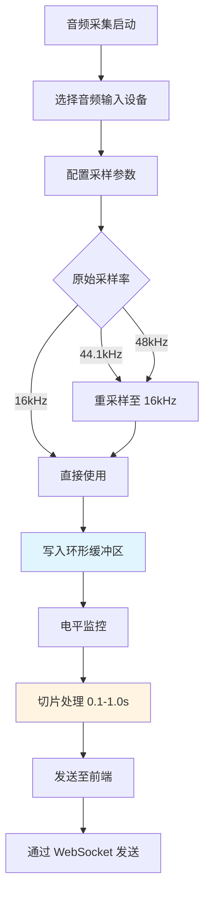

#### 3.1.2 实现细节

**Rust 后端代码结构**：

```rust
// src-tauri/src/audio/mod.rs

use cpal::traits::{DeviceTrait, HostTrait, StreamTrait};
use ringbuf::RingBuffer;

pub struct AudioCaptureConfig {
    pub sample_rate: u32,        // 16000 Hz
    pub channels: u16,           // 1 (mono)
    pub chunk_duration_ms: u32,  // 100-1000 ms
}

pub struct AudioCapture {
    config: AudioCaptureConfig,
    stream: Option<cpal::Stream>,
    ring_buffer: Arc<RingBuffer<f32>>,
    level_monitor: Arc<Mutex<LevelMonitor>>,
}

impl AudioCapture {
    pub fn start(&mut self, on_chunk: impl Fn(Vec<u8>) + Send + 'static) {
        let host = cpal::default_host();
        let device = host.default_input_device()
            .expect("No input device available");

        let config = device.default_input_config()
            .expect("Failed to get default config");

        // 配置重采样器
        let resampler = self.create_resampler(
            config.sample_rate().0,
            self.config.sample_rate
        );

        // 构建音频流
        let stream = device.build_input_stream(
            &config.into(),
            move |data: &[f32], _: &_| {
                // 重采样
                let resampled = resampler.process(data);

                // 写入环形缓冲区
                self.ring_buffer.push_slice(&resampled);

                // 更新电平
                self.level_monitor.lock().unwrap()
                    .update(calculate_rms(data));

                // 检查是否有完整的块
                if self.has_complete_chunk() {
                    let chunk = self.extract_chunk();
                    on_chunk(pcm_to_bytes(chunk));
                }
            },
            |err| eprintln!("Audio error: {}", err),
        ).expect("Failed to build stream");

        stream.play().expect("Failed to play stream");
        self.stream = Some(stream);
    }
}
```

**关键技术点**：

1. **环形缓冲区**：防止主线程阻塞导致丢帧
2. **重采样**：统一转换为 16kHz PCM
3. **电平监控**：实时计算 RMS 值用于 UI 展示
4. **块大小控制**：平衡延迟和网络开销（建议 0.2-0.5 秒）

### 3.2 WebSocket 转录模块

#### 3.2.1 连接流程

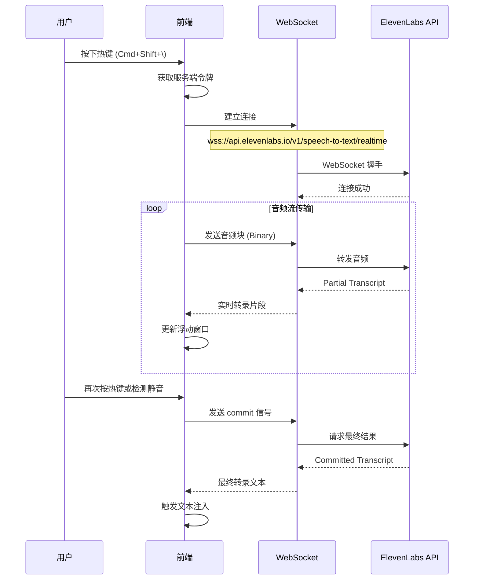

#### 3.2.2 TypeScript 实现

```typescript
// src/services/transcription.ts

import { Scribe, AudioFormat, CommitStrategy } from '@elevenlabs/client';

export interface TranscriptionConfig {
  modelId: string;
  audioFormat: AudioFormat;
  languageCode?: string;
  commitStrategy: CommitStrategy;
  vadSilenceThreshold?: number;
}

export class TranscriptionService {
  private connection: Scribe | null = null;
  private isRecording = false;

  async start(
    config: TranscriptionConfig,
    callbacks: {
      onPartial: (text: string) => void;
      onCommit: (text: string) => void;
      onError: (error: Error) => void;
    }
  ) {
    try {
      // 从后端获取单次令牌
      const token = await invoke<string>('get_elevenlabs_token');

      this.connection = await Scribe.connect({
        token,
        modelId: config.modelId || 'scribe_v2_realtime',
        audioFormat: config.audioFormat || AudioFormat.PCM_16000,
        languageCode: config.languageCode,
        commitStrategy: config.commitStrategy || CommitStrategy.VAD,
        vadSilenceThreshold: config.vadSilenceThreshold || 1.5,

        onPartialTranscript: (data) => {
          callbacks.onPartial(data.text);
        },

        onCommittedTranscript: (data) => {
          callbacks.onCommit(data.text);
        },

        onError: (error) => {
          callbacks.onError(new Error(error.message));
        }
      });

      this.isRecording = true;

      // 开始音频采集
      await invoke('start_audio_capture');

      // 监听来自 Rust 的音频块
      await listen<Uint8Array>('audio-chunk', (event) => {
        if (this.connection && this.isRecording) {
          this.connection.sendAudio(event.payload);
        }
      });

    } catch (error) {
      callbacks.onError(error as Error);
    }
  }

  async stop() {
    this.isRecording = false;
    await invoke('stop_audio_capture');

    if (this.connection) {
      await this.connection.close();
      this.connection = null;
    }
  }

  async manualCommit() {
    if (this.connection) {
      await this.connection.commit();
    }
  }
}
```

#### 3.2.3 连接参数配置

| 参数 | 推荐值 | 说明 |
|------|--------|------|
| `model_id` | `scribe_v2_realtime` | 使用最新的实时模型 |
| `audio_format` | `PCM_16000` | 16kHz 单声道 PCM |
| `commit_strategy` | `VAD` | 自动静音检测提交 |
| `vad_silence_threshold` | `1.5` | 1.5秒静音后自动提交 |
| `language_code` | `zh` / `en` | 预设语言提升准确率 |

### 3.3 系统集成模块

#### 3.3.1 全局热键处理

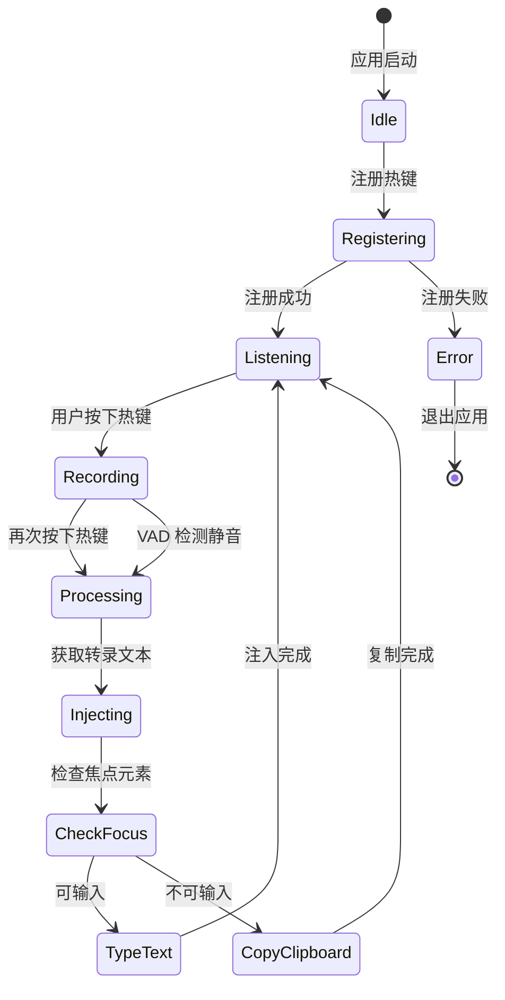

**Rust 实现**：

```rust
// src-tauri/src/hotkey.rs

use tauri::Manager;
use tauri_plugin_global_shortcut::{GlobalShortcutExt, Shortcut};

pub fn setup_global_shortcut(app: &tauri::App) -> Result<(), Box<dyn std::error::Error>> {
    let app_handle = app.handle();

    // 根据操作系统设置不同的快捷键
    let shortcut_str = if cfg!(target_os = "macos") {
        "Command+Shift+Backslash"
    } else {
        "Ctrl+Shift+Backslash"
    };

    let shortcut = shortcut_str.parse::<Shortcut>()?;

    app.global_shortcut().register(shortcut, move || {
        // 获取当前状态
        let state = app_handle.state::<AppState>();
        let mut is_recording = state.is_recording.lock().unwrap();

        if *is_recording {
            // 停止录音
            *is_recording = false;
            app_handle.emit_all("stop-recording", ()).unwrap();
        } else {
            // 开始录音
            *is_recording = true;
            app_handle.emit_all("start-recording", ()).unwrap();
        }
    })?;

    Ok(())
}
```

#### 3.3.2 智能文本注入流程

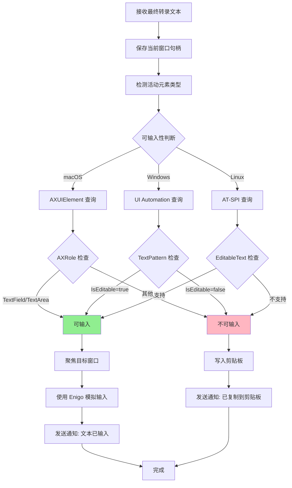

**Rust 实现**：

```rust
// src-tauri/src/injection.rs

use enigo::{Enigo, Key, KeyboardControllable};
use tauri_plugin_clipboard_manager::ClipboardExt;

pub enum InjectionStrategy {
    Direct,
    Clipboard,
}

pub struct TextInjector {
    enigo: Enigo,
}

impl TextInjector {
    pub fn new() -> Self {
        Self {
            enigo: Enigo::new(),
        }
    }

    pub async fn inject(
        &mut self,
        app: &tauri::AppHandle,
        text: &str
    ) -> Result<(), Box<dyn std::error::Error>> {
        // 检测当前焦点元素是否可输入
        let is_editable = self.check_focus_editable().await?;

        if is_editable {
            // 直接输入
            self.type_text(text)?;
            self.notify_success(app, "文本已输入").await?;
        } else {
            // 回退到剪贴板
            app.clipboard().write_text(text)?;
            self.notify_info(app, "文本已复制到剪贴板，请手动粘贴").await?;
        }

        Ok(())
    }

    fn type_text(&mut self, text: &str) -> Result<(), Box<dyn std::error::Error>> {
        // 短暂延迟确保窗口获得焦点
        std::thread::sleep(std::time::Duration::from_millis(100));

        // 使用 Enigo 输入文本
        self.enigo.key_sequence(text);

        Ok(())
    }

    #[cfg(target_os = "macos")]
    async fn check_focus_editable(&self) -> Result<bool, Box<dyn std::error::Error>> {
        // 使用 macOS Accessibility API
        // 注意：需要 accessibility-sys crate
        use accessibility_sys::*;

        unsafe {
            let app = AXUIElementCreateSystemWide();
            let mut focused_element: AXUIElementRef = std::ptr::null_mut();

            let result = AXUIElementCopyAttributeValue(
                app,
                kAXFocusedUIElementAttribute,
                &mut focused_element as *mut _ as *mut _
            );

            if result == kAXErrorSuccess && !focused_element.is_null() {
                let mut role: CFStringRef = std::ptr::null_mut();
                AXUIElementCopyAttributeValue(
                    focused_element,
                    kAXRoleAttribute,
                    &mut role as *mut _ as *mut _
                );

                if !role.is_null() {
                    let role_str = CFString::wrap_under_get_rule(role).to_string();
                    return Ok(
                        role_str == "AXTextField" ||
                        role_str == "AXTextArea" ||
                        role_str == "AXComboBox"
                    );
                }
            }
        }

        Ok(false)
    }

    #[cfg(target_os = "windows")]
    async fn check_focus_editable(&self) -> Result<bool, Box<dyn std::error::Error>> {
        // 使用 Windows UI Automation
        // 注意：需要 windows-rs crate
        use windows::UI::Automation::*;

        let automation = UIAutomation::new()?;
        let focused = automation.GetFocusedElement()?;

        // 检查是否支持 TextPattern
        let text_pattern_id = UIA_TextPatternId;
        let value = focused.GetCurrentPropertyValue(text_pattern_id)?;

        Ok(!value.is_empty())
    }

    #[cfg(target_os = "linux")]
    async fn check_focus_editable(&self) -> Result<bool, Box<dyn std::error::Error>> {
        // Linux 使用 AT-SPI (需要额外的 crate)
        // 由于环境复杂性，建议默认使用剪贴板模式
        Ok(false)
    }
}
```

### 3.4 系统托盘与窗口管理

#### 3.4.1 托盘设计

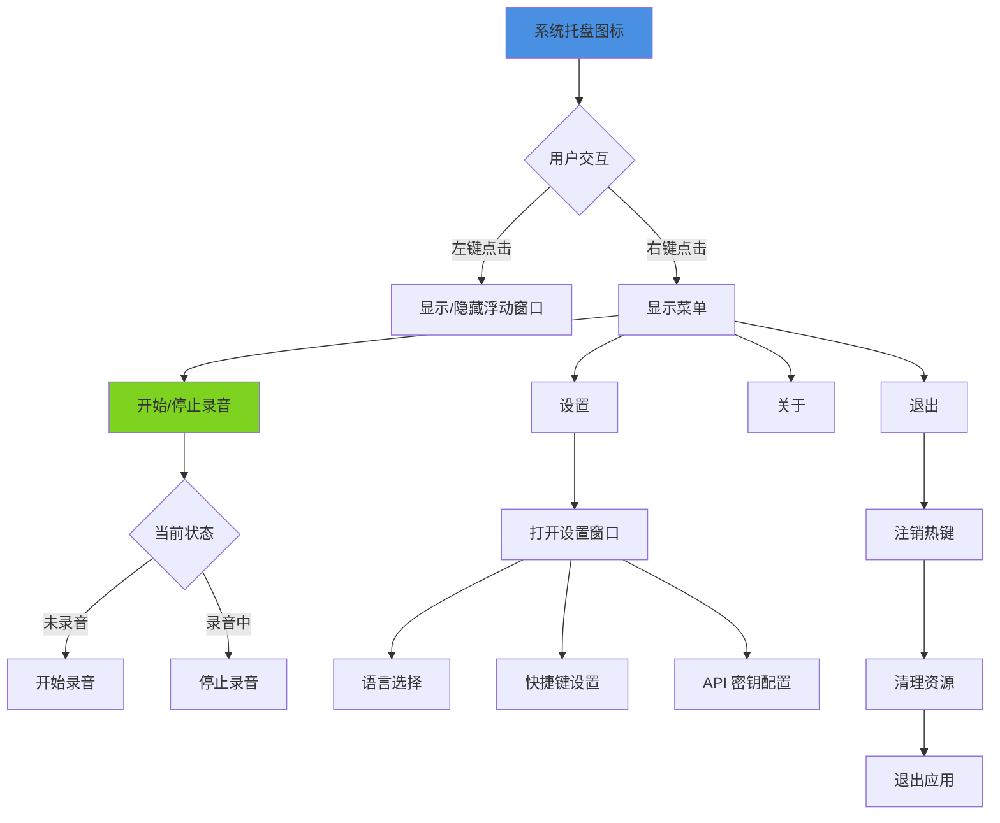

**Rust 实现**：

```rust
// src-tauri/src/tray.rs

use tauri::{
    menu::{Menu, MenuItem},
    tray::{TrayIconBuilder, TrayIconEvent},
    Manager, Runtime,
};

pub fn setup_tray<R: Runtime>(app: &tauri::App<R>) -> Result<(), Box<dyn std::error::Error>> {
    let toggle_recording = MenuItem::with_id(
        app,
        "toggle_recording",
        "开始录音",
        true,
        None::<&str>,
    )?;

    let settings = MenuItem::with_id(
        app,
        "settings",
        "设置",
        true,
        None::<&str>,
    )?;

    let quit = MenuItem::with_id(
        app,
        "quit",
        "退出",
        true,
        None::<&str>,
    )?;

    let menu = Menu::with_items(
        app,
        &[&toggle_recording, &settings, &quit],
    )?;

    let _tray = TrayIconBuilder::new()
        .icon(app.default_window_icon().unwrap().clone())
        .menu(&menu)
        .on_menu_event(move |app, event| {
            match event.id.as_ref() {
                "toggle_recording" => {
                    // 切换录音状态
                    app.emit_all("toggle-recording", ()).unwrap();
                }
                "settings" => {
                    // 打开设置窗口
                    if let Some(window) = app.get_window("settings") {
                        window.show().unwrap();
                        window.set_focus().unwrap();
                    }
                }
                "quit" => {
                    app.exit(0);
                }
                _ => {}
            }
        })
        .on_tray_icon_event(|tray, event| {
            if let TrayIconEvent::Click { button_state, .. } = event {
                // 左键点击显示主窗口
                if button_state == tauri::tray::MouseButtonState::Up {
                    let app = tray.app_handle();
                    if let Some(window) = app.get_window("main") {
                        if window.is_visible().unwrap() {
                            window.hide().unwrap();
                        } else {
                            window.show().unwrap();
                            window.set_focus().unwrap();
                        }
                    }
                }
            }
        })
        .build(app)?;

    Ok(())
}
```

#### 3.4.2 浮动状态窗口

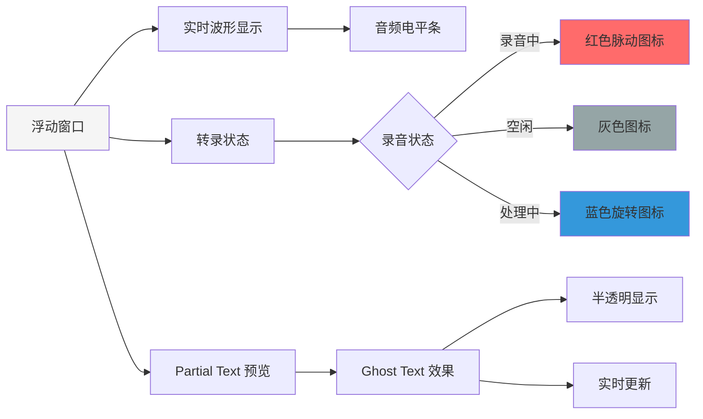

**React 实现**：

```typescript
// src/components/FloatingWindow.tsx

import React, { useEffect, useState } from 'react';
import { listen } from '@tauri-apps/api/event';

interface FloatingWindowProps {
  isRecording: boolean;
  partialText: string;
  audioLevel: number;
}

export const FloatingWindow: React.FC<FloatingWindowProps> = ({
  isRecording,
  partialText,
  audioLevel
}) => {
  return (
    <div className={`floating-window ${isRecording ? 'recording' : 'idle'}`}>
      <div className="status-indicator">
        {isRecording && <div className="pulse-icon" />}
      </div>

      <div className="audio-visualizer">
        <div
          className="level-bar"
          style={{ width: `${audioLevel * 100}%` }}
        />
      </div>

      <div className="partial-text">
        {partialText || '按 Cmd+Shift+\\ 开始录音...'}
      </div>
    </div>
  );
};
```

## 4. 数据流设计

### 4.1 完整转录流程

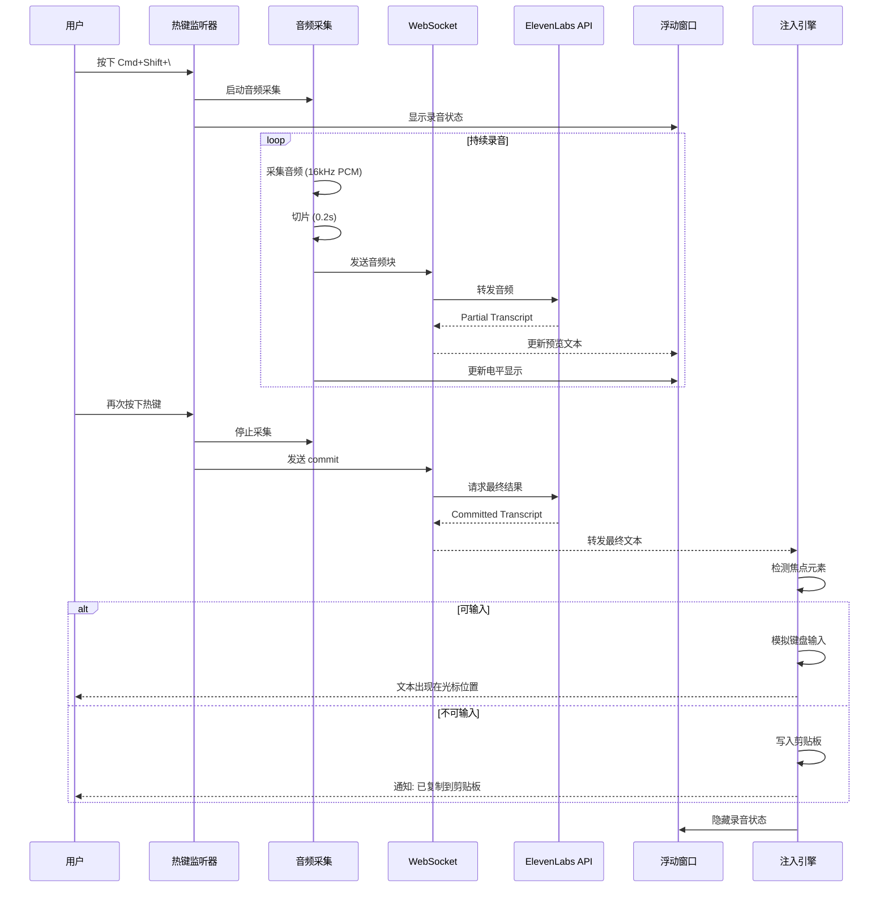

### 4.2 状态管理

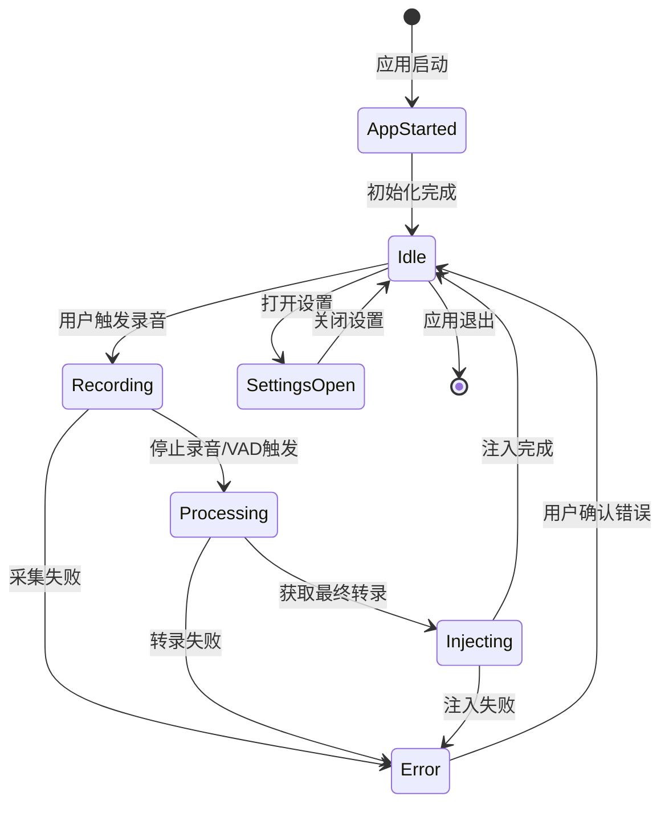

## 5. 关键技术实现

### 5.1 音频优化策略

#### 5.1.1 重采样实现

```rust
// src-tauri/src/audio/resampler.rs

use rubato::{Resampler, SincFixedIn, InterpolationType, InterpolationParameters, WindowFunction};

pub struct AudioResampler {
    resampler: SincFixedIn<f32>,
    input_rate: u32,
    output_rate: u32,
}

impl AudioResampler {
    pub fn new(input_rate: u32, output_rate: u32, chunk_size: usize) -> Self {
        let params = InterpolationParameters {
            sinc_len: 256,
            f_cutoff: 0.95,
            interpolation: InterpolationType::Linear,
            oversampling_factor: 256,
            window: WindowFunction::BlackmanHarris2,
        };

        let resampler = SincFixedIn::new(
            output_rate as f64 / input_rate as f64,
            2.0,
            params,
            chunk_size,
            1, // mono
        ).unwrap();

        Self {
            resampler,
            input_rate,
            output_rate,
        }
    }

    pub fn process(&mut self, input: &[f32]) -> Vec<f32> {
        let waves_in = vec![input.to_vec()];
        let waves_out = self.resampler.process(&waves_in, None).unwrap();
        waves_out[0].clone()
    }
}
```

#### 5.1.2 噪声抑制（可选）

```rust
// 使用 nnnoiseless crate 进行降噪
use nnnoiseless::DenoiseState;

pub struct NoiseReducer {
    state: DenoiseState<'static>,
}

impl NoiseReducer {
    pub fn new() -> Self {
        Self {
            state: DenoiseState::new(),
        }
    }

    pub fn process(&mut self, audio: &mut [f32]) {
        // 处理音频帧 (480 samples @ 48kHz)
        self.state.process_frame(audio);
    }
}
```

### 5.2 文本后处理

#### 5.2.1 专业术语修正

```typescript
// src/services/post-processor.ts

export class TextPostProcessor {
  private termMapping: Map<string, string>;

  constructor() {
    this.termMapping = new Map([
      // 技术术语
      ['view cell', 'Vercel'],
      ['super base', 'Supabase'],
      ['react js', 'React.js'],
      ['type script', 'TypeScript'],
      ['next js', 'Next.js'],

      // 编程概念
      ['camel case', 'camelCase'],
      ['snake case', 'snake_case'],
      ['kebab case', 'kebab-case'],
    ]);
  }

  process(text: string): string {
    let processed = text;

    // 应用术语映射
    this.termMapping.forEach((correct, wrong) => {
      const regex = new RegExp(wrong, 'gi');
      processed = processed.replace(regex, correct);
    });

    // 代码格式检测
    processed = this.formatCodeBlocks(processed);

    return processed;
  }

  private formatCodeBlocks(text: string): string {
    // 检测是否是代码（包含 = { } ; 等符号密度高）
    const codeIndicators = /[={}();[\]]/g;
    const matches = text.match(codeIndicators);

    if (matches && matches.length > text.length * 0.1) {
      // 可能是代码，去除多余空格
      return text.replace(/\s+/g, ' ').trim();
    }

    return text;
  }
}
```

#### 5.2.2 航向修正（Course Correction）

```typescript
// src/services/correction.ts

export class CourseCorrection {
  detectCorrection(text: string): { corrected: string; hasSelfCorrection: boolean } {
    // 检测常见的自我修正模式
    const patterns = [
      /(.+?),\s*不[，,]\s*(.+)/,           // "明天，不，后天"
      /(.+?),\s*我是说\s*(.+)/,            // "三点，我是说四点"
      /(.+?),\s*应该是\s*(.+)/,            // "周一，应该是周二"
    ];

    for (const pattern of patterns) {
      const match = text.match(pattern);
      if (match) {
        return {
          corrected: match[2],
          hasSelfCorrection: true
        };
      }
    }

    return {
      corrected: text,
      hasSelfCorrection: false
    };
  }
}
```

### 5.3 性能优化

#### 5.3.1 线程模型

```rust
// src-tauri/src/main.rs

use tokio::runtime::Runtime;
use std::sync::Arc;

pub struct AppThreadPool {
    audio_runtime: Runtime,
    network_runtime: Runtime,
    system_runtime: Runtime,
}

impl AppThreadPool {
    pub fn new() -> Self {
        Self {
            // 音频采集线程：单线程实时处理
            audio_runtime: tokio::runtime::Builder::new_current_thread()
                .enable_all()
                .thread_name("audio-capture")
                .build()
                .unwrap(),

            // 网络通信线程：多线程异步处理
            network_runtime: tokio::runtime::Builder::new_multi_thread()
                .worker_threads(2)
                .thread_name("network")
                .enable_all()
                .build()
                .unwrap(),

            // 系统交互线程：单线程避免竞态
            system_runtime: tokio::runtime::Builder::new_current_thread()
                .enable_all()
                .thread_name("system")
                .build()
                .unwrap(),
        }
    }
}
```

#### 5.3.2 内存管理

```rust
// 音频缓冲区大小控制
const MAX_BUFFER_SIZE: usize = 16000 * 10; // 10秒音频
const CHUNK_SIZE: usize = 16000 / 5;       // 0.2秒块

// WebSocket 连接定期重置
const MAX_CONNECTION_DURATION: Duration = Duration::from_secs(300); // 5分钟
```

## 6. 跨平台兼容性

### 6.1 平台差异处理

| 功能 | macOS | Windows | Linux |
|------|-------|---------|-------|
| 全局热键 | Command+Shift+\\ | Ctrl+Shift+\\ | Ctrl+Shift+\\ |
| 托盘菜单 | 原生支持 | 原生支持 | 依赖 libappindicator |
| 文本注入 | enigo + Accessibility | enigo + UIA | enigo (X11/Wayland) |
| 焦点检测 | AXUIElement | IUIAutomation | AT-SPI / 回退剪贴板 |
| 音频采集 | CoreAudio | WASAPI | ALSA/PulseAudio |
| 权限要求 | 辅助功能 + 麦克风 | 麦克风 | 麦克风 |

### 6.2 权限处理流程

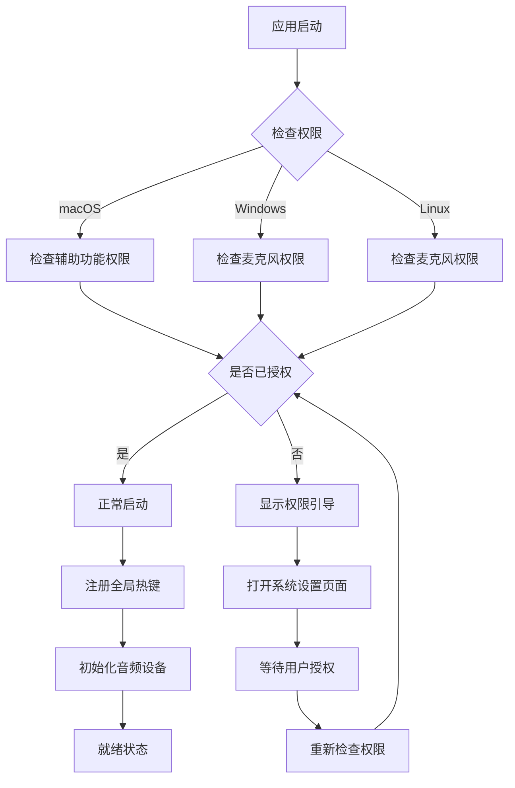

## 7. 配置与设置

### 7.1 配置文件结构

```json
{
  "version": "1.0.0",
  "elevenlabs": {
    "apiKey": "sk_xxx",
    "modelId": "scribe_v2_realtime",
    "languageCode": "zh",
    "commitStrategy": "vad",
    "vadSilenceThreshold": 1.5
  },
  "audio": {
    "inputDevice": "default",
    "sampleRate": 16000,
    "chunkDurationMs": 200,
    "noiseReduction": false
  },
  "injection": {
    "strategy": "auto",
    "fallbackToClipboard": true,
    "insertDelay": 100
  },
  "hotkeys": {
    "toggleRecording": "Command+Shift+Backslash",
    "manualCommit": "Command+Shift+Return"
  },
  "ui": {
    "showFloatingWindow": true,
    "floatingWindowPosition": "bottom-right",
    "theme": "auto"
  },
  "postProcessing": {
    "enableTermCorrection": true,
    "enableCourseCorrection": true,
    "customTerms": {
      "view cell": "Vercel"
    }
  }
}
```

### 7.2 设置界面

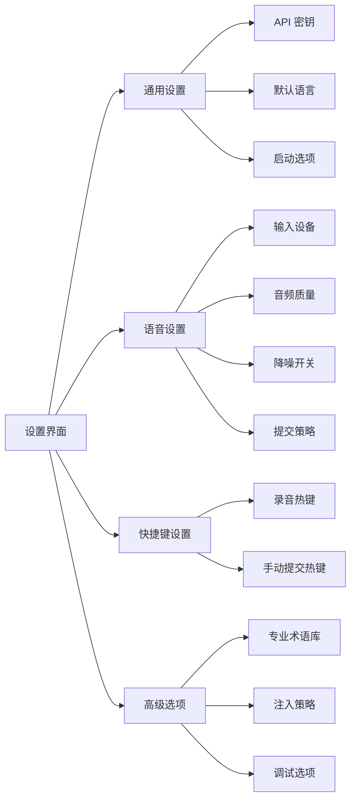

## 8. 错误处理与日志

### 8.1 错误类型定义

```rust
// src-tauri/src/error.rs

#[derive(Debug, thiserror::Error)]
pub enum RAFlowError {
    #[error("音频设备错误: {0}")]
    AudioDevice(String),

    #[error("WebSocket 连接失败: {0}")]
    WebSocketConnection(String),

    #[error("转录服务错误: {0}")]
    Transcription(String),

    #[error("权限不足: {0}")]
    Permission(String),

    #[error("文本注入失败: {0}")]
    Injection(String),

    #[error("配置错误: {0}")]
    Config(String),
}
```

### 8.2 日志策略

```rust
// 使用 tracing crate
use tracing::{info, warn, error, debug};

// 日志级别：
// - INFO: 正常操作（启动、停止、转录完成）
// - WARN: 可恢复错误（网络抖动、设备切换）
// - ERROR: 严重错误（连接失败、权限不足）
// - DEBUG: 调试信息（音频电平、WebSocket 消息）

// 日志输出位置：
// - macOS: ~/Library/Logs/RAFlow/app.log
// - Windows: %APPDATA%\RAFlow\logs\app.log
// - Linux: ~/.local/share/raflow/logs/app.log
```

## 9. 测试策略

### 9.1 测试金字塔

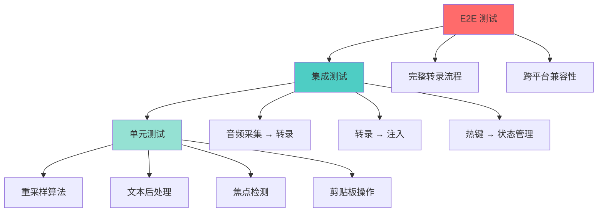

### 9.2 关键测试用例

| 测试场景 | 输入 | 期望输出 |
|---------|------|---------|
| 基本转录 | 5秒清晰语音 | 准确转录文本 |
| 静音检测 | 2秒语音 + 2秒静音 | 自动提交 |
| 专业术语 | "使用 view cell 部署" | "使用 Vercel 部署" |
| 自我修正 | "明天，不，后天" | "后天" |
| 可输入检测 | 焦点在文本框 | 直接注入 |
| 剪贴板回退 | 焦点在图片 | 复制到剪贴板 |
| 多语言切换 | 中英文混合 | 正确识别 |
| 网络恢复 | 断网后恢复 | 自动重连 |

## 10. 部署与分发

### 10.1 构建流程

```bash
# 开发模式
npm run tauri dev

# 生产构建
npm run tauri build

# 平台特定构建
npm run tauri build -- --target x86_64-apple-darwin    # macOS Intel
npm run tauri build -- --target aarch64-apple-darwin   # macOS Apple Silicon
npm run tauri build -- --target x86_64-pc-windows-msvc # Windows
npm run tauri build -- --target x86_64-unknown-linux-gnu # Linux
```

### 10.2 代码签名

```rust
// tauri.conf.json

{
  "tauri": {
    "bundle": {
      "active": true,
      "identifier": "com.raflow.app",
      "macOS": {
        "signingIdentity": "Developer ID Application: Your Name",
        "entitlements": "entitlements.plist",
        "exceptionDomain": "api.elevenlabs.io"
      },
      "windows": {
        "certificateThumbprint": "YOUR_CERT_THUMBPRINT",
        "digestAlgorithm": "sha256"
      }
    }
  }
}
```

### 10.3 自动更新

```rust
// 使用 tauri-plugin-updater

use tauri_plugin_updater::UpdaterExt;

#[tauri::command]
async fn check_update(app: tauri::AppHandle) -> Result<bool, String> {
    if let Some(update) = app.updater()
        .check()
        .await
        .map_err(|e| e.to_string())?
    {
        update.download_and_install()
            .await
            .map_err(|e| e.to_string())?;

        Ok(true)
    } else {
        Ok(false)
    }
}
```

## 11. 性能指标

### 11.1 关键指标

| 指标 | 目标值 | 测量方法 |
|------|--------|---------|
| 端到端延迟 | < 500ms | 从说话到文本出现的时间 |
| 内存占用 | < 150MB | 空闲状态内存使用 |
| CPU 使用率 | < 5% | 录音时平均 CPU 使用 |
| 启动时间 | < 2s | 从点击到托盘图标出现 |
| 转录准确率 | > 95% | 标准测试集评估 |
| 安装包大小 | < 30MB | 压缩后的安装包 |

### 11.2 性能监控

```rust
// src-tauri/src/metrics.rs

use std::time::Instant;

pub struct PerformanceMetrics {
    recording_start: Option<Instant>,
    transcription_start: Option<Instant>,
}

impl PerformanceMetrics {
    pub fn mark_recording_start(&mut self) {
        self.recording_start = Some(Instant::now());
    }

    pub fn mark_transcription_complete(&mut self) -> Option<Duration> {
        self.recording_start.map(|start| start.elapsed())
    }

    pub fn report(&self, app: &tauri::AppHandle) {
        // 发送到分析服务或本地日志
        info!("Performance: {:?}", self);
    }
}
```

## 12. 安全与隐私

### 12.1 安全措施

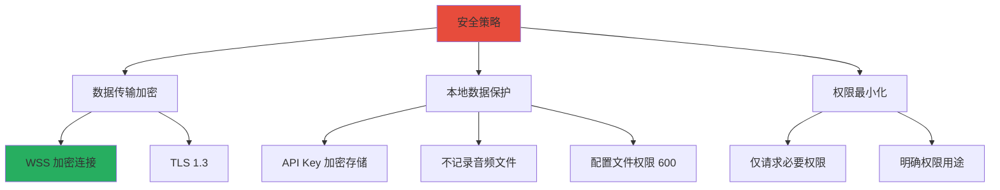

### 12.2 隐私保护

1. **零留存模式**：企业用户可启用 ElevenLabs 的零留存模式
2. **本地处理**：音频数据仅临时缓冲，不写入磁盘
3. **透明通信**：用户可查看所有网络请求
4. **数据控制**：用户可随时删除云端转录历史

## 13. 未来扩展方向

### 13.1 功能路线图

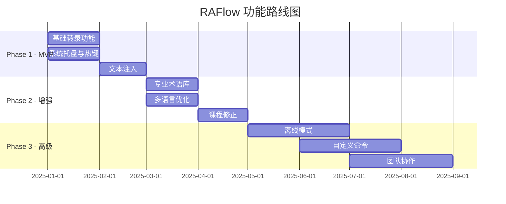

### 13.2 潜在功能

1. **语音命令**：支持"删除上一句"、"换行"等控制指令
2. **上下文感知**：根据当前应用自动调整术语库
3. **多设备同步**：跨设备同步配置和术语库
4. **插件系统**：允许第三方扩展功能
5. **离线模式**：集成本地 Whisper 模型作为备选

## 14. 技术参考资料

### 14.1 官方文档

- [ElevenLabs Scribe v2 Realtime API](https://elevenlabs.io/docs/api-reference/speech-to-text/v-1-speech-to-text-realtime)
- [Tauri 2.0 Documentation](https://v2.tauri.app/)
- [Global Shortcut Plugin](https://v2.tauri.app/plugin/global-shortcut/)
- [Clipboard Plugin](https://v2.tauri.app/plugin/clipboard/)

### 14.2 关键依赖库

- [@elevenlabs/client 0.12.2](https://www.npmjs.com/package/@elevenlabs/client)
- [cpal 0.17](https://docs.rs/cpal/)
- [enigo 0.6.1](https://docs.rs/enigo/)
- [tauri-plugin-global-shortcut 2.0.0](https://crates.io/crates/tauri-plugin-global-shortcut)
- [tauri-plugin-clipboard-manager 2.0.0](https://crates.io/crates/tauri-plugin-clipboard-manager)

### 14.3 社区资源

- [Tauri GitHub](https://github.com/tauri-apps/tauri)
- [ElevenLabs Blog - Scribe v2 Realtime](https://elevenlabs.io/blog/introducing-scribe-v2-realtime)
- [Rust Audio Community](https://github.com/RustAudio)

---

**文档版本**：v1.0.0
**最后更新**：2025-12-23
**技术审核**：基于最新 2025 年 12 月技术栈
