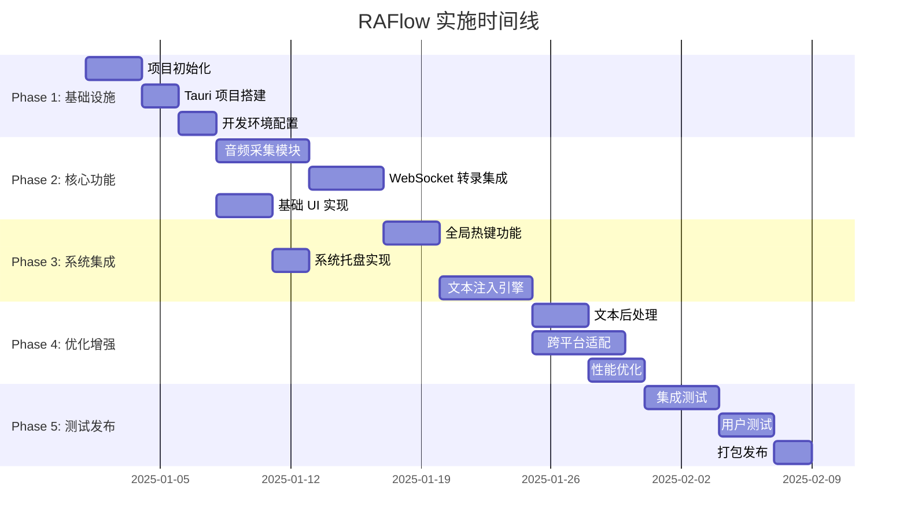
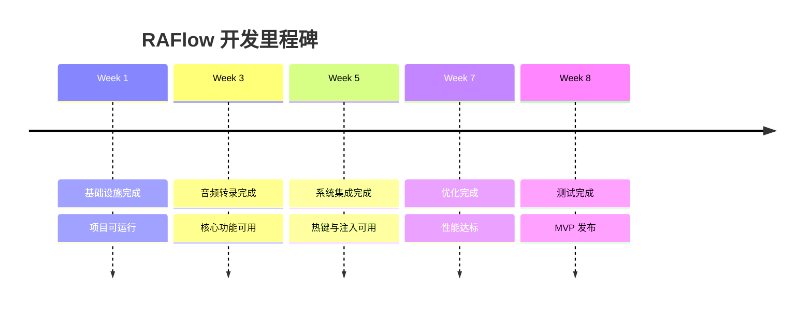

# RAFlow 实施计划

## 1. 项目总览

### 1.1 项目信息

| 项目名称 | RAFlow - 实时语音转文字工具 |
|---------|---------------------------|
| 技术栈 | Tauri 2.0 + React + Rust + ElevenLabs Scribe v2 |
| 目标平台 | macOS, Windows, Linux |
| 开发周期 | 8-10 周 |
| 团队规模 | 1-3 人 |

### 1.2 阶段划分



## 2. Phase 1: 基础设施搭建（第 1 周）

### 2.1 任务清单

#### 2.1.1 项目初始化
- [ ] 创建 Git 仓库
- [ ] 配置 `.gitignore`
- [ ] 创建项目 README
- [ ] 设置 LICENSE
- [ ] 配置 issue/PR 模板

#### 2.1.2 Tauri 项目搭建
- [ ] 安装 Tauri CLI: `cargo install tauri-cli`
- [ ] 创建 Tauri 项目: `cargo create-tauri-app`
- [ ] 选择前端模板: React + TypeScript
- [ ] 验证基础运行: `npm run tauri dev`

#### 2.1.3 依赖安装

**前端依赖** (`package.json`):
```json
{
  "dependencies": {
    "react": "^18.3.1",
    "react-dom": "^18.3.1",
    "@tauri-apps/api": "^2.0.0",
    "@tauri-apps/plugin-global-shortcut": "^2.0.0",
    "@tauri-apps/plugin-clipboard-manager": "^2.0.0",
    "@elevenlabs/client": "^0.12.2",
    "zustand": "^4.5.0"
  },
  "devDependencies": {
    "@types/react": "^18.3.0",
    "@types/react-dom": "^18.3.0",
    "@vitejs/plugin-react": "^4.3.0",
    "typescript": "^5.6.0",
    "vite": "^5.4.0"
  }
}
```

**Rust 依赖** (`src-tauri/Cargo.toml`):
```toml
[dependencies]
tauri = { version = "2.0", features = ["tray-icon"] }
tauri-plugin-global-shortcut = "2.0"
tauri-plugin-clipboard-manager = "2.0"
serde = { version = "1.0", features = ["derive"] }
serde_json = "1.0"
tokio = { version = "1.40", features = ["full"] }
cpal = "0.17"
enigo = "0.6.1"
ringbuf = "0.4"
rubato = "0.16"
tracing = "0.1"
tracing-subscriber = "0.3"
thiserror = "2.0"

[target.'cfg(target_os = "macos")'.dependencies]
cocoa = "0.26"
objc = "0.2"

[target.'cfg(target_os = "windows")'.dependencies]
windows = { version = "0.58", features = ["Win32_UI_Automation"] }
```

#### 2.1.4 项目结构创建

```
raflow/
├── src/                          # 前端源码
│   ├── components/               # React 组件
│   │   ├── FloatingWindow.tsx
│   │   ├── SettingsDialog.tsx
│   │   └── AudioVisualizer.tsx
│   ├── services/                 # 业务逻辑
│   │   ├── transcription.ts
│   │   ├── post-processor.ts
│   │   └── audio-bridge.ts
│   ├── stores/                   # 状态管理
│   │   └── app-store.ts
│   ├── types/                    # TypeScript 类型
│   │   └── index.ts
│   ├── App.tsx
│   └── main.tsx
├── src-tauri/                    # Rust 后端
│   ├── src/
│   │   ├── audio/                # 音频模块
│   │   │   ├── mod.rs
│   │   │   ├── capture.rs
│   │   │   └── resampler.rs
│   │   ├── system/               # 系统交互
│   │   │   ├── mod.rs
│   │   │   ├── hotkey.rs
│   │   │   ├── tray.rs
│   │   │   └── injection.rs
│   │   ├── error.rs              # 错误定义
│   │   ├── state.rs              # 应用状态
│   │   └── main.rs
│   ├── Cargo.toml
│   ├── tauri.conf.json
│   └── build.rs
├── specs/                        # 设计文档
├── .github/                      # CI/CD
└── README.md
```

#### 2.1.5 开发工具配置

**VSCode 扩展**:
- rust-analyzer
- Tauri
- ESLint
- Prettier

**VSCode 设置** (`.vscode/settings.json`):
```json
{
  "rust-analyzer.cargo.features": ["all"],
  "editor.formatOnSave": true,
  "editor.codeActionsOnSave": {
    "source.fixAll.eslint": true
  }
}
```

### 2.2 验收标准

- [x] 项目可以运行 `npm run tauri dev` 无错误
- [x] 前端显示基础窗口
- [x] Rust 后端可以编译
- [x] Git 提交记录清晰

## 3. Phase 2: 核心音频与转录（第 2-3 周）

### 3.1 任务清单

#### 3.1.1 音频采集模块 (5 天)

**第 1-2 天：基础音频采集**

```rust
// src-tauri/src/audio/capture.rs

use cpal::traits::{DeviceTrait, HostTrait, StreamTrait};
use std::sync::Arc;
use tokio::sync::Mutex;

pub struct AudioCapture {
    stream: Option<cpal::Stream>,
    is_recording: Arc<Mutex<bool>>,
}

impl AudioCapture {
    pub fn new() -> Self {
        Self {
            stream: None,
            is_recording: Arc::new(Mutex::new(false)),
        }
    }

    pub async fn start(&mut self) -> Result<(), cpal::BuildStreamError> {
        // 实现音频采集
        todo!()
    }

    pub async fn stop(&mut self) {
        *self.is_recording.lock().await = false;
        self.stream = None;
    }
}
```

- [ ] 实现设备枚举
- [ ] 实现默认设备选择
- [ ] 实现音频流创建
- [ ] 测试：能够采集到音频数据

**第 3 天：重采样实现**

```rust
// src-tauri/src/audio/resampler.rs

use rubato::{Resampler, SincFixedIn};

pub struct AudioResampler {
    resampler: SincFixedIn<f32>,
}

impl AudioResampler {
    pub fn new(input_rate: u32, output_rate: u32) -> Self {
        // 实现重采样器
        todo!()
    }

    pub fn process(&mut self, input: &[f32]) -> Vec<f32> {
        todo!()
    }
}
```

- [ ] 实现 SincFixedIn 重采样器
- [ ] 处理单声道转换
- [ ] 测试：48kHz -> 16kHz 转换正确

**第 4 天：环形缓冲区**

```rust
// src-tauri/src/audio/mod.rs

use ringbuf::{HeapRb, traits::*};

pub struct AudioBuffer {
    buffer: HeapRb<f32>,
}

impl AudioBuffer {
    pub fn new(capacity: usize) -> Self {
        Self {
            buffer: HeapRb::new(capacity),
        }
    }

    pub fn push_slice(&mut self, data: &[f32]) {
        // 实现批量写入
        todo!()
    }

    pub fn pop_chunk(&mut self, size: usize) -> Option<Vec<f32>> {
        // 实现块读取
        todo!()
    }
}
```

- [ ] 实现环形缓冲区写入
- [ ] 实现块读取逻辑
- [ ] 测试：无数据丢失

**第 5 天：集成与 Tauri 通信**

```rust
// src-tauri/src/main.rs

#[tauri::command]
async fn start_audio_capture(app: tauri::AppHandle) -> Result<(), String> {
    // 启动音频采集
    // 通过事件发送音频块到前端
    todo!()
}

#[tauri::command]
async fn stop_audio_capture() -> Result<(), String> {
    todo!()
}
```

- [ ] 实现 Tauri command
- [ ] 通过事件发送音频数据
- [ ] 前端接收测试

#### 3.1.2 WebSocket 转录集成 (4 天)

**第 1 天：ElevenLabs SDK 集成**

```typescript
// src/services/transcription.ts

import { Scribe, AudioFormat } from '@elevenlabs/client';

export class TranscriptionService {
  private connection: Scribe | null = null;

  async connect(apiKey: string) {
    this.connection = await Scribe.connect({
      token: apiKey,
      modelId: 'scribe_v2_realtime',
      audioFormat: AudioFormat.PCM_16000,
      onPartialTranscript: this.handlePartial.bind(this),
      onCommittedTranscript: this.handleCommit.bind(this),
    });
  }

  private handlePartial(data: any) {
    // 处理实时转录
  }

  private handleCommit(data: any) {
    // 处理最终转录
  }
}
```

- [ ] 实现连接逻辑
- [ ] 处理回调事件
- [ ] 测试：能够建立连接

**第 2 天：音频流发送**

- [ ] 接收来自 Rust 的音频块
- [ ] 通过 WebSocket 发送
- [ ] 实现错误重连
- [ ] 测试：音频正常发送

**第 3 天：转录结果处理**

```typescript
// src/stores/app-store.ts

import { create } from 'zustand';

interface AppState {
  isRecording: boolean;
  partialText: string;
  finalText: string;
  setPartialText: (text: string) => void;
  setFinalText: (text: string) => void;
}

export const useAppStore = create<AppState>((set) => ({
  isRecording: false,
  partialText: '',
  finalText: '',
  setPartialText: (text) => set({ partialText: text }),
  setFinalText: (text) => set({ finalText: text }),
}));
```

- [ ] 实现状态管理
- [ ] 处理 partial transcript
- [ ] 处理 committed transcript
- [ ] 测试：状态正确更新

**第 4 天：VAD 与手动提交**

- [ ] 配置 VAD 参数
- [ ] 实现手动提交按钮
- [ ] 测试静音检测
- [ ] 集成测试

#### 3.1.3 基础 UI 实现 (3 天)

**第 1 天：浮动窗口组件**

```typescript
// src/components/FloatingWindow.tsx

import React from 'react';
import { useAppStore } from '../stores/app-store';

export const FloatingWindow: React.FC = () => {
  const { isRecording, partialText } = useAppStore();

  return (
    <div className="floating-window">
      <div className={`status ${isRecording ? 'recording' : 'idle'}`}>
        {isRecording ? '🔴 录音中...' : '⚪ 就绪'}
      </div>
      <div className="text-preview">{partialText}</div>
    </div>
  );
};
```

- [ ] 创建浮动窗口组件
- [ ] 实现录音状态显示
- [ ] 实现文本预览
- [ ] 基础样式

**第 2 天：音频可视化**

```typescript
// src/components/AudioVisualizer.tsx

import React, { useEffect, useRef } from 'react';

export const AudioVisualizer: React.FC<{ level: number }> = ({ level }) => {
  const canvasRef = useRef<HTMLCanvasElement>(null);

  useEffect(() => {
    // 绘制音频波形
  }, [level]);

  return <canvas ref={canvasRef} width={200} height={50} />;
};
```

- [ ] 实现音频电平显示
- [ ] Canvas 绘制波形
- [ ] 测试：电平正常显示

**第 3 天：窗口配置**

```json
// src-tauri/tauri.conf.json

{
  "tauri": {
    "windows": [
      {
        "title": "RAFlow",
        "width": 400,
        "height": 150,
        "decorations": false,
        "alwaysOnTop": true,
        "skipTaskbar": true,
        "visible": false
      }
    ]
  }
}
```

- [ ] 配置无边框窗口
- [ ] 实现窗口拖动
- [ ] 窗口置顶
- [ ] 测试：窗口行为正确

### 3.2 验收标准

- [x] 能够采集 16kHz 单声道音频
- [x] 音频正常发送到 ElevenLabs
- [x] 接收并显示实时转录
- [x] 浮动窗口显示录音状态
- [x] 静音检测自动提交

## 4. Phase 3: 系统集成（第 4-5 周）

### 4.1 任务清单

#### 4.1.1 全局热键功能 (3 天)

**第 1 天：热键注册**

```rust
// src-tauri/src/system/hotkey.rs

use tauri::Manager;
use tauri_plugin_global_shortcut::{GlobalShortcutExt, Shortcut};

pub fn setup_hotkeys(app: &tauri::App) -> Result<(), Box<dyn std::error::Error>> {
    let shortcut_str = if cfg!(target_os = "macos") {
        "Command+Shift+Backslash"
    } else {
        "Ctrl+Shift+Backslash"
    };

    let shortcut = shortcut_str.parse::<Shortcut>()?;

    app.global_shortcut().register(shortcut, move || {
        // 处理热键事件
    })?;

    Ok(())
}
```

- [ ] 实现跨平台热键注册
- [ ] 处理热键回调
- [ ] 测试：热键正常触发

**第 2 天：录音控制**

- [ ] 连接热键与录音状态
- [ ] 实现开始/停止切换
- [ ] 添加状态指示
- [ ] 测试：热键控制录音

**第 3 天：错误处理**

- [ ] 处理热键注册失败
- [ ] 权限检查
- [ ] 提示用户授权
- [ ] 测试：错误提示正确

#### 4.1.2 系统托盘实现 (2 天)

**第 1 天：托盘菜单**

```rust
// src-tauri/src/system/tray.rs

use tauri::menu::{Menu, MenuItem};
use tauri::tray::TrayIconBuilder;

pub fn setup_tray(app: &tauri::App) -> Result<(), Box<dyn std::error::Error>> {
    let toggle = MenuItem::with_id(app, "toggle", "开始录音", true, None::<&str>)?;
    let settings = MenuItem::with_id(app, "settings", "设置", true, None::<&str>)?;
    let quit = MenuItem::with_id(app, "quit", "退出", true, None::<&str>)?;

    let menu = Menu::with_items(app, &[&toggle, &settings, &quit])?;

    TrayIconBuilder::new()
        .menu(&menu)
        .on_menu_event(|app, event| {
            // 处理菜单点击
        })
        .build(app)?;

    Ok(())
}
```

- [ ] 创建托盘图标
- [ ] 实现菜单
- [ ] 处理菜单事件
- [ ] 测试：菜单功能正常

**第 2 天：后台常驻**

```rust
// src-tauri/src/main.rs

fn main() {
    tauri::Builder::default()
        .setup(|app| {
            // macOS 不在 Dock 显示
            #[cfg(target_os = "macos")]
            app.set_activation_policy(tauri::ActivationPolicy::Accessory);

            Ok(())
        })
        .run(tauri::generate_context!())
        .expect("error while running tauri application");
}
```

- [ ] 配置后台常驻
- [ ] 防止意外退出
- [ ] 测试：关闭窗口不退出

#### 4.1.3 文本注入引擎 (5 天)

**第 1 天：Enigo 基础**

```rust
// src-tauri/src/system/injection.rs

use enigo::{Enigo, KeyboardControllable};

pub struct TextInjector {
    enigo: Enigo,
}

impl TextInjector {
    pub fn new() -> Self {
        Self {
            enigo: Enigo::new(),
        }
    }

    pub fn type_text(&mut self, text: &str) -> Result<(), String> {
        self.enigo.key_sequence(text);
        Ok(())
    }
}
```

- [ ] 初始化 Enigo
- [ ] 实现基础文本输入
- [ ] 测试：能够输入文本

**第 2-3 天：焦点检测 (macOS)**

```rust
#[cfg(target_os = "macos")]
mod macos {
    use cocoa::appkit::NSWorkspace;
    use cocoa::base::id;
    use objc::runtime::Object;

    pub fn get_focused_element() -> Option<String> {
        unsafe {
            // 使用 Accessibility API
            // 检查焦点元素类型
            todo!()
        }
    }

    pub fn is_text_editable() -> bool {
        // 检查 AXRole 是否为 TextField/TextArea
        todo!()
    }
}
```

- [ ] 集成 Accessibility API
- [ ] 实现焦点元素查询
- [ ] 判断可输入性
- [ ] 测试：检测准确

**第 2-3 天：焦点检测 (Windows)**

```rust
#[cfg(target_os = "windows")]
mod windows {
    use windows::UI::Automation::*;

    pub fn is_text_editable() -> bool {
        // 使用 UI Automation
        // 检查 TextPattern
        todo!()
    }
}
```

- [ ] 集成 UI Automation
- [ ] 实现焦点检测
- [ ] 测试：检测准确

**第 4 天：剪贴板回退**

```rust
use tauri_plugin_clipboard_manager::ClipboardExt;

pub async fn inject_or_copy(
    app: &tauri::AppHandle,
    text: &str,
) -> Result<(), String> {
    let mut injector = TextInjector::new();

    if is_text_editable() {
        injector.type_text(text)?;
    } else {
        app.clipboard().write_text(text)
            .map_err(|e| e.to_string())?;
        // 发送通知
    }

    Ok(())
}
```

- [ ] 实现剪贴板写入
- [ ] 添加通知提示
- [ ] 测试：回退逻辑正确

**第 5 天：集成测试**

- [ ] 测试各种应用场景
- [ ] 测试边界情况
- [ ] 性能测试
- [ ] 修复 bug

### 4.2 验收标准

- [x] 全局热键可以控制录音
- [x] 托盘图标正常显示
- [x] 应用可以后台常驻
- [x] 文本能够注入到焦点应用
- [x] 不可输入时回退到剪贴板

## 5. Phase 4: 优化与增强（第 6-7 周）

### 5.1 任务清单

#### 5.1.1 文本后处理 (3 天)

**第 1 天：专业术语库**

```typescript
// src/services/post-processor.ts

export class TextPostProcessor {
  private termMapping = new Map([
    ['view cell', 'Vercel'],
    ['super base', 'Supabase'],
    ['react js', 'React.js'],
    // ... 更多术语
  ]);

  process(text: string): string {
    let result = text;
    this.termMapping.forEach((correct, wrong) => {
      result = result.replace(new RegExp(wrong, 'gi'), correct);
    });
    return result;
  }
}
```

- [ ] 实现术语映射
- [ ] 支持正则匹配
- [ ] 添加用户自定义术语
- [ ] 测试：替换正确

**第 2 天：航向修正**

```typescript
export class CourseCorrection {
  detect(text: string): { text: string; corrected: boolean } {
    // 检测"不，应该是"等修正模式
    const patterns = [
      /(.+?),\s*不[，,]\s*(.+)/,
      /(.+?),\s*应该是\s*(.+)/,
    ];

    for (const pattern of patterns) {
      const match = text.match(pattern);
      if (match) {
        return { text: match[2], corrected: true };
      }
    }

    return { text, corrected: false };
  }
}
```

- [ ] 实现修正检测
- [ ] 支持多种模式
- [ ] 测试：检测准确

**第 3 天：集成后处理**

- [ ] 在转录完成后调用后处理
- [ ] 显示修正提示
- [ ] 测试：完整流程

#### 5.1.2 跨平台适配 (5 天)

**第 1-2 天：macOS 适配**

- [ ] 测试辅助功能权限
- [ ] 优化 Accessibility API 调用
- [ ] 测试多种应用（Safari, Chrome, VS Code）
- [ ] 签名与公证准备

**第 2-3 天：Windows 适配**

- [ ] 测试 UI Automation
- [ ] 测试管理员权限场景
- [ ] 测试多种应用
- [ ] 代码签名准备

**第 4-5 天：Linux 适配**

- [ ] X11 环境测试
- [ ] Wayland 环境测试
- [ ] 回退策略（默认剪贴板）
- [ ] 多发行版测试

#### 5.1.3 性能优化 (3 天)

**第 1 天：音频优化**

- [ ] 优化缓冲区大小
- [ ] 减少内存拷贝
- [ ] 线程优先级调整
- [ ] 性能测试

**第 2 天：网络优化**

- [ ] 实现连接池
- [ ] 优化重连策略
- [ ] 添加超时控制
- [ ] 压力测试

**第 3 天：整体优化**

- [ ] CPU 使用率优化
- [ ] 内存占用优化
- [ ] 启动时间优化
- [ ] 性能基准测试

### 5.2 验收标准

- [x] 专业术语正确替换
- [x] 自我修正检测准确
- [x] 三大平台均可正常运行
- [x] 内存占用 < 150MB
- [x] CPU 使用率 < 5%

## 6. Phase 5: 测试与发布（第 8 周）

### 6.1 任务清单

#### 6.1.1 测试 (4 天)

**第 1 天：单元测试**

```rust
// src-tauri/src/audio/resampler.rs

#[cfg(test)]
mod tests {
    use super::*;

    #[test]
    fn test_resampling() {
        let mut resampler = AudioResampler::new(48000, 16000);
        let input = vec![0.0; 4800]; // 0.1s @ 48kHz
        let output = resampler.process(&input);
        assert_eq!(output.len(), 1600); // 0.1s @ 16kHz
    }
}
```

- [ ] 编写音频模块测试
- [ ] 编写注入模块测试
- [ ] 编写后处理测试
- [ ] 覆盖率 > 70%

**第 2 天：集成测试**

```typescript
// src/__tests__/transcription.test.ts

import { describe, it, expect } from 'vitest';
import { TranscriptionService } from '../services/transcription';

describe('TranscriptionService', () => {
  it('should connect and receive transcripts', async () => {
    const service = new TranscriptionService();
    // 测试转录流程
  });
});
```

- [ ] 测试完整转录流程
- [ ] 测试热键触发
- [ ] 测试文本注入
- [ ] 测试错误恢复

**第 3 天：跨平台测试**

| 平台 | 测试场景 | 状态 |
|------|---------|------|
| macOS 13+ | Safari, Chrome, VS Code | ⬜ |
| macOS 13+ | 权限处理 | ⬜ |
| Windows 11 | Edge, Chrome, VS Code | ⬜ |
| Windows 11 | 管理员模式 | ⬜ |
| Ubuntu 22.04 | Firefox, VS Code | ⬜ |
| Ubuntu 22.04 | X11/Wayland | ⬜ |

**第 4 天：用户测试**

- [ ] 招募 5-10 名测试用户
- [ ] 收集使用反馈
- [ ] 记录 bug 和改进建议
- [ ] 优先级排序

#### 6.1.2 文档 (1 天)

**用户文档**:
- [ ] README.md（中英文）
- [ ] 安装指南
- [ ] 使用教程
- [ ] 常见问题 FAQ
- [ ] 故障排除

**开发者文档**:
- [ ] 架构说明
- [ ] 构建指南
- [ ] 贡献指南
- [ ] API 文档

#### 6.1.3 打包与发布 (2 天)

**第 1 天：构建配置**

```json
// src-tauri/tauri.conf.json

{
  "tauri": {
    "bundle": {
      "active": true,
      "identifier": "com.raflow.app",
      "icon": [
        "icons/icon.icns",
        "icons/icon.ico",
        "icons/icon.png"
      ],
      "macOS": {
        "frameworks": [],
        "minimumSystemVersion": "10.15",
        "signingIdentity": null
      },
      "windows": {
        "certificateThumbprint": null,
        "wix": {
          "language": "zh-CN"
        }
      }
    }
  }
}
```

- [ ] 配置应用图标
- [ ] 配置 bundle 信息
- [ ] 准备签名证书（可选）
- [ ] 测试构建

**第 2 天：发布**

- [ ] 构建 macOS 版本（.dmg）
- [ ] 构建 Windows 版本（.msi）
- [ ] 构建 Linux 版本（.deb/.AppImage）
- [ ] 创建 GitHub Release
- [ ] 编写发布说明
- [ ] 社区宣传

### 6.2 验收标准

- [x] 所有测试通过
- [x] 文档完整
- [x] 三平台安装包可用
- [x] GitHub Release 发布
- [x] 至少 5 名用户测试通过

## 7. 开发规范

### 7.1 代码规范

**Rust**:
```bash
# 格式化
cargo fmt

# Lint
cargo clippy -- -D warnings

# 测试
cargo test
```

**TypeScript**:
```bash
# Lint
npm run lint

# 类型检查
npm run type-check

# 测试
npm run test
```

### 7.2 Git 工作流

```
main (保护分支)
  └── develop
       ├── feature/audio-capture
       ├── feature/transcription
       ├── feature/text-injection
       └── bugfix/xxx
```

**Commit 消息规范**:
```
feat: 添加音频采集功能
fix: 修复热键注册失败问题
docs: 更新 README
test: 添加重采样测试
refactor: 重构文本注入逻辑
perf: 优化内存使用
```

### 7.3 Code Review 检查点

- [ ] 代码符合规范
- [ ] 有必要的注释
- [ ] 包含测试
- [ ] 无安全问题
- [ ] 性能可接受
- [ ] 跨平台兼容

## 8. 风险管理

### 8.1 技术风险

| 风险 | 概率 | 影响 | 缓解措施 |
|------|------|------|---------|
| ElevenLabs API 限制 | 中 | 高 | 实现本地 Whisper 备选方案 |
| 权限获取困难 | 高 | 高 | 提供详细引导文档 |
| 跨平台兼容性 | 中 | 中 | 早期多平台测试 |
| 音频采集问题 | 低 | 高 | 使用成熟的 cpal 库 |
| 文本注入失败 | 中 | 中 | 剪贴板作为回退 |

### 8.2 时间风险

- **缓冲时间**：每个 Phase 预留 10% 缓冲
- **关键路径**：音频采集 → 转录 → 文本注入
- **并行开发**：UI 可与后端并行
- **MVP 定义**：Phase 1-3 完成即可发布 MVP

## 9. 资源需求

### 9.1 开发资源

| 资源 | 需求 | 备注 |
|------|------|------|
| 开发人员 | 1-3 人 | Rust + TypeScript |
| 测试设备 | 3 台 | macOS, Windows, Linux |
| ElevenLabs API | 付费账号 | 用于开发测试 |
| 代码签名证书 | 可选 | macOS/Windows 分发 |

### 9.2 预算估算

| 项目 | 成本 | 备注 |
|------|------|------|
| ElevenLabs API | $20-50/月 | 开发测试用 |
| Apple 开发者 | $99/年 | macOS 签名 |
| 代码签名证书 (Windows) | $100-300/年 | 可选 |
| 服务器（可选） | $5-10/月 | 统计/更新服务器 |
| **总计** | ~$150-500 | 首年 |

## 10. 里程碑

### 10.1 关键里程碑



### 10.2 发布计划

| 版本 | 时间 | 功能 |
|------|------|------|
| v0.1.0-alpha | Week 3 | 内部测试版 |
| v0.2.0-beta | Week 5 | 公开测试版 |
| v0.3.0-rc | Week 7 | 候选发布版 |
| v1.0.0 | Week 8 | 正式版 |

## 11. 后续计划

### 11.1 v1.1 功能（Week 9-12）

- [ ] 语音命令支持
- [ ] 自定义术语库 UI
- [ ] 多语言切换优化
- [ ] 使用统计

### 11.2 v1.2 功能（Week 13-16）

- [ ] 离线模式（本地 Whisper）
- [ ] 插件系统
- [ ] 团队协作
- [ ] 云同步配置

### 11.3 v2.0 愿景

- [ ] 完整的语音命令系统
- [ ] AI 增强修正
- [ ] 多设备协同
- [ ] 企业级功能

## 12. 总结

### 12.1 成功标准

- [x] 功能完整：满足设计文档要求
- [x] 性能达标：延迟 < 500ms，内存 < 150MB
- [x] 跨平台支持：macOS, Windows, Linux
- [x] 用户体验：简单易用，稳定可靠
- [x] 代码质量：测试覆盖率 > 70%

### 12.2 团队协作

**角色分工**:
- **全栈开发**：负责 Rust + TypeScript 开发
- **测试工程师**（可选）：负责测试用例编写
- **文档工程师**（可选）：负责文档维护

**沟通机制**:
- 每日站会（10 分钟）
- 每周 Code Review
- 每两周 Sprint 回顾

### 12.3 联系方式

- **项目地址**: https://github.com/your-org/raflow
- **问题反馈**: GitHub Issues
- **讨论区**: GitHub Discussions

---

**文档版本**: v1.0.0
**创建日期**: 2025-12-23
**最后更新**: 2025-12-23
**维护者**: RAFlow Team
