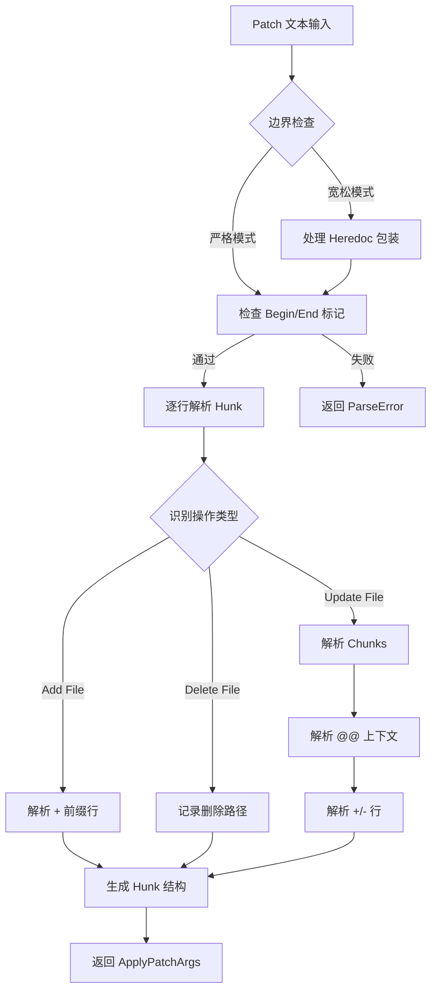
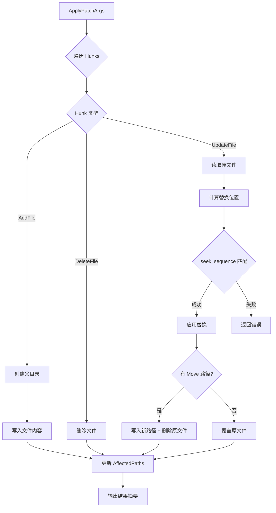
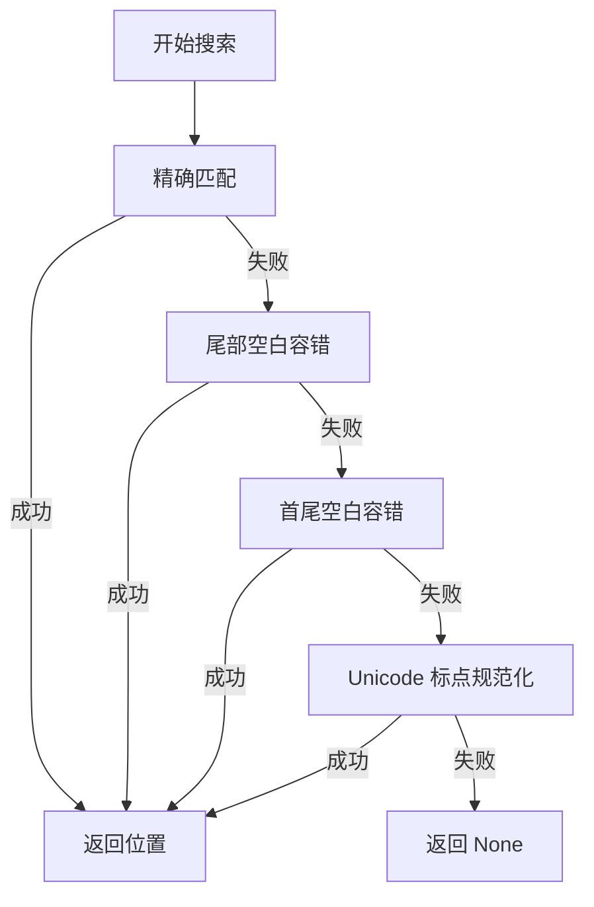
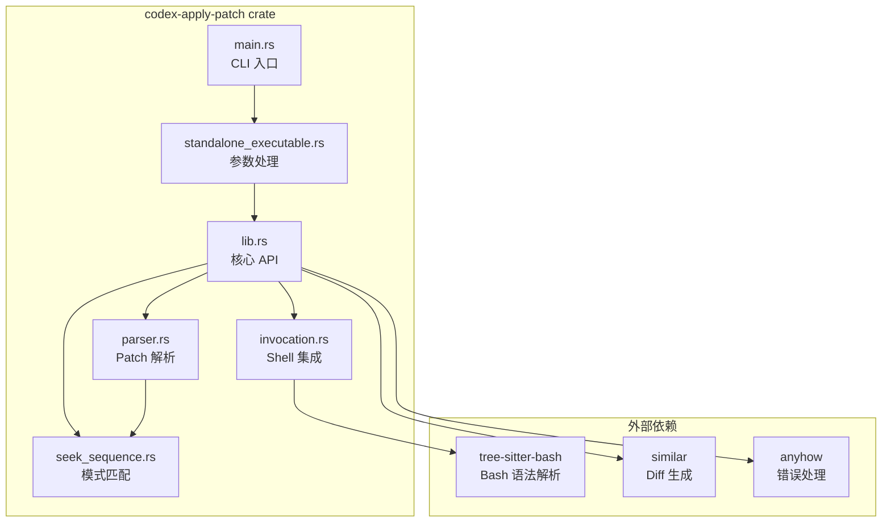
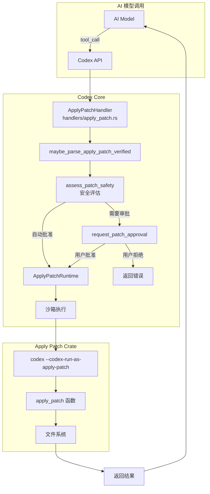
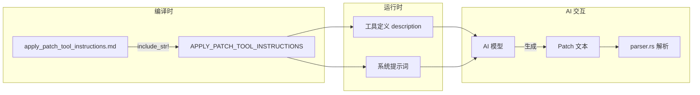
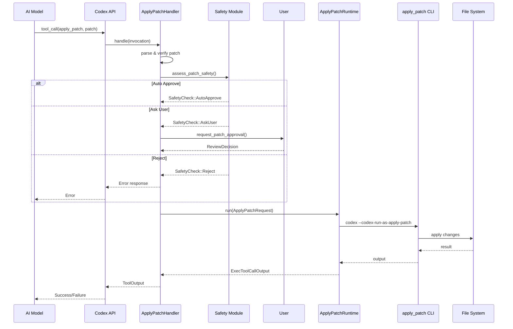
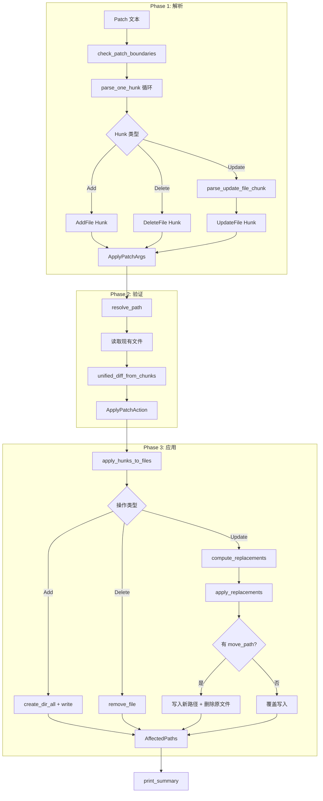
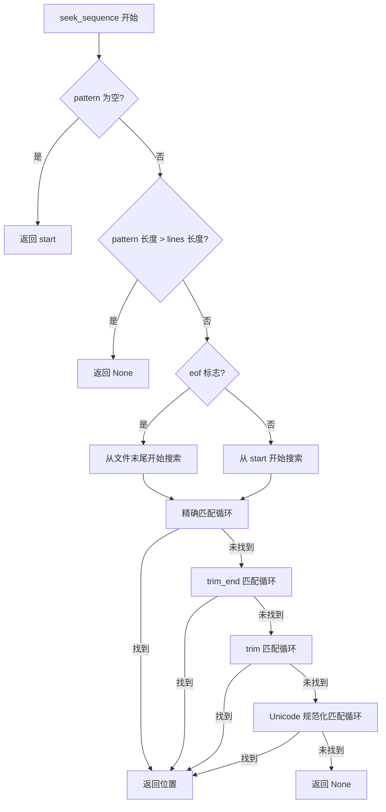

# Codex Apply Patch Tool 深度解析

本文档详细解读 Codex 项目中 `apply_patch` 工具的原理、实现、使用方式、测试策略以及与 Codex 其他组件的集成关系。

---

## 目录

1. [概述](#1-概述)
2. [Patch 格式与语法](#2-patch-格式与语法)
3. [核心原理](#3-核心原理)
4. [代码架构](#4-代码架构)
5. [关键模块实现详解](#5-关键模块实现详解)
6. [如何使用](#6-如何使用)
7. [测试策略](#7-测试策略)
8. [与 Codex 集成](#8-与-codex-集成)
9. [`apply_patch_tool_instructions.md` 的作用](#9-apply_patch_tool_instructionsmd-的作用)
10. [流程图](#10-流程图)

---

## 1. 概述

`apply_patch` 是 Codex 项目中的核心文件编辑工具，专为 AI 模型设计，用于安全、精确地修改文件系统。它提供了一种简化的、面向文件的 diff 格式，比传统 unified diff 更易于 AI 模型理解和生成。

### 主要特点

- **简洁语法**: 专为 AI 模型设计的易解析格式
- **三种操作**: 添加文件 (Add)、删除文件 (Delete)、更新文件 (Update)
- **容错匹配**: 支持空白字符容错和 Unicode 标点符号规范化
- **安全机制**: 与 Codex 的安全审批流程深度集成
- **跨平台**: 支持 Unix shell、PowerShell、cmd

### 文件位置

```
venders/codex/codex-rs/apply-patch/
├── Cargo.toml                          # 包配置
├── apply_patch_tool_instructions.md    # AI 使用说明
└── src/
    ├── lib.rs                          # 核心库 (~1065 行)
    ├── main.rs                         # 可执行文件入口 (3 行)
    ├── parser.rs                       # 解析器 (~741 行)
    ├── invocation.rs                   # Shell 集成 (~813 行)
    ├── seek_sequence.rs                # 模式匹配 (~151 行)
    └── standalone_executable.rs        # CLI 处理 (~59 行)
```

---

## 2. Patch 格式与语法

### 2.1 基本结构

```
*** Begin Patch
[ 一个或多个文件操作 ]
*** End Patch
```

### 2.2 文件操作类型

#### 添加文件 (Add File)
```
*** Add File: path/to/file.txt
+第一行内容
+第二行内容
```

#### 删除文件 (Delete File)
```
*** Delete File: path/to/obsolete.txt
```

#### 更新文件 (Update File)
```
*** Update File: path/to/file.txt
@@ def some_function():
 context_line
-old_line
+new_line
 context_line
```

#### 移动/重命名文件
```
*** Update File: old/path.txt
*** Move to: new/path.txt
@@
-old content
+new content
```

### 2.3 完整语法 (Lark 格式)

```lark
Patch := Begin { FileOp } End
Begin := "*** Begin Patch" NEWLINE
End := "*** End Patch" NEWLINE
FileOp := AddFile | DeleteFile | UpdateFile
AddFile := "*** Add File: " path NEWLINE { "+" line NEWLINE }
DeleteFile := "*** Delete File: " path NEWLINE
UpdateFile := "*** Update File: " path NEWLINE [ MoveTo ] { Hunk }
MoveTo := "*** Move to: " newPath NEWLINE
Hunk := "@@" [ header ] NEWLINE { HunkLine } [ "*** End of File" NEWLINE ]
HunkLine := (" " | "-" | "+") text NEWLINE
```

### 2.4 上下文标记 (@@)

`@@` 标记用于定位代码片段：

```
*** Update File: src/main.py
@@ class BaseClass
@@ def method():
 context_before
-old_code
+new_code
 context_after
```

- 单个 `@@` 可指定类或函数范围
- 嵌套 `@@` 用于更精确定位（如类内的方法）
- 默认需要 3 行上下文和 3 行下文

---

## 3. 核心原理

### 3.1 解析流程



### 3.2 应用流程



### 3.3 模式匹配算法 (seek_sequence)

`seek_sequence` 使用分层匹配策略，按严格度递减尝试：



**Unicode 规范化映射**:
- 各种破折号 (–, —, ‒, ―) → `-`
- 花式引号 (' ' " ") → `'` 或 `"`
- 各种空格 (non-breaking space 等) → 普通空格

---

## 4. 代码架构

### 4.1 Crate 结构



### 4.2 核心数据结构

```rust
/// 解析后的补丁参数
pub struct ApplyPatchArgs {
    pub patch: String,           // 原始 patch 文本
    pub hunks: Vec<Hunk>,        // 解析后的操作列表
    pub workdir: Option<String>, // 工作目录 (从 cd 命令提取)
}

/// 单个文件操作
pub enum Hunk {
    AddFile { path: PathBuf, contents: String },
    DeleteFile { path: PathBuf },
    UpdateFile {
        path: PathBuf,
        move_path: Option<PathBuf>,
        chunks: Vec<UpdateFileChunk>,
    },
}

/// 更新文件的单个 chunk
pub struct UpdateFileChunk {
    pub change_context: Option<String>,  // @@ 后的上下文标识
    pub old_lines: Vec<String>,          // 要替换的旧行
    pub new_lines: Vec<String>,          // 替换后的新行
    pub is_end_of_file: bool,           // 是否在文件末尾
}

/// 验证后的应用动作
pub struct ApplyPatchAction {
    changes: HashMap<PathBuf, ApplyPatchFileChange>,
    pub patch: String,
    pub cwd: PathBuf,
}

/// 文件变更类型
pub enum ApplyPatchFileChange {
    Add { content: String },
    Delete { content: String },
    Update {
        unified_diff: String,
        move_path: Option<PathBuf>,
        new_content: String,
    },
}
```

---

## 5. 关键模块实现详解

### 5.1 parser.rs - 解析器

**主要功能**:
- 解析 patch 文本为结构化数据
- 支持严格模式和宽松模式
- 验证语法正确性

**核心函数**:

```rust
// 入口函数
pub fn parse_patch(patch: &str) -> Result<ApplyPatchArgs, ParseError>

// 内部实现
fn parse_patch_text(patch: &str, mode: ParseMode) -> Result<ApplyPatchArgs, ParseError>
fn parse_one_hunk(lines: &[&str], line_number: usize) -> Result<(Hunk, usize), ParseError>
fn parse_update_file_chunk(...) -> Result<(UpdateFileChunk, usize), ParseError>
```

**宽松模式 (Lenient Mode)**:

GPT-4.1 等模型有时会生成带 heredoc 包装的 patch：

```bash
<<'EOF'
*** Begin Patch
...
*** End Patch
EOF
```

宽松模式会自动剥离这些包装。

### 5.2 invocation.rs - Shell 集成

**主要功能**:
- 从 shell 命令中提取 apply_patch 调用
- 使用 Tree-sitter 解析 Bash 脚本
- 支持多种 shell (bash, zsh, sh, PowerShell, cmd)

**Tree-sitter 查询**:

```rust
static APPLY_PATCH_QUERY: LazyLock<Query> = LazyLock::new(|| {
    Query::new(&language, r#"
        // 模式 1: 直接调用
        (program
            . (redirected_statement
                body: (command
                    name: (command_name (word) @apply_name) .)
                (#any-of? @apply_name "apply_patch" "applypatch")
                redirect: (heredoc_redirect
                    . (heredoc_start)
                    . (heredoc_body) @heredoc
                    . (heredoc_end)
                    .))
            .)

        // 模式 2: cd + apply_patch
        (program
            . (redirected_statement
                body: (list
                    . (command
                        name: (command_name (word) @cd_name) .
                        argument: [...] @cd_path .)
                    "&&"
                    . (command
                        name: (command_name (word) @apply_name))
                    .)
                (#eq? @cd_name "cd")
                (#any-of? @apply_name "apply_patch" "applypatch")
                redirect: (heredoc_redirect ...))
            .)
    "#)
});
```

**支持的命令格式**:
```bash
# 直接调用
apply_patch <<'EOF'
*** Begin Patch
...
*** End Patch
EOF

# 带目录切换
cd /some/path && apply_patch <<'EOF'
...
EOF
```

### 5.3 seek_sequence.rs - 模式匹配

**核心算法**:

```rust
pub fn seek_sequence(
    lines: &[String],      // 文件内容行
    pattern: &[String],    // 要匹配的模式
    start: usize,          // 起始位置
    eof: bool,             // 是否从文件末尾开始搜索
) -> Option<usize>
```

**匹配层次**:

1. **精确匹配**: 逐字节比较
2. **尾部空白容错**: `trim_end()` 后比较
3. **首尾空白容错**: `trim()` 后比较
4. **Unicode 规范化**: 将花式标点转为 ASCII 后比较

### 5.4 lib.rs - 核心 API

**公开 API**:

```rust
// 应用 patch 到文件系统
pub fn apply_patch(
    patch: &str,
    stdout: &mut impl Write,
    stderr: &mut impl Write,
) -> Result<(), ApplyPatchError>

// 应用已解析的 hunks
pub fn apply_hunks(
    hunks: &[Hunk],
    stdout: &mut impl Write,
    stderr: &mut impl Write,
) -> Result<(), ApplyPatchError>

// 解析 patch 文本
pub fn parse_patch(patch: &str) -> Result<ApplyPatchArgs, ParseError>

// 生成 unified diff
pub fn unified_diff_from_chunks(
    path: &Path,
    chunks: &[UpdateFileChunk],
) -> Result<ApplyPatchFileUpdate, ApplyPatchError>

// 验证并解析 apply_patch 调用
pub fn maybe_parse_apply_patch_verified(
    argv: &[String],
    cwd: &Path,
) -> MaybeApplyPatchVerified

// 工具指令文本
pub const APPLY_PATCH_TOOL_INSTRUCTIONS: &str = include_str!("../apply_patch_tool_instructions.md");
```

---

## 6. 如何使用

### 6.1 作为独立 CLI 工具

```bash
# 直接传递 patch 参数
apply_patch "*** Begin Patch
*** Add File: hello.txt
+Hello, world!
*** End Patch"

# 从 stdin 读取
echo "*** Begin Patch
*** Add File: hello.txt
+Hello, world!
*** End Patch" | apply_patch
```

### 6.2 作为 Rust 库

```rust
use codex_apply_patch::{apply_patch, parse_patch};

// 解析 patch
let args = parse_patch(patch_text)?;
println!("将执行 {} 个操作", args.hunks.len());

// 应用 patch
let mut stdout = Vec::new();
let mut stderr = Vec::new();
apply_patch(patch_text, &mut stdout, &mut stderr)?;
```

### 6.3 在 AI 工具调用中

```json
{
  "name": "apply_patch",
  "arguments": {
    "input": "*** Begin Patch\n*** Add File: hello.txt\n+Hello, world!\n*** End Patch"
  }
}
```

### 6.4 通过 Shell 命令

```json
{
  "name": "shell",
  "arguments": {
    "command": ["apply_patch", "*** Begin Patch\n*** Add File: hello.txt\n+Hello, world!\n*** End Patch"]
  }
}
```

---

## 7. 测试策略

### 7.1 测试文件结构

```
tests/
├── all.rs                    # 测试聚合
└── suite/
    ├── mod.rs               # 模块定义
    ├── cli.rs               # CLI 集成测试
    ├── scenarios.rs         # 基于 fixture 的场景测试
    └── tool.rs              # 工具行为测试

fixtures/scenarios/
├── 001_add_file/            # 添加文件
├── 002_multiple_operations/ # 多操作组合
├── 003_multiple_chunks/     # 多 chunk 更新
├── 004_move_to_new_directory/
├── 005_rejects_empty_patch/
├── 006_rejects_missing_context/
├── 007_rejects_missing_file_delete/
├── 008_rejects_empty_update_hunk/
├── 009_requires_existing_file_for_update/
├── 010_move_overwrites_existing_destination/
├── 011_add_overwrites_existing_file/
├── 012_delete_directory_fails/
├── 013_rejects_invalid_hunk_header/
├── 014_update_file_appends_trailing_newline/
├── 015_failure_after_partial_success_leaves_changes/
├── 016_pure_addition_update_chunk/
├── 017_whitespace_padded_hunk_header/
├── 018_whitespace_padded_patch_markers/
└── 019_unicode_simple/
```

### 7.2 场景测试结构

每个场景目录包含：

```
scenario_name/
├── input/          # 初始文件状态
├── patch.txt       # 要应用的 patch
└── expected/       # 期望的最终状态
```

测试流程:
1. 复制 `input/` 到临时目录
2. 运行 `apply_patch patch.txt`
3. 比较临时目录与 `expected/` 的内容

### 7.3 测试覆盖范围

| 类别 | 测试项 |
|------|--------|
| 基本操作 | 添加、删除、更新文件 |
| 组合操作 | 多文件操作、多 chunk 更新 |
| 文件移动 | 重命名、移动到新目录 |
| 错误处理 | 空 patch、缺失上下文、缺失文件 |
| 边界情况 | 空白容错、Unicode 处理、EOF 处理 |
| 覆盖行为 | 添加覆盖、移动覆盖 |

### 7.4 运行测试

```bash
# 运行所有测试
cd venders/codex/codex-rs/apply-patch
cargo test

# 运行特定测试
cargo test test_apply_patch_scenarios

# 运行 CLI 测试
cargo test --test all
```

---

## 8. 与 Codex 集成

### 8.1 集成架构



### 8.2 关键集成点

#### core/src/apply_patch.rs

处理安全评估和审批流程：

```rust
pub(crate) async fn apply_patch(
    sess: &Session,
    turn_context: &TurnContext,
    call_id: &str,
    action: ApplyPatchAction,
) -> InternalApplyPatchInvocation {
    match assess_patch_safety(&action, ...) {
        SafetyCheck::AutoApprove { .. } =>
            InternalApplyPatchInvocation::DelegateToExec(...),
        SafetyCheck::AskUser => {
            // 请求用户审批
            let decision = sess.request_patch_approval(...).await;
            // 根据决定处理
        }
        SafetyCheck::Reject { reason } =>
            InternalApplyPatchInvocation::Output(Err(...))
    }
}
```

#### core/src/tools/handlers/apply_patch.rs

工具处理器实现：

```rust
impl ToolHandler for ApplyPatchHandler {
    async fn handle(&self, invocation: ToolInvocation) -> Result<ToolOutput, FunctionCallError> {
        // 1. 解析输入
        let patch_input = match payload { ... };

        // 2. 验证 patch
        match codex_apply_patch::maybe_parse_apply_patch_verified(&command, &cwd) {
            MaybeApplyPatchVerified::Body(changes) => {
                // 3. 安全评估 + 执行
                match apply_patch::apply_patch(...).await { ... }
            }
            // 处理错误情况
        }
    }
}
```

#### core/src/tools/runtimes/apply_patch.rs

运行时执行：

```rust
impl ToolRuntime<ApplyPatchRequest, ExecToolCallOutput> for ApplyPatchRuntime {
    async fn run(
        &mut self,
        req: &ApplyPatchRequest,
        attempt: &SandboxAttempt<'_>,
        ctx: &ToolCtx<'_>,
    ) -> Result<ExecToolCallOutput, ToolError> {
        // 构建命令: codex --codex-run-as-apply-patch <patch>
        let spec = Self::build_command_spec(req)?;
        // 在沙箱中执行
        execute_env(env, attempt.policy, ...).await
    }
}
```

### 8.3 安全机制

1. **路径验证**: 所有路径解析为绝对路径
2. **安全评估**: 检查写入路径是否在允许范围内
3. **用户审批**: 敏感操作需要用户确认
4. **沙箱执行**: 通过 `codex --codex-run-as-apply-patch` 在受控环境执行

### 8.4 工具定义

Codex 提供两种工具定义方式：

**Freeform Tool (用于 GPT-5)**:
```rust
pub fn create_apply_patch_freeform_tool() -> ToolSpec {
    ToolSpec::Freeform(FreeformTool {
        name: "apply_patch",
        description: "...",
        format: FreeformToolFormat {
            r#type: "grammar",
            syntax: "lark",
            definition: APPLY_PATCH_LARK_GRAMMAR,
        },
    })
}
```

**JSON Tool (用于其他模型)**:
```rust
pub fn create_apply_patch_json_tool() -> ToolSpec {
    ToolSpec::Function(ResponsesApiTool {
        name: "apply_patch",
        description: "...",
        parameters: JsonSchema::Object { ... },
    })
}
```

---

## 9. `apply_patch_tool_instructions.md` 的作用

### 9.1 文件位置
```
venders/codex/codex-rs/apply-patch/apply_patch_tool_instructions.md
```

### 9.2 用途

这个文件是 **AI 模型的使用说明书**，在代码中通过 `include_str!` 宏嵌入：

```rust
// lib.rs
pub const APPLY_PATCH_TOOL_INSTRUCTIONS: &str =
    include_str!("../apply_patch_tool_instructions.md");
```

### 9.3 与 apply_patch crate 的关系



### 9.4 文件内容概要

1. **格式说明**: 完整的 patch 语法描述
2. **操作类型**: Add/Delete/Update 的使用方法
3. **上下文规则**: `@@` 标记的使用指南
4. **语法定义**: 完整的 Lark 语法
5. **示例**: 综合使用示例
6. **注意事项**: 路径必须是相对路径、必须使用 `+` 前缀等

### 9.5 为什么使用 Markdown 文件

1. **可维护性**: 独立于代码，易于更新
2. **版本控制**: 可以追踪历史变更
3. **复用性**: 同一份说明可用于多个场景
4. **编译时嵌入**: 通过 `include_str!` 实现零运行时开销

---

## 10. 流程图

### 10.1 完整调用流程



### 10.2 解析与应用流程



### 10.3 模式匹配详细流程



---

## 附录

### A. 错误类型

```rust
pub enum ApplyPatchError {
    ParseError(ParseError),           // 解析错误
    IoError(IoError),                 // I/O 错误
    ComputeReplacements(String),      // 替换计算错误
    ImplicitInvocation,               // 缺少显式 apply_patch 调用
}

pub enum ParseError {
    InvalidPatchError(String),        // 无效的 patch 格式
    InvalidHunkError {                // 无效的 hunk
        message: String,
        line_number: usize,
    },
}
```

### B. 常见问题

1. **Q: 为什么需要 `@@` 上下文标记?**
   A: 当文件中有重复代码时，仅靠 3 行上下文可能无法唯一定位修改位置。`@@` 标记可以指定类/函数范围来消除歧义。

2. **Q: 宽松模式何时启用?**
   A: 默认总是启用宽松模式 (`PARSE_IN_STRICT_MODE = false`)，以兼容 GPT-4.1 等模型生成的 heredoc 包装格式。

3. **Q: 如何处理 Unicode 差异?**
   A: `seek_sequence` 会将花式标点（如中文引号、长破折号）规范化为 ASCII 等价物，确保匹配成功。

4. **Q: 部分失败如何处理?**
   A: 已成功的操作会保留（非原子性），便于用户处理剩余问题。

### C. 参考资源

- [Codex 项目](../venders/codex/)
- [Tree-sitter Bash](https://github.com/tree-sitter/tree-sitter-bash)
- [similar crate](https://docs.rs/similar/)
