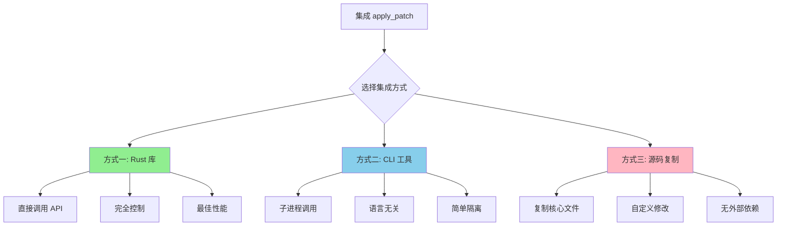
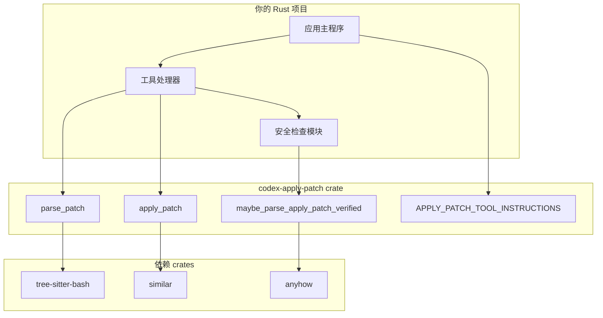
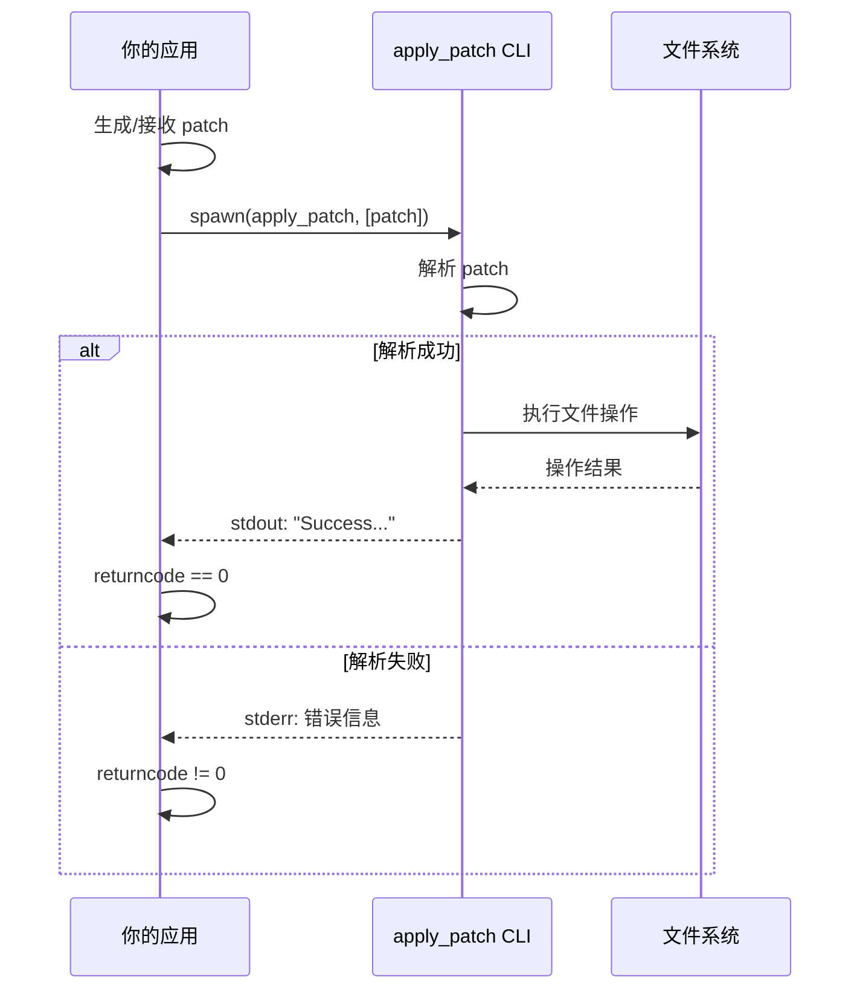
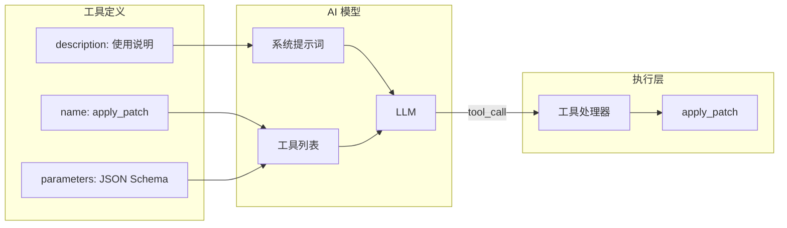
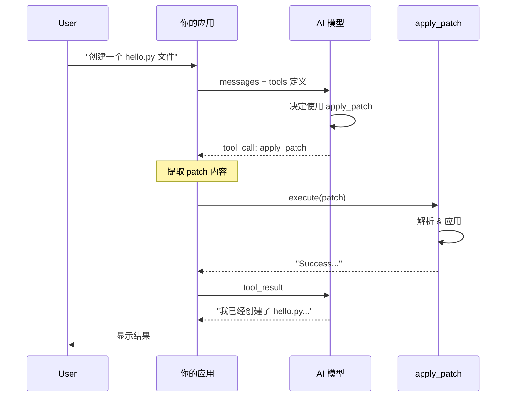
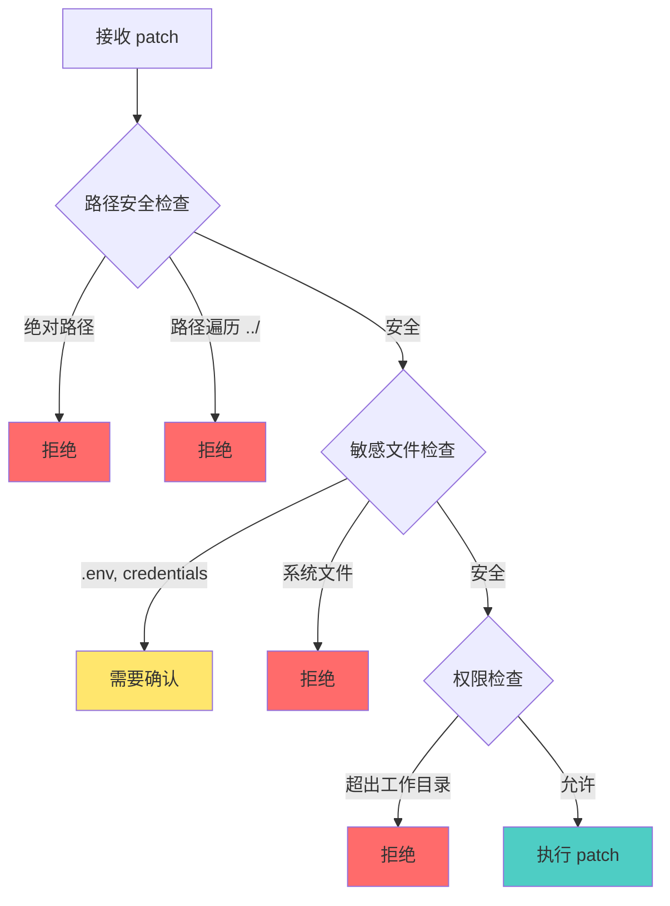
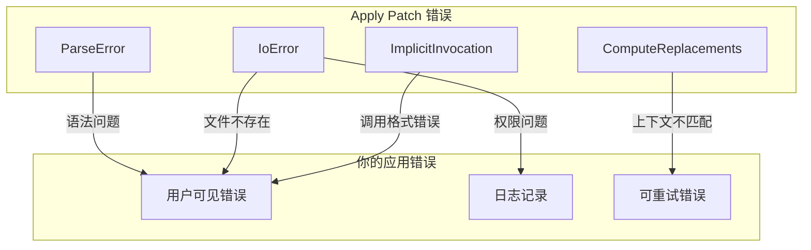
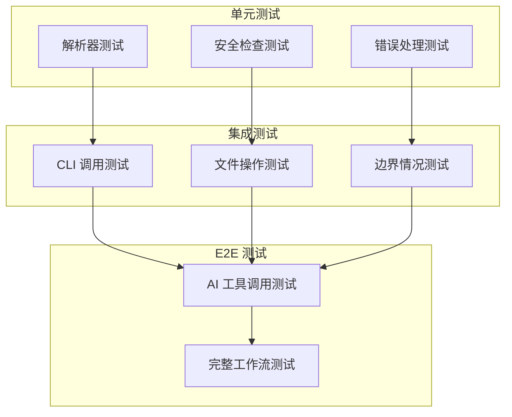

# Codex Apply Patch 集成指南

本文档详细说明如何将 `apply_patch` 工具集成到你自己的项目中。

---

## 目录

1. [集成方式概览](#1-集成方式概览)
2. [方式一：作为 Rust 库集成](#2-方式一作为-rust-库集成)
3. [方式二：作为独立 CLI 工具集成](#3-方式二作为独立-cli-工具集成)
4. [与 AI 模型集成](#4-与-ai-模型集成)
5. [安全考虑](#5-安全考虑)
6. [错误处理](#6-错误处理)
7. [测试策略](#7-测试策略)
8. [完整集成示例](#8-完整集成示例)
9. [常见问题](#9-常见问题)

---

## 1. 集成方式概览



### 方式对比

| 特性 | Rust 库 | CLI 工具 | 源码复制 |
|------|---------|----------|----------|
| 集成难度 | 中等 | 简单 | 复杂 |
| 性能 | 最佳 | 有进程开销 | 最佳 |
| 语言限制 | 仅 Rust | 任意语言 | 需转换 |
| 可定制性 | 中等 | 低 | 高 |
| 维护成本 | 低 | 低 | 高 |
| 依赖管理 | Cargo | 二进制 | 自行管理 |

---

## 2. 方式一：作为 Rust 库集成

### 2.1 添加依赖

由于 `codex-apply-patch` 不在 crates.io 上发布，你需要使用 git 依赖或路径依赖：

**方法 A: Git 依赖**
```toml
# Cargo.toml
[dependencies]
codex-apply-patch = { git = "https://github.com/openai/codex", subdirectory = "codex-rs/apply-patch" }
```

**方法 B: 路径依赖（如果是 submodule）**
```toml
# Cargo.toml
[dependencies]
codex-apply-patch = { path = "./venders/codex/codex-rs/apply-patch" }
```

**方法 C: 复制 crate 到项目**
```bash
# 复制 apply-patch crate
cp -r venders/codex/codex-rs/apply-patch ./crates/apply-patch

# 更新 Cargo.toml
[dependencies]
codex-apply-patch = { path = "./crates/apply-patch" }
```

### 2.2 基本 API 使用

```rust
use codex_apply_patch::{
    apply_patch,
    parse_patch,
    ApplyPatchError,
    Hunk,
    APPLY_PATCH_TOOL_INSTRUCTIONS,
};
use std::io::{stdout, stderr};

fn main() -> Result<(), ApplyPatchError> {
    let patch = r#"*** Begin Patch
*** Add File: hello.txt
+Hello, World!
*** End Patch"#;

    // 方式 1: 直接应用 patch
    apply_patch(patch, &mut stdout(), &mut stderr())?;

    // 方式 2: 先解析，再处理
    let args = parse_patch(patch)?;
    for hunk in &args.hunks {
        match hunk {
            Hunk::AddFile { path, contents } => {
                println!("将创建文件: {:?}", path);
                println!("内容: {}", contents);
            }
            Hunk::DeleteFile { path } => {
                println!("将删除文件: {:?}", path);
            }
            Hunk::UpdateFile { path, move_path, chunks } => {
                println!("将更新文件: {:?}", path);
                if let Some(new_path) = move_path {
                    println!("  移动到: {:?}", new_path);
                }
                println!("  {} 个修改块", chunks.len());
            }
        }
    }

    Ok(())
}
```

### 2.3 验证 patch（不执行）

```rust
use codex_apply_patch::{
    maybe_parse_apply_patch_verified,
    MaybeApplyPatchVerified,
    ApplyPatchFileChange,
};
use std::path::Path;

fn validate_and_preview(patch: &str, cwd: &Path) {
    let command = vec!["apply_patch".to_string(), patch.to_string()];

    match maybe_parse_apply_patch_verified(&command, cwd) {
        MaybeApplyPatchVerified::Body(action) => {
            println!("Patch 验证通过，将执行以下变更:");
            for (path, change) in action.changes() {
                match change {
                    ApplyPatchFileChange::Add { content } => {
                        println!("  + ADD: {:?} ({} bytes)", path, content.len());
                    }
                    ApplyPatchFileChange::Delete { content } => {
                        println!("  - DEL: {:?} ({} bytes)", path, content.len());
                    }
                    ApplyPatchFileChange::Update { unified_diff, move_path, .. } => {
                        println!("  ~ UPD: {:?}", path);
                        if let Some(new_path) = move_path {
                            println!("    -> {:?}", new_path);
                        }
                        println!("    Diff:\n{}", unified_diff);
                    }
                }
            }
        }
        MaybeApplyPatchVerified::CorrectnessError(e) => {
            println!("Patch 错误: {}", e);
        }
        MaybeApplyPatchVerified::ShellParseError(e) => {
            println!("Shell 解析错误: {:?}", e);
        }
        MaybeApplyPatchVerified::NotApplyPatch => {
            println!("不是有效的 apply_patch 命令");
        }
    }
}
```

### 2.4 获取工具说明

```rust
use codex_apply_patch::APPLY_PATCH_TOOL_INSTRUCTIONS;

fn get_tool_description() -> &'static str {
    // 这个常量包含完整的工具使用说明
    // 可以直接用于 AI 模型的系统提示词
    APPLY_PATCH_TOOL_INSTRUCTIONS
}
```

### 2.5 集成架构图



---

## 3. 方式二：作为独立 CLI 工具集成

### 3.1 构建二进制

```bash
cd venders/codex/codex-rs/apply-patch
cargo build --release

# 二进制文件位置
ls target/release/apply_patch
```

### 3.2 部署二进制

```bash
# 复制到项目 bin 目录
mkdir -p ./bin
cp target/release/apply_patch ./bin/

# 或安装到系统路径
sudo cp target/release/apply_patch /usr/local/bin/
```

### 3.3 从各种语言调用

#### Python
```python
import subprocess
import json
from pathlib import Path

class ApplyPatchTool:
    def __init__(self, binary_path: str = "apply_patch"):
        self.binary_path = binary_path

    def apply(self, patch: str, cwd: Path = None) -> tuple[bool, str, str]:
        """
        应用 patch 并返回 (success, stdout, stderr)
        """
        result = subprocess.run(
            [self.binary_path, patch],
            cwd=cwd,
            capture_output=True,
            text=True,
        )
        return (
            result.returncode == 0,
            result.stdout,
            result.stderr,
        )

    def apply_from_stdin(self, patch: str, cwd: Path = None) -> tuple[bool, str, str]:
        """
        通过 stdin 传递 patch
        """
        result = subprocess.run(
            [self.binary_path],
            cwd=cwd,
            input=patch,
            capture_output=True,
            text=True,
        )
        return (
            result.returncode == 0,
            result.stdout,
            result.stderr,
        )

# 使用示例
tool = ApplyPatchTool("./bin/apply_patch")
success, stdout, stderr = tool.apply("""*** Begin Patch
*** Add File: hello.txt
+Hello, World!
*** End Patch""")

if success:
    print(f"成功: {stdout}")
else:
    print(f"失败: {stderr}")
```

#### Node.js / TypeScript
```typescript
import { spawn, exec } from 'child_process';
import { promisify } from 'util';

const execAsync = promisify(exec);

interface ApplyPatchResult {
  success: boolean;
  stdout: string;
  stderr: string;
}

class ApplyPatchTool {
  constructor(private binaryPath: string = 'apply_patch') {}

  async apply(patch: string, cwd?: string): Promise<ApplyPatchResult> {
    try {
      const { stdout, stderr } = await execAsync(
        `${this.binaryPath} ${JSON.stringify(patch)}`,
        { cwd }
      );
      return { success: true, stdout, stderr };
    } catch (error: any) {
      return {
        success: false,
        stdout: error.stdout || '',
        stderr: error.stderr || error.message,
      };
    }
  }

  // 使用 stdin 传递大型 patch
  applyViaStdin(patch: string, cwd?: string): Promise<ApplyPatchResult> {
    return new Promise((resolve) => {
      const child = spawn(this.binaryPath, [], { cwd });
      let stdout = '';
      let stderr = '';

      child.stdout.on('data', (data) => (stdout += data));
      child.stderr.on('data', (data) => (stderr += data));

      child.on('close', (code) => {
        resolve({
          success: code === 0,
          stdout,
          stderr,
        });
      });

      child.stdin.write(patch);
      child.stdin.end();
    });
  }
}

// 使用示例
const tool = new ApplyPatchTool('./bin/apply_patch');
const result = await tool.apply(`*** Begin Patch
*** Add File: hello.txt
+Hello, World!
*** End Patch`);

console.log(result);
```

#### Go
```go
package main

import (
	"bytes"
	"os/exec"
	"path/filepath"
)

type ApplyPatchTool struct {
	BinaryPath string
}

type ApplyPatchResult struct {
	Success bool
	Stdout  string
	Stderr  string
}

func NewApplyPatchTool(binaryPath string) *ApplyPatchTool {
	return &ApplyPatchTool{BinaryPath: binaryPath}
}

func (t *ApplyPatchTool) Apply(patch string, cwd string) ApplyPatchResult {
	cmd := exec.Command(t.BinaryPath, patch)
	if cwd != "" {
		cmd.Dir = cwd
	}

	var stdout, stderr bytes.Buffer
	cmd.Stdout = &stdout
	cmd.Stderr = &stderr

	err := cmd.Run()
	return ApplyPatchResult{
		Success: err == nil,
		Stdout:  stdout.String(),
		Stderr:  stderr.String(),
	}
}

func (t *ApplyPatchTool) ApplyViaStdin(patch string, cwd string) ApplyPatchResult {
	cmd := exec.Command(t.BinaryPath)
	if cwd != "" {
		cmd.Dir = cwd
	}

	cmd.Stdin = bytes.NewBufferString(patch)

	var stdout, stderr bytes.Buffer
	cmd.Stdout = &stdout
	cmd.Stderr = &stderr

	err := cmd.Run()
	return ApplyPatchResult{
		Success: err == nil,
		Stdout:  stdout.String(),
		Stderr:  stderr.String(),
	}
}

func main() {
	tool := NewApplyPatchTool("./bin/apply_patch")
	result := tool.Apply(`*** Begin Patch
*** Add File: hello.txt
+Hello, World!
*** End Patch`, "")

	if result.Success {
		println("成功:", result.Stdout)
	} else {
		println("失败:", result.Stderr)
	}
}
```

### 3.4 CLI 集成架构



---

## 4. 与 AI 模型集成

### 4.1 工具定义

将 `apply_patch` 作为 AI 可调用的工具：



#### OpenAI 格式
```json
{
  "type": "function",
  "function": {
    "name": "apply_patch",
    "description": "Use the `apply_patch` tool to edit files.\n\nYour patch language is a stripped-down, file-oriented diff format...",
    "parameters": {
      "type": "object",
      "properties": {
        "input": {
          "type": "string",
          "description": "The entire contents of the apply_patch command"
        }
      },
      "required": ["input"],
      "additionalProperties": false
    }
  }
}
```

#### Anthropic 格式
```json
{
  "name": "apply_patch",
  "description": "Use the `apply_patch` tool to edit files...",
  "input_schema": {
    "type": "object",
    "properties": {
      "input": {
        "type": "string",
        "description": "The patch content"
      }
    },
    "required": ["input"]
  }
}
```

### 4.2 完整的 AI 集成示例 (Python)

```python
import json
from openai import OpenAI
from pathlib import Path
import subprocess

# 工具定义
APPLY_PATCH_TOOL = {
    "type": "function",
    "function": {
        "name": "apply_patch",
        "description": """Use the `apply_patch` tool to edit files.
Your patch language is a stripped-down, file-oriented diff format:

*** Begin Patch
[ one or more file sections ]
*** End Patch

Each operation starts with one of three headers:
- *** Add File: <path> - create a new file
- *** Delete File: <path> - remove an existing file
- *** Update File: <path> - patch an existing file

For updates, use @@ markers for context and +/- for changes.""",
        "parameters": {
            "type": "object",
            "properties": {
                "input": {
                    "type": "string",
                    "description": "The complete patch content"
                }
            },
            "required": ["input"],
            "additionalProperties": False
        }
    }
}

class AICodeEditor:
    def __init__(self, openai_client: OpenAI, workspace: Path):
        self.client = openai_client
        self.workspace = workspace
        self.tools = [APPLY_PATCH_TOOL]

    def execute_tool(self, tool_name: str, arguments: dict) -> str:
        if tool_name == "apply_patch":
            return self._execute_apply_patch(arguments["input"])
        raise ValueError(f"Unknown tool: {tool_name}")

    def _execute_apply_patch(self, patch: str) -> str:
        result = subprocess.run(
            ["apply_patch", patch],
            cwd=self.workspace,
            capture_output=True,
            text=True,
        )
        if result.returncode == 0:
            return f"Success: {result.stdout}"
        else:
            return f"Error: {result.stderr}"

    def chat(self, user_message: str) -> str:
        messages = [
            {"role": "system", "content": f"You are a code editor. Workspace: {self.workspace}"},
            {"role": "user", "content": user_message}
        ]

        while True:
            response = self.client.chat.completions.create(
                model="gpt-4",
                messages=messages,
                tools=self.tools,
            )

            choice = response.choices[0]

            if choice.finish_reason == "tool_calls":
                # 处理工具调用
                for tool_call in choice.message.tool_calls:
                    args = json.loads(tool_call.function.arguments)
                    result = self.execute_tool(
                        tool_call.function.name,
                        args
                    )
                    messages.append(choice.message)
                    messages.append({
                        "role": "tool",
                        "tool_call_id": tool_call.id,
                        "content": result
                    })
            else:
                return choice.message.content

# 使用示例
client = OpenAI()
editor = AICodeEditor(client, Path("./my_project"))
response = editor.chat("Create a hello.py file that prints 'Hello, World!'")
print(response)
```

### 4.3 AI 交互流程



---

## 5. 安全考虑

### 5.1 安全检查清单



### 5.2 实现安全检查

```rust
use std::path::{Path, PathBuf};
use codex_apply_patch::{parse_patch, Hunk};

#[derive(Debug)]
pub enum SafetyCheck {
    Safe,
    NeedsConfirmation(String),
    Rejected(String),
}

pub fn check_patch_safety(patch: &str, workspace: &Path) -> SafetyCheck {
    let args = match parse_patch(patch) {
        Ok(args) => args,
        Err(e) => return SafetyCheck::Rejected(format!("解析错误: {}", e)),
    };

    for hunk in &args.hunks {
        let path = match hunk {
            Hunk::AddFile { path, .. } => path,
            Hunk::DeleteFile { path } => path,
            Hunk::UpdateFile { path, .. } => path,
        };

        // 检查 1: 拒绝绝对路径
        if path.is_absolute() {
            return SafetyCheck::Rejected(
                format!("不允许绝对路径: {:?}", path)
            );
        }

        // 检查 2: 拒绝路径遍历
        if path.components().any(|c| c.as_os_str() == "..") {
            return SafetyCheck::Rejected(
                format!("不允许路径遍历: {:?}", path)
            );
        }

        // 检查 3: 解析后验证在工作目录内
        let full_path = workspace.join(path);
        if !full_path.starts_with(workspace) {
            return SafetyCheck::Rejected(
                format!("路径超出工作目录: {:?}", path)
            );
        }

        // 检查 4: 敏感文件警告
        let path_str = path.to_string_lossy().to_lowercase();
        if path_str.contains(".env")
            || path_str.contains("credential")
            || path_str.contains("secret")
            || path_str.contains("password")
        {
            return SafetyCheck::NeedsConfirmation(
                format!("敏感文件修改: {:?}", path)
            );
        }
    }

    SafetyCheck::Safe
}
```

### 5.3 沙箱执行

```rust
use std::process::{Command, Stdio};
use tempfile::TempDir;

pub struct SandboxedApplyPatch {
    workspace: PathBuf,
    allowed_paths: Vec<PathBuf>,
}

impl SandboxedApplyPatch {
    pub fn new(workspace: PathBuf) -> Self {
        Self {
            workspace,
            allowed_paths: vec![],
        }
    }

    pub fn allow_path(&mut self, path: PathBuf) {
        self.allowed_paths.push(path);
    }

    pub fn execute(&self, patch: &str) -> Result<String, String> {
        // 在临时目录中创建工作副本（可选的额外安全层）
        // 或直接在 workspace 中执行

        let output = Command::new("apply_patch")
            .arg(patch)
            .current_dir(&self.workspace)
            .stdout(Stdio::piped())
            .stderr(Stdio::piped())
            // 可以添加更多限制，如 chroot、容器等
            .output()
            .map_err(|e| format!("执行失败: {}", e))?;

        if output.status.success() {
            Ok(String::from_utf8_lossy(&output.stdout).to_string())
        } else {
            Err(String::from_utf8_lossy(&output.stderr).to_string())
        }
    }
}
```

---

## 6. 错误处理

### 6.1 错误类型映射



### 6.2 错误处理示例

```rust
use codex_apply_patch::{apply_patch, ApplyPatchError, ParseError};

#[derive(Debug)]
pub enum UserFacingError {
    InvalidPatchSyntax(String),
    FileNotFound(String),
    PermissionDenied(String),
    ContextMismatch(String),
    Unknown(String),
}

impl From<ApplyPatchError> for UserFacingError {
    fn from(err: ApplyPatchError) -> Self {
        match err {
            ApplyPatchError::ParseError(ParseError::InvalidPatchError(msg)) => {
                UserFacingError::InvalidPatchSyntax(
                    format!("Patch 语法错误: {}. 请确保以 '*** Begin Patch' 开始，'*** End Patch' 结束", msg)
                )
            }
            ApplyPatchError::ParseError(ParseError::InvalidHunkError { message, line_number }) => {
                UserFacingError::InvalidPatchSyntax(
                    format!("第 {} 行错误: {}", line_number, message)
                )
            }
            ApplyPatchError::IoError(e) => {
                let msg = e.to_string();
                if msg.contains("No such file") {
                    UserFacingError::FileNotFound(msg)
                } else if msg.contains("Permission denied") {
                    UserFacingError::PermissionDenied(msg)
                } else {
                    UserFacingError::Unknown(msg)
                }
            }
            ApplyPatchError::ComputeReplacements(msg) => {
                UserFacingError::ContextMismatch(
                    format!("无法定位修改位置: {}. 请确保上下文行与文件内容匹配", msg)
                )
            }
            ApplyPatchError::ImplicitInvocation => {
                UserFacingError::InvalidPatchSyntax(
                    "请使用 apply_patch 工具调用，不要直接传递 patch 内容".to_string()
                )
            }
        }
    }
}

pub fn apply_with_friendly_errors(patch: &str) -> Result<String, UserFacingError> {
    let mut stdout = Vec::new();
    let mut stderr = Vec::new();

    apply_patch(patch, &mut stdout, &mut stderr)?;

    Ok(String::from_utf8_lossy(&stdout).to_string())
}
```

---

## 7. 测试策略

### 7.1 测试架构



### 7.2 测试示例

```rust
#[cfg(test)]
mod tests {
    use super::*;
    use tempfile::tempdir;
    use std::fs;

    #[test]
    fn test_add_file() {
        let tmp = tempdir().unwrap();
        let patch = r#"*** Begin Patch
*** Add File: hello.txt
+Hello, World!
*** End Patch"#;

        let result = execute_patch_in_dir(patch, tmp.path());
        assert!(result.is_ok());

        let content = fs::read_to_string(tmp.path().join("hello.txt")).unwrap();
        assert_eq!(content, "Hello, World!\n");
    }

    #[test]
    fn test_update_file() {
        let tmp = tempdir().unwrap();
        fs::write(tmp.path().join("test.txt"), "line1\nline2\nline3\n").unwrap();

        let patch = r#"*** Begin Patch
*** Update File: test.txt
@@
 line1
-line2
+modified
 line3
*** End Patch"#;

        let result = execute_patch_in_dir(patch, tmp.path());
        assert!(result.is_ok());

        let content = fs::read_to_string(tmp.path().join("test.txt")).unwrap();
        assert_eq!(content, "line1\nmodified\nline3\n");
    }

    #[test]
    fn test_safety_rejects_path_traversal() {
        let patch = r#"*** Begin Patch
*** Add File: ../../../etc/passwd
+malicious
*** End Patch"#;

        let result = check_patch_safety(patch, Path::new("/workspace"));
        assert!(matches!(result, SafetyCheck::Rejected(_)));
    }

    #[test]
    fn test_safety_warns_on_sensitive_files() {
        let patch = r#"*** Begin Patch
*** Add File: .env
+SECRET_KEY=xxx
*** End Patch"#;

        let result = check_patch_safety(patch, Path::new("/workspace"));
        assert!(matches!(result, SafetyCheck::NeedsConfirmation(_)));
    }
}
```

### 7.3 模拟 AI 工具调用测试

```python
import pytest
from pathlib import Path
import tempfile
import json

class TestAIToolIntegration:
    def setup_method(self):
        self.tmp_dir = tempfile.mkdtemp()
        self.tool = ApplyPatchTool("./bin/apply_patch")

    def test_ai_generated_add_file(self):
        """测试 AI 生成的添加文件 patch"""
        # 模拟 AI 工具调用
        tool_call = {
            "name": "apply_patch",
            "arguments": {
                "input": """*** Begin Patch
*** Add File: src/main.py
+def main():
+    print("Hello")
+
+if __name__ == "__main__":
+    main()
*** End Patch"""
            }
        }

        success, stdout, stderr = self.tool.apply(
            tool_call["arguments"]["input"],
            cwd=Path(self.tmp_dir)
        )

        assert success
        assert (Path(self.tmp_dir) / "src/main.py").exists()

    def test_ai_generated_update_file(self):
        """测试 AI 生成的更新文件 patch"""
        # 创建初始文件
        src_dir = Path(self.tmp_dir) / "src"
        src_dir.mkdir()
        (src_dir / "app.py").write_text("def greet():\n    print('Hi')\n")

        tool_call = {
            "name": "apply_patch",
            "arguments": {
                "input": """*** Begin Patch
*** Update File: src/app.py
@@
 def greet():
-    print('Hi')
+    print('Hello, World!')
*** End Patch"""
            }
        }

        success, stdout, stderr = self.tool.apply(
            tool_call["arguments"]["input"],
            cwd=Path(self.tmp_dir)
        )

        assert success
        content = (src_dir / "app.py").read_text()
        assert "Hello, World!" in content
```

---

## 8. 完整集成示例

### 8.1 Rust 项目结构

```
my_ai_editor/
├── Cargo.toml
├── src/
│   ├── main.rs
│   ├── lib.rs
│   ├── tools/
│   │   ├── mod.rs
│   │   └── apply_patch.rs
│   └── safety/
│       ├── mod.rs
│       └── checker.rs
└── tests/
    └── integration_tests.rs
```

### 8.2 Cargo.toml

```toml
[package]
name = "my_ai_editor"
version = "0.1.0"
edition = "2021"

[dependencies]
codex-apply-patch = { path = "./venders/codex/codex-rs/apply-patch" }
tokio = { version = "1", features = ["full"] }
serde = { version = "1", features = ["derive"] }
serde_json = "1"
anyhow = "1"

[dev-dependencies]
tempfile = "3"
```

### 8.3 核心实现

```rust
// src/tools/apply_patch.rs
use codex_apply_patch::{
    apply_patch as execute_patch,
    parse_patch,
    maybe_parse_apply_patch_verified,
    MaybeApplyPatchVerified,
    ApplyPatchError,
    APPLY_PATCH_TOOL_INSTRUCTIONS,
};
use std::path::{Path, PathBuf};
use crate::safety::SafetyChecker;

pub struct ApplyPatchTool {
    workspace: PathBuf,
    safety_checker: SafetyChecker,
}

impl ApplyPatchTool {
    pub fn new(workspace: PathBuf) -> Self {
        Self {
            workspace,
            safety_checker: SafetyChecker::new(),
        }
    }

    /// 获取工具定义（用于 AI）
    pub fn tool_definition() -> serde_json::Value {
        serde_json::json!({
            "type": "function",
            "function": {
                "name": "apply_patch",
                "description": APPLY_PATCH_TOOL_INSTRUCTIONS,
                "parameters": {
                    "type": "object",
                    "properties": {
                        "input": {
                            "type": "string",
                            "description": "The patch content"
                        }
                    },
                    "required": ["input"]
                }
            }
        })
    }

    /// 预览变更（不执行）
    pub fn preview(&self, patch: &str) -> Result<PatchPreview, ToolError> {
        let command = vec!["apply_patch".to_string(), patch.to_string()];

        match maybe_parse_apply_patch_verified(&command, &self.workspace) {
            MaybeApplyPatchVerified::Body(action) => {
                Ok(PatchPreview {
                    changes: action.changes().clone(),
                    safety: self.safety_checker.check(action.changes()),
                })
            }
            MaybeApplyPatchVerified::CorrectnessError(e) => {
                Err(ToolError::PatchError(e.to_string()))
            }
            _ => Err(ToolError::InvalidInput),
        }
    }

    /// 执行 patch
    pub fn execute(&self, patch: &str) -> Result<ExecuteResult, ToolError> {
        // 1. 安全检查
        let preview = self.preview(patch)?;
        if let SafetyResult::Rejected(reason) = preview.safety {
            return Err(ToolError::SecurityRejected(reason));
        }

        // 2. 执行
        let mut stdout = Vec::new();
        let mut stderr = Vec::new();

        // 切换到工作目录
        let original_dir = std::env::current_dir()?;
        std::env::set_current_dir(&self.workspace)?;

        let result = execute_patch(patch, &mut stdout, &mut stderr);

        // 恢复目录
        std::env::set_current_dir(original_dir)?;

        match result {
            Ok(()) => Ok(ExecuteResult {
                success: true,
                message: String::from_utf8_lossy(&stdout).to_string(),
            }),
            Err(e) => Err(ToolError::ExecutionFailed(e.to_string())),
        }
    }
}

// src/main.rs
use my_ai_editor::tools::ApplyPatchTool;
use std::path::PathBuf;

fn main() {
    let tool = ApplyPatchTool::new(PathBuf::from("./workspace"));

    let patch = r#"*** Begin Patch
*** Add File: hello.rs
+fn main() {
+    println!("Hello, World!");
+}
*** End Patch"#;

    // 预览
    match tool.preview(patch) {
        Ok(preview) => {
            println!("将执行以下变更:");
            for (path, change) in &preview.changes {
                println!("  {:?}: {:?}", path, change);
            }
        }
        Err(e) => {
            eprintln!("预览失败: {:?}", e);
            return;
        }
    }

    // 执行
    match tool.execute(patch) {
        Ok(result) => println!("成功: {}", result.message),
        Err(e) => eprintln!("失败: {:?}", e),
    }
}
```

---

## 9. 常见问题

### Q1: 如何处理大型 patch？

**A:** 对于超大 patch，建议：
1. 使用 stdin 传递而非命令行参数
2. 分批执行多个小 patch
3. 增加超时时间

```rust
// 使用 stdin
let mut child = Command::new("apply_patch")
    .stdin(Stdio::piped())
    .spawn()?;

child.stdin.as_mut().unwrap().write_all(large_patch.as_bytes())?;
```

### Q2: 如何实现回滚？

**A:** apply_patch 本身不提供回滚。建议：
1. 执行前使用 git 创建 stash 或 commit
2. 保存原文件副本
3. 使用 `MaybeApplyPatchVerified` 预先获取变更内容

```rust
fn execute_with_backup(patch: &str, workspace: &Path) -> Result<(), Error> {
    // 1. 备份
    let backup = create_backup(workspace)?;

    // 2. 执行
    match apply_patch_in_dir(patch, workspace) {
        Ok(_) => {
            cleanup_backup(backup)?;
            Ok(())
        }
        Err(e) => {
            restore_from_backup(backup, workspace)?;
            Err(e)
        }
    }
}
```

### Q3: 如何与 git 集成？

**A:**
```rust
fn apply_and_commit(patch: &str, message: &str) -> Result<(), Error> {
    // 1. 确保工作目录干净
    let status = Command::new("git").args(["status", "--porcelain"]).output()?;
    if !status.stdout.is_empty() {
        return Err(Error::DirtyWorkingDirectory);
    }

    // 2. 应用 patch
    apply_patch(patch)?;

    // 3. git add & commit
    Command::new("git").args(["add", "."]).output()?;
    Command::new("git").args(["commit", "-m", message]).output()?;

    Ok(())
}
```

### Q4: 如何处理编码问题？

**A:** apply_patch 期望 UTF-8 编码。对于非 UTF-8 文件：
1. 在调用前转换编码
2. 使用二进制模式读写
3. 添加 BOM 处理

### Q5: Windows 上的路径问题？

**A:** apply_patch 使用 Rust 的 `PathBuf`，会自动处理路径分隔符。但建议：
1. 在 patch 中始终使用正斜杠 `/`
2. 避免包含 Windows 特有的路径字符

---

## 附录

### A. 依赖版本兼容性

| codex-apply-patch | Rust | tree-sitter | similar |
|-------------------|------|-------------|---------|
| main branch | 1.70+ | 0.24+ | 2.0+ |

### B. 性能基准

| 操作 | 文件数 | 平均耗时 |
|------|--------|----------|
| 解析 1KB patch | 1 | < 1ms |
| 应用简单添加 | 1 | ~ 5ms |
| 应用复杂更新 | 10 | ~ 50ms |
| 验证 + 应用 | 100 | ~ 500ms |

### C. 相关资源

- [apply-patch 源码](../../venders/codex/codex-rs/apply-patch/)
- [apply_patch 详解](./apply-patch.md)
- [Codex 项目](https://github.com/openai/codex)
