# Codex 架构分析文档

> 本文档基于对 `./venders/codex` 代码库的深入分析，详细阐述了 Codex CLI 的架构设计、核心组件、数据流和关键设计模式。

## 目录

- [1. 项目概述](#1-项目概述)
- [2. 整体架构](#2-整体架构)
- [3. 核心模块详解](#3-核心模块详解)
- [4. 数据流与协议](#4-数据流与协议)
- [5. 关键设计模式](#5-关键设计模式)
- [6. 安全机制](#6-安全机制)
- [7. 扩展性设计](#7-扩展性设计)
- [8. 总结](#8-总结)

---

## 1. 项目概述

### 1.1 项目定位

Codex CLI 是 OpenAI 开发的一个**本地运行的 AI 编程助手**，它能够：
- 理解自然语言指令并执行编程任务
- 在沙箱环境中安全执行命令
- 与用户交互式对话，支持多轮对话和会话恢复
- 集成 Model Context Protocol (MCP) 扩展能力
- 提供多种部署模式（CLI、App Server、MCP Server）

### 1.2 技术栈

- **语言**: Rust（核心） + Node.js（CLI 包装器） + TypeScript（SDK）
- **包管理**: Cargo（Rust workspace） + pnpm（Node.js monorepo）
- **UI 框架**: Ratatui（TUI）
- **异步运行时**: Tokio
- **协议**: JSON-RPC 2.0（App Server）、MCP（Model Context Protocol）
- **沙箱技术**: 
  - macOS: Seatbelt
  - Linux: Landlock + seccomp
  - Windows: Restricted Token

### 1.3 项目结构

```
codex/
├── codex-cli/          # Node.js CLI 包装器
│   └── bin/codex.js    # 入口脚本，根据平台分发 Rust 二进制
├── codex-rs/           # Rust 核心实现
│   ├── cli/            # CLI 主入口
│   ├── core/           # 核心业务逻辑
│   ├── tui/            # 终端用户界面
│   ├── app-server/     # JSON-RPC 服务器（供 IDE 扩展使用）
│   ├── exec-server/    # MCP 服务器（命令执行）
│   ├── mcp-server/     # MCP 服务器（Codex 工具）
│   ├── protocol/       # 协议类型定义
│   └── ...
├── sdk/typescript/     # TypeScript SDK
└── shell-tool-mcp/     # Shell 工具 MCP 实现
```

---

## 2. 整体架构

### 2.1 架构层次图

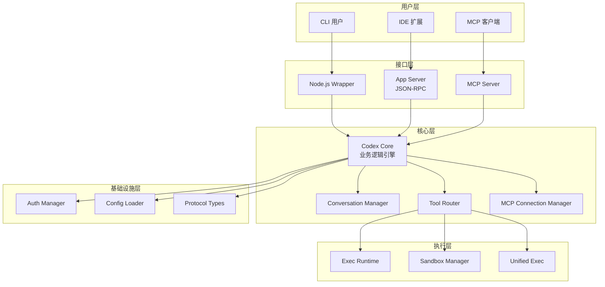
```mermaid
graph TB
    subgraph "用户层"
        CLI[CLI 用户]
        IDE[IDE 扩展]
        MCP[MCP 客户端]
    end
    
    subgraph "接口层"
        CLI_WRAPPER[Node.js Wrapper]
        APP_SERVER[App Server<br/>JSON-RPC]
        MCP_SERVER[MCP Server]
    end
    
    subgraph "核心层"
        CODEX_CORE[Codex Core<br/>业务逻辑引擎]
        CONV_MGR[Conversation Manager]
        TOOL_ROUTER[Tool Router]
        MCP_MGR[MCP Connection Manager]
    end
    
    subgraph "执行层"
        EXEC[Exec Runtime]
        SANDBOX[Sandbox Manager]
        UNIFIED_EXEC[Unified Exec]
    end
    
    subgraph "基础设施层"
        AUTH[Auth Manager]
        CONFIG[Config Loader]
        PROTOCOL[Protocol Types]
    end
    
    CLI --> CLI_WRAPPER
    IDE --> APP_SERVER
    MCP --> MCP_SERVER
    
    CLI_WRAPPER --> CODEX_CORE
    APP_SERVER --> CODEX_CORE
    MCP_SERVER --> CODEX_CORE
    
    CODEX_CORE --> CONV_MGR
    CODEX_CORE --> TOOL_ROUTER
    CODEX_CORE --> MCP_MGR
    
    TOOL_ROUTER --> EXEC
    TOOL_ROUTER --> SANDBOX
    TOOL_ROUTER --> UNIFIED_EXEC
    
    CODEX_CORE --> AUTH
    CODEX_CORE --> CONFIG
    CODEX_CORE --> PROTOCOL
```

### 2.2 核心架构模式

Codex 采用**队列对（Queue Pair）模式**作为核心通信机制：

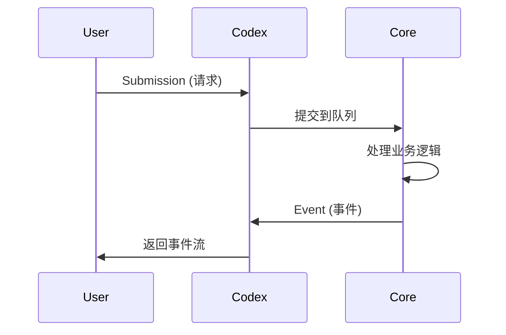
```mermaid
sequenceDiagram
    participant User
    participant Codex
    participant Core
    
    User->>Codex: Submission (请求)
    Codex->>Core: 提交到队列
    Core->>Core: 处理业务逻辑
    Core->>Codex: Event (事件)
    Codex->>User: 返回事件流
```

**关键设计**：
- **Submission Channel**: 用户提交请求的通道（`Sender<Submission>`）
- **Event Channel**: 系统返回事件的通道（`Receiver<Event>`）
- **异步非阻塞**: 所有操作都是异步的，支持流式响应

### 2.3 模块依赖关系

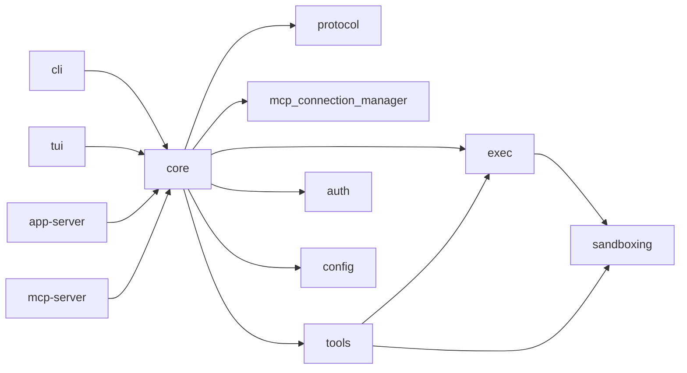
```mermaid
graph LR
    CLI[cli] --> CORE[core]
    TUI[tui] --> CORE
    APP_SERVER[app-server] --> CORE
    MCP_SERVER[mcp-server] --> CORE
    
    CORE --> PROTOCOL[protocol]
    CORE --> EXEC[exec]
    CORE --> MCP_MGR[mcp_connection_manager]
    CORE --> TOOLS[tools]
    
    EXEC --> SANDBOX[sandboxing]
    TOOLS --> EXEC
    TOOLS --> SANDBOX
    
    CORE --> AUTH[auth]
    CORE --> CONFIG[config]
```

---

## 3. 核心模块详解

### 3.1 Codex Core

**位置**: `codex-rs/core/src/codex.rs`

**职责**：
- 管理会话生命周期
- 处理用户输入和模型响应
- 协调工具调用
- 管理对话历史

**核心结构**：

```rust
pub struct Codex {
    pub(crate) next_id: AtomicU64,
    pub(crate) tx_sub: Sender<Submission>,      // 提交通道
    pub(crate) rx_event: Receiver<Event>,       // 事件通道
}
```

**关键流程**：

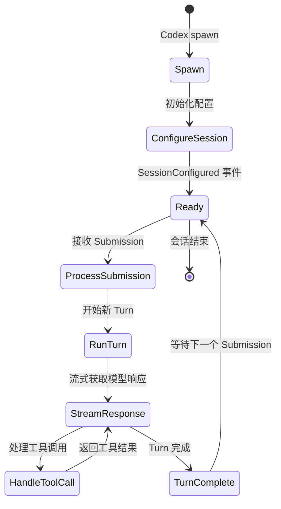
```mermaid
stateDiagram-v2
    [*] --> Spawn: Codex spawn
    Spawn --> ConfigureSession: 初始化配置
    ConfigureSession --> Ready: SessionConfigured 事件
    Ready --> ProcessSubmission: 接收 Submission
    ProcessSubmission --> RunTurn: 开始新 Turn
    RunTurn --> StreamResponse: 流式获取模型响应
    StreamResponse --> HandleToolCall: 处理工具调用
    HandleToolCall --> StreamResponse: 返回工具结果
    StreamResponse --> TurnComplete: Turn 完成
    TurnComplete --> Ready: 等待下一个 Submission
    Ready --> [*]: 会话结束
```

### 3.2 Conversation Manager

**位置**: `codex-rs/core/src/conversation_manager.rs`

**职责**：
- 创建和管理多个对话会话
- 支持会话恢复（Resume）
- 管理会话持久化（Rollout）

**核心 API**：

```rust
pub struct ConversationManager {
    conversations: Arc<RwLock<HashMap<ConversationId, Arc<CodexConversation>>>>,
    auth_manager: Arc<AuthManager>,
    models_manager: Arc<ModelsManager>,
    skills_manager: Arc<SkillsManager>,
}

impl ConversationManager {
    pub async fn new_conversation(&self, config: Config) -> CodexResult<NewConversation>;
    pub async fn resume_conversation(&self, id: ConversationId, config: Config) -> CodexResult<...>;
}
```

**会话生命周期**：

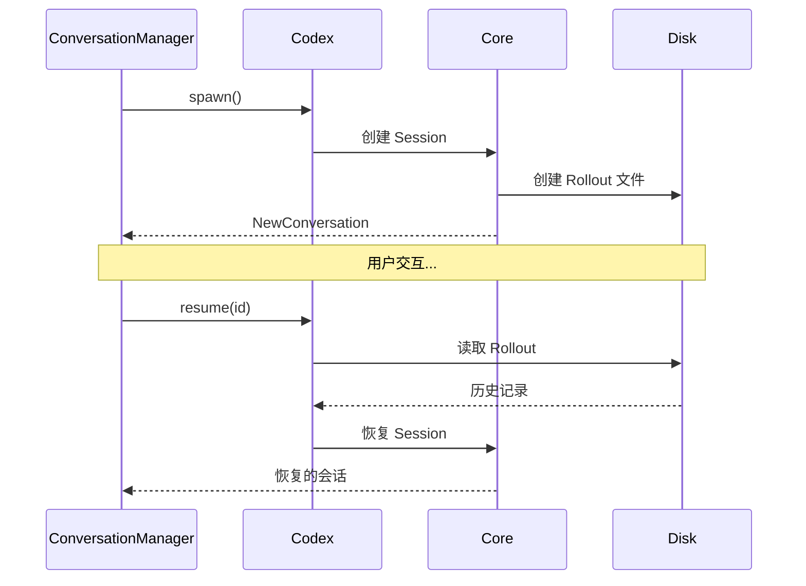
```mermaid
sequenceDiagram
    participant CM as ConversationManager
    participant Codex
    participant Core
    participant Disk
    
    CM->>Codex: spawn()
    Codex->>Core: 创建 Session
    Core->>Disk: 创建 Rollout 文件
    Core-->>CM: NewConversation
    
    Note over CM,Disk: 用户交互...
    
    CM->>Codex: resume(id)
    Codex->>Disk: 读取 Rollout
    Disk-->>Codex: 历史记录
    Codex->>Core: 恢复 Session
    Core-->>CM: 恢复的会话
```

### 3.3 Tool System

**位置**: `codex-rs/core/src/tools/`

**架构**：

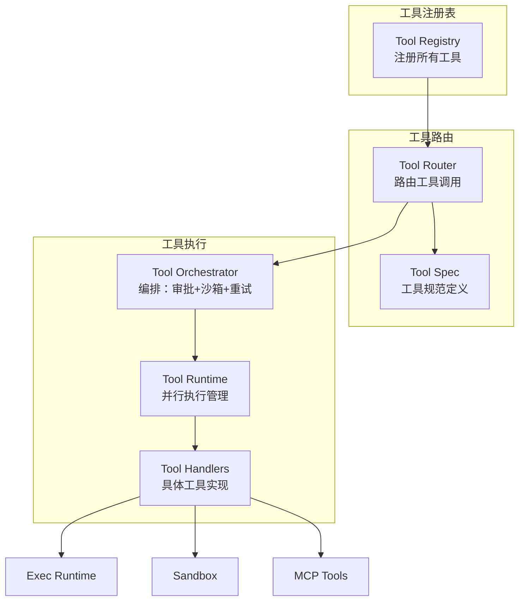
```mermaid
graph TB
    subgraph "工具注册表"
        REGISTRY[Tool Registry<br/>注册所有工具]
    end
    
    subgraph "工具路由"
        ROUTER[Tool Router<br/>路由工具调用]
        SPEC[Tool Spec<br/>工具规范定义]
    end
    
    subgraph "工具执行"
        ORCHESTRATOR[Tool Orchestrator<br/>编排：审批+沙箱+重试]
        RUNTIME[Tool Runtime<br/>并行执行管理]
        HANDLERS[Tool Handlers<br/>具体工具实现]
    end
    
    REGISTRY --> ROUTER
    ROUTER --> SPEC
    ROUTER --> ORCHESTRATOR
    ORCHESTRATOR --> RUNTIME
    RUNTIME --> HANDLERS
    
    HANDLERS --> EXEC[Exec Runtime]
    HANDLERS --> SANDBOX[Sandbox]
    HANDLERS --> MCP[MCP Tools]
```

**工具类型**：

1. **内置工具**：
   - `read_file`: 读取文件
   - `list_dir`: 列出目录
   - `grep_files`: 文件搜索
   - `apply_patch`: 应用补丁
   - `shell`: 执行 Shell 命令
   - `unified_exec`: 统一执行（支持交互式命令）
   - `view_image`: 查看图片
   - `mcp`: MCP 工具调用
   - `plan`: 计划工具

2. **MCP 工具**：
   - 动态加载的 MCP 服务器工具
   - 通过 `McpConnectionManager` 管理

**工具调用流程**：

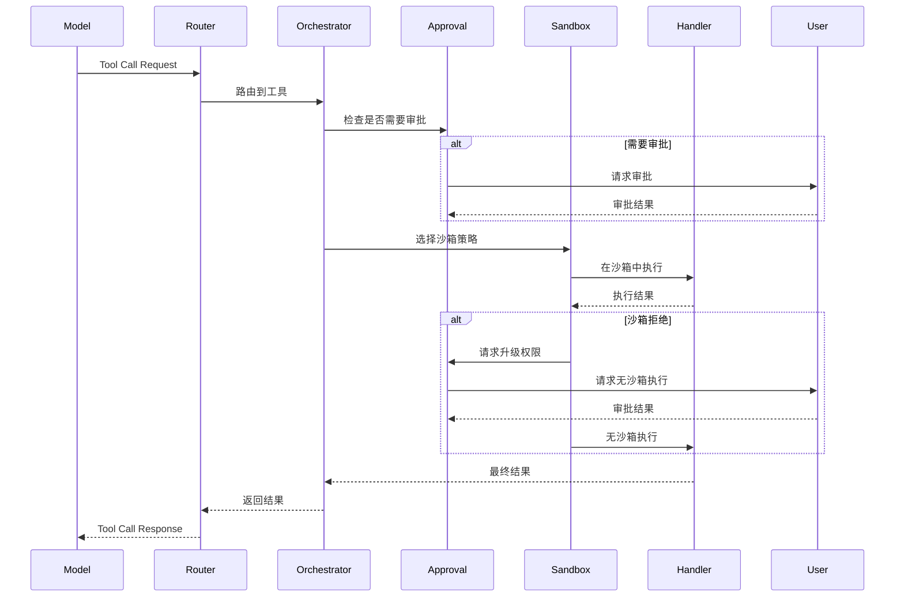
```mermaid
sequenceDiagram
    participant Model
    participant Router
    participant Orchestrator
    participant Approval
    participant Sandbox
    participant Handler
    
    Model->>Router: Tool Call Request
    Router->>Orchestrator: 路由到工具
    Orchestrator->>Approval: 检查是否需要审批
    alt 需要审批
        Approval->>User: 请求审批
        User-->>Approval: 审批结果
    end
    Orchestrator->>Sandbox: 选择沙箱策略
    Sandbox->>Handler: 在沙箱中执行
    Handler-->>Sandbox: 执行结果
    alt 沙箱拒绝
        Sandbox->>Approval: 请求升级权限
        Approval->>User: 请求无沙箱执行
        User-->>Approval: 审批结果
        Sandbox->>Handler: 无沙箱执行
    end
    Handler-->>Orchestrator: 最终结果
    Orchestrator-->>Router: 返回结果
    Router-->>Model: Tool Call Response
```

**并行工具调用**：

Codex 支持并行工具调用（当模型支持时）：

```rust
pub struct ToolCallRuntime {
    router: Arc<ToolRouter>,
    session: Arc<Session>,
    turn_context: Arc<TurnContext>,
    tracker: SharedTurnDiffTracker,
    parallel_execution: Arc<RwLock<()>>,  // 读写锁控制并行度
}
```

- **并行工具**: 使用 `read_lock`，允许多个并行执行
- **串行工具**: 使用 `write_lock`，强制串行执行

### 3.4 Exec Runtime

**位置**: `codex-rs/core/src/exec.rs`

**职责**：
- 执行 Shell 命令
- 管理命令超时
- 流式输出处理
- 平台特定的沙箱集成

**执行流程**：

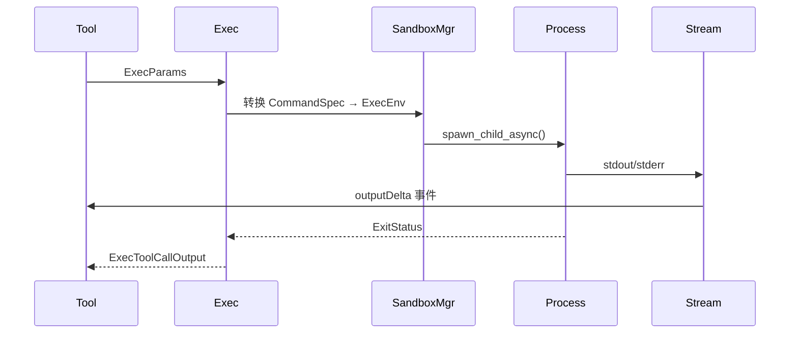
```mermaid
sequenceDiagram
    participant Tool
    participant Exec
    participant SandboxMgr
    participant Process
    participant Stream
    
    Tool->>Exec: ExecParams
    Exec->>SandboxMgr: 转换 CommandSpec → ExecEnv
    SandboxMgr->>Process: spawn_child_async()
    Process->>Stream: stdout/stderr
    Stream->>Tool: outputDelta 事件
    Process-->>Exec: ExitStatus
    Exec-->>Tool: ExecToolCallOutput
```

**关键特性**：

1. **流式输出**: 实时发送 `ExecCommandOutputDeltaEvent`
2. **超时控制**: 支持超时和取消令牌
3. **输出聚合**: 最终提供完整的 `aggregated_output`
4. **平台适配**: 
   - macOS: Seatbelt
   - Linux: Landlock + seccomp
   - Windows: Restricted Token

### 3.5 Sandbox Manager

**位置**: `codex-rs/core/src/sandboxing/mod.rs`

**沙箱策略**：

```rust
pub enum SandboxPolicy {
    DangerFullAccess,           // 无限制访问（危险）
    ReadOnly,                    // 只读
    WorkspaceWrite {             // 工作区可写
        writable_roots: Vec<PathBuf>,
        network_access: bool,
    },
    ExternalSandbox {            // 外部沙箱
        network_access: NetworkAccess,
    },
}
```

**沙箱选择逻辑**：

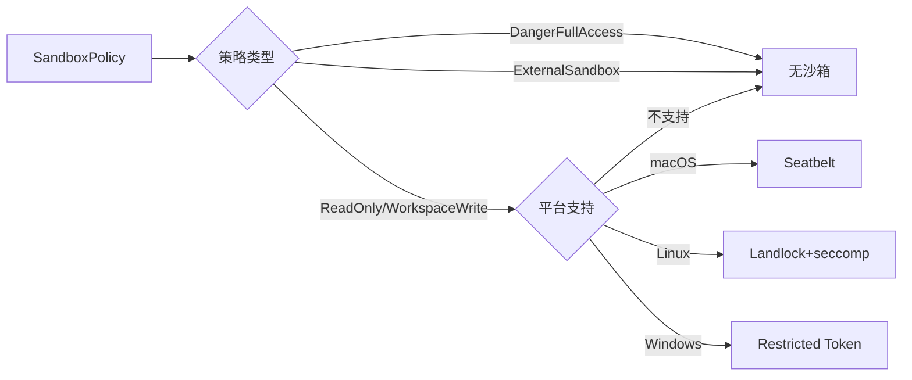
```mermaid
graph LR
    A[SandboxPolicy] --> B{策略类型}
    B -->|DangerFullAccess| C[无沙箱]
    B -->|ExternalSandbox| C
    B -->|ReadOnly/WorkspaceWrite| D{平台支持}
    D -->|macOS| E[Seatbelt]
    D -->|Linux| F[Landlock+seccomp]
    D -->|Windows| G[Restricted Token]
    D -->|不支持| C
```

**沙箱转换流程**：

```rust
pub struct SandboxManager;

impl SandboxManager {
    pub fn transform(
        &self,
        spec: CommandSpec,
        policy: &SandboxPolicy,
        sandbox_type: SandboxType,
        sandbox_cwd: &Path,
        codex_linux_sandbox_exe: Option<&PathBuf>,
    ) -> Result<ExecEnv, SandboxTransformError>
}
```

### 3.6 MCP Integration

**位置**: `codex-rs/core/src/mcp_connection_manager.rs`

**架构**：

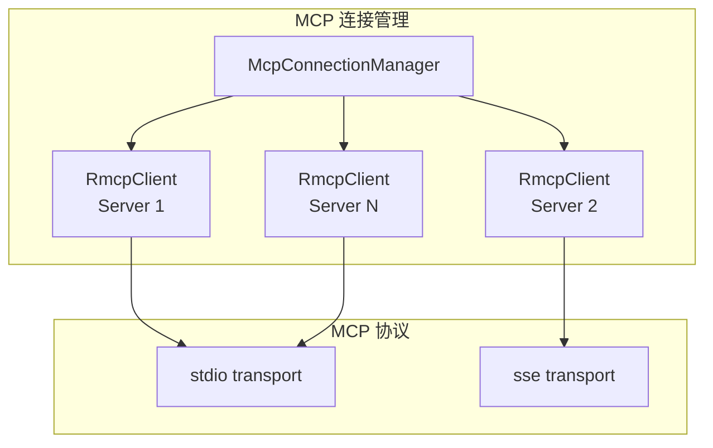
```mermaid
graph TB
    subgraph "MCP 连接管理"
        MCP_MGR[McpConnectionManager]
        CLIENT1[RmcpClient<br/>Server 1]
        CLIENT2[RmcpClient<br/>Server 2]
        CLIENTN[RmcpClient<br/>Server N]
    end
    
    subgraph "MCP 协议"
        STDIO[stdio transport]
        SSE[sse transport]
    end
    
    MCP_MGR --> CLIENT1
    MCP_MGR --> CLIENT2
    MCP_MGR --> CLIENTN
    
    CLIENT1 --> STDIO
    CLIENT2 --> SSE
    CLIENTN --> STDIO
```

**关键功能**：

1. **工具聚合**: 将所有 MCP 服务器的工具聚合，使用限定名称 `mcp__<server>__<tool>`
2. **资源管理**: 支持 MCP 资源（Resources）和资源模板（Resource Templates）
3. **OAuth 认证**: 支持 MCP 服务器的 OAuth 登录流程
4. **启动管理**: 管理 MCP 服务器的启动、重连和错误处理

**工具调用流程**：

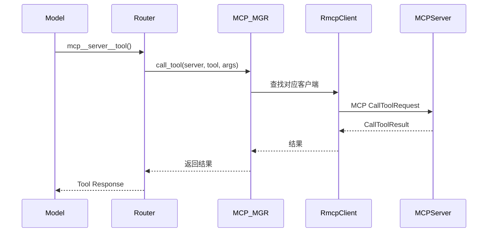
```mermaid
sequenceDiagram
    participant Model
    participant Router
    participant MCP_MGR
    participant RmcpClient
    participant MCPServer
    
    Model->>Router: mcp__server__tool()
    Router->>MCP_MGR: call_tool(server, tool, args)
    MCP_MGR->>RmcpClient: 查找对应客户端
    RmcpClient->>MCPServer: MCP CallToolRequest
    MCPServer-->>RmcpClient: CallToolResult
    RmcpClient-->>MCP_MGR: 结果
    MCP_MGR-->>Router: 返回结果
    Router-->>Model: Tool Response
```

### 3.7 App Server

**位置**: `codex-rs/app-server/`

**协议**: JSON-RPC 2.0 over stdio（JSONL 格式）

**核心 API**：

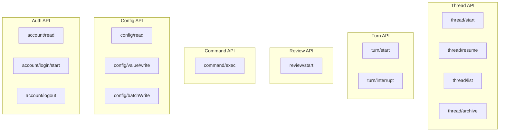
```mermaid
graph TB
    subgraph "Thread API"
        T_START[thread/start]
        T_RESUME[thread/resume]
        T_LIST[thread/list]
        T_ARCHIVE[thread/archive]
    end
    
    subgraph "Turn API"
        TURN_START[turn/start]
        TURN_INTERRUPT[turn/interrupt]
    end
    
    subgraph "Review API"
        REVIEW_START[review/start]
    end
    
    subgraph "Command API"
        CMD_EXEC[command/exec]
    end
    
    subgraph "Config API"
        CFG_READ[config/read]
        CFG_WRITE[config/value/write]
        CFG_BATCH[config/batchWrite]
    end
    
    subgraph "Auth API"
        AUTH_READ[account/read]
        AUTH_LOGIN[account/login/start]
        AUTH_LOGOUT[account/logout]
    end
```

**事件流**：

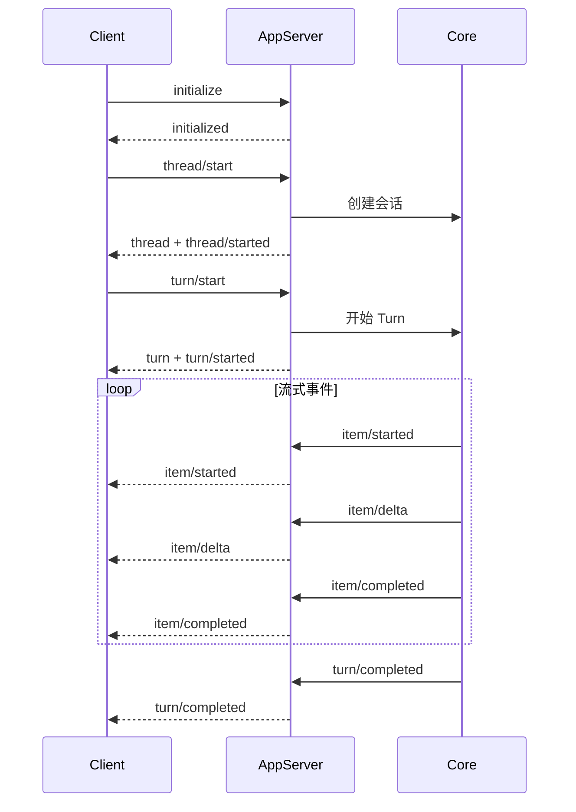
```mermaid
sequenceDiagram
    participant Client
    participant AppServer
    participant Core
    
    Client->>AppServer: initialize
    AppServer-->>Client: initialized
    
    Client->>AppServer: thread/start
    AppServer->>Core: 创建会话
    AppServer-->>Client: thread + thread/started
    
    Client->>AppServer: turn/start
    AppServer->>Core: 开始 Turn
    AppServer-->>Client: turn + turn/started
    
    loop 流式事件
        Core->>AppServer: item/started
        AppServer-->>Client: item/started
        Core->>AppServer: item/delta
        AppServer-->>Client: item/delta
        Core->>AppServer: item/completed
        AppServer-->>Client: item/completed
    end
    
    Core->>AppServer: turn/completed
    AppServer-->>Client: turn/completed
```

### 3.8 TUI (Terminal User Interface)

**位置**: `codex-rs/tui/`

**技术栈**:
- **Ratatui**: 终端 UI 框架
- **Crossterm**: 终端控制
- **事件驱动**: 基于 Tokio 的异步事件循环

**主要组件**：

1. **会话视图**: 显示对话历史
2. **输入处理**: 用户输入和快捷键
3. **状态管理**: 管理 UI 状态和 Codex 状态同步
4. **渲染引擎**: 基于 Ratatui 的组件渲染

**UI 架构**：

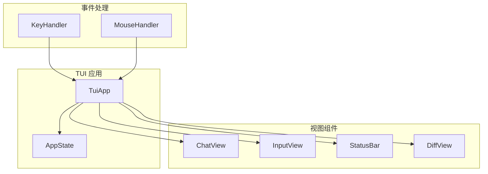
```mermaid
graph TB
    subgraph "TUI 应用"
        APP[TuiApp]
        STATE[AppState]
    end
    
    subgraph "视图组件"
        CHAT[ChatView]
        INPUT[InputView]
        STATUS[StatusBar]
        DIFF[DiffView]
    end
    
    subgraph "事件处理"
        KEY_HANDLER[KeyHandler]
        MOUSE_HANDLER[MouseHandler]
    end
    
    APP --> STATE
    APP --> CHAT
    APP --> INPUT
    APP --> STATUS
    APP --> DIFF
    
    KEY_HANDLER --> APP
    MOUSE_HANDLER --> APP
```

---

## 4. 数据流与协议

### 4.1 核心数据流

**完整请求-响应流程**：

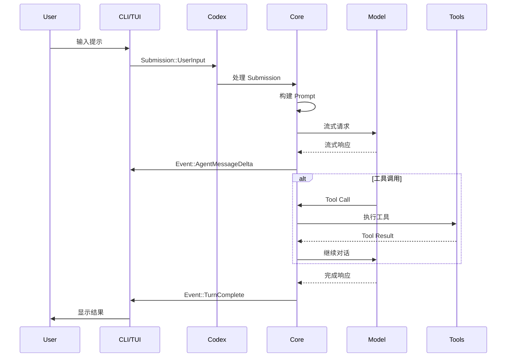
```mermaid
sequenceDiagram
    participant User
    participant CLI/TUI
    participant Codex
    participant Core
    participant Model
    participant Tools
    
    User->>CLI/TUI: 输入提示
    CLI/TUI->>Codex: Submission::UserInput
    Codex->>Core: 处理 Submission
    Core->>Core: 构建 Prompt
    Core->>Model: 流式请求
    Model-->>Core: 流式响应
    Core->>CLI/TUI: Event::AgentMessageDelta
    alt 工具调用
        Model->>Core: Tool Call
        Core->>Tools: 执行工具
        Tools-->>Core: Tool Result
        Core->>Model: 继续对话
    end
    Model-->>Core: 完成响应
    Core->>CLI/TUI: Event::TurnComplete
    CLI/TUI->>User: 显示结果
```

### 4.2 协议定义

**Submission 类型**：

```rust
pub enum Submission {
    ConfigureSession { ... },
    UserInput { input: Vec<ResponseItem> },
    InterruptTurn,
    ApproveCommand { ... },
    DeclineCommand { ... },
    // ...
}
```

**Event 类型**：

```rust
pub enum EventMsg {
    SessionConfigured(SessionConfiguredEvent),
    AgentMessageDelta(AgentMessageContentDeltaEvent),
    ItemStarted(ItemStartedEvent),
    ItemCompleted(ItemCompletedEvent),
    ExecCommandOutputDelta(ExecCommandOutputDeltaEvent),
    TurnComplete(TurnCompleteEvent),
    Error(ErrorEvent),
    // ...
}
```

### 4.3 对话历史管理

**Rollout 格式**：

Codex 使用 JSONL（JSON Lines）格式持久化对话历史：

```json
{"type":"SessionConfigured","model":"gpt-5.1-codex",...}
{"type":"TurnContext","cwd":"/path/to/project",...}
{"type":"UserMessage","content":[{"type":"text","text":"..."}]}
{"type":"AgentMessage","text":"..."}
{"type":"CommandExecution","command":["ls","-la"],...}
```

**历史压缩**：

Codex 支持自动压缩对话历史：
- **内联压缩**: 在 Turn 内压缩
- **远程压缩**: 使用远程服务压缩（如果配置）

---

## 5. 关键设计模式

### 5.1 队列对模式（Queue Pair）

**实现**：

```rust
pub struct Codex {
    pub(crate) next_id: AtomicU64,
    pub(crate) tx_sub: Sender<Submission>,    // 64 容量通道
    pub(crate) rx_event: Receiver<Event>,
}
```

**优势**：
- 解耦生产者和消费者
- 支持异步非阻塞操作
- 易于测试和模拟

### 5.2 状态机模式

**会话状态**：

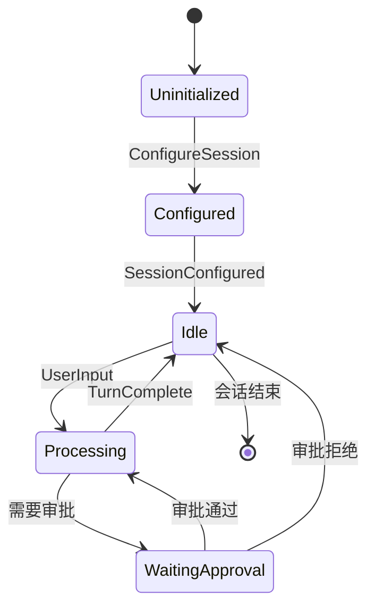
```mermaid
stateDiagram-v2
    [*] --> Uninitialized
    Uninitialized --> Configured: ConfigureSession
    Configured --> Idle: SessionConfigured
    Idle --> Processing: UserInput
    Processing --> WaitingApproval: 需要审批
    WaitingApproval --> Processing: 审批通过
    WaitingApproval --> Idle: 审批拒绝
    Processing --> Idle: TurnComplete
    Idle --> [*]: 会话结束
```

### 5.3 策略模式

**沙箱策略**：

```rust
pub enum SandboxPolicy {
    DangerFullAccess,
    ReadOnly,
    WorkspaceWrite { ... },
    ExternalSandbox { ... },
}
```

**审批策略**：

```rust
pub enum AskForApproval {
    Never,
    Untrusted,
    OnRequest,
    OnFailure,
}
```

### 5.4 观察者模式

**事件流**：

```rust
// 事件发送
tx_event.send(Event { id, msg: EventMsg::... }).await?;

// 事件接收
while let Ok(event) = rx_event.recv().await {
    handle_event(event)?;
}
```

### 5.5 工厂模式

**工具注册**：

```rust
pub struct ToolRegistry {
    tools: HashMap<String, Box<dyn ToolHandler>>,
}

impl ToolRegistry {
    pub fn register<T: ToolHandler + 'static>(&mut self, name: String, tool: T) {
        self.tools.insert(name, Box::new(tool));
    }
}
```

---

## 6. 安全机制

### 6.1 多层安全防护

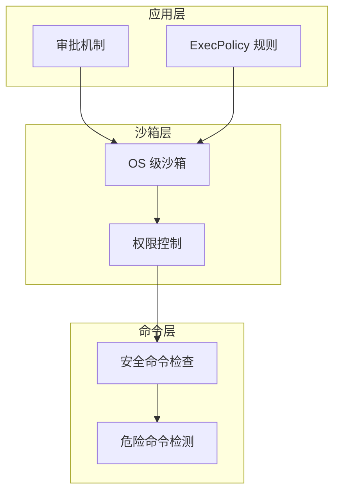
```mermaid
graph TB
    subgraph "应用层"
        APPROVAL[审批机制]
        EXECPOLICY[ExecPolicy 规则]
    end
    
    subgraph "沙箱层"
        SANDBOX[OS 级沙箱]
        PERMISSIONS[权限控制]
    end
    
    subgraph "命令层"
        SAFE_CHECK[安全命令检查]
        DANGER_CHECK[危险命令检测]
    end
    
    APPROVAL --> SANDBOX
    EXECPOLICY --> SANDBOX
    SANDBOX --> PERMISSIONS
    PERMISSIONS --> SAFE_CHECK
    SAFE_CHECK --> DANGER_CHECK
```

### 6.2 审批流程

**审批决策树**：

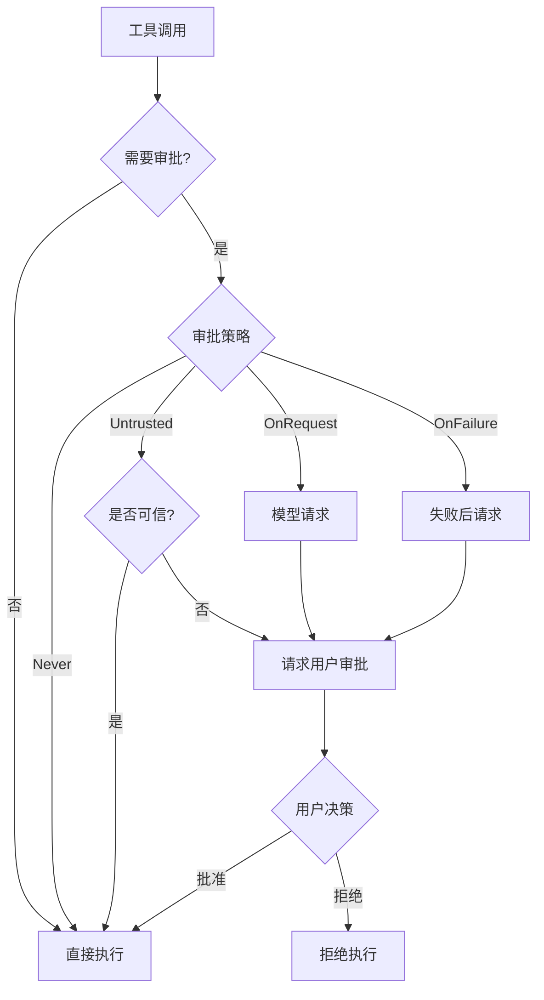
```mermaid
graph TD
    A[工具调用] --> B{需要审批?}
    B -->|是| C{审批策略}
    B -->|否| E[直接执行]
    
    C -->|Never| E
    C -->|Untrusted| D{是否可信?}
    C -->|OnRequest| F[模型请求]
    C -->|OnFailure| G[失败后请求]
    
    D -->|是| E
    D -->|否| H[请求用户审批]
    F --> H
    G --> H
    
    H --> I{用户决策}
    I -->|批准| E
    I -->|拒绝| J[拒绝执行]
```

### 6.3 ExecPolicy

**规则文件格式** (`.codexpolicy`):

```starlark
def can_execute(command, cwd):
    # 自定义规则逻辑
    if command[0] == "rm" and "-rf" in command:
        return False
    return True
```

**执行流程**：

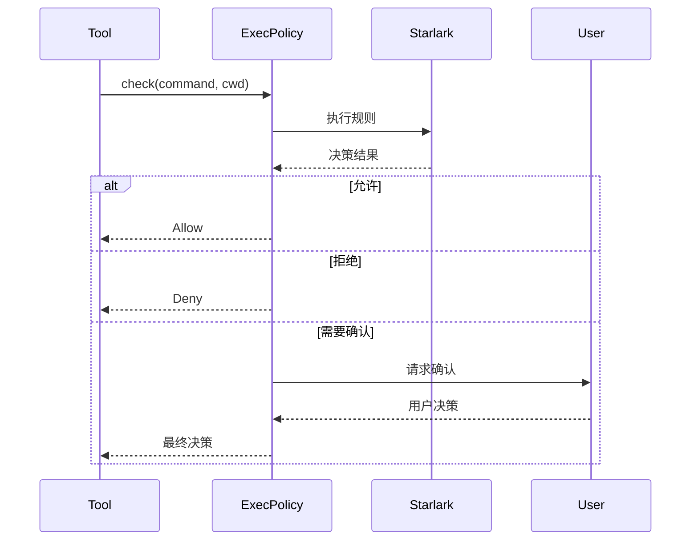
```mermaid
sequenceDiagram
    participant Tool
    participant ExecPolicy
    participant Starlark
    participant User
    
    Tool->>ExecPolicy: check(command, cwd)
    ExecPolicy->>Starlark: 执行规则
    Starlark-->>ExecPolicy: 决策结果
    alt 允许
        ExecPolicy-->>Tool: Allow
    else 拒绝
        ExecPolicy-->>Tool: Deny
    else 需要确认
        ExecPolicy->>User: 请求确认
        User-->>ExecPolicy: 用户决策
        ExecPolicy-->>Tool: 最终决策
    end
```

### 6.4 平台特定沙箱

**macOS Seatbelt**:

```rust
// 使用系统 sandbox-exec
sandbox-exec -f policy.sbpl command args
```

**Linux Landlock + seccomp**:

```rust
// 使用 codex-linux-sandbox 包装器
codex-linux-sandbox --policy policy.json command args
```

**Windows Restricted Token**:

```rust
// 使用 Windows 受限令牌
run_windows_sandbox_capture(policy, command, ...)
```

---

## 7. 扩展性设计

### 7.1 MCP 扩展

**集成流程**：

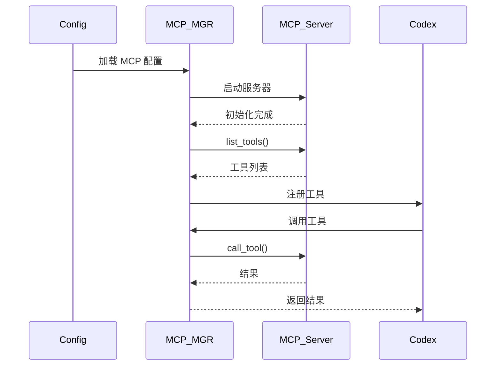
```mermaid
sequenceDiagram
    participant Config
    participant MCP_MGR
    participant MCP_Server
    participant Codex
    
    Config->>MCP_MGR: 加载 MCP 配置
    MCP_MGR->>MCP_Server: 启动服务器
    MCP_Server-->>MCP_MGR: 初始化完成
    MCP_MGR->>MCP_Server: list_tools()
    MCP_Server-->>MCP_MGR: 工具列表
    MCP_MGR->>Codex: 注册工具
    Codex->>MCP_MGR: 调用工具
    MCP_MGR->>MCP_Server: call_tool()
    MCP_Server-->>MCP_MGR: 结果
    MCP_MGR-->>Codex: 返回结果
```

### 7.2 Skills 系统

**位置**: `codex-rs/core/src/skills/`

**Skills 是预定义的提示模板**，可以：
- 注入到系统提示中
- 根据项目上下文动态加载
- 支持自定义 Skills

**Skills 加载流程**：

```mermaid
graph LR
    A[SkillsManager] --> B[扫描 Skills 目录]
    B --> C[加载 .md 文件]
    C --> D[解析元数据]
    D --> E[注入到 Prompt]
```

### 7.3 自定义工具

**实现新工具**：

```rust
pub trait ToolRuntime<Req, Out> {
    fn run(&mut self, req: &Req, attempt: &SandboxAttempt, ctx: &ToolCtx) 
        -> impl Future<Output = Result<Out, ToolError>>;
    
    fn exec_approval_requirement(&self, req: &Req) -> Option<ExecApprovalRequirement>;
    fn sandbox_mode_for_first_attempt(&self, req: &Req) -> SandboxOverride;
    // ...
}
```

### 7.4 配置系统

**配置层次**：

```mermaid
graph TB
    A[默认配置] --> B[用户配置<br/>~/.codex/config.toml]
    B --> C[Profile 配置]
    C --> D[CLI 参数覆盖]
    D --> E[最终配置]
```

**配置加载**：

```rust
pub struct ConfigLoader {
    // 支持多层级配置合并
    // 支持环境变量覆盖
    // 支持 CLI 参数覆盖
}
```

---

## 8. 总结

### 8.1 架构优势

1. **模块化设计**: 清晰的模块边界，易于维护和扩展
2. **异步架构**: 基于 Tokio 的高性能异步运行时
3. **类型安全**: Rust 的类型系统保证运行时安全
4. **安全优先**: 多层安全机制，沙箱 + 审批 + 策略
5. **可扩展性**: MCP 集成、Skills 系统、自定义工具

### 8.2 关键创新

1. **队列对模式**: 简洁的异步通信机制
2. **统一执行**: 支持交互式命令的统一执行框架
3. **并行工具调用**: 智能的并行/串行工具调度
4. **历史压缩**: 自动压缩对话历史以节省 Token
5. **多平台沙箱**: 统一的沙箱抽象，支持三大平台

### 8.3 技术亮点

1. **零拷贝设计**: 大量使用 `Arc` 和引用避免数据复制
2. **流式处理**: 实时流式输出，提升用户体验
3. **错误处理**: 完善的错误类型和错误传播机制
4. **测试支持**: 丰富的测试工具和测试支持特性
5. **可观测性**: 集成 OpenTelemetry 进行追踪和监控

### 8.4 未来方向

根据代码分析，可能的演进方向：

1. **TUI v2**: 正在开发的新版 TUI（`tui2` 模块）
2. **统一执行增强**: `unified_exec` 模块的持续改进
3. **MCP 生态**: 更丰富的 MCP 服务器集成
4. **性能优化**: 进一步优化并发和内存使用
5. **安全性增强**: 更细粒度的权限控制和审计

---

## 附录

### A. 关键文件索引

- **核心入口**: `codex-rs/cli/src/main.rs`
- **业务逻辑**: `codex-rs/core/src/codex.rs`
- **工具系统**: `codex-rs/core/src/tools/`
- **执行引擎**: `codex-rs/core/src/exec.rs`
- **沙箱管理**: `codex-rs/core/src/sandboxing/`
- **MCP 集成**: `codex-rs/core/src/mcp_connection_manager.rs`
- **协议定义**: `codex-rs/protocol/`
- **App Server**: `codex-rs/app-server/`

### B. 重要依赖

- **Tokio**: 异步运行时
- **Ratatui**: TUI 框架
- **Serde**: 序列化/反序列化
- **Reqwest**: HTTP 客户端
- **Tree-sitter**: 代码解析
- **Starlark**: 规则引擎（ExecPolicy）

### C. 参考文档

- [Codex README](https://github.com/openai/codex)
- [App Server Protocol](./venders/codex/codex-rs/app-server/README.md)
- [Exec Server](./venders/codex/codex-rs/exec-server/README.md)
- [Config Documentation](./venders/codex/docs/config.md)

---

**文档版本**: 1.0  
**分析日期**: 2024  
**分析工具**: Composer (AI Assistant)

