# OpenAI Codex CLI 架构分析文档

> 本文档由 Claude AI 分析 OpenAI Codex CLI 源代码后生成
> 分析日期: 2025-12-30
> 代码版本: 基于 venders/codex 仓库

## 目录

- [1. 项目概述](#1-项目概述)
- [2. 整体架构](#2-整体架构)
- [3. 核心组件](#3-核心组件)
- [4. 协议与通信](#4-协议与通信)
- [5. 工具系统](#5-工具系统)
- [6. 沙箱机制](#6-沙箱机制)
- [7. MCP 集成](#7-mcp-集成)
- [8. 会话管理](#8-会话管理)
- [9. 配置系统](#9-配置系统)
- [10. 设计模式与最佳实践](#10-设计模式与最佳实践)
- [11. 部署架构](#11-部署架构)
- [12. 技术栈](#12-技术栈)

---

## 1. 项目概述

### 1.1 项目定位

OpenAI Codex CLI 是一个本地运行的 AI 编程助手，支持在终端中进行智能代码编写、修改、审查等操作。它是 OpenAI 官方提供的命令行工具，旨在为开发者提供类似 ChatGPT 的推理能力，同时具备执行代码、操作文件系统的能力。

### 1.2 核心特性

- **本地运行**: 在用户计算机上本地执行，提供即时响应
- **多模态支持**: 支持文本和图像输入（截图、图表等）
- **安全沙箱**: 跨平台的沙箱机制，确保代码执行安全
- **多种接口**: CLI TUI、非交互式 exec 模式、App Server、MCP Server
- **配置灵活**: 丰富的配置选项，支持多种 AI 提供商
- **可扩展**: 通过 MCP (Model Context Protocol) 和 Skills 系统扩展功能

### 1.3 双实现架构

Codex CLI 历史上有两个实现：

1. **TypeScript 实现** (Legacy)
   - 最初的实现版本
   - 位于 `codex-cli/` 目录
   - 已被标记为过时，仅维护模式

2. **Rust 实现** (Current)
   - 当前主要维护的版本
   - 位于 `codex-rs/` 目录
   - 提供更好的性能和内存安全
   - 包含更丰富的功能（如 App Server、MCP Server）

---

## 2. 整体架构

### 2.1 系统架构图

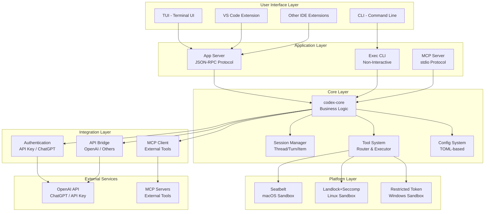

### 2.2 分层架构

Codex CLI 采用清晰的分层架构：

| 层级 | 职责 | 主要组件 |
|------|------|----------|
| **用户界面层** | 接收用户输入，展示结果 | TUI、CLI、IDE Extensions |
| **应用层** | 协议适配，请求路由 | App Server、Exec CLI、MCP Server |
| **核心层** | 业务逻辑，会话管理，工具执行 | codex-core |
| **集成层** | 外部服务对接 | Auth、API Client、MCP Client |
| **平台层** | OS 特定功能 | Sandbox 实现 |

---

## 3. 核心组件

### 3.1 Cargo Workspace 结构

Codex Rust 实现是一个 Cargo Workspace，包含 40+ 个 crate：

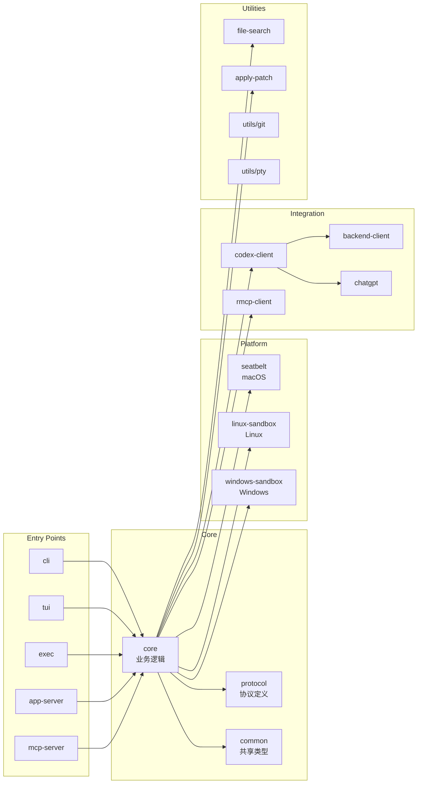

### 3.2 核心 Crate 说明

#### 3.2.1 codex-core

核心业务逻辑库，负责：

- **会话管理**: `CodexConversation`、`ConversationManager`
- **工具系统**: `ToolRouter`、工具注册与执行
- **执行策略**: `ExecPolicyManager`
- **沙箱协调**: 跨平台沙箱策略
- **配置加载**: 多层配置合并
- **MCP 集成**: `McpConnectionManager`

主要模块：

```
core/src/
├── codex.rs               # 核心 Codex 会话类
├── codex_conversation.rs  # 对话管理
├── conversation_manager.rs # 会话管理器
├── tools/                 # 工具系统
│   ├── router.rs         # 工具路由
│   ├── orchestrator.rs   # 编排器
│   ├── parallel.rs       # 并行执行
│   └── sandboxing.rs     # 沙箱集成
├── config/               # 配置系统
├── auth.rs               # 认证管理
├── mcp_connection_manager.rs # MCP 连接
└── sandboxing/           # 沙箱实现
```

#### 3.2.2 codex-protocol

定义了 Codex 的通信协议：

- **Submission Queue (SQ)**: 用户请求队列
- **Event Queue (EQ)**: 系统事件队列
- **Op 类型**: `UserTurn`、`Interrupt` 等操作
- **Event 类型**: 各种事件通知
- **会话结构**: `Thread`、`Turn`、`Item`

#### 3.2.3 codex-tui

基于 [Ratatui](https://ratatui.rs/) 的终端 UI：

- 全屏交互式界面
- 实时流式输出
- 富文本渲染（代码高亮、diff 显示）
- 审批流程 UI

#### 3.2.4 codex-app-server

JSON-RPC 2.0 协议服务器：

- 通过 stdio 通信（类似 LSP/MCP）
- 为 IDE 扩展提供后端
- 支持 Thread/Turn/Item 完整生命周期
- 流式事件通知

---

## 4. 协议与通信

### 4.1 SQ/EQ 模式

Codex 使用 **Submission Queue (SQ)** 和 **Event Queue (EQ)** 模式进行异步通信：

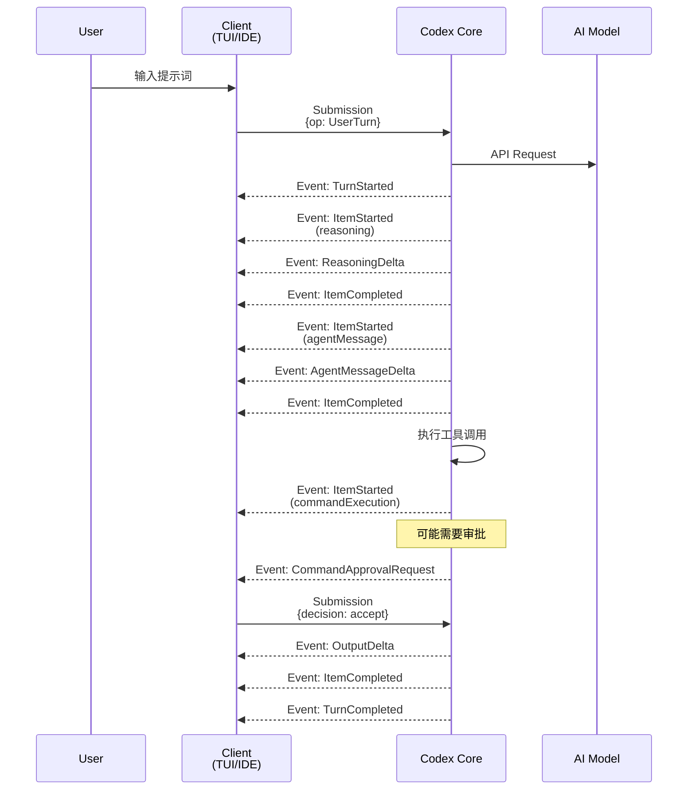

### 4.2 Submission 类型

```rust
pub enum Op {
    // 中断当前任务
    Interrupt,

    // 用户输入（简单模式）
    UserInput {
        items: Vec<UserInput>,
    },

    // 用户 Turn（完整模式）
    UserTurn {
        items: Vec<UserInput>,
        cwd: PathBuf,
        approval_policy: AskForApproval,
        sandbox_policy: SandboxPolicy,
        model: String,
        // ...
    },

    // 审批响应
    ApprovalResponse {
        request_id: String,
        decision: ReviewDecision,
    },

    // ...
}
```

### 4.3 Event 类型

主要事件包括：

- **生命周期事件**: `TurnStarted`, `TurnCompleted`, `ItemStarted`, `ItemCompleted`
- **流式更新**: `AgentMessageDelta`, `ReasoningDelta`, `OutputDelta`
- **审批请求**: `ExecApprovalRequest`, `ApplyPatchApprovalRequest`
- **状态通知**: `TokenCountEvent`, `DeprecationNotice`, `ErrorEvent`

### 4.4 App Server 协议

App Server 使用 JSON-RPC 2.0（省略 `"jsonrpc":"2.0"` 字段）：

**初始化流程**:

```json
// 1. Client -> Server: initialize
{"method": "initialize", "id": 0, "params": {
    "clientInfo": {
        "name": "codex-vscode",
        "version": "0.1.0"
    }
}}

// 2. Server -> Client: response
{"id": 0, "result": {"userAgent": "..."}}

// 3. Client -> Server: initialized
{"method": "initialized"}
```

**核心 API**:

- `thread/start`, `thread/resume`, `thread/list`, `thread/archive`
- `turn/start`, `turn/interrupt`
- `review/start`
- `command/exec`
- `config/read`, `config/value/write`
- `account/login/start`, `account/logout`

---

## 5. 工具系统

### 5.1 工具架构

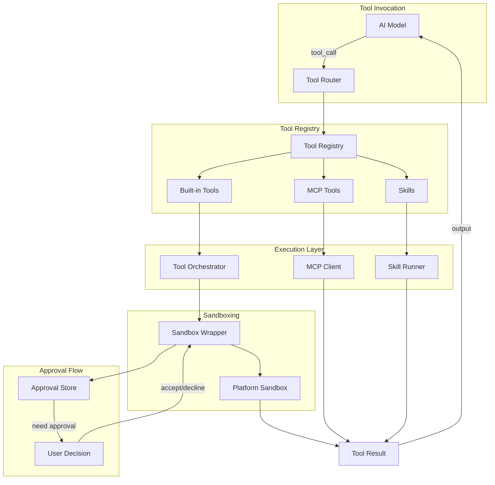

### 5.2 内置工具

Codex 提供以下内置工具（部分）：

| 工具名称 | 功能 | 参数 |
|---------|------|------|
| `local_shell` | 执行 shell 命令 | `command`, `cwd` |
| `apply_patch` | 应用文件补丁 | `path`, `patch` |
| `read_file` | 读取文件内容 | `path` |
| `write_file` | 写入文件 | `path`, `content` |
| `glob` | 文件模式匹配 | `pattern` |
| `grep` | 文本搜索 | `pattern`, `path` |
| `view_image` | 查看图像（转 base64） | `path` |
| `web_search` | 网页搜索 | `query` |

### 5.3 工具路由机制

```rust
pub struct ToolRouter {
    // 内置工具注册表
    builtin_registry: ToolRegistry,
    // MCP 工具
    mcp_tools: HashMap<String, McpTool>,
    // Skills
    skills: HashMap<String, Skill>,
}

impl ToolRouter {
    pub async fn route_tool_call(
        &self,
        tool_name: &str,
        args: Value,
    ) -> Result<ToolCallOutput> {
        // 1. 查找工具
        let tool = self.find_tool(tool_name)?;

        // 2. 检查审批策略
        if self.needs_approval(&tool, &args) {
            self.request_approval(&tool, &args).await?;
        }

        // 3. 应用沙箱策略
        let sandboxed = self.apply_sandbox(&tool, &args)?;

        // 4. 执行工具
        let output = tool.execute(sandboxed).await?;

        // 5. 返回结果
        Ok(output)
    }
}
```

### 5.4 并行工具执行

Codex 支持并行执行多个独立的工具调用：

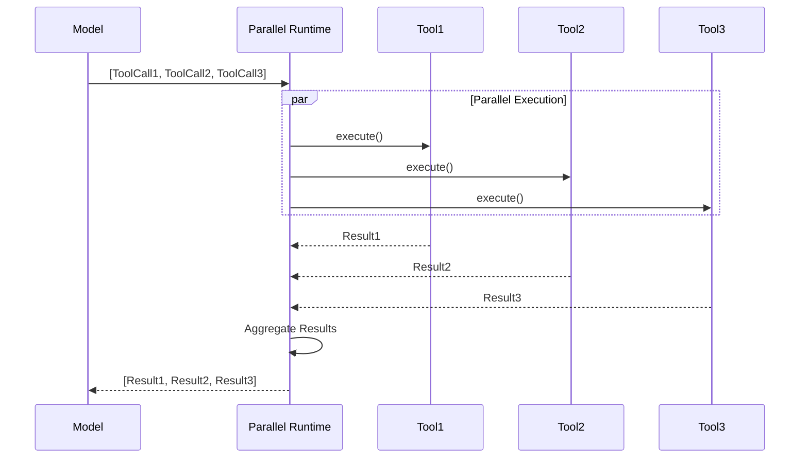

---

## 6. 沙箱机制

### 6.1 跨平台沙箱策略

Codex 在不同平台使用不同的沙箱机制：

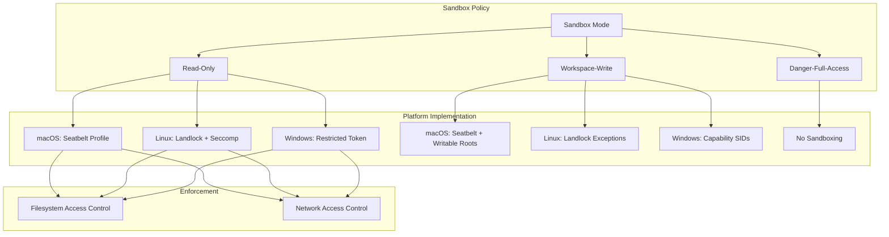

### 6.2 沙箱模式

| 模式 | 说明 | 文件系统 | 网络 |
|------|------|----------|------|
| `read-only` | 只读模式 | 只读（除 `/tmp`） | 禁止 |
| `workspace-write` | 工作区可写 | 工作区+/tmp 可写 | 禁止（可配置） |
| `danger-full-access` | 无限制 | 完全访问 | 完全访问 |

### 6.3 macOS Seatbelt

使用 `sandbox-exec` 命令：

```rust
// codex-rs/core/src/seatbelt.rs
pub fn apply_seatbelt(
    command: &[String],
    policy: SandboxPolicy,
) -> Command {
    let profile = generate_profile(&policy);

    let mut cmd = Command::new("/usr/bin/sandbox-exec");
    cmd.arg("-p").arg(profile);
    cmd.args(command);

    cmd
}

fn generate_profile(policy: &SandboxPolicy) -> String {
    match policy {
        SandboxPolicy::ReadOnly => {
            r#"
            (version 1)
            (deny default)
            (allow file-read*)
            (deny file-write*)
            (allow file-write* (subpath "/tmp"))
            (deny network*)
            "#
        }
        // ...
    }
}
```

### 6.4 Linux Landlock + Seccomp

```rust
// codex-rs/linux-sandbox/src/lib.rs
pub fn apply_landlock(
    policy: &SandboxPolicy,
    writable_roots: &[PathBuf],
) -> Result<()> {
    use landlock::*;

    let mut ruleset = Ruleset::default()
        .handle_access(AccessFs::from_all(ABI::V4))?;

    // 添加只读路径
    ruleset = ruleset.add_rule(PathBeneath::new("/", AccessFs::ReadFile))?;

    // 添加可写路径
    for root in writable_roots {
        ruleset = ruleset.add_rule(
            PathBeneath::new(root, AccessFs::WriteFile | AccessFs::ReadFile)
        )?;
    }

    ruleset.restrict_self()?;

    Ok(())
}
```

### 6.5 Windows Sandbox

使用 Restricted Token + AppContainer：

```rust
// codex-rs/windows-sandbox-rs/src/lib.rs
pub fn create_restricted_token() -> Result<HANDLE> {
    // 1. 创建受限令牌
    let token = create_token_with_reduced_privileges()?;

    // 2. 附加 AppContainer 能力 SID
    attach_capability_sids(token, &capabilities)?;

    // 3. 禁用网络访问（通过环境变量）
    disable_network_env_vars();

    Ok(token)
}
```

---

## 7. MCP 集成

### 7.1 MCP 角色

Codex 在 MCP (Model Context Protocol) 生态中扮演双重角色：

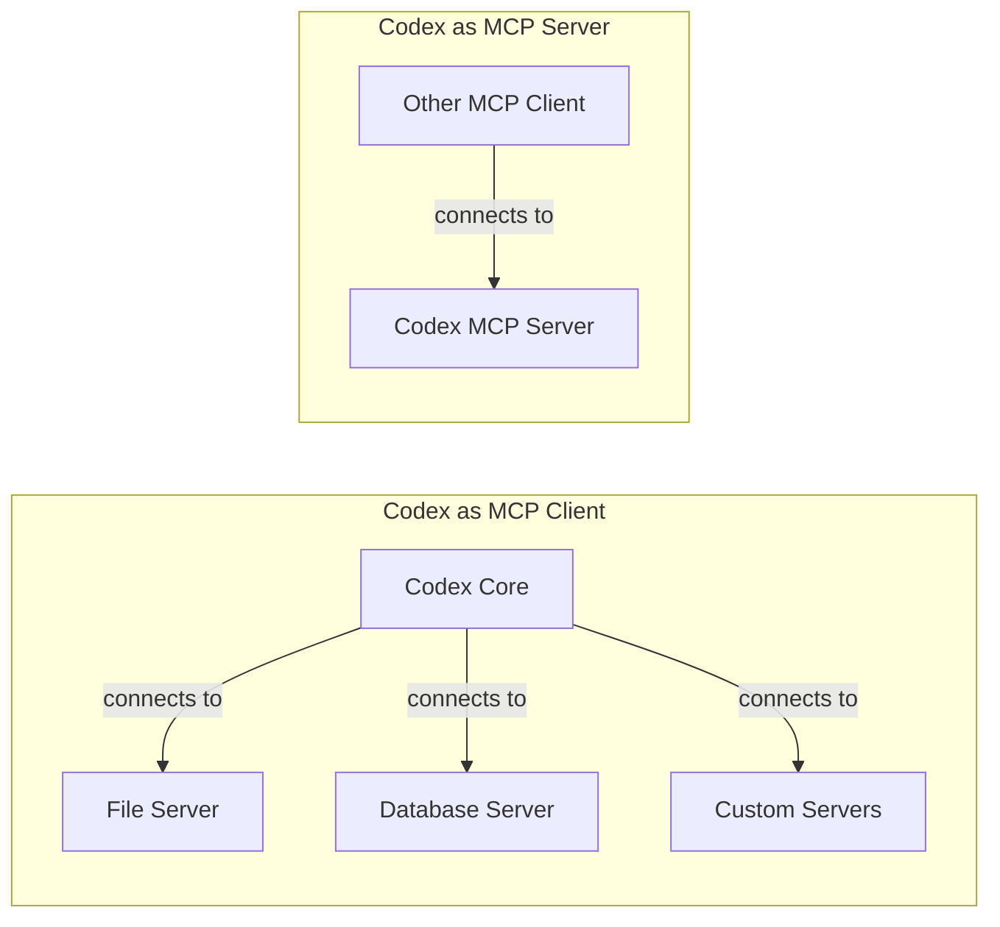

### 7.2 MCP 客户端功能

作为 MCP 客户端，Codex 可以连接到外部 MCP 服务器：

**配置示例**:

```toml
# ~/.codex/config.toml
[[mcp_servers]]
name = "filesystem"
command = "npx"
args = ["-y", "@modelcontextprotocol/server-filesystem", "/Users/me/projects"]

[[mcp_servers]]
name = "postgres"
command = "docker"
args = ["run", "-i", "mcp-postgres-server"]
env = { DATABASE_URL = "postgresql://..." }
```

**工具调用流程**:

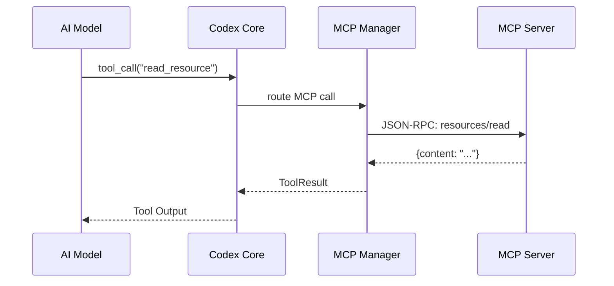

### 7.3 MCP 服务器功能

作为 MCP 服务器，Codex 暴露自己的能力给其他客户端：

**启动**:

```bash
codex mcp-server
```

**暴露的工具**:

- `codex_exec`: 在 Codex 沙箱中执行命令
- `codex_apply_patch`: 应用代码补丁
- `codex_read_file`: 读取文件
- `codex_write_file`: 写入文件

### 7.4 MCP 连接管理

```rust
// codex-rs/core/src/mcp_connection_manager.rs
pub struct McpConnectionManager {
    connections: HashMap<String, McpConnection>,
    oauth_store: OAuthCredentialsStore,
}

impl McpConnectionManager {
    pub async fn connect(&mut self, config: &McpServerConfig) -> Result<()> {
        let transport = match &config.transport {
            Transport::Stdio { command, args } => {
                stdio_transport(command, args)
            }
            Transport::Sse { url } => {
                sse_transport(url)
            }
        };

        let client = RmcpClient::new(transport);
        client.initialize().await?;

        // 加载工具、资源、模板
        let tools = client.list_tools().await?;
        let resources = client.list_resources().await?;

        self.connections.insert(config.name.clone(), McpConnection {
            client,
            tools,
            resources,
        });

        Ok(())
    }
}
```

---

## 8. 会话管理

### 8.1 三层结构

Codex 使用 Thread → Turn → Item 三层结构管理会话：

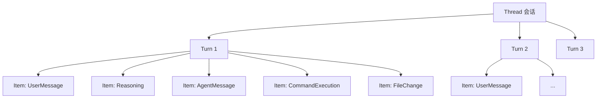

**概念说明**:

- **Thread (会话)**: 一次完整的对话，包含多个 Turn
- **Turn (回合)**: 一次用户输入 + AI 响应的完整循环
- **Item (条目)**: Turn 中的各种元素（消息、推理、工具调用等）

### 8.2 Item 类型

```rust
pub enum ThreadItem {
    UserMessage {
        id: String,
        content: Vec<ContentItem>,
    },

    Reasoning {
        id: String,
        summary: Option<String>,
        content: Option<String>,
    },

    AgentMessage {
        id: String,
        text: String,
    },

    CommandExecution {
        id: String,
        command: Vec<String>,
        cwd: PathBuf,
        status: ItemStatus,
        exit_code: Option<i32>,
        aggregated_output: Option<String>,
    },

    FileChange {
        id: String,
        changes: Vec<FileChangeDetail>,
        status: ItemStatus,
    },

    McpToolCall {
        id: String,
        server: String,
        tool: String,
        status: ItemStatus,
        result: Option<CallToolResult>,
    },

    // ...
}
```

### 8.3 会话持久化 (Rollout)

Codex 将会话以 JSONL 格式持久化到磁盘：

**存储路径**:

```
~/.codex/
├── sessions/
│   ├── conv_abc123.jsonl     # 活动会话
│   ├── conv_def456.jsonl
│   └── ...
└── archived-sessions/
    ├── conv_old789.jsonl     # 已归档会话
    └── ...
```

**JSONL 格式**:

每行一个 JSON 对象，表示一个 `RolloutItem`：

```jsonl
{"type":"thread_init","thread_id":"conv_abc123","model":"gpt-5.1","timestamp":1730910000}
{"type":"turn_started","turn_id":"turn_001","timestamp":1730910010}
{"type":"item","item":{"type":"userMessage","id":"turn_001","content":[{"type":"text","text":"Hello"}]}}
{"type":"item","item":{"type":"agentMessage","id":"msg_001","text":"Hi there!"}}
{"type":"turn_completed","turn_id":"turn_001","status":"completed","timestamp":1730910020}
```

### 8.4 会话生命周期

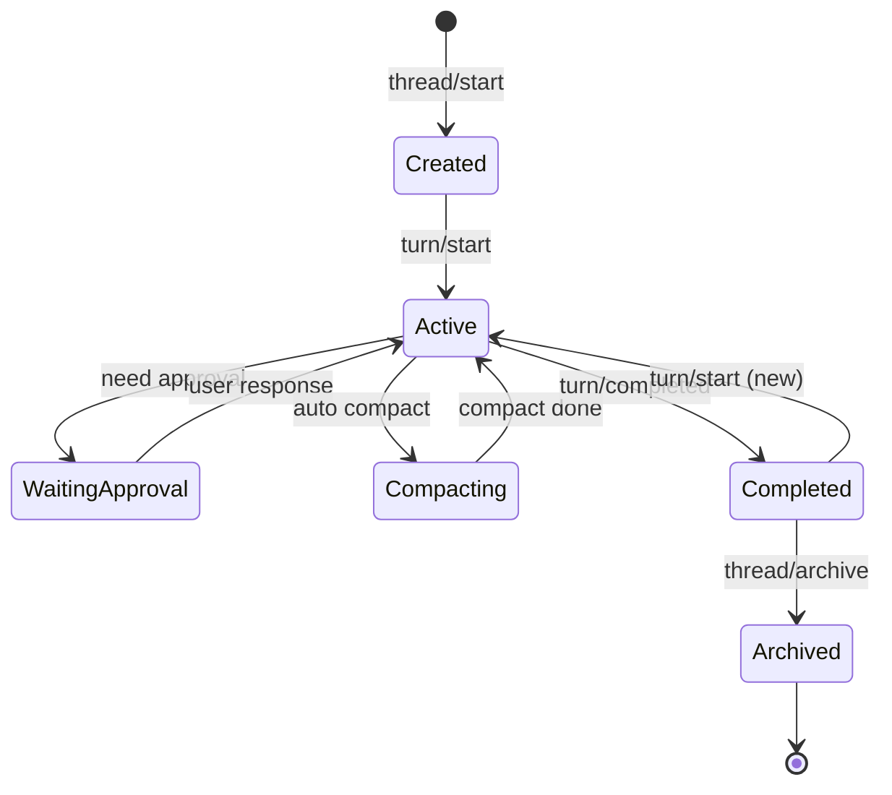

---

## 9. 配置系统

### 9.1 配置层级

Codex 支持多层配置，按优先级从高到低：

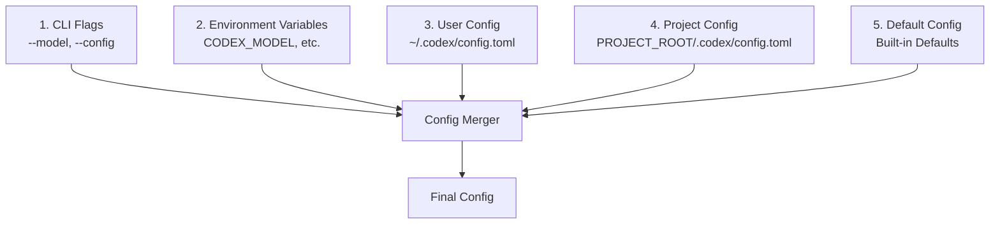

### 9.2 配置文件格式

`~/.codex/config.toml`:

```toml
# 模型选择
model = "gpt-5.1-codex-max"
model_provider = "openai"

# 审批策略
approval_policy = "on-request"  # never | on-request | always
sandbox_mode = "workspace-write"  # read-only | workspace-write | danger-full-access

# 沙箱配置
[sandbox_workspace_write]
network_access = true
writable_roots = ["/Users/me/projects"]

# 功能开关
[features]
web_search_request = true
view_image_tool = true
unified_exec = false
skills = false

# 模型提供商
[model_providers.openai]
name = "OpenAI"
base_url = "https://api.openai.com/v1"
env_key = "OPENAI_API_KEY"
wire_api = "responses"

# MCP 服务器
[[mcp_servers]]
name = "filesystem"
command = "npx"
args = ["-y", "@modelcontextprotocol/server-filesystem", "/Users/me/docs"]

[[mcp_servers]]
name = "github"
command = "docker"
args = ["run", "-i", "mcp-github"]
env = { GITHUB_TOKEN = "ghp_..." }

# 通知配置
[notifications]
on_turn_complete = "/usr/local/bin/terminal-notifier -message 'Codex done'"

# Shell 环境策略
[shell_environment_policy]
mode = "include_only"
include_only = ["PATH", "HOME", "USER"]

# 用户指令
user_instructions = """
- Always use TypeScript for new files
- Follow Airbnb style guide
"""

# TUI 配置
[tui]
scroll_input_mode = "vim"  # vim | emacs
theme = "dark"

# 配置 Profiles
[profiles.review]
model = "gpt-5.1-codex-max"
approval_policy = "never"
sandbox_mode = "read-only"

[profiles.full_auto]
approval_policy = "on-request"
sandbox_mode = "workspace-write"
```

### 9.3 配置服务

```rust
// codex-rs/core/src/config/service.rs
pub struct ConfigService {
    config_path: PathBuf,
    config: Arc<RwLock<Config>>,
}

impl ConfigService {
    pub async fn read(&self) -> Result<Config> {
        let config = self.config.read().await;
        Ok(config.clone())
    }

    pub async fn write_value(&self, key: &str, value: TomlValue) -> Result<()> {
        let mut doc = self.load_toml_document()?;

        // 解析 key 路径（支持 "a.b.c" 格式）
        let keys: Vec<&str> = key.split('.').collect();
        let mut table = doc.as_table_mut();

        for (i, k) in keys.iter().enumerate() {
            if i == keys.len() - 1 {
                // 最后一个 key，写入值
                table.insert(k, Item::Value(value));
            } else {
                // 中间 key，创建或获取表
                table = table.entry(k)
                    .or_insert(Item::Table(Table::new()))
                    .as_table_mut()?;
            }
        }

        self.save_toml_document(&doc)?;
        self.reload().await?;

        Ok(())
    }
}
```

---

## 10. 设计模式与最佳实践

### 10.1 设计模式

#### 10.1.1 策略模式 (Strategy Pattern)

**沙箱策略**:

```rust
trait SandboxStrategy {
    fn apply(&self, command: &Command) -> Result<Command>;
}

struct SeatbeltStrategy;
impl SandboxStrategy for SeatbeltStrategy { /* ... */ }

struct LandlockStrategy;
impl SandboxStrategy for LandlockStrategy { /* ... */ }

struct WindowsStrategy;
impl SandboxStrategy for WindowsStrategy { /* ... */ }
```

#### 10.1.2 工厂模式 (Factory Pattern)

**模型客户端工厂**:

```rust
pub fn create_model_client(provider: &ModelProviderInfo) -> Result<Box<dyn ModelClient>> {
    match provider.wire_api {
        WireApi::Responses => Ok(Box::new(ResponsesApiClient::new(provider)?)),
        WireApi::Chat => Ok(Box::new(ChatCompletionsClient::new(provider)?)),
    }
}
```

#### 10.1.3 观察者模式 (Observer Pattern)

**事件通知系统**:

```rust
pub struct EventBus {
    subscribers: Vec<Box<dyn EventListener>>,
}

impl EventBus {
    pub fn emit(&self, event: Event) {
        for subscriber in &self.subscribers {
            subscriber.on_event(&event);
        }
    }
}
```

#### 10.1.4 建造者模式 (Builder Pattern)

**配置构建**:

```rust
Config::builder()
    .model("gpt-5.1")
    .approval_policy(AskForApproval::OnRequest)
    .sandbox_mode(SandboxMode::WorkspaceWrite)
    .build()?
```

### 10.2 Rust 最佳实践

#### 10.2.1 错误处理

使用 `anyhow` 和 `thiserror`:

```rust
use anyhow::{Context, Result};
use thiserror::Error;

#[derive(Error, Debug)]
pub enum CodexError {
    #[error("Context window exceeded")]
    ContextWindowExceeded,

    #[error("Sandbox error: {0}")]
    SandboxError(String),

    #[error("MCP connection failed: {0}")]
    McpConnectionFailed(String),
}

pub fn process() -> Result<()> {
    read_file(path)
        .context("Failed to read config file")?;
    Ok(())
}
```

#### 10.2.2 异步编程

使用 Tokio 运行时：

```rust
#[tokio::main]
async fn main() -> Result<()> {
    let codex = CodexConversation::new(config).await?;

    let (tx, rx) = async_channel::unbounded();

    tokio::spawn(async move {
        while let Ok(event) = rx.recv().await {
            handle_event(event).await;
        }
    });

    codex.start(tx).await?;

    Ok(())
}
```

#### 10.2.3 并发安全

使用 `Arc` 和 `RwLock`/`Mutex`:

```rust
pub struct SessionState {
    config: Arc<RwLock<Config>>,
    active_turn: Arc<Mutex<Option<ActiveTurn>>>,
}
```

#### 10.2.4 生命周期管理

```rust
pub struct ToolContext<'a> {
    config: &'a Config,
    cwd: &'a Path,
    sandbox: &'a SandboxPolicy,
}
```

### 10.3 代码组织原则

1. **模块化**: 每个 crate 职责单一
2. **接口隔离**: 通过 trait 定义接口
3. **依赖注入**: 通过参数传递依赖
4. **测试覆盖**: 单元测试 + 集成测试 + snapshot 测试

---

## 11. 部署架构

### 11.1 部署模式

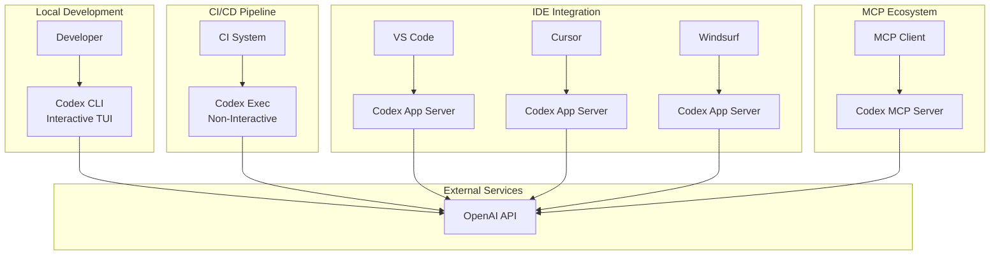

### 11.2 分发方式

| 方式 | 命令 | 适用场景 |
|------|------|----------|
| **npm** | `npm i -g @openai/codex` | Node.js 用户 |
| **Homebrew** | `brew install --cask codex` | macOS 用户 |
| **GitHub Release** | 下载二进制 | 所有平台 |
| **源码构建** | `cargo build --release` | 开发者 |

### 11.3 容器化

Codex 支持在 Docker 中运行（特别是 Linux）：

```dockerfile
FROM ubuntu:22.04

# 安装依赖
RUN apt-get update && apt-get install -y \
    curl \
    git \
    build-essential

# 安装 Codex
RUN curl -fsSL https://github.com/openai/codex/releases/download/v1.0.0/codex-x86_64-unknown-linux-musl.tar.gz | tar xz
RUN mv codex /usr/local/bin/

# 设置工作目录
WORKDIR /workspace

# 启动 Codex
ENTRYPOINT ["codex"]
```

---

## 12. 技术栈

### 12.1 Rust 生态

| 类别 | Crate | 用途 |
|------|-------|------|
| **异步运行时** | `tokio` | 异步 I/O、任务调度 |
| **序列化** | `serde`, `serde_json`, `toml` | 数据序列化 |
| **HTTP 客户端** | `reqwest` | API 请求 |
| **CLI 解析** | `clap` | 命令行参数解析 |
| **TUI** | `ratatui`, `crossterm` | 终端 UI |
| **错误处理** | `anyhow`, `thiserror` | 错误管理 |
| **日志** | `tracing`, `tracing-subscriber` | 结构化日志 |
| **文件操作** | `ignore`, `walkdir` | 文件遍历 |
| **正则表达式** | `regex` | 文本匹配 |
| **PTY** | `portable-pty` | 伪终端 |
| **沙箱** | `landlock`, `seccompiler` | Linux 沙箱 |

### 12.2 TypeScript 生态 (Legacy)

| 类别 | Package | 用途 |
|------|---------|------|
| **运行时** | `node` | JavaScript 运行时 |
| **包管理** | `pnpm` | 依赖管理 |
| **AI SDK** | `openai` | OpenAI API |
| **测试** | `vitest` | 单元测试 |
| **代码检查** | `eslint`, `prettier` | 代码质量 |

### 12.3 协议标准

- **JSON-RPC 2.0**: App Server 协议
- **MCP (Model Context Protocol)**: 工具集成
- **SSE (Server-Sent Events)**: 流式响应
- **OpenAI Responses API**: AI 模型调用

---

## 总结

OpenAI Codex CLI 是一个设计精良的 AI 编程助手，具有以下特点：

### 优势

1. **多层架构清晰**: 从 UI 层到平台层，职责分明
2. **跨平台支持**: macOS、Linux、Windows 均有对应沙箱实现
3. **协议设计优秀**: SQ/EQ 模式简洁高效
4. **可扩展性强**: MCP、Skills 提供良好的扩展机制
5. **安全优先**: 沙箱机制、审批策略保障安全
6. **Rust 实现**: 提供高性能和内存安全

### 技术亮点

- **异步事件驱动**: 充分利用 Rust 异步生态
- **工具系统**: 灵活的工具注册、路由、执行机制
- **配置层级**: 支持多层配置合并
- **会话管理**: Thread/Turn/Item 三层结构清晰
- **协议标准化**: 遵循 JSON-RPC、MCP 等标准

### 架构演进方向

1. **TUI v2**: 更先进的视口实现
2. **Skills 系统**: 用户自定义技能
3. **统一 Exec 工具**: PTY-backed 执行
4. **更多 MCP 集成**: 扩展外部工具支持
5. **Windows 沙箱改进**: 增强 Windows 平台安全性

---

## 附录

### A. 参考资源

- [Codex CLI GitHub](https://github.com/openai/codex)
- [Model Context Protocol](https://modelcontextprotocol.io/)
- [Ratatui 文档](https://ratatui.rs/)
- [OpenAI API 文档](https://platform.openai.com/docs/)

### B. 关键文件路径

```
codex/
├── codex-rs/              # Rust 实现（主要）
│   ├── core/              # 核心逻辑
│   ├── cli/               # CLI 入口
│   ├── tui/               # TUI 界面
│   ├── exec/              # 非交互式执行
│   ├── app-server/        # App Server
│   ├── mcp-server/        # MCP Server
│   ├── protocol/          # 协议定义
│   └── ...
├── codex-cli/             # TypeScript 实现（legacy）
├── docs/                  # 文档
└── sdk/                   # TypeScript SDK
```

### C. 常用命令

```bash
# 交互式运行
codex

# 非交互式执行
codex exec "fix lint errors"

# 代码审查
codex review

# 启动 App Server
codex app-server

# 启动 MCP Server
codex mcp-server

# 配置管理
codex config read
codex config set model gpt-5.1

# 沙箱测试
codex sandbox macos ls -la
codex sandbox linux --full-auto npm test
```

---

**文档版本**: 1.0
**生成工具**: Claude Sonnet 4.5
**最后更新**: 2025-12-30
