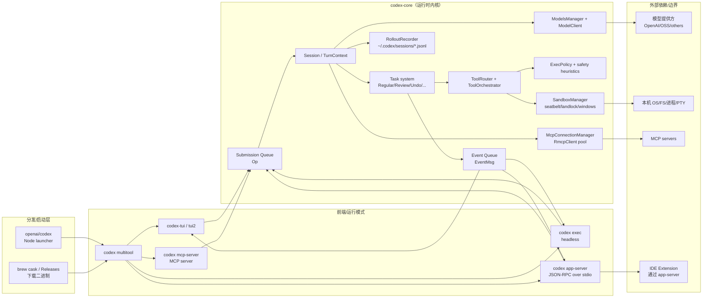
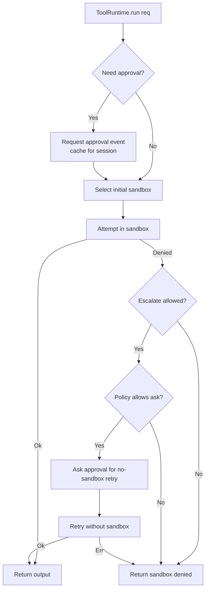

# OpenAI Codex（CLI / App Server / MCP）架构分析（基于 `./venders/codex` 源码）

> 生成者：Codex（本仓库运行环境）  
> 分析日期：2025-12-30  
> 代码范围：`venders/codex/`（包含 Rust workspace、npm 分发包装、TypeScript SDK、MCP server 等）

本文档面向“需要改代码/接入/排障”的读者：尽量用**代码里的真实抽象**（结构体/模块/crate）来解释系统边界、数据流与关键权衡，并在必要处给出 Mermaid 图。

---

## 0. 一句话总结

Codex 本质上是一个**以协议（SQ/EQ）驱动的本地 Agent 运行时**：外层（TUI / `codex exec` / `codex app-server` / MCP）把用户输入编码为 `codex_protocol::protocol::Op`（Submission Queue），`codex-core` 内部把它编排成“模型流式输出 + 工具调用 + 审批/沙箱 + 变更记录”的一系列 `EventMsg`（Event Queue），最终由前端消费并呈现/落盘。

---

## 1. 仓库与产物形态（Repo → Binary → Runtime）

### 1.1 顶层结构（`venders/codex/`）

- `codex-rs/`：Rust Cargo workspace（核心实现，产出 `codex`、`codex-tui`、`codex-exec`、`codex app-server` 等二进制与库）
- `codex-cli/`：**npm 包分发层**（`@openai/codex`），Node 脚本负责选择平台二进制并 `spawn` 执行（Rust 才是主体）
- `docs/`：文档站/文档包（pnpm workspace）
- `sdk/typescript/`：TypeScript SDK（用于编程式调用/集成）
- `shell-tool-mcp/`：独立 npm 包 `@openai/codex-shell-tool-mcp`，提供“拦截 execve 的 Bash + MCP shell 工具”方案
- 其他：`third_party/`、`scripts/`、CI/格式化配置等

### 1.2 npm 分发包装（`codex-cli/bin/codex.js`）

`codex-cli/bin/codex.js` 是 `@openai/codex` 的 `bin` 入口，核心逻辑：

- 根据 `process.platform / process.arch` 推导 target triple（如 `x86_64-unknown-linux-musl`、`aarch64-apple-darwin`、`x86_64-pc-windows-msvc`）
- 计算 `vendor/<triple>/codex/<codex|codex.exe>` 路径并 `spawn` 子进程
- 可选把 `vendor/<triple>/path/` 加到 `PATH`（用于随包附带的依赖工具）
- 设置环境变量标记包管理器（如 `CODEX_MANAGED_BY_NPM` / `CODEX_MANAGED_BY_BUN`）

注意：你当前的 `venders/codex/codex-cli/` 目录里不一定包含 `vendor/`（该目录通常是发布/打包产物的一部分）。

### 1.3 Rust workspace 的“可执行入口”分层

Rust 侧的可执行入口主要有三类（都通过 `clap` 解析参数）：

1) **主 CLI 多工具**：`codex-rs/cli` → 二进制名 `codex`（`[[bin]] name="codex"`）
2) **交互式 UI**：`codex-rs/tui` → 二进制名 `codex-tui`（全屏 TUI，Ratatui）
3) **非交互/自动化**：`codex-rs/exec` → 二进制名 `codex-exec`（JSONL 或人类输出）

主 CLI `codex` 实际上把子命令分发到 TUI/Exec/AppServer/MCP 等模块；没有子命令时，默认进入交互式体验（TUI / TUI2）。

---

## 2. 总体组件图（“外壳”与“内核”）



---

## 3. 核心协议：SQ/EQ（Submission Queue / Event Queue）

### 3.1 为什么要有独立的协议 crate？

`codex-rs/protocol`（crate 名 `codex-protocol`）把 **运行时的输入/输出、审批、模型输出 item、配置枚举**等抽象成可序列化类型：

- 便于 **TUI / Exec / App Server** 共享同一套事件与数据模型
- 便于 **生成 TS 类型 / JSON Schema**（`ts-rs` + `schemars`），让 IDE/外部集成与 CLI 版本强一致
- 明确 “业务内核” 与 “I/O 展示层” 的边界（core 禁止直接 stdout/stderr 输出）

### 3.2 `Op`：输入侧（用户/客户端 → Agent）

`codex_protocol::protocol::Op` 是“用户意图”的统一表达，包括：

- `UserInput` / `UserTurn`：一轮对话输入（支持覆盖 `cwd/approval_policy/sandbox_policy/model` 等）
- `Interrupt` / `Shutdown`
- `ExecApproval` / `PatchApproval`：审批回传
- `ListMcpTools` / `ListSkills` / `ListModels` / `ListCustomPrompts`
- `RunUserShellCommand`：用户显式触发的一次性 shell（`!cmd` 风格）
- `Review` / `Undo` / `Compact` 等工作流指令

### 3.3 `EventMsg`：输出侧（Agent → 用户/客户端）

`EventMsg` 体现 Codex 的“流式运行时”属性：模型内容增量、工具调用开始/结束、审批请求、回放/持久化事件等都会以事件形式送出，前端负责渲染、交互与最终展示。

（典型例子：`AgentMessageDelta`、`ExecCommandBegin/End`、`ApplyPatchApprovalRequest`、`TaskComplete`、`TurnAborted`…）

### 3.4 SQ/EQ 与线程模型

在 `codex-core` 中，`Codex` 的公共接口是：

- `submit(op) -> id`：把 `Op` 放进 submission channel
- `next_event() -> Event`：从 event channel 读取一个事件

内部通过 `submission_loop(...)` 读取 `Submission` 并分发到一组 `handlers::*`，这些 handler 再触发具体 `Task`（见下节）。

```mermaid
sequenceDiagram
  participant UI as Frontend (TUI/Exec/AppServer)
  participant Codex as codex_core::Codex
  participant Loop as submission_loop + handlers
  participant Task as SessionTask

  UI->>Codex: submit(Op::UserTurn{...})
  Codex->>Loop: rx_sub.recv()
  Loop->>Task: session.spawn_task(RegularTask/ReviewTask/...)
  Task-->>Codex: tx_event.send(EventMsg::*)
  UI->>Codex: next_event() (poll)
  Codex-->>UI: Event{ id, msg }
```

---

## 4. `codex-core` 的会话模型：`ConversationManager` / `Session` / `TurnContext`

### 4.1 `ConversationManager`：多会话容器 + spawn/resume/fork

`ConversationManager` 维护内存中的 `ConversationId -> CodexConversation` 映射，负责：

- `new_conversation(config)`：创建新会话并要求第一条事件必须是 `SessionConfigured`
- `resume_conversation_from_rollout(path)`：从 rollout 文件恢复历史
- `fork_conversation(nth_user_message, ...)`：从历史某位置“分叉”新会话

它本质上是“会话生命周期管理”，而不是“执行引擎”。

### 4.2 `Codex` / `Session`：单会话执行引擎

`Codex::spawn(...)` 会创建：

- `tx_sub/rx_sub`：Submission channel（有界）
- `tx_event/rx_event`：Event channel（无界）
- `Session`：包含 `SessionState`、`Features`、`SessionServices`、`active_turn` 等
- 启动后台 `submission_loop(session, config, rx_sub)`

`Session` 的关键点是：**一个 session 同时最多运行一个 active turn（可中断/替换）**，并通过任务系统统一管理取消、收尾、持久化。

### 4.3 `TurnContext`：每一轮 Turn 的“冻结配置快照”

`TurnContext` 把一轮 turn 需要的所有关键决策材料放在一起：

- 模型相关：`client: ModelClient`、`final_output_json_schema`
- 安全相关：`approval_policy`、`sandbox_policy`、`shell_environment_policy`
- 工具相关：`tools_config`、`tool_call_gate`（就绪门控，常用于等待 ghost snapshot）
- 变更与限制：`cwd`、`ghost_snapshot`、`truncation_policy`、`codex_linux_sandbox_exe`
- 指令拼装：`base_instructions / developer_instructions / user_instructions / compact_prompt`

这使得“turn 内一致性”更强：同一 turn 的工具运行与审批判断可重复、可落盘、可回放。

### 4.4 模型调用层：`ModelClient` / Provider registry / Wire API

`core/src/client.rs` 的 `ModelClient` 是“把 Prompt 变成 SSE 流”的统一入口，它把以下变量收敛在一个对象里：

- Provider：`ModelProviderInfo`（`core/src/model_provider_info.rs`）
- Wire API：`WireApi::{Responses, Chat}`（代码中对 `Chat` 线协议标注“将弃用”，并会通过事件提示）
- Auth：来自 `AuthManager`（支持 ChatGPT 登录 token / API Key 等模式）
- Telemetry：`OtelManager`（对请求与 SSE 做 tracing/metrics）

运行时会根据 `provider.wire_api` 决定走：

- OpenAI **Responses API**（`/v1/responses`）：支持 reasoning summary、verbosity、output schema 等更现代的控制面
- 兼容 **Chat Completions**（`/v1/chat/completions`）：可选做“聚合（aggregate）”以隐藏 raw reasoning

Provider 的默认 base URL 会随 auth mode 改变：当 `AuthMode::ChatGPT` 时默认走 `https://chatgpt.com/backend-api/codex`，否则走 `https://api.openai.com/v1`（可被 config/env 覆盖）。

---

## 5. 任务系统：把“工作流”变成可取消的异步 Task

`core/src/tasks` 把不同类型工作流封装成 `SessionTask` trait：

- `RegularTask`：正常对话/编码任务
- `ReviewTask`：审查工作流（内部会启动一个“子 agent”会话并屏蔽部分事件）
- `UndoTask`：撤销（依赖 ghost snapshot / git 相关）
- `CompactTask`：上下文压缩（本地/远程压缩逻辑）
- `UserShellCommandTask`：用户触发的 `!cmd`（默认 DangerFullAccess，因为是用户显式命令）
- `GhostSnapshotTask`：创建 ghost commit / 生成恢复点，并通过 `tool_call_gate` 控制后续工具

`Session::spawn_task` 负责“替换式执行”：

1) 先 `abort_all_tasks(TurnAbortReason::Replaced)`
2) 再启动新 task（Tokio task），在 task 结束时统一发 `TaskComplete`，并触发 rollout flush
3) 若被取消，走统一 abort 路径（限时等待 graceful shutdown + 强制 abort）

---

## 6. 工具系统：ToolRouter → ToolOrchestrator（审批/沙箱）→ ToolRuntime（具体实现）

### 6.0 工具声明：`ToolsConfig` 如何决定“给模型哪些工具”

Codex 并不是永远给模型同一组工具。`core/src/tools/spec.rs` 的 `ToolsConfig::new(...)` 会综合：

- **模型家族**（`ModelFamily`）：不同模型对 shell/apply_patch/实验工具的支持差异
- **Feature flags**（`Features`）：例如 `Feature::ShellTool`、`Feature::UnifiedExec`、`Feature::ApplyPatchFreeform`、`Feature::WebSearchRequest`、`Feature::ViewImageTool`

从而决定：

- `shell_type`：`Disabled` / `ShellCommand` / `UnifiedExec`（Windows 若 ConPTY 不可用会降级）
- `apply_patch_tool_type`：`Function` / `Freeform` / `None`
- 是否包含 `web_search`、`view_image` 等工具

并在构造 Prompt 时序列化为对应 wire API 的工具定义（Responses API vs Chat Completions 的工具 schema 不同）。

### 6.1 从模型输出到“工具调用”

模型输出使用 `codex_protocol::models::ResponseItem` 表示，其中工具相关分支包括：

- `FunctionCall { name, arguments, call_id }`
- `LocalShellCall { action, call_id/id, ... }`
- `CustomToolCall { name, input, call_id }`
- 以及 MCP 相关的 tool call output / web_search_call 等

`ToolRouter::build_tool_call(session, ResponseItem)` 会把这些统一归一为内部 `ToolCall { tool_name, call_id, payload }`：

- 若 `name` 是“完全限定的 MCP tool 名”（如 `mcp__server__tool`），则走 `payload: Mcp`
- `LocalShellCall::Exec` 会转成 `tool_name="local_shell"` + `ShellToolCallParams`

### 6.2 关键抽象：把“策略”集中在 Orchestrator

工具执行的策略复杂度很高（审批、沙箱选择、失败后是否升级、是否复用之前的批准、是否给出 execpolicy amendment…），Codex 把这些集中在 `core/src/tools/orchestrator.rs`：



对应代码里的结构：

- `ToolRuntime<Req, Out>`：每个工具提供 `run(...)`（在指定 `SandboxAttempt` 下执行）
- `Approvable`：定义 approval key、如何发起审批、是否绕过二次审批等
- `Sandboxable`：声明工具偏好（Auto/Require/Forbid）与是否允许失败升级
- `ApprovalStore`：以序列化 key 做缓存（`ApprovedForSession` 可跨同类请求复用）

### 6.3 “沙箱环境”是如何真正落到进程执行上的？

`core/src/sandboxing/mod.rs` 定义：

- `CommandSpec`：跨平台/可移植的“要执行的命令 + cwd/env/超时 + sandbox_permissions”
- `SandboxManager::transform(...) -> ExecEnv`：把 `CommandSpec` 根据 `SandboxPolicy` + 平台 sandbox 类型变成可执行环境
- `execute_env(...)`：真正执行 `ExecEnv`（内部会按平台差异走 seatbelt/landlock/windows token 等）

平台差异要点：

- macOS：`sandbox-exec`（Seatbelt），生成参数并在 env 打上 `CODEX_SANDBOX_ENV_VAR`
- Linux：通过 `codex-linux-sandbox` 可执行文件包装（Landlock + seccomp）；需要 `codex_linux_sandbox_exe` 路径
- Windows：受限 token 沙箱在进程内执行（`codex-windows-sandbox`），`transform` 不改命令，但执行侧分支处理

### 6.4 `apply_patch` 的特殊性：既是“工具”，又是“安全边界”

`codex-apply-patch` crate 负责解析/校验补丁语法，并能作为独立可执行“安全地写文件”。`codex-core` 对 `apply_patch` 的处理是：

- 先 `assess_patch_safety(action, approval_policy, sandbox_policy, cwd)`：
  - 若变更被约束在可写 roots 内，且平台 sandbox 可用：可自动批准并在 sandbox 内执行
  - 若用户设置为 Never 且写越界：直接拒绝
  - 其他情况：发 `ApplyPatchApprovalRequestEvent` 请求用户确认
- 获批后，通常通过一次 `exec` 调用并携带 `--codex-run-as-apply-patch`（`CODEX_APPLY_PATCH_ARG1`）来执行写入（这样写入路径仍受沙箱/策略约束）

配合 `TurnDiffTracker`，Codex 可以为一个 turn 累积变更并生成 unified diff（用于 UI 展示或审查）。

### 6.5 `Unified Exec`：为什么需要“PTY 会话式 shell”

如果 `Features` 启用了 `UnifiedExec`，shell 工具会从“一次性命令”升级为“可交互会话”：

- `exec_command`：在 PTY 中启动命令，返回 `process_id` + 本次输出片段
- `write_stdin`：向已存在的 PTY 会话写入输入并拉取新的输出片段

对应实现位于 `core/src/unified_exec/`：

- `session_manager.rs`：会话复用、审批/沙箱编排（复用 `ToolOrchestrator`）
- `session.rs`：PTY 生命周期、输出缓冲与截断（按字节/近似 token 进行上限控制）

这类设计适合长时间运行或需要交互的命令（如 REPL、watch 模式、需要输入确认的脚本），并且把“沙箱/审批一致性”维持在会话维度。

---

## 7. 安全模型：审批（AskForApproval）+ 沙箱（SandboxPolicy）+ ExecPolicy（.rules）

### 7.1 审批策略：`AskForApproval`

`AskForApproval`（kebab-case）典型值包括：

- `untrusted`（默认更保守）：只自动批准“已知安全且只读”的命令，其余都要问用户
- `on-request`：倾向先在受限沙箱里跑；若需要越权/危险再问
- `on-failure`：先自动跑（通常在无网/限写沙箱），失败后再升级
- `never`：不提示（但仍可能被 sandbox/execpolicy 拦截）

### 7.2 命令启发式：safe/dangerous allowlist

`core/src/command_safety/is_safe_command.rs` 与 `is_dangerous_command.rs` 做了两类判断：

- **known safe**：如 `ls`、`cat`、`git status/log/diff`，以及受限参数的 `find`、`base64`、`rg` 等
- **might be dangerous**：如 `git reset/rm`、`rm -rf` 等；并支持解析 `bash -lc "..."` 的“可分解 plain commands”

这些启发式主要用于 `AskForApproval::OnRequest` 下，决定是否在“DangerFullAccess / ExternalSandbox”场景仍要弹窗。

### 7.3 ExecPolicy（`.rules`）：把“组织策略”写进文件

`core/src/exec_policy.rs` 把 `.rules`（`codex_execpolicy` crate）加载为 `Policy`，并在每次工具执行前评估：

- `Decision::Forbidden` → 直接拒绝
- `Decision::Prompt` → 需要用户审批（若 approval_policy=Never，则冲突并拒绝）
- `Decision::Allow` → 跳过审批，甚至可 `bypass_sandbox`（取决于规则匹配类型）

并且 Codex 能在合适时机提出 `ExecPolicyAmendment`（建议用户把某个命令前缀加入 allow 规则），甚至在用户批准后自动 append 到默认规则文件并更新内存策略。

### 7.4 `SandboxPolicy`：ReadOnly / WorkspaceWrite / DangerFullAccess / ExternalSandbox

`SandboxPolicy`（协议层类型）是“工具执行环境约束”的核心抽象：

- `ReadOnly`：禁止写入（并常伴随无网）；用于默认最安全策略
- `WorkspaceWrite`：允许在 `cwd` 与额外 `writable_roots` 下写入，可配置网络是否可用、是否排除临时目录
- `DangerFullAccess`：不启用 Codex 自带沙箱（通常只在你已处于容器/隔离环境时使用）
- `ExternalSandbox`：表示“外部已有沙箱”（Codex 不再包裹 seatbelt/landlock），但仍可保持网络策略语义

工具在执行时拿到的是 `TurnContext.sandbox_policy`，并由 `SandboxManager::select_initial/transform` 将其具体化到平台实现。

---

## 8. MCP：把“外部工具生态”接入到 Codex 的 Tool 体系

### 8.1 配置与传输

`core/src/config/types.rs` 定义 `McpServerConfig`，支持两类 transport：

- `stdio`：`command/args/env/env_vars/cwd`
- `streamable_http`：`url` + 可选 bearer token env var + headers

并支持 `startup_timeout`、`tool_timeout`、`enabled_tools/disabled_tools`（过滤）。

### 8.2 连接管理：`McpConnectionManager`

`core/src/mcp_connection_manager.rs` 的职责：

- 为每个 server 创建一个 `RmcpClient`（异步启动，带取消 token）
- 聚合 `list_all_tools/resources/resource_templates`
- 处理 MCP elicitation：转成 `EventMsg::ElicitationRequest`，等待 UI 回传 `Op::ResolveElicitation`
- 为 tool 名加前缀并做长度限制：`mcp__<server>__<tool>`，超长会 hash 截断以符合 OpenAI tool name 约束

### 8.3 Sandbox State capability（Codex 扩展）

Codex 定义了 MCP capability `codex/sandbox-state`（常量 `MCP_SANDBOX_STATE_CAPABILITY`），并能向支持该能力的 MCP server 发送自定义请求（`codex/sandbox-state/update`），用于在会话中动态更新 MCP server 的沙箱策略（例如切换 ReadOnly/WorkspaceWrite、更新可写 roots、控制网络）。

这使得“工具执行安全边界”在 MCP 工具侧也能保持一致。

### 8.4 MCP snapshot：启动期批量探测（tools/resources/templates/auth）

`core/src/mcp/mod.rs` 提供 `collect_mcp_snapshot(config)`，用于在启动阶段（或显式请求）一次性聚合：

- `tools`：所有 server 的工具（以 fully-qualified 名称为 key）
- `resources` / `resource_templates`
- `auth_statuses`

实现上它会用一个 **ReadOnly** 的 `SandboxState` 初始化连接管理器（“最保守默认”），并在收集完成后取消启动 token，避免后台残留。

---

## 9. App Server：为 IDE/富客户端提供“线程/回合/条目”API

`codex-rs/app-server` 是一个 JSON-RPC（2.0 形态但省略 `jsonrpc` 字段）的 stdio server，用于支持 VS Code 等富客户端。

核心特征：

- 统一抽象：`Thread`（会话）/ `Turn`（一轮）/ `Item`（回合条目）
- 生命周期：`initialize` → `initialized` → `thread/start|resume` → `turn/start` → 读 notifications（流式 item/turn 事件）→ `turn/completed`
- Schema 输出：`codex app-server generate-ts` / `generate-json-schema`（版本绑定）

实现上，`app-server/src/lib.rs` 采用三任务并发模型：

- stdin reader：读一行 JSON → 反序列化为 `JSONRPCMessage` → 送入 channel
- processor：`MessageProcessor` 消费消息并驱动 core
- stdout writer：把 `OutgoingMessage` 序列化为 JSON 行输出

这与 core 的 SQ/EQ 模式天然契合：App Server 本身是“协议桥接器 + 状态机”。

### 9.1 配置栈（Config Layers）：把系统/用户/项目/会话覆盖统一成可追溯结果

`core/src/config_loader` 的思路是“分层合并 + 约束（requirements）”：

- requirements（不可被低优先级覆盖）：如 `/etc/codex/requirements.toml`（Unix）以及历史兼容的 managed config
- config layers（从低到高优先级合并）：system → user（`$CODEX_HOME/config.toml`）→ cwd → tree（向上查找 `.codex/config.toml`）→ repo（git root 下 `.codex/config.toml`）→ runtime flags（`-c ...`、UI 选择）

最终 `Config` 不只包含合并后的值，也包含 `config_layer_stack`（来源可追溯），并在部分字段上使用 `Constrained<T>` 强制满足 requirements（例如组织强制的 sandbox/approval 策略）。

---

## 10. Rollout（会话持久化/可恢复性）与可观测性

### 10.1 Rollout：`~/.codex/sessions/*.jsonl`

`core/src/rollout/recorder.rs` 把会话记录为 JSONL：

- `SessionMeta`（首条出现的 meta 行作为 canonical 信息）
- `ResponseItem` / `TurnContext` / `Compacted` / `EventMsg` 等

用途：

- `codex resume`：从历史继续
- 事故排查：可用 `jq/fx` 浏览
- App Server 的 `thread/list/archive` 也基于该目录

### 10.2 Telemetry / Tracing / OTEL

多个入口（TUI/Exec/AppServer）都会在启动时构建 tracing subscriber，并可选启用 OTEL exporter：

- “业务库”禁止直接 stdout/stderr（`#![deny(clippy::print_stdout)]`），输出必须走 UI 或 tracing
- tool 执行会向 `OtelManager` 记录关键决策（例如用户批准/配置跳过、tool 名、call_id）

### 10.3 Skills（“可控的提示词注入”）：显式引用才加载

`core/src/skills` 把 skills 视为一种“可版本化的知识/工作流片段”：

- 发现路径（按优先级去重同名 skill）：repo `.codex/skills/**/SKILL.md` → user `$CODEX_HOME/skills` → system cache → admin `/etc/codex/skills`（Unix）
- 结构：`SKILL.md` 必须包含 YAML frontmatter（`name/description/...`），并对长度/字符做校验
- 注入策略：`build_skill_injections(...)` 只会在用户输入里出现显式 `UserInput::Skill { name, path }` 时读取对应 `SKILL.md` 内容并注入为 `ResponseItem`（避免“自动把全库技能塞进上下文”导致污染）

这与“安全与可控”的总体方向一致：技能是用户/环境明确选择的上下文，而不是隐式全量记忆。

---

## 11. 设计要点与“读代码时的抓手”

1) **协议先行**：优先理解 `codex-protocol` 的 `Op/EventMsg/ResponseItem`，再回到 core 看“谁在何时发什么事件”。  
2) **TurnContext 是“边界”**：很多安全/配置/工具决策都从 `TurnContext` 派生，排障时先确认 turn 的 policy/config 是否符合预期。  
3) **Orchestrator 收敛复杂性**：工具执行的审批/沙箱/升级逻辑集中在 `tools/orchestrator.rs`；新增工具优先复用该编排。  
4) **MCP 与内置工具同构**：MCP 工具最终也是 `ToolRouter` 的一类 payload；关键在 tool 名限定与 sandbox-state 同步。  
5) **rollout 是“事实记录”**：很多看似“UI 行为”的问题，最终都能在 rollout 的事件序列里找到根因。

---

## 12. 附：关键路径速查（从需求到代码）

- 主命令入口：`venders/codex/codex-rs/cli/src/main.rs`
- 交互式入口：`venders/codex/codex-rs/tui/src/lib.rs`
- Headless 入口：`venders/codex/codex-rs/exec/src/lib.rs`
- 核心运行时：`venders/codex/codex-rs/core/src/codex.rs`
- 协议定义：`venders/codex/codex-rs/protocol/src/protocol.rs`
- 工具路由/编排：`venders/codex/codex-rs/core/src/tools/router.rs`、`venders/codex/codex-rs/core/src/tools/orchestrator.rs`
- 沙箱转换：`venders/codex/codex-rs/core/src/sandboxing/mod.rs`
- ExecPolicy：`venders/codex/codex-rs/core/src/exec_policy.rs`
- MCP 连接管理：`venders/codex/codex-rs/core/src/mcp_connection_manager.rs`
- App Server：`venders/codex/codex-rs/app-server/src/lib.rs`
- npm launcher：`venders/codex/codex-cli/bin/codex.js`
- shell-tool MCP：`venders/codex/shell-tool-mcp/src/index.ts`
