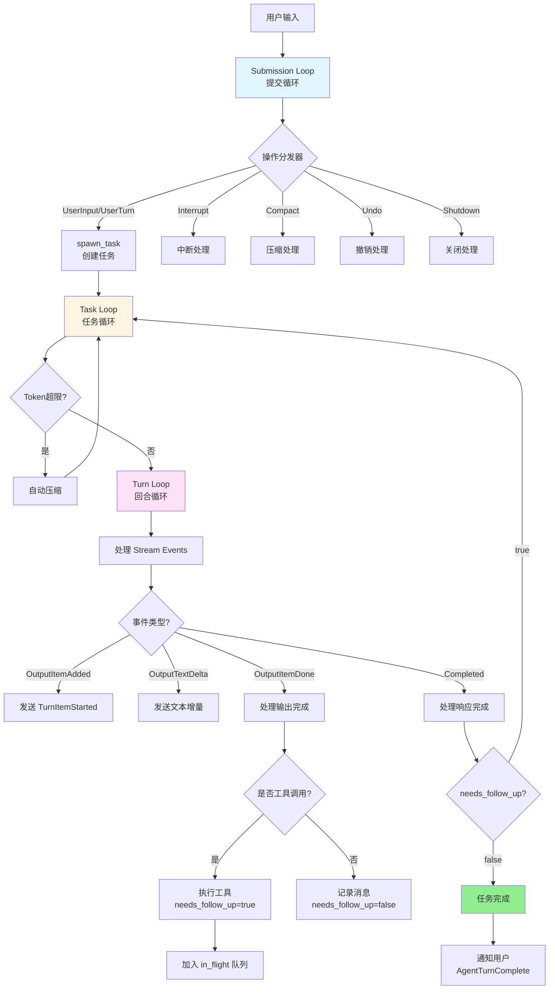
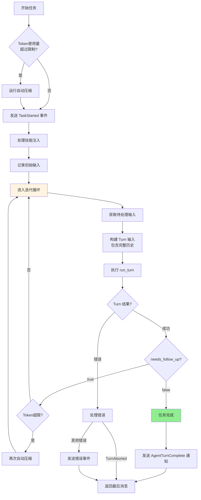
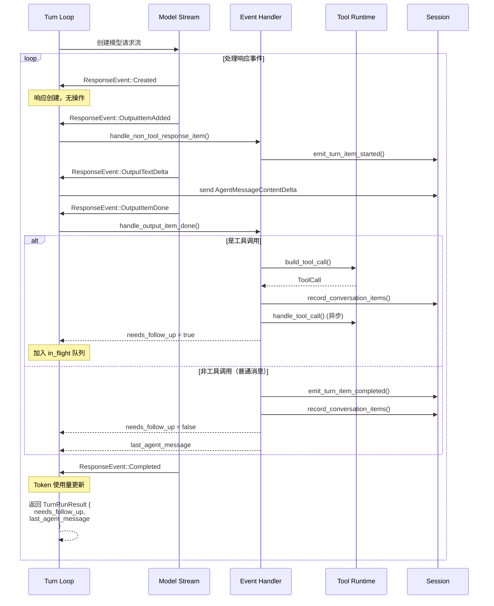
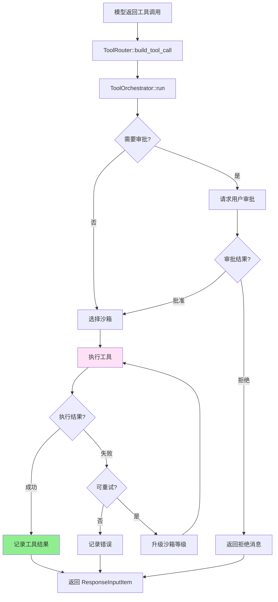
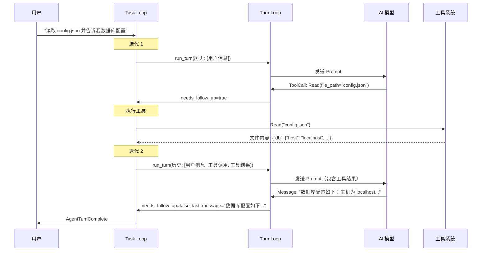
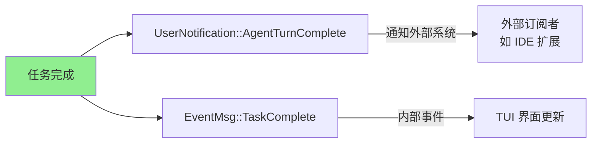
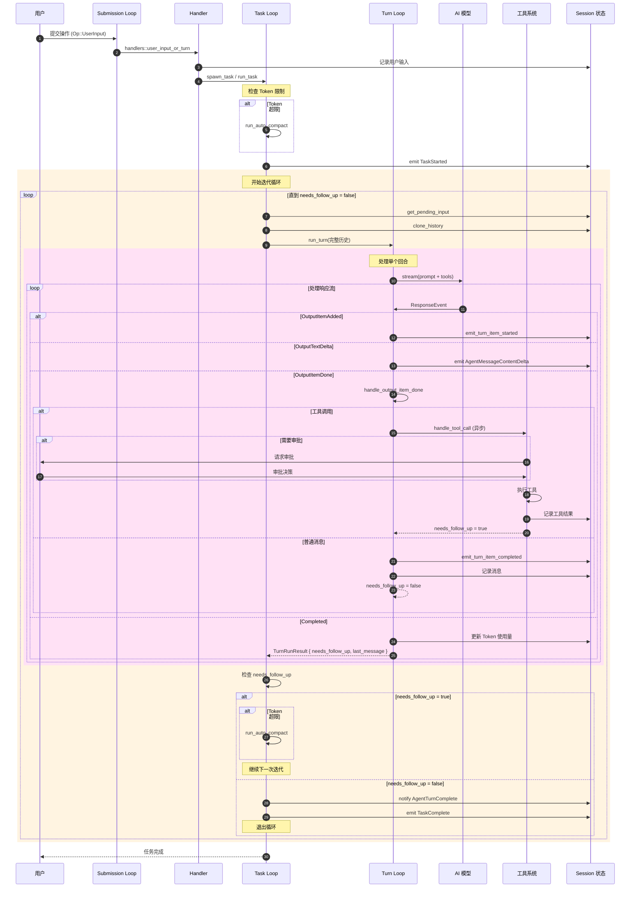
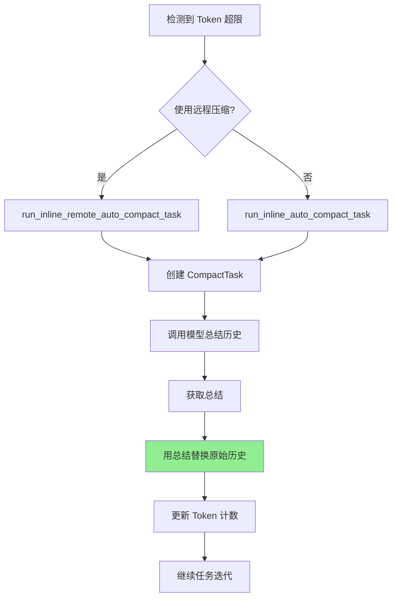
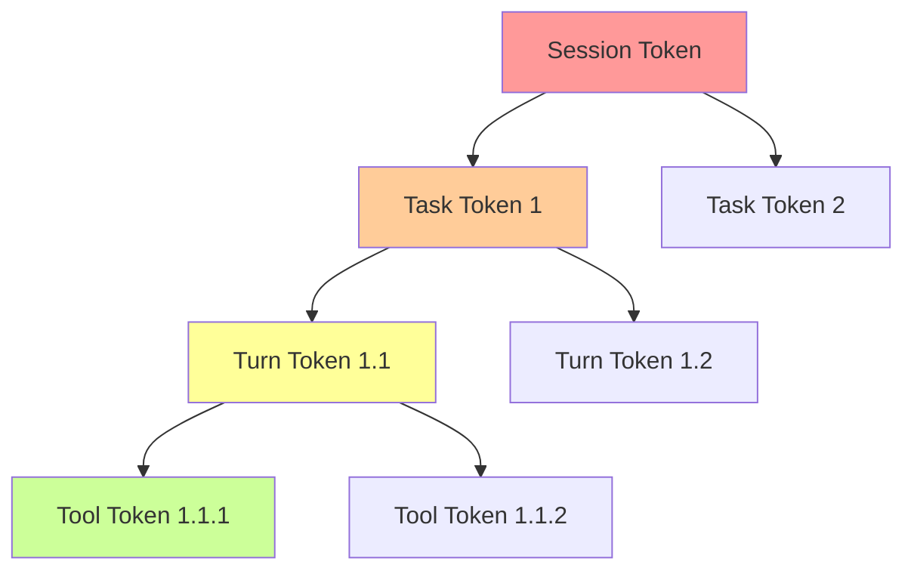

# Codex 事件循环详解

## 概述

Codex 是一个基于事件驱动的 AI Agent 系统，采用多层嵌套的循环结构来处理用户任务。当用户发起一个任务后，Codex 会通过三层循环机制来分解、处理和迭代执行任务，直到任务完成。

本文档将深入解读 Codex 的事件循环机制，包括：
- 三层循环结构（Submission Loop → Task Loop → Turn Loop）
- 任务分解和工具调用机制
- 自我迭代逻辑
- 任务完成判断条件

---

## 整体架构



---

## 三层循环结构

### 第一层：Submission Loop（提交循环）

**位置**: `venders/codex/codex-rs/core/src/codex.rs:1578`

```rust
async fn submission_loop(sess: Arc<Session>, config: Arc<Config>, rx_sub: Receiver<Submission>)
```

#### 功能
- 这是 Codex 的**最外层循环**，负责监听和处理所有用户提交的操作
- 通过 `rx_sub` 通道接收 `Submission` 对象
- 根据操作类型分发到不同的处理器（handlers）

#### 支持的操作类型

| 操作类型 | 说明 | 处理器 |
|---------|------|--------|
| `Op::UserInput` | 用户输入 | `handlers::user_input_or_turn` |
| `Op::UserTurn` | 用户回合 | `handlers::user_input_or_turn` |
| `Op::Interrupt` | 中断当前任务 | `handlers::interrupt` |
| `Op::Compact` | 手动压缩历史 | `handlers::compact` |
| `Op::Undo` | 撤销操作 | `handlers::undo` |
| `Op::ExecApproval` | 执行审批 | `handlers::exec_approval` |
| `Op::PatchApproval` | 补丁审批 | `handlers::patch_approval` |
| `Op::Review` | 代码审查 | `handlers::review` |
| `Op::Shutdown` | 关闭系统 | `handlers::shutdown` |

#### 核心代码流程

```rust
while let Ok(sub) = rx_sub.recv().await {
    match sub.op.clone() {
        Op::UserInput { .. } | Op::UserTurn { .. } => {
            // 用户输入 → 创建任务 → 进入 Task Loop
            handlers::user_input_or_turn(&sess, sub.id.clone(), sub.op, &mut previous_context)
                .await;
        }
        Op::Interrupt => {
            // 中断处理
            handlers::interrupt(&sess).await;
        }
        Op::Shutdown => {
            // 关闭系统，退出循环
            if handlers::shutdown(&sess, sub.id.clone()).await {
                break;
            }
        }
        // ... 其他操作
    }
}
```

#### 退出条件
收到 `Op::Shutdown` 操作时退出循环

---

### 第二层：Task Loop（任务循环）

**位置**: `venders/codex/codex-rs/core/src/codex.rs:2205`

```rust
pub(crate) async fn run_task(
    sess: Arc<Session>,
    turn_context: Arc<TurnContext>,
    input: Vec<UserInput>,
    cancellation_token: CancellationToken,
) -> Option<String>
```

#### 功能
- 这是**任务执行的主循环**，实现了自我迭代机制
- 每次迭代执行一个 Turn（回合）
- 根据 `needs_follow_up` 标志决定是否继续迭代

#### 自我迭代流程



#### 核心代码

```rust
loop {
    // 1. 获取待处理的输入（用户在模型运行时提交的输入）
    let pending_input = sess
        .get_pending_input()
        .await
        .into_iter()
        .map(ResponseItem::from)
        .collect::<Vec<ResponseItem>>();

    // 2. 构建发送给模型的输入（包含完整历史）
    let turn_input: Vec<ResponseItem> = {
        sess.record_conversation_items(&turn_context, &pending_input)
            .await;
        sess.clone_history().await.get_history_for_prompt()
    };

    // 3. 执行一个 Turn
    match run_turn(
        Arc::clone(&sess),
        Arc::clone(&turn_context),
        Arc::clone(&turn_diff_tracker),
        turn_input,
        cancellation_token.child_token(),
    )
    .await
    {
        Ok(turn_output) => {
            let TurnRunResult {
                needs_follow_up,
                last_agent_message: turn_last_agent_message,
            } = turn_output;

            let total_usage_tokens = sess.get_total_token_usage().await;
            let token_limit_reached = total_usage_tokens >= auto_compact_limit;

            // 4. 检查是否需要自动压缩
            if token_limit_reached && needs_follow_up {
                run_auto_compact(&sess, &turn_context).await;
                continue;
            }

            // 5. 检查是否需要继续迭代
            if !needs_follow_up {
                // 任务完成
                last_agent_message = turn_last_agent_message;
                sess.notifier()
                    .notify(&UserNotification::AgentTurnComplete {
                        thread_id: sess.conversation_id.to_string(),
                        turn_id: turn_context.sub_id.clone(),
                        cwd: turn_context.cwd.display().to_string(),
                        input_messages: turn_input_messages,
                        last_assistant_message: last_agent_message.clone(),
                    });
                break;
            }

            // 6. 继续下一次迭代
            continue;
        }
        Err(e) => {
            // 错误处理
            break;
        }
    }
}
```

#### 自动压缩机制

当 Token 使用量超过模型的自动压缩限制时，会触发自动压缩：

```rust
let auto_compact_limit = turn_context
    .client
    .get_model_family()
    .auto_compact_token_limit()
    .unwrap_or(i64::MAX);

let total_usage_tokens = sess.get_total_token_usage().await;

if total_usage_tokens >= auto_compact_limit {
    run_auto_compact(&sess, &turn_context).await;
}
```

自动压缩会：
1. 创建一个压缩任务（CompactTask）
2. 使用模型总结历史对话
3. 用总结替换原始历史，节省 Token

---

### 第三层：Turn Loop（回合循环）

**位置**: `venders/codex/codex-rs/core/src/codex.rs:2504`

```rust
async fn try_run_turn(
    router: Arc<ToolRouter>,
    sess: Arc<Session>,
    turn_context: Arc<TurnContext>,
    turn_diff_tracker: SharedTurnDiffTracker,
    prompt: &Prompt,
    cancellation_token: CancellationToken,
) -> CodexResult<TurnRunResult>
```

#### 功能
- 这是**最内层的循环**，处理模型的响应流
- 创建模型请求并循环处理 `ResponseEvent`
- 执行工具调用
- 构建 `TurnRunResult`（包含 `needs_follow_up` 和 `last_agent_message`）

#### 响应事件类型

| 事件类型 | 说明 | 处理方式 |
|---------|------|---------|
| `ResponseEvent::Created` | 响应创建 | 无操作 |
| `ResponseEvent::OutputItemAdded` | 输出项添加 | 发送 `TurnItemStarted` 事件 |
| `ResponseEvent::OutputTextDelta` | 文本增量 | 发送 `AgentMessageContentDelta` 事件 |
| `ResponseEvent::OutputItemDone` | 输出项完成 | 处理工具调用或记录消息 |
| `ResponseEvent::RateLimits` | 速率限制更新 | 更新速率限制状态 |
| `ResponseEvent::Completed` | 响应完成 | 返回 `TurnRunResult` |

#### 核心流程



#### 核心代码

```rust
// 创建模型响应流
let mut stream = turn_context
    .client
    .clone()
    .stream(prompt)
    .or_cancel(&cancellation_token)
    .await??;

// 工具运行时
let tool_runtime = ToolCallRuntime::new(
    Arc::clone(&router),
    Arc::clone(&sess),
    Arc::clone(&turn_context),
    Arc::clone(&turn_diff_tracker),
);

let mut in_flight: FuturesOrdered<BoxFuture<'static, CodexResult<ResponseInputItem>>> =
    FuturesOrdered::new();
let mut needs_follow_up = false;
let mut last_agent_message: Option<String> = None;

// 循环处理响应事件
loop {
    let event = stream
        .next()
        .or_cancel(&cancellation_token)
        .await?;

    match event {
        ResponseEvent::OutputItemDone(item) => {
            // 处理输出项完成
            let output_result = handle_output_item_done(&mut ctx, item, previously_active_item)
                .await?;

            if let Some(tool_future) = output_result.tool_future {
                // 工具调用：加入队列
                in_flight.push_back(tool_future);
            }
            if let Some(agent_message) = output_result.last_agent_message {
                // 记录最后的消息
                last_agent_message = Some(agent_message);
            }
            // 更新 needs_follow_up 标志
            needs_follow_up |= output_result.needs_follow_up;
        }
        ResponseEvent::Completed { token_usage, .. } => {
            // 响应完成
            sess.update_token_usage_info(&turn_context, token_usage.as_ref())
                .await;

            // 返回结果
            break Ok(TurnRunResult {
                needs_follow_up,
                last_agent_message,
            });
        }
        // ... 处理其他事件
    }
}
```

---

## 任务分解机制

### 工具调用识别

**位置**: `venders/codex/codex-rs/core/src/stream_events_utils.rs:43`

当模型返回 `OutputItemDone` 事件时，Codex 会判断该输出项是否为工具调用：

```rust
pub(crate) async fn handle_output_item_done(
    ctx: &mut HandleOutputCtx,
    item: ResponseItem,
    previously_active_item: Option<TurnItem>,
) -> Result<OutputItemResult> {
    let mut output = OutputItemResult::default();

    match ToolRouter::build_tool_call(ctx.sess.as_ref(), item.clone()).await {
        // 情况1: 模型发出工具调用
        Ok(Some(call)) => {
            // 记录工具调用
            tracing::info!("ToolCall: {} {}", call.tool_name, call.payload.log_payload());

            // 立即持久化
            ctx.sess
                .record_conversation_items(&ctx.turn_context, std::slice::from_ref(&item))
                .await;

            // 创建工具执行 Future
            let tool_future: InFlightFuture<'static> = Box::pin(
                ctx.tool_runtime
                    .clone()
                    .handle_tool_call(call, cancellation_token),
            );

            // 设置需要后续处理
            output.needs_follow_up = true;
            output.tool_future = Some(tool_future);
        }

        // 情况2: 非工具调用（普通消息或推理）
        Ok(None) => {
            // 发送完成事件
            if let Some(turn_item) = handle_non_tool_response_item(&item).await {
                ctx.sess
                    .emit_turn_item_completed(&ctx.turn_context, turn_item)
                    .await;
            }

            // 记录到历史
            ctx.sess
                .record_conversation_items(&ctx.turn_context, std::slice::from_ref(&item))
                .await;

            // 提取最后的消息
            let last_agent_message = last_assistant_message_from_item(&item);
            output.last_agent_message = last_agent_message;

            // needs_follow_up 默认为 false
        }

        // 情况3: 错误（需要反馈给模型）
        Err(FunctionCallError::RespondToModel(message)) => {
            // ... 错误处理
            output.needs_follow_up = true;
        }
    }

    Ok(output)
}
```

### 工具执行流程



#### 工具编排器（ToolOrchestrator）

**位置**: `venders/codex/codex-rs/core/src/tools/orchestrator.rs`

工具编排器负责：
1. **审批流程**: 根据 `approval_policy` 决定是否需要用户审批
2. **沙箱选择**: 根据 `sandbox_policy` 选择执行环境
3. **错误重试**: 失败时升级沙箱等级重试
4. **结果记录**: 将工具执行结果记录到历史

#### 并行工具执行（ToolCallRuntime）

**位置**: `venders/codex/codex-rs/core/src/tools/parallel.rs`

支持并行执行多个工具调用：

```rust
pub async fn handle_tool_call(
    self,
    call: ToolCall,
    cancellation_token: CancellationToken,
) -> CodexResult<ResponseInputItem> {
    // 使用读写锁控制并发
    // 大多数工具可以并行执行（读锁）
    // 某些工具需要独占访问（写锁）

    let result = if call.requires_exclusive_access() {
        let _guard = self.write_lock.lock().await;
        self.orchestrator.run(call, cancellation_token).await
    } else {
        let _guard = self.read_lock.read().await;
        self.orchestrator.run(call, cancellation_token).await
    };

    result
}
```

---

## 自我迭代逻辑

### 迭代触发条件

Codex 的自我迭代由 `needs_follow_up` 标志控制，该标志在以下情况下被设置为 `true`：

#### 1. 模型发出工具调用

```rust
// stream_events_utils.rs:52
Ok(Some(call)) => {
    // ... 工具调用处理
    output.needs_follow_up = true;
    output.tool_future = Some(tool_future);
}
```

**原因**: 工具执行完成后，需要将结果反馈给模型，让模型继续处理

#### 2. 工具执行失败需要反馈

```rust
Err(FunctionCallError::RespondToModel(message)) => {
    // 将错误消息反馈给模型
    let response = ResponseInputItem::FunctionCallOutput {
        call_id: "error".to_string(),
        output: FunctionCallOutputPayload::Error { message },
    };

    output.needs_follow_up = true;
    // ... 记录错误响应
}
```

**原因**: 工具执行失败时，需要告知模型失败原因，让模型调整策略

#### 3. Token 超限后自动压缩

```rust
// codex.rs:2306
if token_limit_reached && needs_follow_up {
    run_auto_compact(&sess, &turn_context).await;
    continue;
}
```

**原因**: 压缩历史后，需要继续原任务的执行

### 迭代流程示例

假设用户输入："读取 config.json 文件并告诉我数据库配置"



**流程说明**：

1. **迭代 1**:
   - 模型分析用户请求，决定使用 Read 工具
   - 返回 `needs_follow_up=true`
   - Task Loop 继续迭代

2. **工具执行**:
   - Tool Runtime 异步执行 Read 工具
   - 将文件内容记录到历史

3. **迭代 2**:
   - 模型收到工具结果（文件内容）
   - 分析数据库配置并生成回答
   - 返回 `needs_follow_up=false`
   - Task Loop 退出，任务完成

---

## 任务完成判断

### 核心判断逻辑

任务是否完成取决于 **`needs_follow_up` 标志**：

```rust
// codex.rs:2311
if !needs_follow_up {
    last_agent_message = turn_last_agent_message;
    sess.notifier()
        .notify(&UserNotification::AgentTurnComplete {
            thread_id: sess.conversation_id.to_string(),
            turn_id: turn_context.sub_id.clone(),
            cwd: turn_context.cwd.display().to_string(),
            input_messages: turn_input_messages,
            last_assistant_message: last_agent_message.clone(),
        });
    break;  // 退出 Task Loop
}
```

### 完成条件判断表

| 条件 | needs_follow_up | 任务状态 | 说明 |
|------|----------------|---------|------|
| 模型只返回消息（无工具调用） | `false` | ✅ 完成 | 模型认为任务已解决 |
| 模型发出工具调用 | `true` | ⏳ 继续 | 需要执行工具并反馈结果 |
| 工具执行失败 | `true` | ⏳ 继续 | 需要将错误反馈给模型 |
| 工具执行成功 | `true` | ⏳ 继续 | 需要将结果反馈给模型 |
| Token 超限 | - | ⏳ 压缩 | 自动压缩历史后继续 |
| 用户中断 | - | ❌ 中止 | 任务被用户取消 |
| 流错误（可重试） | - | 🔄 重试 | 重新建立连接 |
| 流错误（不可重试） | - | ❌ 失败 | 任务失败 |

### 完成事件发送

当任务完成时，Codex 会发送多个事件：



#### UserNotification::AgentTurnComplete

**位置**: `venders/codex/codex-rs/core/src/codex.rs:2313`

```rust
sess.notifier()
    .notify(&UserNotification::AgentTurnComplete {
        thread_id: sess.conversation_id.to_string(),
        turn_id: turn_context.sub_id.clone(),
        cwd: turn_context.cwd.display().to_string(),
        input_messages: turn_input_messages,
        last_assistant_message: last_agent_message.clone(),
    });
```

这个通知会发送到外部订阅者，如 VS Code 扩展，用于：
- 显示完成通知
- 更新状态栏
- 触发后续操作（如运行测试）

#### EventMsg::TaskComplete

**位置**: `venders/codex/codex-rs/core/src/tasks/mod.rs:183`

```rust
pub async fn on_task_finished(...) {
    let event = EventMsg::TaskComplete(TaskCompleteEvent {
        last_agent_message
    });
    self.send_event(turn_context.as_ref(), event).await;
}
```

这个事件用于：
- 更新 TUI 界面
- 记录任务日志
- 触发 Ghost Snapshot（如果启用）

---

## 完整执行流程图



---

## 关键数据结构

### TurnRunResult

```rust
struct TurnRunResult {
    needs_follow_up: bool,        // 是否需要继续迭代
    last_agent_message: Option<String>,  // 最后的 AI 消息
}
```

### OutputItemResult

```rust
struct OutputItemResult {
    last_agent_message: Option<String>,  // 最后的 AI 消息
    needs_follow_up: bool,               // 是否需要后续处理
    tool_future: Option<InFlightFuture<'static>>,  // 工具执行 Future
}
```

### ResponseEvent

```rust
enum ResponseEvent {
    Created,                              // 响应创建
    OutputItemAdded(ResponseItem),        // 输出项添加
    OutputTextDelta(String),              // 文本增量
    OutputItemDone(ResponseItem),         // 输出项完成
    RateLimits(RateLimitsSnapshot),       // 速率限制
    Completed {                           // 响应完成
        response_id: String,
        token_usage: Option<TokenUsage>,
    },
    // ... 其他事件
}
```

---

## 错误处理和重试机制

### Turn 级别重试

**位置**: `venders/codex/codex-rs/core/src/codex.rs:2404`

当 Turn 执行失败时，Codex 会根据错误类型决定是否重试：

```rust
loop {
    match try_run_turn(...).await {
        Ok(output) => return Ok(output),

        // 不可重试的错误
        Err(CodexErr::TurnAborted) => return Err(CodexErr::TurnAborted),
        Err(CodexErr::Interrupted) => return Err(CodexErr::Interrupted),
        Err(e @ CodexErr::Fatal(_)) => return Err(e),

        // 可重试的错误
        Err(e) => {
            let max_retries = turn_context.client.get_provider().stream_max_retries();
            if retries < max_retries {
                retries += 1;
                let delay = backoff(retries);  // 指数退避
                warn!("stream disconnected - retrying ({retries}/{max_retries} in {delay:?})...");

                // 通知用户正在重试
                sess.notify_stream_error(
                    &turn_context,
                    format!("Reconnecting... {retries}/{max_retries}"),
                    e,
                ).await;

                tokio::time::sleep(delay).await;
            } else {
                return Err(e);
            }
        }
    }
}
```

### 工具级别重试

**位置**: `venders/codex/codex-rs/core/src/tools/orchestrator.rs`

工具执行失败时，可以升级沙箱等级重试：

```rust
async fn run(&self, call: ToolCall, cancellation_token: CancellationToken) -> Result<ResponseInputItem> {
    let mut current_sandbox = self.select_sandbox(&call);

    loop {
        match self.execute_tool(&call, current_sandbox).await {
            Ok(result) => return Ok(result),
            Err(e) if e.is_retryable() => {
                // 升级沙箱等级
                current_sandbox = self.escalate_sandbox(current_sandbox);
                if current_sandbox.is_none() {
                    // 没有更高级别的沙箱，返回错误
                    return Err(e);
                }
            }
            Err(e) => return Err(e),
        }
    }
}
```

---

## Token 管理和自动压缩

### Token 跟踪

Codex 在每个 Turn 完成后更新 Token 使用量：

```rust
// codex.rs:2616
ResponseEvent::Completed { response_id, token_usage } => {
    sess.update_token_usage_info(&turn_context, token_usage.as_ref()).await;
    // ...
}
```

### 自动压缩触发

```rust
// codex.rs:2215
let auto_compact_limit = turn_context
    .client
    .get_model_family()
    .auto_compact_token_limit()
    .unwrap_or(i64::MAX);

let total_usage_tokens = sess.get_total_token_usage().await;

if total_usage_tokens >= auto_compact_limit {
    run_auto_compact(&sess, &turn_context).await;
}
```

### 压缩流程



---

## 并发和取消机制

### CancellationToken

Codex 使用 `CancellationToken` 实现任务取消：

```rust
// 每个子任务都有自己的 token
let child_token = cancellation_token.child_token();

// 取消父 token 会级联取消所有子 token
cancellation_token.cancel();
```

### 取消传播



当用户发送 `Op::Interrupt` 时：
1. Session 取消当前运行的任务
2. 级联取消该任务的所有 Turn
3. 级联取消所有正在执行的工具
4. 清理资源并返回

---

## 总结

Codex 的事件循环采用了**三层嵌套循环**的架构设计：

1. **Submission Loop（最外层）**：
   - 监听用户操作
   - 分发到对应的处理器
   - 生命周期贯穿整个会话

2. **Task Loop（中间层）**：
   - 实现自我迭代机制
   - 管理 Token 使用和自动压缩
   - 根据 `needs_follow_up` 决定是否继续

3. **Turn Loop（最内层）**：
   - 处理模型响应流
   - 识别和执行工具调用
   - 返回迭代控制信号

### 核心控制流

```
用户输入
  → Submission Loop (分发)
    → Task Loop (迭代)
      → Turn Loop (执行)
        → 模型响应
          → 工具调用？
            ├─ 是 → needs_follow_up=true → 返回 Task Loop（继续迭代）
            └─ 否 → needs_follow_up=false → 任务完成
```

### 关键特性

- ✅ **自我迭代**: 通过 `needs_follow_up` 标志实现自动迭代
- ✅ **工具分解**: 将复杂任务分解为多个工具调用
- ✅ **并行执行**: 支持并行工具调用（通过读写锁）
- ✅ **自动压缩**: Token 超限时自动压缩历史
- ✅ **错误恢复**: 多层次的重试和错误处理
- ✅ **优雅取消**: 基于 CancellationToken 的级联取消

这种设计使得 Codex 能够处理复杂的、多步骤的任务，同时保持代码的清晰和可维护性。
