# Codex 工具调用机制详解

## 概述

Codex 的工具调用机制是其核心功能之一，使得 AI Agent 能够与外部系统交互、执行命令、读写文件等。本文档将深入解读 Codex 如何发现、选择、调用工具，以及如何处理工具的返回结果。

工具调用的完整生命周期包括：
1. **工具注册** - 在启动时注册所有可用工具
2. **工具发现** - 将工具规格发送给模型
3. **工具选择** - 模型根据任务选择合适的工具
4. **工具路由** - 解析模型的工具调用并路由到对应处理器
5. **审批控制** - 根据策略决定是否需要用户审批
6. **沙箱执行** - 在适当的沙箱环境中执行工具
7. **结果处理** - 处理执行结果并反馈给模型
8. **重试机制** - 失败时根据策略进行重试

---

## 整体架构

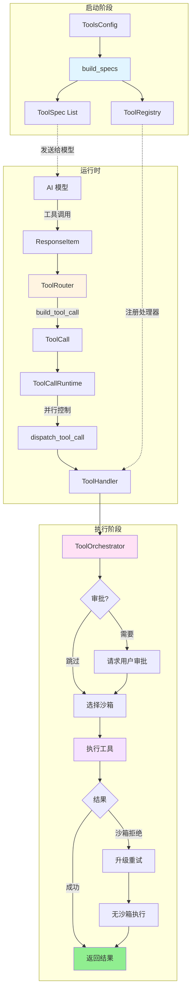

---

## 1. 工具注册和发现

### 1.1 工具类型

Codex 支持三种类型的工具：

#### 1.1.1 内置工具（Built-in Tools）

**位置**: `venders/codex/codex-rs/core/src/tools/spec.rs`

内置工具在 Codex 核心中实现，包括：

| 工具名称 | 功能 | 创建函数 | 行号 |
|---------|------|---------|------|
| `shell` / `local_shell` | 执行 Shell 命令 | `create_shell_tool()` | 259 |
| `exec_command` | 统一执行接口（新版） | `create_exec_command_tool()` | 134 |
| `write_stdin` | 写入标准输入 | `create_write_stdin_tool()` | 214 |
| `shell_command` | Shell 命令工具 | `create_shell_command_tool()` | 323 |
| `view_image` | 查看图片 | `create_view_image_tool()` | 395 |
| `grep_files` | 搜索文件内容 | `create_grep_files_tool()` | 481 |
| `read_file` | 读取文件 | `create_read_file_tool()` | 531 |
| `list_dir` | 列出目录 | `create_list_dir_tool()` | 629 |
| `apply_patch` | 应用补丁 | `create_apply_patch_*_tool()` | 多个 |
| `update_plan` | 更新计划 | `PLAN_TOOL` | 常量 |
| `list_mcp_resources` | 列出 MCP 资源 | `create_list_mcp_resources_tool()` | 674 |
| `read_mcp_resource` | 读取 MCP 资源 | `create_read_mcp_resource_tool()` | 740 |

#### 1.1.2 MCP 工具（Model Context Protocol Tools）

**位置**: `venders/codex/codex-rs/core/src/tools/spec.rs:832-865`

MCP 工具是通过 MCP 服务器动态提供的外部工具。Codex 会：
1. 连接到配置的 MCP 服务器
2. 获取服务器提供的工具列表
3. 将 MCP 工具规格转换为 OpenAI 工具格式
4. 注册 MCP 处理器

**MCP 工具转换代码**：

```rust
pub(crate) fn mcp_tool_to_openai_tool(
    name: String,
    tool: mcp_types::Tool,
) -> Result<ResponsesApiTool, String> {
    let input_schema = tool.input_schema;

    // 清理和标准化 JSON Schema
    let sanitized_schema = sanitize_json_schema(input_schema.clone())?;

    Ok(ResponsesApiTool {
        name,
        description: tool.description,
        input_schema: sanitized_schema,
        ..Default::default()
    })
}
```

**Schema 清理**：`sanitize_json_schema()` 函数（行 874-976）会：
- 移除不支持的字段（如 `$schema`, `$defs`）
- 转换 `anyOf`/`allOf`/`oneOf` 为单一类型
- 展开 `$ref` 引用
- 规范化布尔 schema

#### 1.1.3 自定义工具（Custom Tools）

通过 `CustomToolCall` 支持的工具，使用自定义输入格式而非标准 JSON Schema。

### 1.2 工具规格（ToolSpec）

**位置**: `venders/codex/codex-rs/core/src/tools/spec.rs`

工具规格定义了工具的元数据，发送给模型以便模型选择：

```rust
pub enum ToolSpec {
    // 标准函数工具
    Function(ResponsesApiTool),

    // 本地 Shell 工具（特殊处理）
    LocalShell {},

    // Web 搜索工具
    WebSearch {},

    // 自由格式工具（用于 apply_patch 等）
    Freeform(FreeformTool),
}
```

**ResponsesApiTool 结构**：

```rust
pub struct ResponsesApiTool {
    pub name: String,
    pub description: String,
    pub input_schema: JsonSchema,
    // ...
}
```

**JsonSchema 定义**（行 79-132）：

```rust
pub(crate) enum JsonSchema {
    Boolean {
        description: Option<String>
    },
    String {
        description: Option<String>
    },
    Number {
        description: Option<String>
    },
    Array {
        items: Box<JsonSchema>,
        description: Option<String>
    },
    Object {
        properties: BTreeMap<String, JsonSchema>,
        required: Option<Vec<String>>,
        additional_properties: Option<AdditionalProperties>,
    },
}
```

### 1.3 工具注册流程

**位置**: `venders/codex/codex-rs/core/src/tools/spec.rs:979-1123`

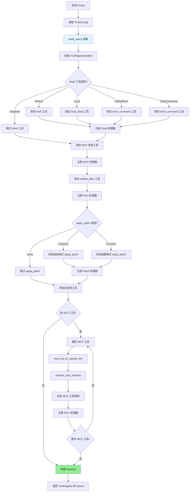

**核心代码**（spec.rs:979-1123）：

```rust
pub(crate) fn build_specs(
    config: &ToolsConfig,
    mcp_tools: Option<HashMap<String, mcp_types::Tool>>,
) -> ToolRegistryBuilder {
    let mut builder = ToolRegistryBuilder::new();

    // 1. 创建处理器实例
    let shell_handler = Arc::new(ShellHandler);
    let unified_exec_handler = Arc::new(UnifiedExecHandler);
    let plan_handler = Arc::new(PlanHandler);
    let apply_patch_handler = Arc::new(ApplyPatchHandler);
    let mcp_handler = Arc::new(McpHandler);
    // ... 其他处理器

    // 2. 根据配置添加 Shell 工具
    match &config.shell_type {
        ConfigShellToolType::Default => {
            builder.push_spec(create_shell_tool());
        }
        ConfigShellToolType::UnifiedExec => {
            builder.push_spec(create_exec_command_tool());
            builder.push_spec(create_write_stdin_tool());
            builder.register_handler("exec_command", unified_exec_handler.clone());
            builder.register_handler("write_stdin", unified_exec_handler);
        }
        // ... 其他类型
    }

    // 3. 注册 Shell 处理器（兼容旧版本）
    if config.shell_type != ConfigShellToolType::Disabled {
        builder.register_handler("shell", shell_handler.clone());
        builder.register_handler("container.exec", shell_handler.clone());
        builder.register_handler("local_shell", shell_handler);
    }

    // 4. 添加 MCP 资源工具
    builder.push_spec_with_parallel_support(create_list_mcp_resources_tool(), true);
    builder.push_spec_with_parallel_support(create_read_mcp_resource_tool(), true);
    builder.register_handler("list_mcp_resources", mcp_resource_handler.clone());
    builder.register_handler("read_mcp_resource", mcp_resource_handler);

    // 5. 添加计划工具
    builder.push_spec(PLAN_TOOL.clone());
    builder.register_handler("update_plan", plan_handler);

    // 6. 添加补丁工具
    if let Some(apply_patch_tool_type) = &config.apply_patch_tool_type {
        match apply_patch_tool_type {
            ApplyPatchToolType::Freeform => {
                builder.push_spec(create_apply_patch_freeform_tool());
            }
            ApplyPatchToolType::Function => {
                builder.push_spec(create_apply_patch_json_tool());
            }
        }
        builder.register_handler("apply_patch", apply_patch_handler);
    }

    // 7. 添加实验性工具
    if config.experimental_supported_tools.contains(&"grep_files".to_string()) {
        builder.push_spec_with_parallel_support(create_grep_files_tool(), true);
        builder.register_handler("grep_files", Arc::new(GrepFilesHandler));
    }

    // 8. 处理 MCP 工具
    if let Some(mcp_tools) = mcp_tools {
        let mut entries: Vec<_> = mcp_tools.into_iter().collect();
        entries.sort_by(|a, b| a.0.cmp(&b.0));

        for (name, tool) in entries {
            match mcp_tool_to_openai_tool(name.clone(), tool.clone()) {
                Ok(converted_tool) => {
                    builder.push_spec(ToolSpec::Function(converted_tool));
                    builder.register_handler(name, mcp_handler.clone());
                }
                Err(e) => {
                    tracing::warn!("Failed to convert MCP tool {name}: {e}");
                }
            }
        }
    }

    builder
}
```

### 1.4 ToolRegistry 和 ToolRegistryBuilder

**位置**: `venders/codex/codex-rs/core/src/tools/registry.rs`

**ToolRegistry**（行 40-144）：

```rust
pub struct ToolRegistry {
    handlers: HashMap<String, Arc<dyn ToolHandler>>,
}

impl ToolRegistry {
    // 获取工具处理器
    pub fn handler(&self, name: &str) -> Option<Arc<dyn ToolHandler>> {
        self.handlers.get(name).map(Arc::clone)
    }

    // 分发工具调用到对应处理器
    pub async fn dispatch(
        &self,
        invocation: ToolInvocation,
    ) -> Result<ResponseInputItem, FunctionCallError> {
        let tool_name = invocation.tool_name.clone();

        // 1. 查找处理器
        let handler = match self.handler(tool_name.as_ref()) {
            Some(handler) => handler,
            None => {
                return Err(FunctionCallError::RespondToModel(
                    format!("Unsupported tool: {tool_name}")
                ));
            }
        };

        // 2. 验证负载类型
        if !handler.matches_kind(&invocation.payload) {
            return Err(FunctionCallError::Fatal(
                format!("tool {tool_name} invoked with incompatible payload")
            ));
        }

        // 3. 等待工具门控（如果是可变操作）
        if handler.is_mutating(&invocation).await {
            invocation.turn.tool_call_gate.wait_ready().await;
        }

        // 4. 执行工具并记录遥测数据
        let result = otel.log_tool_result(/* ... */, || async {
            match handler.handle(invocation).await {
                Ok(output) => {
                    let preview = output.log_preview();
                    let success = output.success_for_logging();
                    Ok((preview, success))
                }
                Err(err) => Err(err),
            }
        }).await;

        // 5. 转换为响应格式
        match result {
            Ok(_) => {
                let output = /* 从 cell 获取 */;
                Ok(output.into_response(&call_id, &payload))
            }
            Err(err) => Err(err),
        }
    }
}
```

**ToolHandler Trait**（registry.rs:21-38）：

```rust
#[async_trait]
pub trait ToolHandler: Send + Sync {
    // 工具类型（Function 或 Mcp）
    fn kind(&self) -> ToolKind;

    // 检查负载类型是否匹配
    fn matches_kind(&self, payload: &ToolPayload) -> bool;

    // 是否是可变操作（需要串行化）
    async fn is_mutating(&self, invocation: &ToolInvocation) -> bool {
        false
    }

    // 处理工具调用
    async fn handle(&self, invocation: ToolInvocation)
        -> Result<ToolOutput, FunctionCallError>;
}
```

---

## 2. 工具选择和路由

### 2.1 模型如何选择工具

当创建模型请求时，Codex 会将所有可用的工具规格发送给模型：

**位置**: `venders/codex/codex-rs/core/src/codex.rs:2365-2401`

```rust
async fn run_turn(
    sess: Arc<Session>,
    turn_context: Arc<TurnContext>,
    // ...
) -> CodexResult<TurnRunResult> {
    // 1. 获取 MCP 工具列表
    let mcp_tools = sess.services.mcp_connection_manager
        .read().await
        .list_all_tools()
        .await?;

    // 2. 创建 ToolRouter（包含所有工具规格）
    let router = Arc::new(ToolRouter::from_config(
        &turn_context.tools_config,
        Some(mcp_tools.into_iter().map(|(name, tool)| (name, tool.tool)).collect()),
    ));

    // 3. 构建 Prompt（包含工具列表）
    let prompt = Prompt {
        input,
        tools: router.specs(),  // 所有工具规格
        parallel_tool_calls: model_supports_parallel && sess.enabled(Feature::ParallelToolCalls),
        base_instructions_override: turn_context.base_instructions.clone(),
        output_schema: turn_context.final_output_json_schema.clone(),
    };

    // 4. 发送给模型
    let mut stream = turn_context.client.stream(&prompt).await??;
    // ...
}
```

模型根据：
- 工具的 `name` 和 `description`
- 工具的 `input_schema`（参数定义）
- 当前任务需求

来选择合适的工具并生成工具调用。

### 2.2 ToolRouter - 工具路由器

**位置**: `venders/codex/codex-rs/core/src/tools/router.rs`

ToolRouter 负责：
1. 存储工具注册表和规格
2. 解析模型的响应项为 ToolCall
3. 分发工具调用到对应处理器

**ToolRouter 结构**（router.rs:28-31）：

```rust
pub struct ToolRouter {
    registry: ToolRegistry,          // 工具处理器注册表
    specs: Vec<ConfiguredToolSpec>,  // 工具规格列表
}
```

**ToolCall 结构**（router.rs:22-26）：

```rust
#[derive(Clone, Debug)]
pub struct ToolCall {
    pub tool_name: String,    // 工具名称
    pub call_id: String,      // 调用 ID（用于追踪）
    pub payload: ToolPayload, // 工具负载
}
```

**ToolPayload 枚举**（context.rs:29-45）：

```rust
#[derive(Clone, Debug)]
pub enum ToolPayload {
    // 标准函数调用（JSON 参数）
    Function {
        arguments: String,
    },

    // 自定义工具调用
    Custom {
        input: String,
    },

    // 本地 Shell 调用
    LocalShell {
        params: ShellToolCallParams,
    },

    // MCP 工具调用
    Mcp {
        server: String,
        tool: String,
        raw_arguments: String,
    },
}
```

### 2.3 构建工具调用（build_tool_call）

**位置**: `venders/codex/codex-rs/core/src/tools/router.rs:59-127`

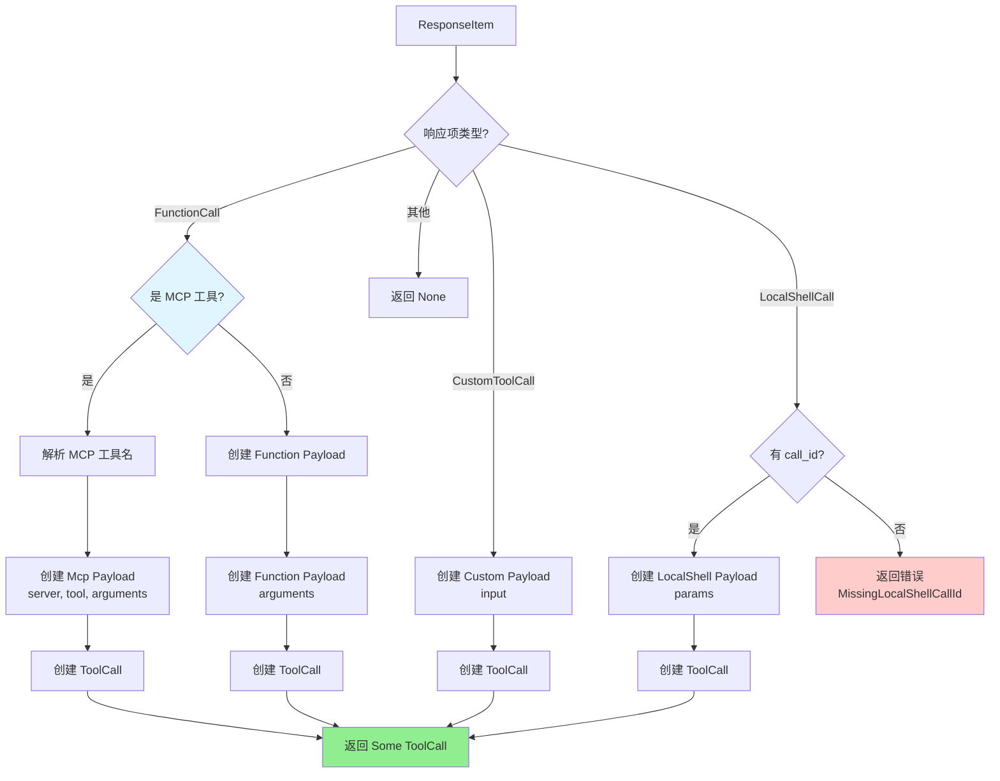

**核心代码**：

```rust
pub async fn build_tool_call(
    session: &Session,
    item: ResponseItem,
) -> Result<Option<ToolCall>, FunctionCallError> {
    match item {
        // 1. 标准函数调用
        ResponseItem::FunctionCall { name, arguments, call_id, .. } => {
            // 检查是否是 MCP 工具（格式：server__tool）
            if let Some((server, tool)) = session.parse_mcp_tool_name(&name).await {
                Ok(Some(ToolCall {
                    tool_name: name,
                    call_id,
                    payload: ToolPayload::Mcp {
                        server,
                        tool,
                        raw_arguments: arguments,
                    },
                }))
            } else {
                Ok(Some(ToolCall {
                    tool_name: name,
                    call_id,
                    payload: ToolPayload::Function { arguments },
                }))
            }
        }

        // 2. 自定义工具调用
        ResponseItem::CustomToolCall { name, input, call_id, .. } => {
            Ok(Some(ToolCall {
                tool_name: name,
                call_id,
                payload: ToolPayload::Custom { input },
            }))
        }

        // 3. 本地 Shell 调用
        ResponseItem::LocalShellCall { id, call_id, action, .. } => {
            let call_id = call_id.or(id)
                .ok_or(FunctionCallError::MissingLocalShellCallId)?;

            match action {
                LocalShellAction::Exec(exec) => {
                    let params = ShellToolCallParams {
                        command: exec.command,
                        workdir: exec.working_directory,
                        timeout_ms: exec.timeout_ms,
                        sandbox_permissions: Some(SandboxPermissions::UseDefault),
                        justification: None,
                    };
                    Ok(Some(ToolCall {
                        tool_name: "local_shell".to_string(),
                        call_id,
                        payload: ToolPayload::LocalShell { params },
                    }))
                }
            }
        }

        // 4. 其他类型（非工具调用）
        _ => Ok(None),
    }
}
```

### 2.4 分发工具调用（dispatch_tool_call）

**位置**: `venders/codex/codex-rs/core/src/tools/router.rs:130-163`

```rust
pub async fn dispatch_tool_call(
    &self,
    session: Arc<Session>,
    turn: Arc<TurnContext>,
    tracker: SharedTurnDiffTracker,
    call: ToolCall,
) -> Result<ResponseInputItem, FunctionCallError> {
    // 1. 创建工具调用上下文
    let invocation = ToolInvocation {
        session,
        turn,
        tracker,
        call_id: call.call_id.clone(),
        tool_name: call.tool_name.clone(),
        payload: call.payload.clone(),
    };

    // 2. 分发到 Registry
    match self.registry.dispatch(invocation).await {
        Ok(response) => Ok(response),
        Err(err) => {
            // 3. 错误处理：转换为失败响应
            let payload_outputs_custom = matches!(
                call.payload,
                ToolPayload::Custom { .. }
            );
            Ok(Self::failure_response(
                call.call_id,
                payload_outputs_custom,
                err,
            ))
        }
    }
}
```

---

## 3. 工具执行机制

### 3.1 并行执行控制（ToolCallRuntime）

**位置**: `venders/codex/codex-rs/core/src/tools/parallel.rs`

ToolCallRuntime 负责：
1. 控制工具调用的并行/串行执行
2. 处理工具调用取消
3. 计时和遥测

**核心结构**（parallel.rs:24-30）：

```rust
pub(crate) struct ToolCallRuntime {
    router: Arc<ToolRouter>,
    session: Arc<Session>,
    turn_context: Arc<TurnContext>,
    tracker: SharedTurnDiffTracker,
    parallel_execution: Arc<RwLock<()>>,  // 并行控制锁
}
```

**并行执行逻辑**（parallel.rs:48-105）：

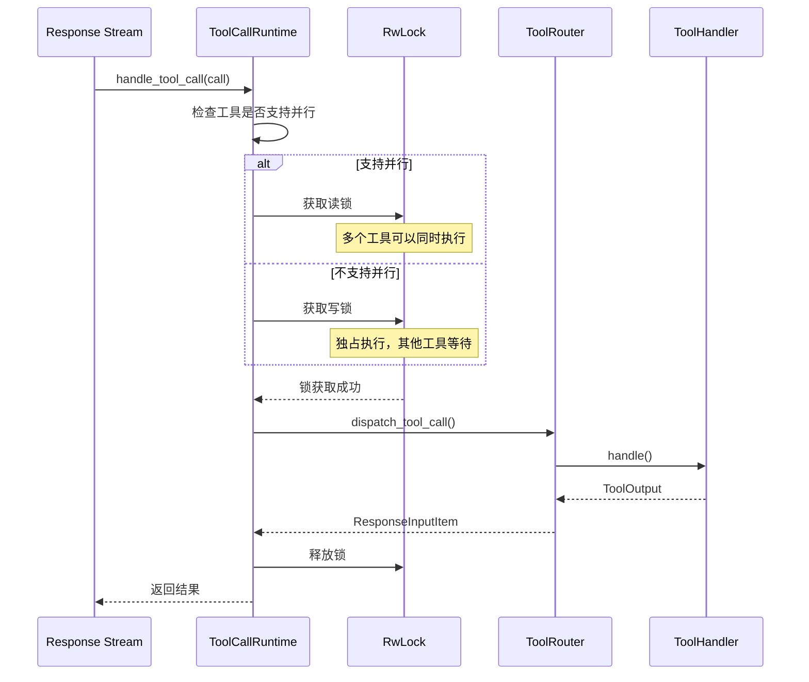

**核心代码**：

```rust
pub(crate) fn handle_tool_call(
    self,
    call: ToolCall,
    cancellation_token: CancellationToken,
) -> impl Future<Output = Result<ResponseInputItem, CodexErr>> {
    // 1. 检查工具是否支持并行
    let supports_parallel = self.router.tool_supports_parallel(&call.tool_name);

    let lock = Arc::clone(&self.parallel_execution);
    let started = Instant::now();

    // 2. 在新任务中执行
    let handle = tokio::spawn(async move {
        tokio::select! {
            // 取消分支
            _ = cancellation_token.cancelled() => {
                let secs = started.elapsed().as_secs_f32();
                Ok(Self::aborted_response(&call, secs))
            },

            // 执行分支
            res = async {
                // 3. 获取锁（读锁或写锁）
                let _guard = if supports_parallel {
                    Either::Left(lock.read().await)   // 读锁：允许并行
                } else {
                    Either::Right(lock.write().await) // 写锁：独占执行
                };

                // 4. 分发工具调用
                router.dispatch_tool_call(session, turn, tracker, call.clone()).await
            } => res,
        }
    });

    // 5. 等待结果
    async move {
        match handle.await {
            Ok(Ok(response)) => Ok(response),
            Ok(Err(err)) => Err(CodexErr::Fatal(err.to_string())),
            Err(err) => Err(CodexErr::Fatal(format!("tool task failed: {err:?}"))),
        }
    }
}
```

**并行支持判断**（router.rs:51-56）：

```rust
pub fn tool_supports_parallel(&self, tool_name: &str) -> bool {
    self.specs
        .iter()
        .filter(|config| config.supports_parallel_tool_calls)
        .any(|config| config.spec.name() == tool_name)
}
```

支持并行的工具：
- `list_mcp_resources` ✅
- `read_mcp_resource` ✅
- `grep_files` ✅
- `read_file` ✅
- `list_dir` ✅

不支持并行的工具（需要独占执行）：
- `shell` / `local_shell` ❌
- `exec_command` ❌
- `apply_patch` ❌
- `update_plan` ❌

### 3.2 工具编排器（ToolOrchestrator）

**位置**: `venders/codex/codex-rs/core/src/tools/orchestrator.rs`

ToolOrchestrator 是工具执行的核心组件，负责：
1. **审批流程** - 根据策略请求用户审批
2. **沙箱选择** - 选择合适的沙箱环境
3. **首次尝试** - 在沙箱中执行工具
4. **失败升级** - 沙箱拒绝时升级重试

**执行流程**：

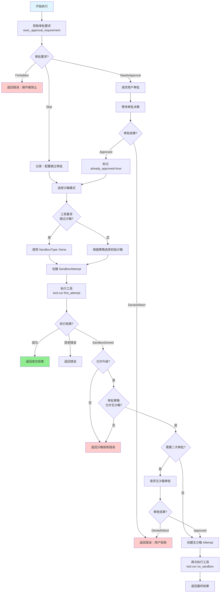

**核心代码**（orchestrator.rs:34-160）：

```rust
pub async fn run<Rq, Out, T>(
    &mut self,
    tool: &mut T,
    req: &Rq,
    tool_ctx: &ToolCtx<'_>,
    turn_ctx: &TurnContext,
    approval_policy: AskForApproval,
) -> Result<Out, ToolError>
where
    T: ToolRuntime<Rq, Out>,
{
    // ========== 阶段 1: 审批 ==========
    let mut already_approved = false;

    // 获取审批要求
    let requirement = tool.exec_approval_requirement(req)
        .unwrap_or_else(|| {
            default_exec_approval_requirement(approval_policy, &turn_ctx.sandbox_policy)
        });

    match requirement {
        ExecApprovalRequirement::Skip { .. } => {
            // 跳过审批（配置允许）
            otel.tool_decision(tool_name, call_id, &ReviewDecision::Approved, Config);
        }

        ExecApprovalRequirement::Forbidden { reason } => {
            // 操作被禁止
            return Err(ToolError::Rejected(reason));
        }

        ExecApprovalRequirement::NeedsApproval { reason, .. } => {
            // 需要审批
            let approval_ctx = ApprovalCtx {
                session: tool_ctx.session,
                turn: turn_ctx,
                call_id: &tool_ctx.call_id,
                retry_reason: reason,
            };

            let decision = tool.start_approval_async(req, approval_ctx).await;
            otel.tool_decision(tool_name, call_id, &decision, User);

            match decision {
                ReviewDecision::Denied | ReviewDecision::Abort => {
                    return Err(ToolError::Rejected("rejected by user".to_string()));
                }
                ReviewDecision::Approved
                | ReviewDecision::ApprovedExecpolicyAmendment { .. }
                | ReviewDecision::ApprovedForSession => {
                    already_approved = true;
                }
            }
        }
    }

    // ========== 阶段 2: 首次尝试 ==========

    // 选择沙箱模式
    let initial_sandbox = match tool.sandbox_mode_for_first_attempt(req) {
        SandboxOverride::BypassSandboxFirstAttempt => SandboxType::None,
        SandboxOverride::NoOverride => {
            self.sandbox.select_initial(
                &turn_ctx.sandbox_policy,
                tool.sandbox_preference(),
            )
        }
    };

    let initial_attempt = SandboxAttempt {
        sandbox: initial_sandbox,
        policy: &turn_ctx.sandbox_policy,
        manager: &self.sandbox,
        sandbox_cwd: &turn_ctx.cwd,
        codex_linux_sandbox_exe: turn_ctx.codex_linux_sandbox_exe.as_ref(),
    };

    // 执行工具
    match tool.run(req, &initial_attempt, tool_ctx).await {
        Ok(out) => {
            // 成功
            return Ok(out);
        }

        Err(ToolError::Codex(CodexErr::Sandbox(SandboxErr::Denied { output }))) => {
            // ========== 阶段 3: 失败升级 ==========

            // 检查是否允许升级
            if !tool.escalate_on_failure() {
                return Err(ToolError::Codex(CodexErr::Sandbox(SandboxErr::Denied { output })));
            }

            // 检查审批策略
            if !tool.wants_no_sandbox_approval(approval_policy) {
                return Err(ToolError::Codex(CodexErr::Sandbox(SandboxErr::Denied { output })));
            }

            // 请求无沙箱审批（如果需要）
            if !tool.should_bypass_approval(approval_policy, already_approved) {
                let reason_msg = build_denial_reason_from_output(output.as_ref());
                let approval_ctx = ApprovalCtx {
                    session: tool_ctx.session,
                    turn: turn_ctx,
                    call_id: &tool_ctx.call_id,
                    retry_reason: Some(reason_msg),
                };

                let decision = tool.start_approval_async(req, approval_ctx).await;
                otel.tool_decision(tool_name, call_id, &decision, User);

                match decision {
                    ReviewDecision::Denied | ReviewDecision::Abort => {
                        return Err(ToolError::Rejected("user denied escalation".to_string()));
                    }
                    _ => {}
                }
            }

            // 无沙箱重试
            let escalated_attempt = SandboxAttempt {
                sandbox: SandboxType::None,
                policy: &turn_ctx.sandbox_policy,
                manager: &self.sandbox,
                sandbox_cwd: &turn_ctx.cwd,
                codex_linux_sandbox_exe: turn_ctx.codex_linux_sandbox_exe.as_ref(),
            };

            tool.run(req, &escalated_attempt, tool_ctx).await
        }

        Err(e) => Err(e),
    }
}
```

### 3.3 审批策略（Approval Policy）

**位置**: `venders/codex/codex-rs/core/src/tools/sandboxing.rs`

**AskForApproval 枚举**（codex_protocol）：

```rust
pub enum AskForApproval {
    Never,          // 从不请求审批（危险！）
    OnFailure,      // 仅在沙箱失败时请求审批
    OnRequest,      // 根据请求判断是否需要审批
    UnlessTrusted,  // 除非是受信任的操作，否则请求审批
}
```

**ExecApprovalRequirement 枚举**（sandboxing.rs:88-124）：

```rust
pub(crate) enum ExecApprovalRequirement {
    // 跳过审批
    Skip {
        bypass_sandbox: bool,  // 是否跳过沙箱
        proposed_execpolicy_amendment: Option<ExecPolicyAmendment>,
    },

    // 需要审批
    NeedsApproval {
        reason: Option<String>,  // 审批原因
        proposed_execpolicy_amendment: Option<ExecPolicyAmendment>,
    },

    // 禁止执行
    Forbidden {
        reason: String
    },
}
```

**默认审批要求**（sandboxing.rs:129-153）：

```rust
pub(crate) fn default_exec_approval_requirement(
    policy: AskForApproval,
    sandbox_policy: &SandboxPolicy,
) -> ExecApprovalRequirement {
    let needs_approval = match policy {
        AskForApproval::Never | AskForApproval::OnFailure => false,

        AskForApproval::OnRequest => {
            // DangerFullAccess 或 ExternalSandbox 不需要审批
            !matches!(
                sandbox_policy,
                SandboxPolicy::DangerFullAccess | SandboxPolicy::ExternalSandbox { .. }
            )
        }

        AskForApproval::UnlessTrusted => true,
    };

    if needs_approval {
        ExecApprovalRequirement::NeedsApproval {
            reason: None,
            proposed_execpolicy_amendment: None,
        }
    } else {
        ExecApprovalRequirement::Skip {
            bypass_sandbox: false,
            proposed_execpolicy_amendment: None,
        }
    }
}
```

**审批缓存**（sandboxing.rs:52-77）：

为避免重复审批相同的操作，Codex 使用 `ApprovalStore` 缓存审批决策：

```rust
pub(crate) async fn with_cached_approval<K, F, Fut>(
    services: &SessionServices,
    key: K,
    fetch: F,
) -> ReviewDecision
where
    K: Serialize + Clone,
    F: FnOnce() -> Fut,
    Fut: Future<Output = ReviewDecision>,
{
    // 1. 检查缓存
    {
        let store = services.tool_approvals.lock().await;
        if let Some(decision) = store.get(&key) {
            return decision;
        }
    }

    // 2. 请求审批
    let decision = fetch().await;

    // 3. 缓存 ApprovedForSession 决策
    if matches!(decision, ReviewDecision::ApprovedForSession) {
        let mut store = services.tool_approvals.lock().await;
        store.put(key, ReviewDecision::ApprovedForSession);
    }

    decision
}
```

### 3.4 沙箱策略（Sandbox Policy）

**SandboxPolicy 枚举**（codex_protocol）：

```rust
pub enum SandboxPolicy {
    // 没有沙箱保护（危险！）
    DangerFullAccess,

    // 外部沙箱（如 Docker）
    ExternalSandbox {
        container_id: String,
    },

    // 本地沙箱
    LocalSandbox {
        level: SandboxLevel,
    },
}

pub enum SandboxLevel {
    None,      // 无沙箱
    Read,      // 只读访问
    Write,     // 读写访问
    Full,      // 完全隔离
}
```

**沙箱选择逻辑**（SandboxManager）：

```rust
impl SandboxManager {
    pub fn select_initial(
        &self,
        policy: &SandboxPolicy,
        tool_preference: SandboxablePreference,
    ) -> SandboxType {
        match (policy, tool_preference) {
            // 策略明确要求无沙箱
            (SandboxPolicy::DangerFullAccess, _) => SandboxType::None,

            // 工具明确禁止沙箱
            (_, SandboxablePreference::Forbid) => SandboxType::None,

            // 工具要求沙箱
            (SandboxPolicy::LocalSandbox { level }, SandboxablePreference::Require) => {
                match level {
                    SandboxLevel::Full => SandboxType::Bubblewrap,
                    SandboxLevel::Write => SandboxType::Bubblewrap,
                    SandboxLevel::Read => SandboxType::ReadOnly,
                    SandboxLevel::None => SandboxType::None,
                }
            }

            // 外部沙箱
            (SandboxPolicy::ExternalSandbox { container_id }, _) => {
                SandboxType::External(container_id.clone())
            }

            // 默认：根据策略选择
            _ => self.default_for_policy(policy),
        }
    }
}
```

**SandboxAttempt 结构**（sandboxing.rs:237-258）：

```rust
pub(crate) struct SandboxAttempt<'a> {
    pub sandbox: SandboxType,             // 沙箱类型
    pub policy: &'a SandboxPolicy,        // 沙箱策略
    pub(crate) manager: &'a SandboxManager,
    pub(crate) sandbox_cwd: &'a Path,     // 沙箱工作目录
    pub codex_linux_sandbox_exe: Option<&'a PathBuf>,
}

impl<'a> SandboxAttempt<'a> {
    // 为命令设置环境变量
    pub(crate) fn env_for(&self, spec: &CommandSpec) -> HashMap<String, String> {
        match self.sandbox {
            SandboxType::None => spec.env.clone(),
            SandboxType::Bubblewrap => {
                let mut env = spec.env.clone();
                env.insert("SANDBOX".to_string(), "bubblewrap".to_string());
                env
            }
            // ...
        }
    }
}
```

---

## 4. 结果处理

### 4.1 ToolOutput - 工具输出

**位置**: `venders/codex/codex-rs/core/src/tools/context.rs:58-116`

```rust
#[derive(Clone)]
pub enum ToolOutput {
    // 函数工具输出
    Function {
        content: String,  // 纯文本表示
        content_items: Option<Vec<FunctionCallOutputContentItem>>,  // 结构化内容
        success: Option<bool>,  // 成功标志
    },

    // MCP 工具输出
    Mcp {
        result: Result<CallToolResult, String>,
    },
}
```

**转换为响应格式**（context.rs:87-115）：

```rust
pub fn into_response(self, call_id: &str, payload: &ToolPayload) -> ResponseInputItem {
    match self {
        ToolOutput::Function { content, content_items, success } => {
            // 自定义工具使用 CustomToolCallOutput
            if matches!(payload, ToolPayload::Custom { .. }) {
                ResponseInputItem::CustomToolCallOutput {
                    call_id: call_id.to_string(),
                    output: content,
                }
            }
            // 标准函数工具使用 FunctionCallOutput
            else {
                ResponseInputItem::FunctionCallOutput {
                    call_id: call_id.to_string(),
                    output: FunctionCallOutputPayload {
                        content,
                        content_items,
                        success,
                    },
                }
            }
        }

        ToolOutput::Mcp { result } => {
            ResponseInputItem::McpToolCallOutput {
                call_id: call_id.to_string(),
                result,
            }
        }
    }
}
```

### 4.2 成功结果处理流程

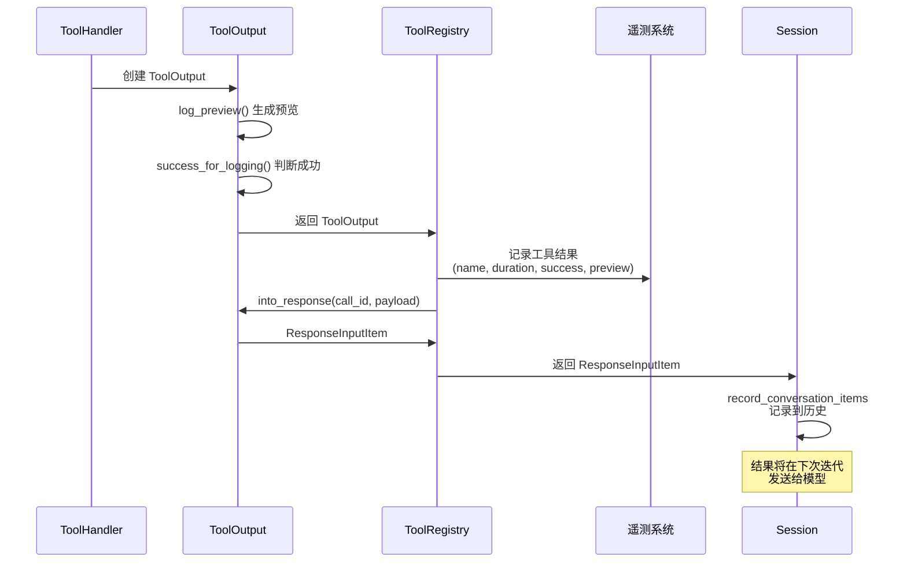

**Registry dispatch 方法**（registry.rs:61-143）：

```rust
pub async fn dispatch(
    &self,
    invocation: ToolInvocation,
) -> Result<ResponseInputItem, FunctionCallError> {
    let tool_name = invocation.tool_name.clone();
    let call_id_owned = invocation.call_id.clone();
    let otel = invocation.turn.client.get_otel_manager();
    let payload_for_response = invocation.payload.clone();
    let log_payload = payload_for_response.log_payload();

    // 1. 查找处理器
    let handler = match self.handler(tool_name.as_ref()) {
        Some(handler) => handler,
        None => {
            let message = unsupported_tool_call_message(&invocation.payload, tool_name.as_ref());
            otel.tool_result(tool_name.as_ref(), &call_id_owned, log_payload.as_ref(),
                            Duration::ZERO, false, &message);
            return Err(FunctionCallError::RespondToModel(message));
        }
    };

    // 2. 验证负载类型
    if !handler.matches_kind(&invocation.payload) {
        let message = format!("tool {tool_name} invoked with incompatible payload");
        otel.tool_result(tool_name.as_ref(), &call_id_owned, log_payload.as_ref(),
                        Duration::ZERO, false, &message);
        return Err(FunctionCallError::Fatal(message));
    }

    let output_cell = tokio::sync::Mutex::new(None);

    // 3. 执行工具并记录遥测
    let result = otel.log_tool_result(
        tool_name.as_ref(),
        &call_id_owned,
        log_payload.as_ref(),
        || async {
            // 等待工具门控（如果是可变操作）
            if handler.is_mutating(&invocation).await {
                invocation.turn.tool_call_gate.wait_ready().await;
            }

            // 执行处理器
            match handler.handle(invocation).await {
                Ok(output) => {
                    let preview = output.log_preview();
                    let success = output.success_for_logging();
                    *output_cell.lock().await = Some(output);
                    Ok((preview, success))
                }
                Err(err) => Err(err),
            }
        },
    ).await;

    // 4. 转换为响应
    match result {
        Ok(_) => {
            let output = output_cell.lock().await.take()
                .ok_or_else(|| FunctionCallError::Fatal("tool produced no output".to_string()))?;
            Ok(output.into_response(&call_id_owned, &payload_for_response))
        }
        Err(err) => Err(err),
    }
}
```

### 4.3 错误结果处理

**FunctionCallError 枚举**：

```rust
pub enum FunctionCallError {
    // 致命错误（中止任务）
    Fatal(String),

    // 需要反馈给模型的错误
    RespondToModel(String),

    // 缺少 LocalShellCall ID
    MissingLocalShellCallId,
}
```

**失败响应生成**（router.rs:165-186）：

```rust
fn failure_response(
    call_id: String,
    payload_outputs_custom: bool,
    err: FunctionCallError,
) -> ResponseInputItem {
    let message = err.to_string();

    if payload_outputs_custom {
        // 自定义工具输出
        ResponseInputItem::CustomToolCallOutput {
            call_id,
            output: message,
        }
    } else {
        // 标准函数输出（标记 success=false）
        ResponseInputItem::FunctionCallOutput {
            call_id,
            output: FunctionCallOutputPayload {
                content: message,
                success: Some(false),
                content_items: None,
            },
        }
    }
}
```

**错误处理示例**（Shell 工具）：

```rust
let (event, result) = match execution_result {
    Ok(output) => {
        let content = self.format_exec_output_for_model(&output, ctx);
        let exit_code = output.exit_code;

        let event = ToolEventStage::Success(output);

        // 退出码非 0 视为错误，但仍然反馈给模型
        let result = if exit_code == 0 {
            Ok(content)
        } else {
            Err(FunctionCallError::RespondToModel(content))
        };

        (event, result)
    }

    Err(e) => {
        let event = ToolEventStage::Error(e.clone());
        let result = Err(e.into());
        (event, result)
    }
};
```

### 4.4 结果反馈流程

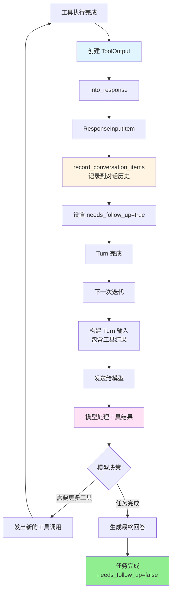

**核心代码**（stream_events_utils.rs:43-149）：

```rust
pub(crate) async fn handle_output_item_done(
    ctx: &mut HandleOutputCtx,
    item: ResponseItem,
    previously_active_item: Option<TurnItem>,
) -> Result<OutputItemResult> {
    let mut output = OutputItemResult::default();

    match ToolRouter::build_tool_call(ctx.sess.as_ref(), item.clone()).await {
        // 情况1: 模型发出工具调用
        Ok(Some(call)) => {
            let payload_preview = call.payload.log_payload().into_owned();
            tracing::info!("ToolCall: {} {}", call.tool_name, payload_preview);

            // 立即记录工具调用到历史
            ctx.sess
                .record_conversation_items(&ctx.turn_context, std::slice::from_ref(&item))
                .await;

            // 创建异步执行 Future
            let cancellation_token = ctx.cancellation_token.child_token();
            let tool_future: InFlightFuture<'static> = Box::pin(
                ctx.tool_runtime
                    .clone()
                    .handle_tool_call(call, cancellation_token),
            );

            // 设置需要后续迭代
            output.needs_follow_up = true;
            output.tool_future = Some(tool_future);
        }

        // 情况2: 非工具调用（普通消息）
        Ok(None) => {
            if let Some(turn_item) = handle_non_tool_response_item(&item).await {
                if previously_active_item.is_none() {
                    ctx.sess.emit_turn_item_started(&ctx.turn_context, &turn_item).await;
                }
                ctx.sess.emit_turn_item_completed(&ctx.turn_context, turn_item).await;
            }

            // 记录到历史
            ctx.sess
                .record_conversation_items(&ctx.turn_context, std::slice::from_ref(&item))
                .await;

            let last_agent_message = last_assistant_message_from_item(&item);
            output.last_agent_message = last_agent_message;

            // needs_follow_up 默认为 false
        }

        // 情况3: 错误（需要反馈给模型）
        Err(FunctionCallError::RespondToModel(message)) => {
            let response = ResponseInputItem::FunctionCallOutput {
                call_id: "error".to_string(),
                output: FunctionCallOutputPayload {
                    content: message,
                    success: Some(false),
                    content_items: None,
                },
            };

            // 记录错误响应
            ctx.sess
                .record_conversation_items(&ctx.turn_context, &[response.into()])
                .await;

            // 需要继续迭代，让模型看到错误
            output.needs_follow_up = true;
        }

        Err(FunctionCallError::Fatal(msg)) => {
            return Err(CodexErr::Fatal(msg).into());
        }

        Err(e) => {
            return Err(e.into());
        }
    }

    Ok(output)
}
```

---

## 5. 成功判断与重试机制

### 5.1 成功判断标准

#### 5.1.1 工具级别的成功判断

**位置**: `venders/codex/codex-rs/core/src/tools/context.rs:80-85`

```rust
impl ToolOutput {
    pub fn success_for_logging(&self) -> bool {
        match self {
            // 函数工具：根据 success 字段判断（默认 true）
            ToolOutput::Function { success, .. } => success.unwrap_or(true),

            // MCP 工具：根据 Result 判断
            ToolOutput::Mcp { result } => result.is_ok(),
        }
    }
}
```

#### 5.1.2 Shell 工具的成功判断

**位置**: `venders/codex/codex-rs/core/src/tools/events.rs:279-318`

```rust
let (event, result) = match out {
    Ok(output) => {
        let content = self.format_exec_output_for_model(&output, ctx);
        let exit_code = output.exit_code;
        let event = ToolEventStage::Success(output);

        // 退出码决定成功与否
        let result = if exit_code == 0 {
            Ok(content)  // 成功
        } else {
            // 非零退出码：反馈给模型（让模型决定如何处理）
            Err(FunctionCallError::RespondToModel(content))
        };

        (event, result)
    }
    Err(e) => {
        let event = ToolEventStage::Error(e.clone());
        let result = Err(e.into());
        (event, result)
    }
};
```

**关键点**：
- 退出码 0 = 成功
- 退出码 非0 = 失败，但仍然将输出反馈给模型
- 模型可以根据错误信息调整策略或重试

#### 5.1.3 MCP 工具的成功判断

MCP 工具的成功由 MCP 服务器决定：

```rust
ToolOutput::Mcp {
    result: Ok(CallToolResult { content, isError }) => {
        // isError=false 表示成功
        // isError=true 表示逻辑错误（但调用成功）
    }
    result: Err(error_message) => {
        // 调用失败
    }
}
```

### 5.2 重试机制

#### 5.2.1 沙箱失败升级重试

**位置**: `venders/codex/codex-rs/core/src/tools/orchestrator.rs:110-160`

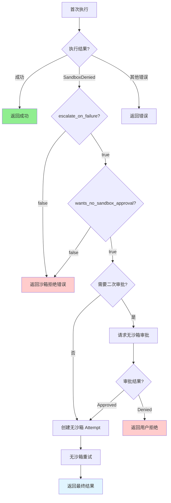

**升级条件判断**：

```rust
impl ToolRuntime for ShellRuntime {
    // 是否允许失败后升级
    fn escalate_on_failure(&self) -> bool {
        true  // Shell 工具允许升级
    }

    // 是否需要无沙箱审批
    fn wants_no_sandbox_approval(&self, policy: AskForApproval) -> bool {
        !matches!(policy, AskForApproval::Never | AskForApproval::OnFailure)
    }

    // 是否跳过审批
    fn should_bypass_approval(&self, policy: AskForApproval, already_approved: bool) -> bool {
        // OnFailure 策略：如果已经审批过，跳过二次审批
        matches!(policy, AskForApproval::OnFailure) && already_approved
    }
}
```

#### 5.2.2 流错误重试

**位置**: `venders/codex/codex-rs/core/src/codex.rs:2404-2468`

当与模型的流连接中断时，Codex 会自动重试：

```rust
async fn run_turn(/* ... */) -> CodexResult<TurnRunResult> {
    let mut retries = 0;

    loop {
        match try_run_turn(/* ... */).await {
            Ok(output) => return Ok(output),

            // 不可重试的错误
            Err(CodexErr::TurnAborted) => return Err(CodexErr::TurnAborted),
            Err(CodexErr::Interrupted) => return Err(CodexErr::Interrupted),
            Err(e @ CodexErr::Fatal(_)) => return Err(e),

            // 可重试的流错误
            Err(e) => {
                let max_retries = turn_context.client.get_provider().stream_max_retries();

                if retries < max_retries {
                    retries += 1;
                    let delay = backoff(retries);  // 指数退避

                    warn!("stream disconnected - retrying ({retries}/{max_retries} in {delay:?})...");

                    // 通知用户正在重试
                    sess.notify_stream_error(
                        &turn_context,
                        format!("Reconnecting... {retries}/{max_retries}"),
                        e,
                    ).await;

                    tokio::time::sleep(delay).await;
                } else {
                    return Err(e);
                }
            }
        }
    }
}
```

**退避策略**：

```rust
fn backoff(retry_count: usize) -> Duration {
    let base = Duration::from_secs(1);
    let multiplier = 2u64.pow(retry_count as u32);
    base * multiplier.min(32)  // 最大 32 秒
}
```

#### 5.2.3 模型级别的重试

模型本身也可以重试失败的工具调用：

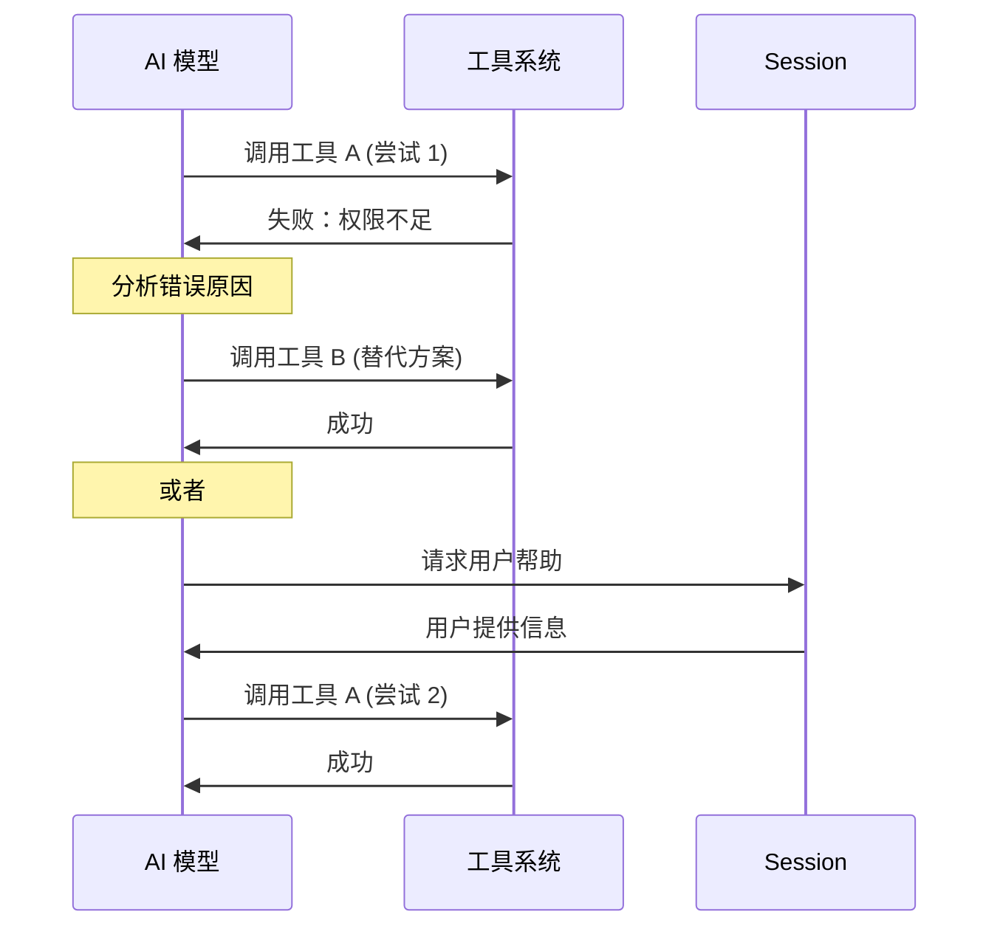

这种重试由模型自主决定，Codex 只需要：
1. 将工具执行结果（成功或失败）反馈给模型
2. 设置 `needs_follow_up=true` 让模型继续处理

### 5.3 错误传播策略

**位置**: `venders/codex/codex-rs/core/src/function_tool.rs`

```rust
pub enum FunctionCallError {
    // 致命错误：中止整个任务
    Fatal(String),

    // 需要反馈给模型：让模型处理错误
    RespondToModel(String),

    // 缺少必需字段
    MissingLocalShellCallId,
}

impl From<CodexErr> for FunctionCallError {
    fn from(err: CodexErr) -> Self {
        match err {
            // 这些错误反馈给模型
            CodexErr::Sandbox(SandboxErr::Denied { output }) => {
                FunctionCallError::RespondToModel(output.unwrap_or_else(|| "Sandbox denied".to_string()))
            }

            // 其他错误视为致命
            e => FunctionCallError::Fatal(e.to_string()),
        }
    }
}
```

**错误处理策略**：

| 错误类型 | 处理方式 | 说明 |
|---------|---------|------|
| `Fatal` | 中止任务 | 系统级错误，无法恢复 |
| `RespondToModel` | 反馈给模型 | 逻辑错误，模型可能调整策略 |
| `SandboxDenied` | 升级重试 | 沙箱拒绝，尝试无沙箱执行 |
| `StreamError` | 重连重试 | 网络错误，重新建立连接 |

---

## 6. 完整工具调用流程

### 6.1 端到端流程图

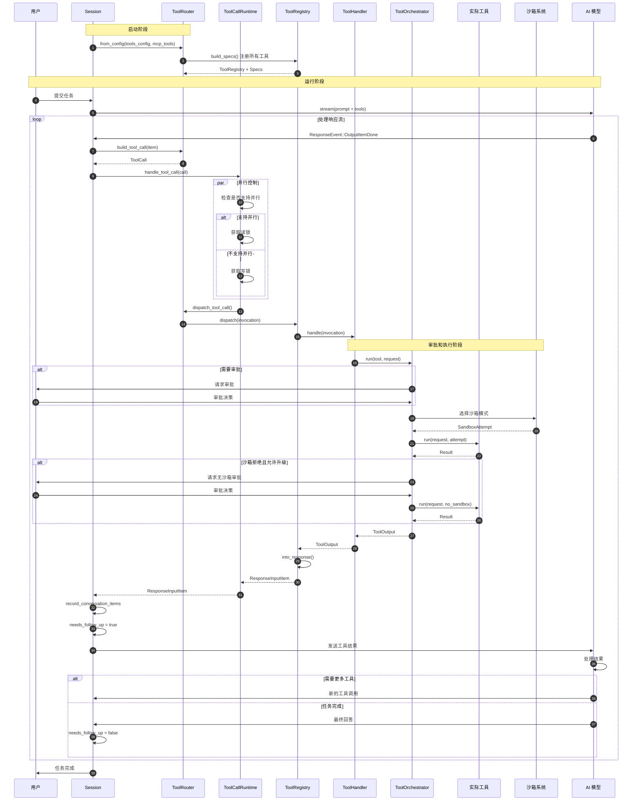

### 6.2 具体示例：执行 Shell 命令

假设用户要求："列出当前目录的文件"

**步骤 1-3：模型选择工具**

```
用户: "列出当前目录的文件"
     ↓
模型分析: 需要列出文件 → 使用 shell 工具
     ↓
模型生成: FunctionCall {
  name: "shell",
  arguments: '{"command": ["ls", "-la"]}',
  call_id: "call_abc123"
}
```

**步骤 4-7：构建工具调用**

```rust
// build_tool_call
ResponseItem::FunctionCall {
    name: "shell",
    arguments: '{"command": ["ls", "-la"]}',
    call_id: "call_abc123"
}
  ↓
ToolCall {
    tool_name: "shell",
    call_id: "call_abc123",
    payload: ToolPayload::Function {
        arguments: '{"command": ["ls", "-la"]}'
    }
}
```

**步骤 8-11：并行控制**

```rust
// handle_tool_call
supports_parallel = false  // Shell 工具不支持并行
  ↓
获取写锁（独占执行）
```

**步骤 12-15：分发到处理器**

```rust
// Registry::dispatch
tool_name = "shell"
  ↓
handler = ShellHandler
  ↓
handler.handle(invocation)
```

**步骤 16-22：审批和沙箱选择**

```rust
// ToolOrchestrator::run

// 1. 审批
approval_requirement = NeedsApproval { reason: None }
  ↓
请求用户审批
  ↓
用户批准

// 2. 沙箱选择
initial_sandbox = SandboxType::Bubblewrap
  ↓
SandboxAttempt {
    sandbox: Bubblewrap,
    policy: LocalSandbox { level: Write },
    ...
}
```

**步骤 23-26：执行工具**

```rust
// ShellRuntime::run

// 1. 构建命令
CommandSpec {
    command: ["ls", "-la"],
    cwd: "/current/directory",
    env: { ... },
    ...
}

// 2. 应用沙箱转换
bubblewrap_command = [
    "bwrap",
    "--ro-bind", "/usr", "/usr",
    "--bind", "/current/directory", "/current/directory",
    "--",
    "ls", "-la"
]

// 3. 执行
execute_env(bubblewrap_command)
  ↓
ExecToolCallOutput {
    stdout: "total 48\ndrwxr-xr-x  5 user ...",
    stderr: "",
    exit_code: 0,
    duration_ms: 42
}
```

**步骤 27-30：处理结果**

```rust
// ShellHandler::format_exec_output_for_model

ToolOutput::Function {
    content: "total 48\ndrwxr-xr-x  5 user ...\n\nExit code: 0\nExecution time: 42ms",
    content_items: None,
    success: Some(true)  // exit_code == 0
}
  ↓
ResponseInputItem::FunctionCallOutput {
    call_id: "call_abc123",
    output: FunctionCallOutputPayload {
        content: "total 48\n...",
        success: Some(true),
        ...
    }
}
```

**步骤 31-35：记录和反馈**

```rust
// Session::record_conversation_items
history.push(ResponseItem::FunctionCallOutput { ... })
  ↓
needs_follow_up = true
  ↓
下一次迭代：
  turn_input = [
    UserMessage("列出当前目录的文件"),
    FunctionCall("shell", ...),
    FunctionCallOutput("total 48\n...", success=true)
  ]
  ↓
发送给模型
```

**步骤 36-37：模型生成最终回答**

```
模型分析工具结果:
  - 命令成功执行
  - 得到文件列表
  ↓
模型生成回答:
  "当前目录包含以下文件：
   - file1.txt
   - file2.py
   - directory/
   ..."
  ↓
needs_follow_up = false
  ↓
任务完成
```

---

## 7. 关键设计模式

### 7.1 策略模式（Strategy Pattern）

**审批策略**：

```rust
enum AskForApproval {
    Never,
    OnFailure,
    OnRequest,
    UnlessTrusted,
}

// 不同策略有不同的行为
fn default_exec_approval_requirement(policy: AskForApproval, ...) -> ExecApprovalRequirement {
    match policy {
        AskForApproval::Never => Skip,
        AskForApproval::OnFailure => Skip,
        AskForApproval::OnRequest => 根据沙箱策略决定,
        AskForApproval::UnlessTrusted => NeedsApproval,
    }
}
```

### 7.2 责任链模式（Chain of Responsibility）

**工具执行链**：

```
ToolRouter → ToolRegistry → ToolHandler → ToolOrchestrator → ToolRuntime
```

每一层负责不同的职责：
- **ToolRouter**: 解析和路由
- **ToolRegistry**: 查找处理器
- **ToolHandler**: 工具特定逻辑
- **ToolOrchestrator**: 审批和沙箱
- **ToolRuntime**: 实际执行

### 7.3 模板方法模式（Template Method）

**ToolOrchestrator::run**：

```rust
pub async fn run<Rq, Out, T>(/* ... */) -> Result<Out, ToolError>
where
    T: ToolRuntime<Rq, Out>
{
    // 1. 审批（模板方法）
    let requirement = tool.exec_approval_requirement(req);  // 钩子方法

    // 2. 选择沙箱（模板方法）
    let sandbox = tool.sandbox_mode_for_first_attempt(req);  // 钩子方法

    // 3. 执行（模板方法）
    let result = tool.run(req, attempt);  // 钩子方法

    // 4. 失败升级（模板方法）
    if result.is_sandbox_denied() && tool.escalate_on_failure() {  // 钩子方法
        // ...
    }
}
```

### 7.4 适配器模式（Adapter Pattern）

**MCP 工具适配**：

```rust
// MCP 工具 → OpenAI 工具格式
fn mcp_tool_to_openai_tool(
    name: String,
    tool: mcp_types::Tool,
) -> Result<ResponsesApiTool, String> {
    let sanitized_schema = sanitize_json_schema(tool.input_schema)?;

    Ok(ResponsesApiTool {
        name,
        description: tool.description,
        input_schema: sanitized_schema,
        ...
    })
}
```

### 7.5 观察者模式（Observer Pattern）

**遥测和事件**：

```rust
// 工具执行时发送事件
otel.log_tool_result(tool_name, call_id, || async {
    // 执行工具
    let result = handler.handle(invocation).await;
    // 返回预览和成功状态
    Ok((result.log_preview(), result.success_for_logging()))
})

// 发送 TUI 事件
sess.send_event(&turn_context, EventMsg::ToolCallStarted { ... })
sess.send_event(&turn_context, EventMsg::ToolCallCompleted { ... })
```

---

## 8. 安全机制

### 8.1 多层防护

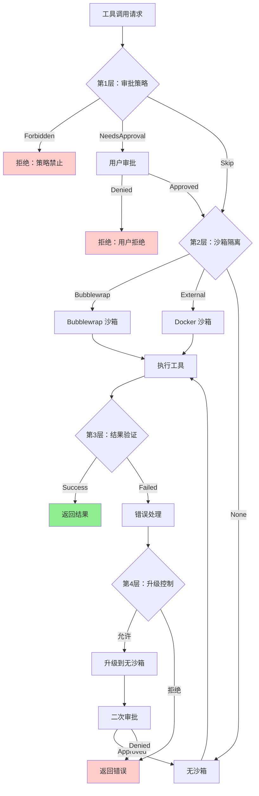

### 8.2 审批缓存

避免重复审批相同的操作：

```rust
// 使用序列化后的命令作为缓存键
let cache_key = serde_json::to_string(&command)?;

let decision = with_cached_approval(services, cache_key, || async {
    session.request_command_approval(/* ... */).await
}).await;

// ApprovedForSession 决策会被缓存
// 下次执行相同命令时直接使用缓存的决策
```

### 8.3 沙箱隔离

**Bubblewrap 沙箱特性**：

- 只读绑定系统目录 (`/usr`, `/lib`, `/bin`)
- 读写绑定工作目录
- 隔离网络（可选）
- 限制设备访问
- 禁止特权操作

**示例配置**：

```rust
bwrap_args = [
    "--ro-bind", "/usr", "/usr",
    "--ro-bind", "/lib", "/lib",
    "--bind", "/workspace", "/workspace",
    "--dev", "/dev",
    "--proc", "/proc",
    "--unshare-net",  // 隔离网络
    "--die-with-parent",
    "--",
    "command", "args"
]
```

### 8.4 执行策略（ExecPolicy）

**位置**: `venders/codex/codex-rs/core/src/exec_policy.rs`

ExecPolicy 允许用户定义命令执行规则：

```rust
pub struct ExecPolicy {
    rules: Vec<PolicyRule>,
}

pub struct PolicyRule {
    pattern: CommandPattern,  // 命令模式
    decision: Decision,       // 决策
}

pub enum Decision {
    Allow,      // 允许（无需审批）
    Prompt,     // 提示用户
    Forbidden,  // 禁止
}
```

**示例规则**：

```json
{
  "rules": [
    {
      "pattern": "ls *",
      "decision": "Allow"
    },
    {
      "pattern": "rm -rf *",
      "decision": "Forbidden"
    },
    {
      "pattern": "git push *",
      "decision": "Prompt"
    }
  ]
}
```

---

## 9. 总结

Codex 的工具调用机制是一个精心设计的多层架构，提供了：

### 9.1 核心特性

1. **灵活的工具注册** ✅
   - 内置工具
   - MCP 工具（动态加载）
   - 自定义工具

2. **智能路由** ✅
   - 自动识别工具类型
   - 并行执行支持
   - MCP 工具名称解析

3. **多层安全防护** ✅
   - 审批策略
   - 沙箱隔离
   - 执行策略
   - 升级控制

4. **完善的错误处理** ✅
   - 失败升级重试
   - 流错误重试
   - 模型驱动重试

5. **全面的可观测性** ✅
   - 遥测记录
   - 事件流
   - 性能追踪

### 9.2 关键文件清单

| 组件 | 文件路径 | 主要功能 |
|------|---------|---------|
| **工具规格** | `tools/spec.rs` | 工具定义和注册 |
| **工具路由** | `tools/router.rs` | 工具调用解析和分发 |
| **工具注册表** | `tools/registry.rs` | 处理器管理 |
| **并行控制** | `tools/parallel.rs` | 并行执行管理 |
| **工具编排** | `tools/orchestrator.rs` | 审批和沙箱编排 |
| **沙箱管理** | `tools/sandboxing.rs` | 沙箱策略和审批 |
| **工具上下文** | `tools/context.rs` | 工具调用上下文 |
| **Shell 处理器** | `tools/handlers/shell.rs` | Shell 工具实现 |
| **MCP 处理器** | `tools/handlers/mcp.rs` | MCP 工具实现 |
| **执行策略** | `exec_policy.rs` | 命令执行策略 |

### 9.3 设计亮点

1. **分层架构**：清晰的职责分离
2. **策略模式**：灵活的策略配置
3. **审批缓存**：避免重复审批
4. **沙箱升级**：平衡安全和可用性
5. **并行控制**：读写锁机制
6. **错误传播**：智能的错误处理
7. **MCP 集成**：无缝的外部工具支持

这种设计使得 Codex 能够安全、高效地执行各种工具调用，同时保持良好的扩展性和可维护性。
