# Open Notebook 架构分析文档

## 1. 项目概述

**Open Notebook** 是一个开源的、隐私优先的研究助手平台，作为 Google Notebook LM 的替代方案。项目采用现代分层架构设计，具有清晰的关注点分离。

### 1.1 项目信息

| 属性 | 值 |
|------|------|
| 版本 | 1.2.4 |
| Python 版本 | >= 3.11, < 3.13 |
| 许可证 | MIT |
| 技术栈 | FastAPI + Next.js + SurrealDB + LangChain/LangGraph |

### 1.2 核心设计原则

根据项目 `DESIGN_PRINCIPLES.md`，Open Notebook 遵循以下核心原则：

1. **隐私优先** - 用户数据和研究应默认保持在用户控制之下
2. **简单胜于功能** - 工具应易于理解和使用
3. **API-First 架构** - 所有功能都应通过 API 访问
4. **多提供商灵活性** - 用户不应被锁定在单一 AI 提供商
5. **通过标准实现可扩展性** - 通过定义良好的接口进行扩展
6. **异步优先** - 长时间运行的操作不应阻塞用户界面

---

## 2. 系统架构总览

### 2.1 高层架构图

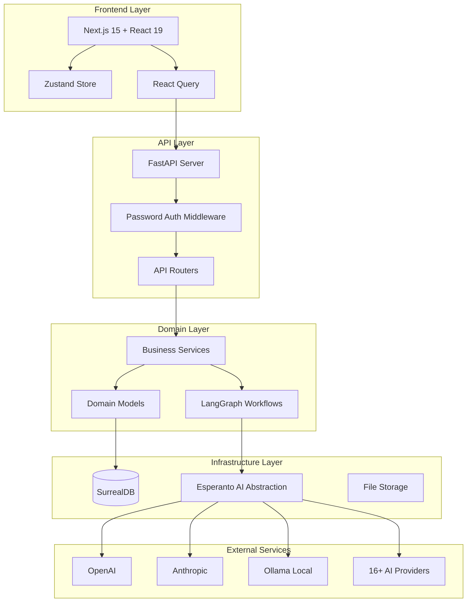
```mermaid
graph TB
    subgraph "Frontend Layer"
        UI[Next.js 15 + React 19]
        Zustand[Zustand Store]
        RQ[React Query]
    end

    subgraph "API Layer"
        FastAPI[FastAPI Server]
        Auth[Password Auth Middleware]
        Routers[API Routers]
    end

    subgraph "Domain Layer"
        Domain[Domain Models]
        Services[Business Services]
        Graphs[LangGraph Workflows]
    end

    subgraph "Infrastructure Layer"
        SurrealDB[(SurrealDB)]
        Esperanto[Esperanto AI Abstraction]
        FileStore[File Storage]
    end

    subgraph "External Services"
        OpenAI[OpenAI]
        Anthropic[Anthropic]
        Ollama[Ollama Local]
        Others[16+ AI Providers]
    end

    UI --> Zustand
    UI --> RQ
    RQ --> FastAPI
    FastAPI --> Auth
    Auth --> Routers
    Routers --> Services
    Services --> Domain
    Services --> Graphs
    Domain --> SurrealDB
    Graphs --> Esperanto
    Esperanto --> OpenAI
    Esperanto --> Anthropic
    Esperanto --> Ollama
    Esperanto --> Others
```

### 2.2 目录结构

```
open-notebook/
├── api/                          # FastAPI 后端 API 层
│   ├── main.py                   # 应用入口和路由注册
│   ├── auth.py                   # 认证中间件
│   ├── models.py                 # Pydantic API 模型
│   ├── routers/                  # API 路由模块
│   └── *_service.py              # 业务逻辑服务
├── open_notebook/                # 核心领域业务逻辑层
│   ├── domain/                   # 领域模型 (DDD)
│   ├── database/                 # 数据库访问层
│   ├── graphs/                   # LangGraph AI 工作流
│   ├── plugins/                  # 插件系统
│   └── utils/                    # 通用工具
├── frontend/                     # React/Next.js 前端
│   └── src/
│       ├── app/                  # Next.js App Router
│       ├── components/           # React 组件
│       └── lib/                  # 工具库和 API 客户端
├── migrations/                   # SurrealDB 迁移文件
├── prompts/                      # AI 提示模板 (Jinja2)
├── commands/                     # 后台命令处理
└── docker-compose.*.yml          # Docker 编排配置
```

---

## 3. 分层架构详解

### 3.1 架构层次图

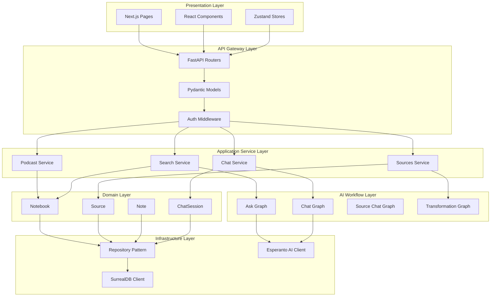
```mermaid
graph TD
    subgraph "Presentation Layer"
        A1[Next.js Pages]
        A2[React Components]
        A3[Zustand Stores]
    end

    subgraph "API Gateway Layer"
        B1[FastAPI Routers]
        B2[Pydantic Models]
        B3[Auth Middleware]
    end

    subgraph "Application Service Layer"
        C1[Chat Service]
        C2[Sources Service]
        C3[Podcast Service]
        C4[Search Service]
    end

    subgraph "Domain Layer"
        D1[Notebook]
        D2[Source]
        D3[Note]
        D4[ChatSession]
    end

    subgraph "AI Workflow Layer"
        E1[Ask Graph]
        E2[Chat Graph]
        E3[Source Chat Graph]
        E4[Transformation Graph]
    end

    subgraph "Infrastructure Layer"
        F1[Repository Pattern]
        F2[SurrealDB Client]
        F3[Esperanto AI Client]
    end

    A1 --> B1
    A2 --> B1
    A3 --> B1
    B1 --> B2
    B2 --> B3
    B3 --> C1
    B3 --> C2
    B3 --> C3
    B3 --> C4
    C1 --> D4
    C2 --> D2
    C3 --> D1
    C4 --> D1
    C1 --> E2
    C2 --> E4
    C4 --> E1
    D1 --> F1
    D2 --> F1
    D3 --> F1
    D4 --> F1
    E1 --> F3
    E2 --> F3
    F1 --> F2
```

---

## 4. 前端架构 (Frontend)

### 4.1 技术栈

| 技术 | 版本 | 用途 |
|------|------|------|
| Next.js | 15.4.10 | React 框架 (App Router) |
| React | 19.1.0 | UI 框架 |
| TypeScript | 5 | 类型系统 |
| TailwindCSS | 4 | 样式框架 |
| Zustand | 5.0.6 | 状态管理 |
| React Query | 5.83.0 | 数据获取和缓存 |
| Radix UI | - | 无障碍 UI 组件库 |

### 4.2 前端架构图

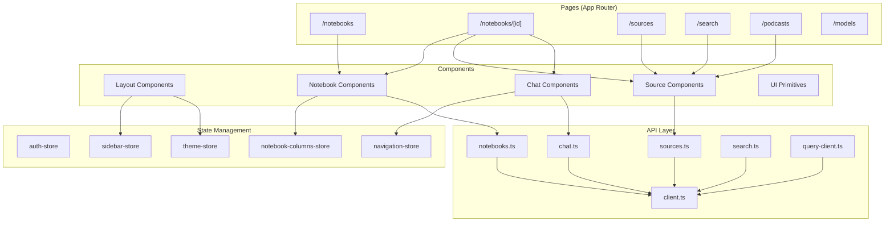
```mermaid
graph TB
    subgraph "Pages (App Router)"
        P1["/notebooks"]
        P2["/notebooks/[id]"]
        P3["/sources"]
        P4["/search"]
        P5["/podcasts"]
        P6["/models"]
    end

    subgraph "Components"
        C1[Layout Components]
        C2[Notebook Components]
        C3[Source Components]
        C4[Chat Components]
        C5[UI Primitives]
    end

    subgraph "State Management"
        S1[auth-store]
        S2[navigation-store]
        S3[notebook-columns-store]
        S4[sidebar-store]
        S5[theme-store]
    end

    subgraph "API Layer"
        A1[client.ts]
        A2[notebooks.ts]
        A3[sources.ts]
        A4[chat.ts]
        A5[search.ts]
        A6[query-client.ts]
    end

    P1 --> C2
    P2 --> C2
    P2 --> C3
    P2 --> C4
    P3 --> C3
    P4 --> C3
    P5 --> C3

    C2 --> S3
    C4 --> S2
    C1 --> S4
    C1 --> S5

    C2 --> A2
    C3 --> A3
    C4 --> A4

    A2 --> A1
    A3 --> A1
    A4 --> A1
    A5 --> A1
    A6 --> A1
```

### 4.3 状态管理设计

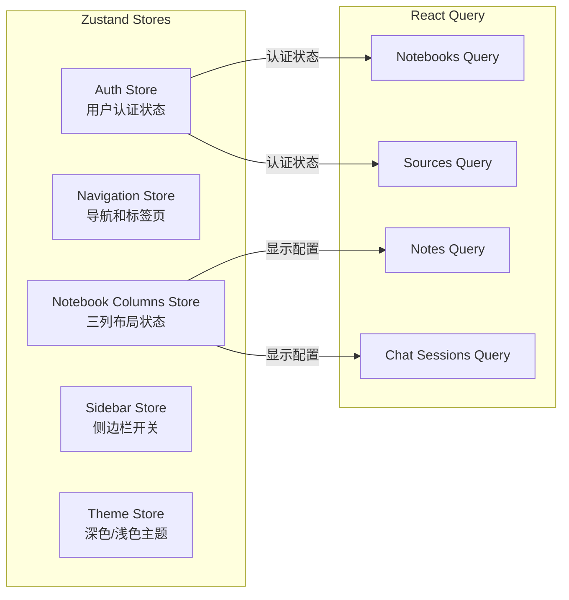
```mermaid
graph LR
    subgraph "Zustand Stores"
        AS[Auth Store<br/>用户认证状态]
        NS[Navigation Store<br/>导航和标签页]
        NCS[Notebook Columns Store<br/>三列布局状态]
        SS[Sidebar Store<br/>侧边栏开关]
        TS[Theme Store<br/>深色/浅色主题]
    end

    subgraph "React Query"
        RQ1[Notebooks Query]
        RQ2[Sources Query]
        RQ3[Notes Query]
        RQ4[Chat Sessions Query]
    end

    AS --> |认证状态| RQ1
    AS --> |认证状态| RQ2
    NCS --> |显示配置| RQ3
    NCS --> |显示配置| RQ4
```

### 4.4 核心页面：笔记本详情页三列布局

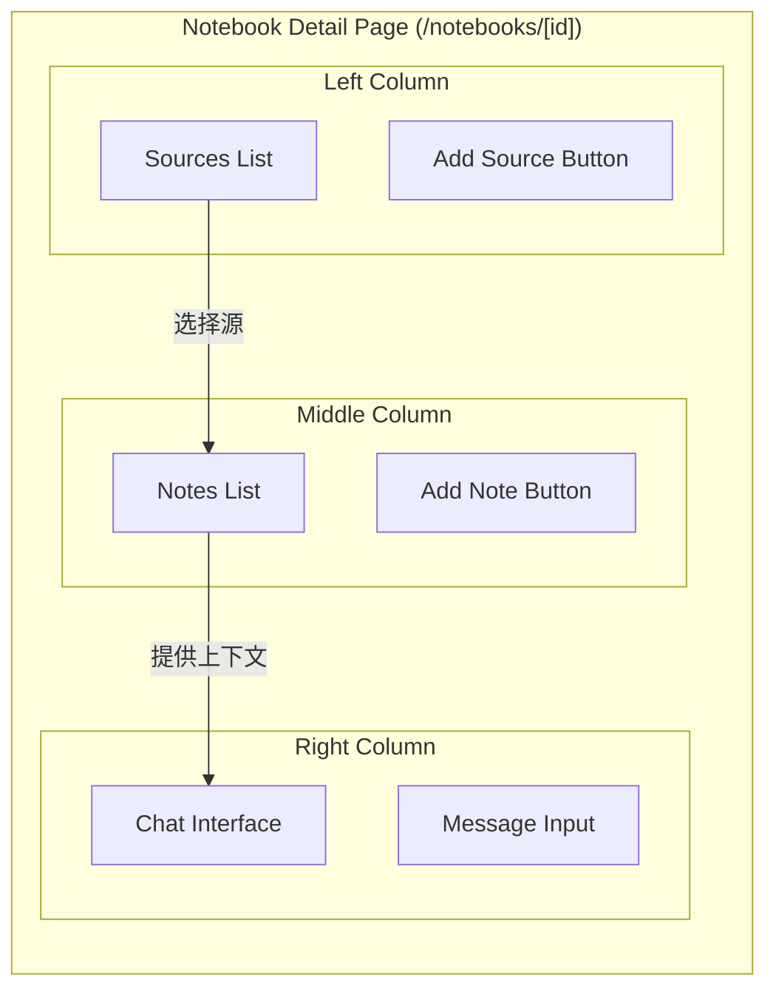
```mermaid
graph LR
    subgraph "Notebook Detail Page (/notebooks/[id])"
        direction TB
        subgraph "Left Column"
            L1[Sources List]
            L2[Add Source Button]
        end
        subgraph "Middle Column"
            M1[Notes List]
            M2[Add Note Button]
        end
        subgraph "Right Column"
            R1[Chat Interface]
            R2[Message Input]
        end
    end

    L1 --> |选择源| M1
    M1 --> |提供上下文| R1
```

---

## 5. 后端 API 架构

### 5.1 FastAPI 应用结构

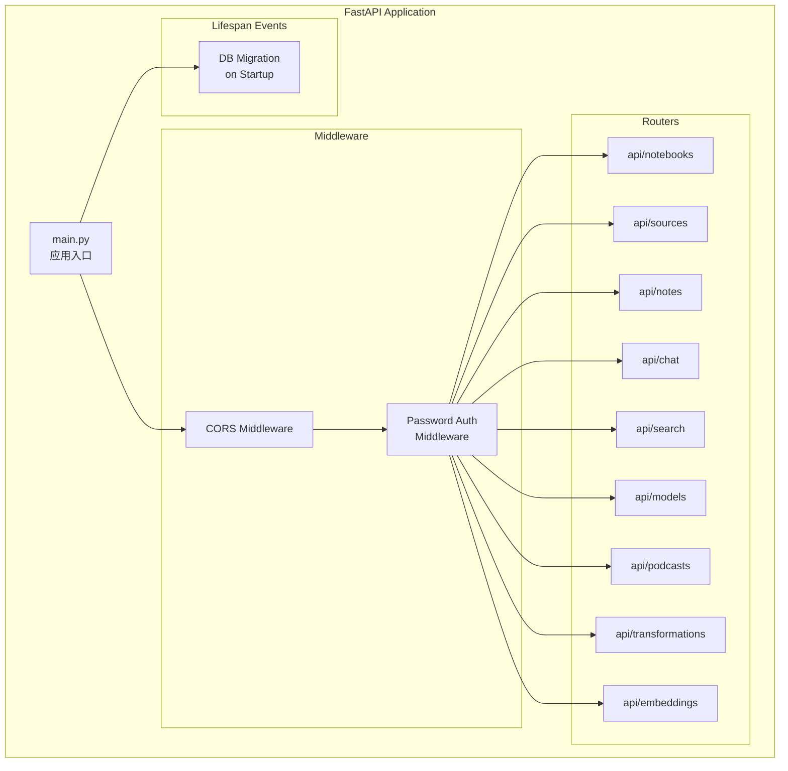
```mermaid
graph TB
    subgraph "FastAPI Application"
        Main[main.py<br/>应用入口]

        subgraph "Middleware"
            CORS[CORS Middleware]
            Auth[Password Auth<br/>Middleware]
        end

        subgraph "Routers"
            R1[api/notebooks]
            R2[api/sources]
            R3[api/notes]
            R4[api/chat]
            R5[api/search]
            R6[api/models]
            R7[api/podcasts]
            R8[api/transformations]
            R9[api/embeddings]
        end

        subgraph "Lifespan Events"
            Startup[DB Migration<br/>on Startup]
        end
    end

    Main --> CORS
    CORS --> Auth
    Auth --> R1
    Auth --> R2
    Auth --> R3
    Auth --> R4
    Auth --> R5
    Auth --> R6
    Auth --> R7
    Auth --> R8
    Auth --> R9
    Main --> Startup
```

### 5.2 API 路由映射

| 路由前缀 | 功能 | 关键操作 |
|----------|------|----------|
| `/api/notebooks` | 笔记本管理 | CRUD, 获取关联源/笔记 |
| `/api/sources` | 内容源管理 | 上传, 处理, 向量化 |
| `/api/notes` | 笔记管理 | CRUD, 嵌入向量化 |
| `/api/chat` | 聊天会话 | 创建会话, 发送消息 (SSE) |
| `/api/source-chat` | 源对话 | 针对特定源的对话 |
| `/api/search` | 搜索功能 | 文本搜索, 向量搜索 |
| `/api/models` | AI 模型配置 | 模型列表, 设置默认模型 |
| `/api/podcasts` | 播客生成 | 生成音频, 下载 |
| `/api/transformations` | 内容转换 | 自定义转换模板 |
| `/api/embeddings` | 向量化操作 | 批量重建向量 |

### 5.3 请求处理流程

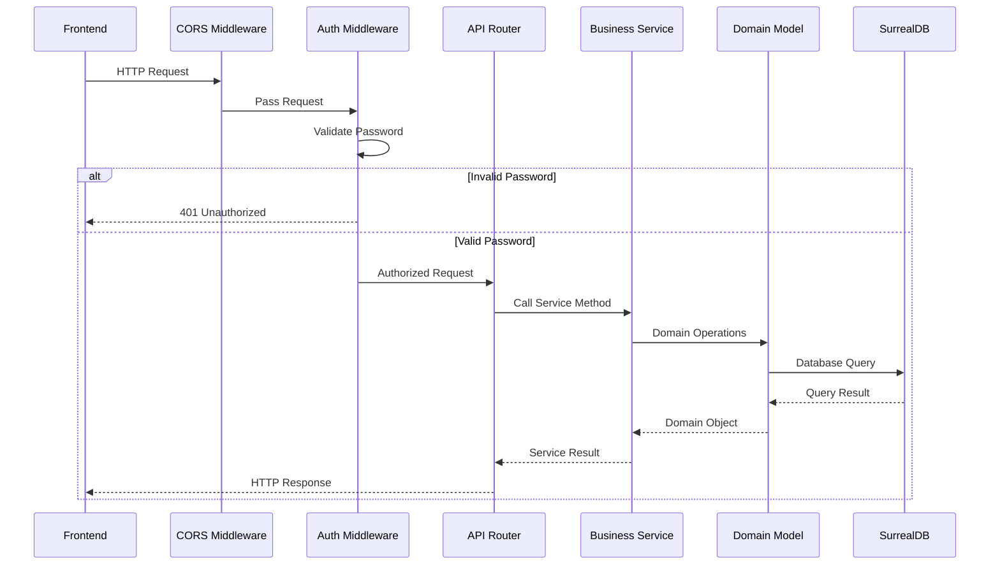
```mermaid
sequenceDiagram
    participant Client as Frontend
    participant CORS as CORS Middleware
    participant Auth as Auth Middleware
    participant Router as API Router
    participant Service as Business Service
    participant Domain as Domain Model
    participant DB as SurrealDB

    Client->>CORS: HTTP Request
    CORS->>Auth: Pass Request
    Auth->>Auth: Validate Password
    alt Invalid Password
        Auth-->>Client: 401 Unauthorized
    else Valid Password
        Auth->>Router: Authorized Request
        Router->>Service: Call Service Method
        Service->>Domain: Domain Operations
        Domain->>DB: Database Query
        DB-->>Domain: Query Result
        Domain-->>Service: Domain Object
        Service-->>Router: Service Result
        Router-->>Client: HTTP Response
    end
```

---

## 6. 领域模型层 (Domain Layer)

### 6.1 核心领域模型

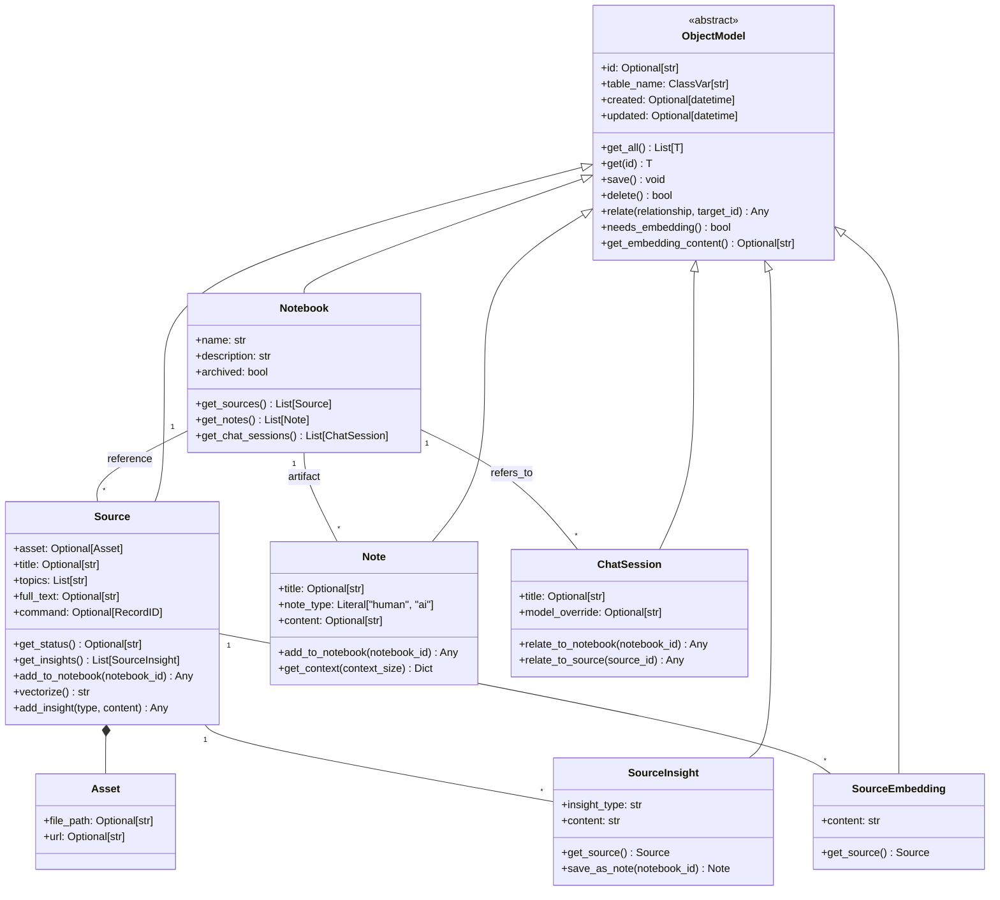
```mermaid
classDiagram
    class ObjectModel {
        <<abstract>>
        +id: Optional[str]
        +table_name: ClassVar[str]
        +created: Optional[datetime]
        +updated: Optional[datetime]
        +get_all() List[T]
        +get(id) T
        +save() void
        +delete() bool
        +relate(relationship, target_id) Any
        +needs_embedding() bool
        +get_embedding_content() Optional[str]
    }

    class Notebook {
        +name: str
        +description: str
        +archived: bool
        +get_sources() List[Source]
        +get_notes() List[Note]
        +get_chat_sessions() List[ChatSession]
    }

    class Source {
        +asset: Optional[Asset]
        +title: Optional[str]
        +topics: List[str]
        +full_text: Optional[str]
        +command: Optional[RecordID]
        +get_status() Optional[str]
        +get_insights() List[SourceInsight]
        +add_to_notebook(notebook_id) Any
        +vectorize() str
        +add_insight(type, content) Any
    }

    class Note {
        +title: Optional[str]
        +note_type: Literal["human", "ai"]
        +content: Optional[str]
        +add_to_notebook(notebook_id) Any
        +get_context(context_size) Dict
    }

    class ChatSession {
        +title: Optional[str]
        +model_override: Optional[str]
        +relate_to_notebook(notebook_id) Any
        +relate_to_source(source_id) Any
    }

    class Asset {
        +file_path: Optional[str]
        +url: Optional[str]
    }

    class SourceInsight {
        +insight_type: str
        +content: str
        +get_source() Source
        +save_as_note(notebook_id) Note
    }

    class SourceEmbedding {
        +content: str
        +get_source() Source
    }

    ObjectModel <|-- Notebook
    ObjectModel <|-- Source
    ObjectModel <|-- Note
    ObjectModel <|-- ChatSession
    ObjectModel <|-- SourceInsight
    ObjectModel <|-- SourceEmbedding
    Source *-- Asset
    Notebook "1" -- "*" Source : reference
    Notebook "1" -- "*" Note : artifact
    Notebook "1" -- "*" ChatSession : refers_to
    Source "1" -- "*" SourceInsight
    Source "1" -- "*" SourceEmbedding
```

### 6.2 实体关系图

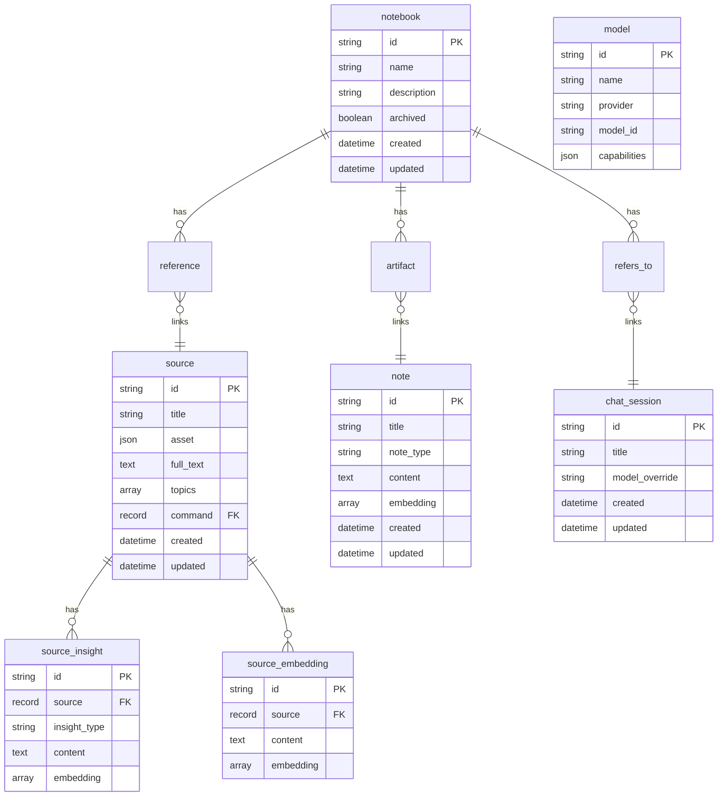
```mermaid
erDiagram
    notebook ||--o{ reference : has
    reference }o--|| source : links

    notebook ||--o{ artifact : has
    artifact }o--|| note : links

    notebook ||--o{ refers_to : has
    refers_to }o--|| chat_session : links

    source ||--o{ source_insight : has
    source ||--o{ source_embedding : has

    source {
        string id PK
        string title
        json asset
        text full_text
        array topics
        record command FK
        datetime created
        datetime updated
    }

    notebook {
        string id PK
        string name
        string description
        boolean archived
        datetime created
        datetime updated
    }

    note {
        string id PK
        string title
        string note_type
        text content
        array embedding
        datetime created
        datetime updated
    }

    chat_session {
        string id PK
        string title
        string model_override
        datetime created
        datetime updated
    }

    source_insight {
        string id PK
        record source FK
        string insight_type
        text content
        array embedding
    }

    source_embedding {
        string id PK
        record source FK
        text content
        array embedding
    }

    model {
        string id PK
        string name
        string provider
        string model_id
        json capabilities
    }
```

---

## 7. 数据库层

### 7.1 Repository 模式

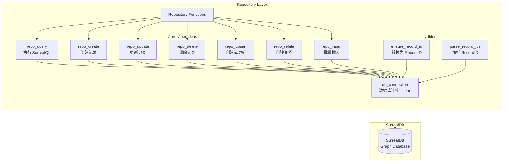
```mermaid
graph TB
    subgraph "Repository Layer"
        RF[Repository Functions]

        subgraph "Core Operations"
            Q[repo_query<br/>执行 SurrealQL]
            C[repo_create<br/>创建记录]
            U[repo_update<br/>更新记录]
            D[repo_delete<br/>删除记录]
            UP[repo_upsert<br/>创建或更新]
            R[repo_relate<br/>创建关系]
            I[repo_insert<br/>批量插入]
        end

        subgraph "Utilities"
            ERI[ensure_record_id<br/>转换为 RecordID]
            PRI[parse_record_ids<br/>解析 RecordID]
            DBC[db_connection<br/>数据库连接上下文]
        end
    end

    subgraph "SurrealDB"
        DB[(SurrealDB<br/>Graph Database)]
    end

    RF --> Q
    RF --> C
    RF --> U
    RF --> D
    RF --> UP
    RF --> R
    RF --> I

    Q --> DBC
    C --> DBC
    U --> DBC
    D --> DBC
    UP --> DBC
    R --> DBC
    I --> DBC

    DBC --> DB
    ERI --> DBC
    PRI --> DBC
```

### 7.2 数据库迁移

项目使用版本化的迁移系统：

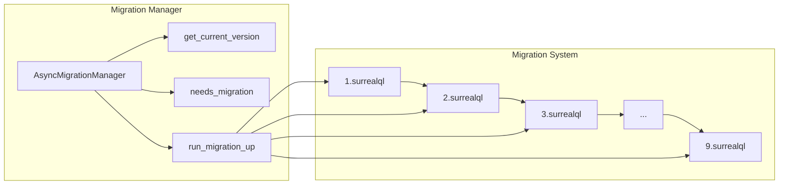
```mermaid
graph LR
    subgraph "Migration System"
        M1[1.surrealql]
        M2[2.surrealql]
        M3[3.surrealql]
        M4[...]
        M9[9.surrealql]
    end

    subgraph "Migration Manager"
        MM[AsyncMigrationManager]
        GV[get_current_version]
        NM[needs_migration]
        RU[run_migration_up]
    end

    M1 --> M2 --> M3 --> M4 --> M9
    MM --> GV
    MM --> NM
    MM --> RU
    RU --> M1
    RU --> M2
    RU --> M3
    RU --> M9
```

---

## 8. AI 工作流层 (LangGraph)

### 8.1 Ask 工作流（智能提问）

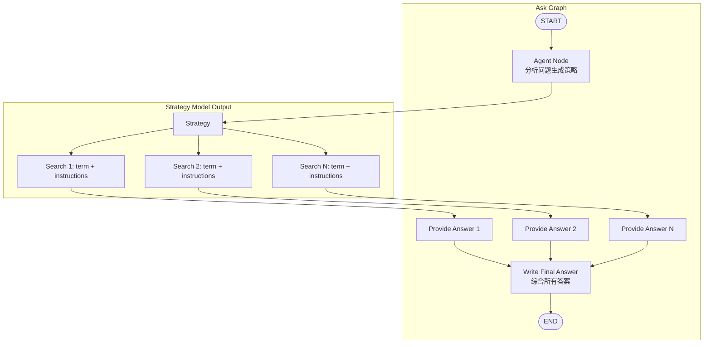
```mermaid
graph TB
    subgraph "Ask Graph"
        Start([START])
        Agent[Agent Node<br/>分析问题生成策略]
        PA1[Provide Answer 1]
        PA2[Provide Answer 2]
        PA3[Provide Answer N]
        Final[Write Final Answer<br/>综合所有答案]
        End([END])
    end

    subgraph "Strategy Model Output"
        ST[Strategy]
        S1[Search 1: term + instructions]
        S2[Search 2: term + instructions]
        SN[Search N: term + instructions]
    end

    Start --> Agent
    Agent --> ST
    ST --> S1
    ST --> S2
    ST --> SN
    S1 --> PA1
    S2 --> PA2
    SN --> PA3
    PA1 --> Final
    PA2 --> Final
    PA3 --> Final
    Final --> End
```

### 8.2 Ask 工作流详细流程

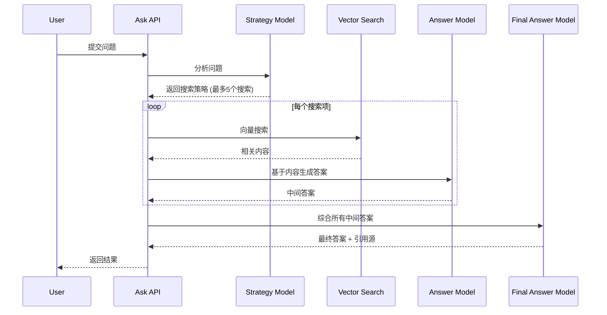
```mermaid
sequenceDiagram
    participant User
    participant API as Ask API
    participant Strategy as Strategy Model
    participant VSearch as Vector Search
    participant Answer as Answer Model
    participant Final as Final Answer Model

    User->>API: 提交问题
    API->>Strategy: 分析问题
    Strategy-->>API: 返回搜索策略 (最多5个搜索)

    loop 每个搜索项
        API->>VSearch: 向量搜索
        VSearch-->>API: 相关内容
        API->>Answer: 基于内容生成答案
        Answer-->>API: 中间答案
    end

    API->>Final: 综合所有中间答案
    Final-->>API: 最终答案 + 引用源
    API-->>User: 返回结果
```

### 8.3 Chat 工作流

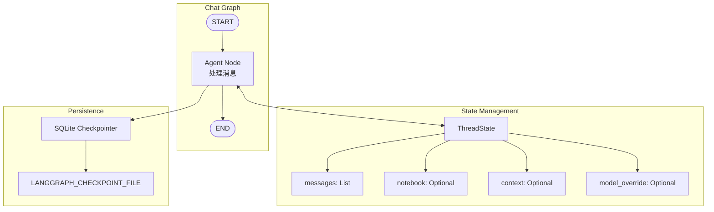
```mermaid
graph TB
    subgraph "Chat Graph"
        Start([START])
        Agent[Agent Node<br/>处理消息]
        End([END])
    end

    subgraph "State Management"
        TS[ThreadState]
        MSG[messages: List]
        NB[notebook: Optional]
        CTX[context: Optional]
        MO[model_override: Optional]
    end

    subgraph "Persistence"
        CP[SQLite Checkpointer]
        SF[LANGGRAPH_CHECKPOINT_FILE]
    end

    Start --> Agent
    Agent --> End

    TS --> MSG
    TS --> NB
    TS --> CTX
    TS --> MO

    Agent <--> TS
    Agent --> CP
    CP --> SF
```

### 8.4 Chat 消息处理流程

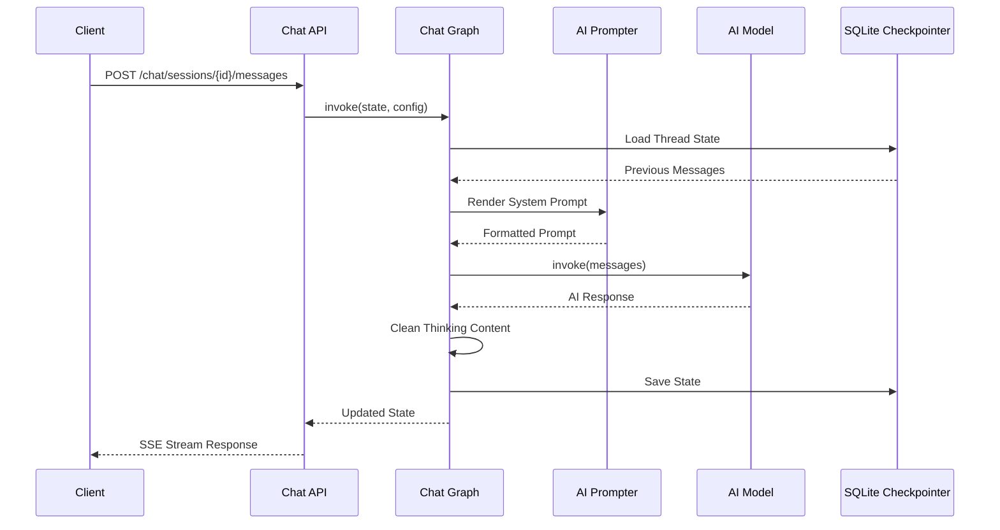
```mermaid
sequenceDiagram
    participant Client
    participant API as Chat API
    participant Graph as Chat Graph
    participant Prompter as AI Prompter
    participant Model as AI Model
    participant CP as SQLite Checkpointer

    Client->>API: POST /chat/sessions/{id}/messages
    API->>Graph: invoke(state, config)
    Graph->>CP: Load Thread State
    CP-->>Graph: Previous Messages
    Graph->>Prompter: Render System Prompt
    Prompter-->>Graph: Formatted Prompt
    Graph->>Model: invoke(messages)
    Model-->>Graph: AI Response
    Graph->>Graph: Clean Thinking Content
    Graph->>CP: Save State
    Graph-->>API: Updated State
    API-->>Client: SSE Stream Response
```

---

## 9. AI 提供商抽象层

### 9.1 Esperanto 多提供商架构

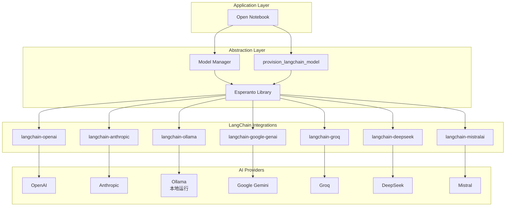
```mermaid
graph TB
    subgraph "Application Layer"
        APP[Open Notebook]
    end

    subgraph "Abstraction Layer"
        ESP[Esperanto Library]
        MM[Model Manager]
        PM[provision_langchain_model]
    end

    subgraph "LangChain Integrations"
        LC_OAI[langchain-openai]
        LC_ANT[langchain-anthropic]
        LC_OLL[langchain-ollama]
        LC_GGL[langchain-google-genai]
        LC_GRQ[langchain-groq]
        LC_DS[langchain-deepseek]
        LC_MST[langchain-mistralai]
    end

    subgraph "AI Providers"
        OAI[OpenAI]
        ANT[Anthropic]
        OLL[Ollama<br/>本地运行]
        GGL[Google Gemini]
        GRQ[Groq]
        DS[DeepSeek]
        MST[Mistral]
    end

    APP --> MM
    MM --> ESP
    APP --> PM
    PM --> ESP

    ESP --> LC_OAI
    ESP --> LC_ANT
    ESP --> LC_OLL
    ESP --> LC_GGL
    ESP --> LC_GRQ
    ESP --> LC_DS
    ESP --> LC_MST

    LC_OAI --> OAI
    LC_ANT --> ANT
    LC_OLL --> OLL
    LC_GGL --> GGL
    LC_GRQ --> GRQ
    LC_DS --> DS
    LC_MST --> MST
```

### 9.2 模型管理器

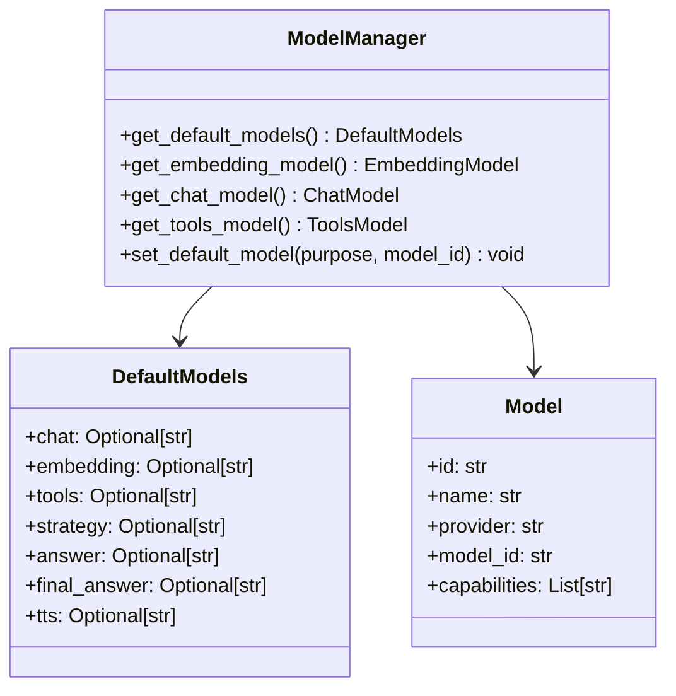
```mermaid
classDiagram
    class ModelManager {
        +get_default_models() DefaultModels
        +get_embedding_model() EmbeddingModel
        +get_chat_model() ChatModel
        +get_tools_model() ToolsModel
        +set_default_model(purpose, model_id) void
    }

    class DefaultModels {
        +chat: Optional[str]
        +embedding: Optional[str]
        +tools: Optional[str]
        +strategy: Optional[str]
        +answer: Optional[str]
        +final_answer: Optional[str]
        +tts: Optional[str]
    }

    class Model {
        +id: str
        +name: str
        +provider: str
        +model_id: str
        +capabilities: List[str]
    }

    ModelManager --> DefaultModels
    ModelManager --> Model
```

---

## 10. 核心数据流

### 10.1 创建笔记本流程

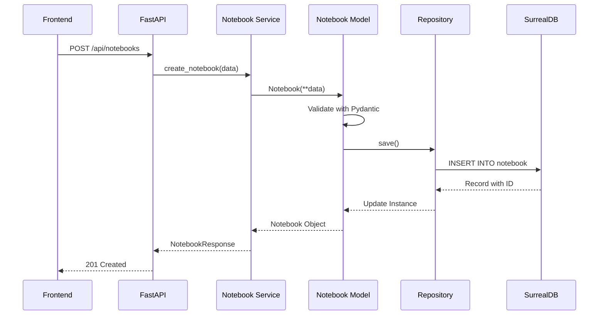
```mermaid
sequenceDiagram
    participant UI as Frontend
    participant API as FastAPI
    participant Service as Notebook Service
    participant Domain as Notebook Model
    participant Repo as Repository
    participant DB as SurrealDB

    UI->>API: POST /api/notebooks
    API->>Service: create_notebook(data)
    Service->>Domain: Notebook(**data)
    Domain->>Domain: Validate with Pydantic
    Domain->>Repo: save()
    Repo->>DB: INSERT INTO notebook
    DB-->>Repo: Record with ID
    Repo-->>Domain: Update Instance
    Domain-->>Service: Notebook Object
    Service-->>API: NotebookResponse
    API-->>UI: 201 Created
```

### 10.2 上传并处理源内容流程

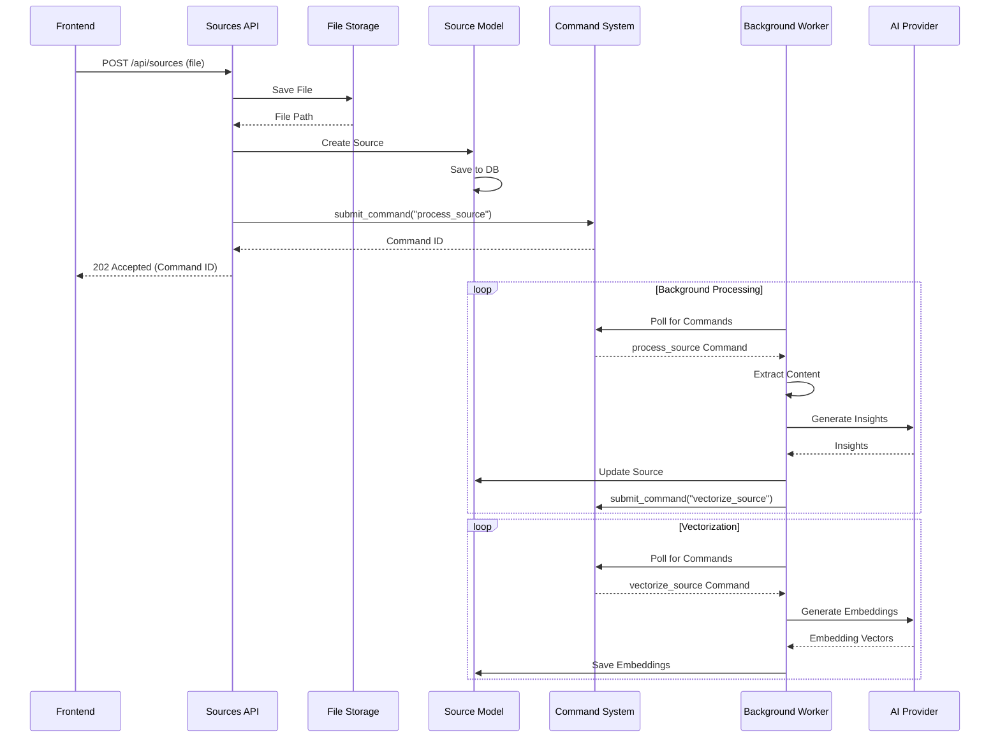
```mermaid
sequenceDiagram
    participant UI as Frontend
    participant API as Sources API
    participant FS as File Storage
    participant Domain as Source Model
    participant CMD as Command System
    participant Worker as Background Worker
    participant AI as AI Provider

    UI->>API: POST /api/sources (file)
    API->>FS: Save File
    FS-->>API: File Path
    API->>Domain: Create Source
    Domain->>Domain: Save to DB
    API->>CMD: submit_command("process_source")
    CMD-->>API: Command ID
    API-->>UI: 202 Accepted (Command ID)

    loop Background Processing
        Worker->>CMD: Poll for Commands
        CMD-->>Worker: process_source Command
        Worker->>Worker: Extract Content
        Worker->>AI: Generate Insights
        AI-->>Worker: Insights
        Worker->>Domain: Update Source
        Worker->>CMD: submit_command("vectorize_source")
    end

    loop Vectorization
        Worker->>CMD: Poll for Commands
        CMD-->>Worker: vectorize_source Command
        Worker->>AI: Generate Embeddings
        AI-->>Worker: Embedding Vectors
        Worker->>Domain: Save Embeddings
    end
```

### 10.3 智能搜索流程

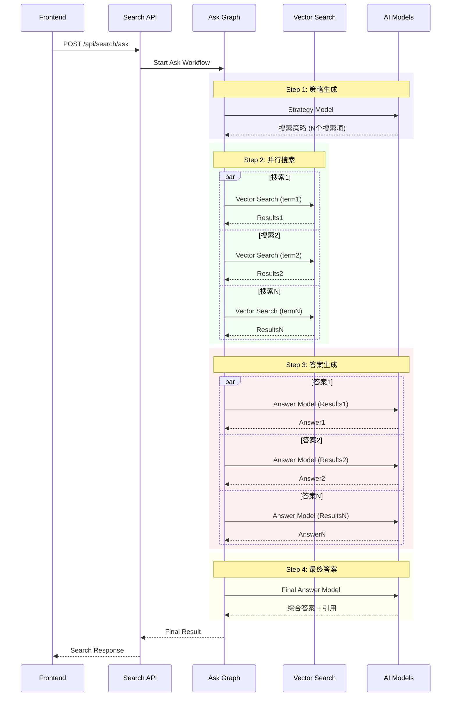
```mermaid
sequenceDiagram
    participant UI as Frontend
    participant API as Search API
    participant Graph as Ask Graph
    participant VS as Vector Search
    participant AI as AI Models

    UI->>API: POST /api/search/ask
    API->>Graph: Start Ask Workflow

    rect rgb(240, 240, 255)
        Note over Graph,AI: Step 1: 策略生成
        Graph->>AI: Strategy Model
        AI-->>Graph: 搜索策略 (N个搜索项)
    end

    rect rgb(240, 255, 240)
        Note over Graph,VS: Step 2: 并行搜索
        par 搜索1
            Graph->>VS: Vector Search (term1)
            VS-->>Graph: Results1
        and 搜索2
            Graph->>VS: Vector Search (term2)
            VS-->>Graph: Results2
        and 搜索N
            Graph->>VS: Vector Search (termN)
            VS-->>Graph: ResultsN
        end
    end

    rect rgb(255, 240, 240)
        Note over Graph,AI: Step 3: 答案生成
        par 答案1
            Graph->>AI: Answer Model (Results1)
            AI-->>Graph: Answer1
        and 答案2
            Graph->>AI: Answer Model (Results2)
            AI-->>Graph: Answer2
        and 答案N
            Graph->>AI: Answer Model (ResultsN)
            AI-->>Graph: AnswerN
        end
    end

    rect rgb(255, 255, 240)
        Note over Graph,AI: Step 4: 最终答案
        Graph->>AI: Final Answer Model
        AI-->>Graph: 综合答案 + 引用
    end

    Graph-->>API: Final Result
    API-->>UI: Search Response
```

### 10.4 播客生成流程

```mermaid
sequenceDiagram
    participant UI as Frontend
    participant API as Podcast API
    participant Service as Podcast Service
    participant CMD as Command System
    participant Worker as Background Worker
    participant AI as AI Models
    participant TTS as TTS Service

    UI->>API: POST /api/podcasts
    API->>Service: create_podcast(config)
    Service->>CMD: submit_command("generate_podcast")
    CMD-->>Service: Command ID
    Service-->>API: 202 Accepted
    API-->>UI: Command ID (轮询进度)

    rect rgb(240, 240, 255)
        Note over Worker,AI: Step 1: 生成大纲
        Worker->>AI: Outline Model
        AI-->>Worker: Podcast Outline
    end

    rect rgb(240, 255, 240)
        Note over Worker,AI: Step 2: 生成脚本
        Worker->>AI: Transcript Model
        AI-->>Worker: Full Transcript
    end

    rect rgb(255, 240, 240)
        Note over Worker,TTS: Step 3: 生成音频
        loop 每个说话人片段
            Worker->>TTS: Generate Audio
            TTS-->>Worker: Audio Segment
        end
        Worker->>Worker: Combine Audio Segments
    end

    Worker->>CMD: Update Status (Complete)

    UI->>API: GET /api/podcasts/{id}
    API-->>UI: Podcast with Download Link
```

---

## 11. 向量搜索架构

### 11.1 向量化流程

```mermaid
graph TB
    subgraph "Content Sources"
        PDF[PDF Documents]
        Video[Video Transcripts]
        Audio[Audio Transcripts]
        Web[Web Pages]
        Text[Plain Text]
    end

    subgraph "Text Processing"
        Extract[Content Extraction]
        Split[Text Splitting<br/>Chunk by Size]
    end

    subgraph "Embedding"
        EM[Embedding Model<br/>via Esperanto]
        Vectors[Embedding Vectors]
    end

    subgraph "Storage"
        SE[source_embedding Table]
        NE[note.embedding Field]
        IE[source_insight.embedding Field]
    end

    subgraph "Search"
        VS[vector_search Function]
        TS[text_search Function]
    end

    PDF --> Extract
    Video --> Extract
    Audio --> Extract
    Web --> Extract
    Text --> Extract

    Extract --> Split
    Split --> EM
    EM --> Vectors
    Vectors --> SE
    Vectors --> NE
    Vectors --> IE

    SE --> VS
    NE --> VS
    IE --> VS
    SE --> TS
```

### 11.2 向量搜索函数

```mermaid
graph LR
    subgraph "Vector Search"
        Input[Search Query]
        Embed[Generate Query Embedding]
        Search[SurrealDB Vector Search<br/>fn::vector_search]
        Filter[Filter by Score >= 0.2]
        Results[Ranked Results]
    end

    subgraph "Search Targets"
        SE[Source Embeddings]
        NE[Note Embeddings]
        IE[Insight Embeddings]
    end

    Input --> Embed
    Embed --> Search
    Search --> SE
    Search --> NE
    Search --> IE
    SE --> Filter
    NE --> Filter
    IE --> Filter
    Filter --> Results
```

---

## 12. 异常处理体系

### 12.1 异常层次结构

```mermaid
classDiagram
    class OpenNotebookError {
        <<abstract>>
        Base Exception
    }

    class DatabaseOperationError {
        Database operation failed
    }

    class InvalidInputError {
        Invalid user input
    }

    class NotFoundError {
        Resource not found
    }

    class AuthenticationError {
        Authentication failed
    }

    class ConfigurationError {
        Configuration issue
    }

    class ExternalServiceError {
        External service failed
    }

    class RateLimitError {
        Rate limit exceeded
    }

    class FileOperationError {
        File operation failed
    }

    class NetworkError {
        Network issue
    }

    class NoTranscriptFound {
        No transcript available
    }

    OpenNotebookError <|-- DatabaseOperationError
    OpenNotebookError <|-- InvalidInputError
    OpenNotebookError <|-- NotFoundError
    OpenNotebookError <|-- AuthenticationError
    OpenNotebookError <|-- ConfigurationError
    OpenNotebookError <|-- ExternalServiceError
    OpenNotebookError <|-- RateLimitError
    OpenNotebookError <|-- FileOperationError
    OpenNotebookError <|-- NetworkError
    OpenNotebookError <|-- NoTranscriptFound
```

---

## 13. 部署架构

### 13.1 Docker 容器架构

```mermaid
graph TB
    subgraph "Docker Compose"
        subgraph "Application"
            API[open-notebook-api<br/>FastAPI + Uvicorn]
            FE[open-notebook-frontend<br/>Next.js]
        end

        subgraph "Database"
            DB[(SurrealDB)]
        end

        subgraph "Optional Services"
            Ollama[Ollama<br/>Local AI Models]
        end
    end

    subgraph "External"
        User[User Browser]
        CloudAI[Cloud AI Providers]
    end

    User --> FE
    FE --> API
    API --> DB
    API --> Ollama
    API --> CloudAI
```

### 13.2 Dockerfile 多阶段构建

```mermaid
graph LR
    subgraph "Build Stages"
        S1[Stage 1: Builder<br/>Install Dependencies]
        S2[Stage 2: Runtime<br/>Copy Built Files]
    end

    subgraph "Artifacts"
        A1[Python Virtual Env]
        A2[Application Code]
        A3[Prompt Templates]
    end

    S1 --> A1
    S1 --> A2
    A1 --> S2
    A2 --> S2
    A3 --> S2
```

---

## 14. 技术亮点总结

### 14.1 架构优势

| 特性 | 实现方式 | 优势 |
|------|----------|------|
| **多 AI 提供商** | Esperanto 抽象层 | 无供应商锁定，支持 16+ 提供商 |
| **高级 AI 工作流** | LangGraph 状态图 | 支持复杂多步骤流程 |
| **异步优先** | AsyncIO + Background Commands | 非阻塞操作，高并发 |
| **向量搜索** | SurrealDB + Embeddings | 语义搜索能力 |
| **API-First** | FastAPI + OpenAPI | 完整 API 文档，易于集成 |
| **类型安全** | Pydantic + TypeScript | 编译时类型检查 |
| **可扩展性** | 插件系统 + 模板引擎 | 易于扩展功能 |

### 14.2 架构模式应用

```mermaid
mindmap
    root((Open Notebook<br/>架构模式))
        Domain Driven Design
            Rich Domain Models
            Repository Pattern
            Aggregate Roots
        Clean Architecture
            Layer Separation
            Dependency Inversion
            Interface Segregation
        Event-Driven
            Background Commands
            Async Processing
            Event Sourcing via Checkpoints
        API-First
            REST API
            OpenAPI Spec
            Versioned Endpoints
```

---

## 15. 扩展点

### 15.1 扩展机制

```mermaid
graph TB
    subgraph "Extension Points"
        EP1[新数据源类型<br/>扩展 Asset 模型]
        EP2[自定义转换<br/>添加 Transformation 模板]
        EP3[AI 提供商<br/>通过 LangChain 集成]
        EP4[前端功能<br/>添加新页面/组件]
        EP5[CLI 命令<br/>在 commands/ 添加]
        EP6[提示模板<br/>在 prompts/ 添加 Jinja2]
    end

    subgraph "Integration Layer"
        IL1[domain/notebook.py]
        IL2[graphs/transformation.py]
        IL3[Esperanto Library]
        IL4[frontend/src/app/]
        IL5[commands/]
        IL6[prompts/]
    end

    EP1 --> IL1
    EP2 --> IL2
    EP3 --> IL3
    EP4 --> IL4
    EP5 --> IL5
    EP6 --> IL6
```

---

## 16. 总结

Open Notebook 是一个**生产级别、高度可扩展的研究助手平台**，其架构特点：

1. **分层架构** - 清晰的关注点分离 (Frontend → API → Domain → Infrastructure)
2. **DDD 模式** - 丰富的领域模型和 Repository 模式
3. **API-First 设计** - 前后端完全解耦，支持多客户端
4. **现代技术栈** - FastAPI + Next.js + SurrealDB + LangGraph
5. **高级 AI 能力** - 多步骤工作流、多提供商支持、向量搜索
6. **企业级部署** - Docker 支持、数据库迁移、完善的日志管理
7. **隐私优先** - 支持本地 Ollama 模型，完全自托管

这种架构设计使 Open Notebook 既适合个人研究使用，也能满足团队协作和企业部署的需求。
