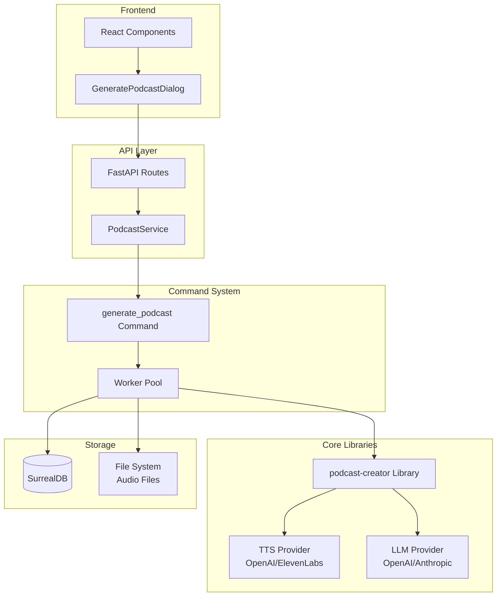
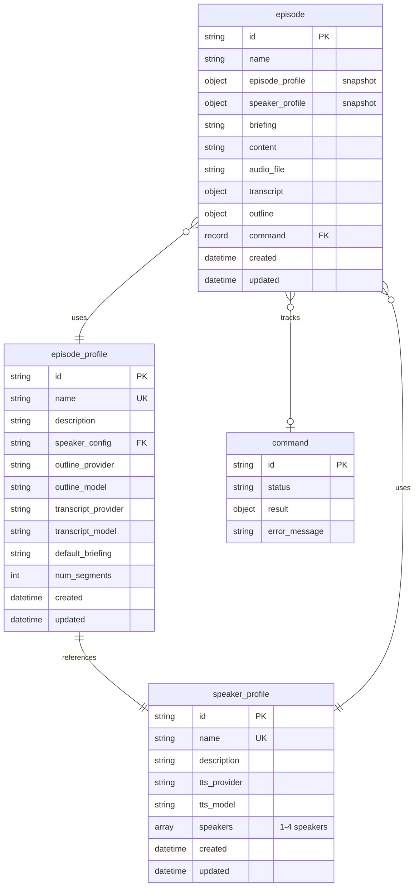
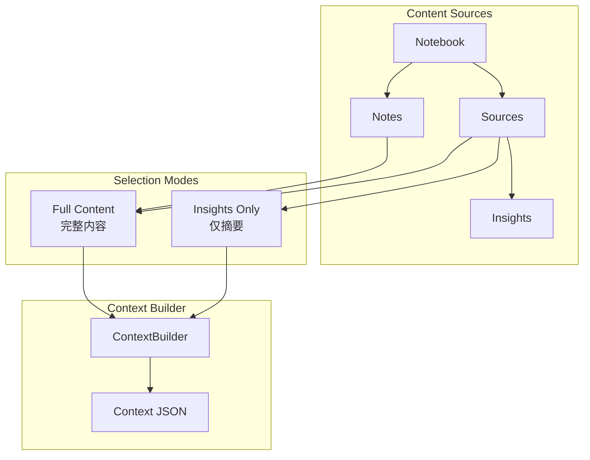
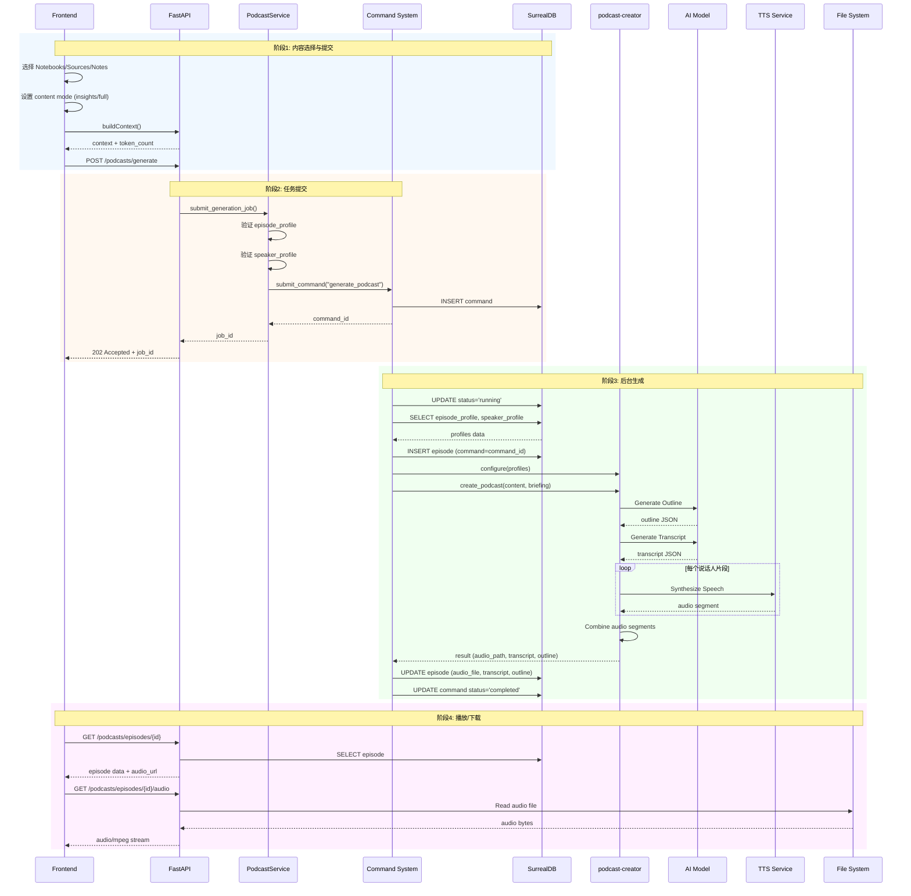
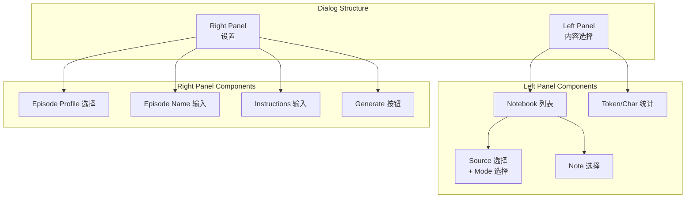
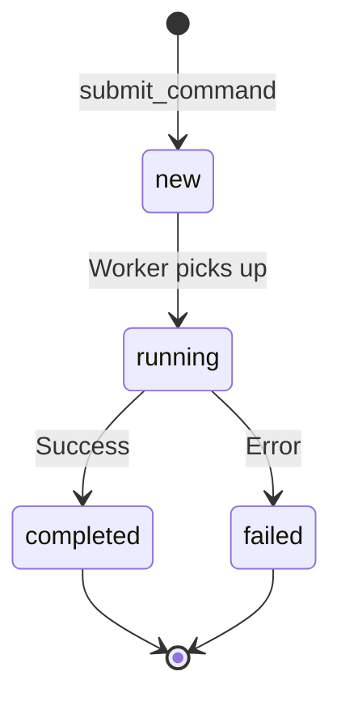
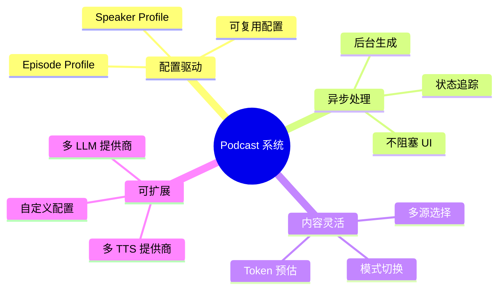

# Open Notebook: Podcast 生成系统详解

## 1. 概述

Open Notebook 集成了强大的播客生成功能，能够将笔记本中的研究内容自动转换为多人对话的播客节目。系统使用 **podcast-creator** 库作为核心引擎，结合 AI 模型生成大纲、脚本和语音。

### 1.1 核心能力

| 能力 | 描述 |
|------|------|
| **内容转换** | 将 Sources、Notes、Insights 转换为播客脚本 |
| **多角色对话** | 支持 1-4 位说话人的对话格式 |
| **AI 驱动** | 使用 LLM 生成大纲和脚本 |
| **TTS 合成** | 使用 OpenAI 等 TTS 服务生成语音 |
| **异步处理** | 后台生成，支持状态追踪 |

### 1.2 技术栈



---

## 2. 数据模型

### 2.1 核心实体关系



### 2.2 Episode Profile（剧集配置）

剧集配置定义了播客生成的 AI 模型和生成参数：

```python
class EpisodeProfile(ObjectModel):
    table_name: ClassVar[str] = "episode_profile"

    name: str                    # 唯一配置名称
    description: Optional[str]   # 配置描述
    speaker_config: str          # 关联的说话人配置名称
    outline_provider: str        # 大纲生成 AI 提供商 (openai, anthropic)
    outline_model: str           # 大纲生成模型 (gpt-4o-mini)
    transcript_provider: str     # 脚本生成 AI 提供商
    transcript_model: str        # 脚本生成模型
    default_briefing: str        # 默认生成指导语
    num_segments: int            # 播客分段数量 (3-20)
```

**数据库表定义**：

```sql
DEFINE TABLE IF NOT EXISTS episode_profile SCHEMAFULL;

DEFINE FIELD IF NOT EXISTS name ON TABLE episode_profile TYPE string;
DEFINE FIELD IF NOT EXISTS description ON TABLE episode_profile TYPE option<string>;
DEFINE FIELD IF NOT EXISTS speaker_config ON TABLE episode_profile TYPE string;
DEFINE FIELD IF NOT EXISTS outline_provider ON TABLE episode_profile TYPE string;
DEFINE FIELD IF NOT EXISTS outline_model ON TABLE episode_profile TYPE string;
DEFINE FIELD IF NOT EXISTS transcript_provider ON TABLE episode_profile TYPE string;
DEFINE FIELD IF NOT EXISTS transcript_model ON TABLE episode_profile TYPE string;
DEFINE FIELD IF NOT EXISTS default_briefing ON TABLE episode_profile TYPE string;
DEFINE FIELD IF NOT EXISTS num_segments ON TABLE episode_profile TYPE int DEFAULT 5;

-- 唯一索引
DEFINE INDEX IF NOT EXISTS idx_episode_profile_name
    ON TABLE episode_profile COLUMNS name UNIQUE CONCURRENTLY;
```

**预置配置示例**：

| 配置名称 | 说话人 | 分段数 | 用途 |
|----------|--------|--------|------|
| `tech_discussion` | tech_experts (2人) | 5 | 技术讨论 |
| `solo_expert` | solo_expert (1人) | 4 | 单人讲解 |
| `business_analysis` | business_panel (3人) | 6 | 商业分析 |

### 2.3 Speaker Profile（说话人配置）

说话人配置定义了播客中的角色和声音：

```python
class SpeakerProfile(ObjectModel):
    table_name: ClassVar[str] = "speaker_profile"

    name: str                    # 唯一配置名称
    description: Optional[str]   # 配置描述
    tts_provider: str            # TTS 提供商 (openai, elevenlabs)
    tts_model: str               # TTS 模型 (gpt-4o-mini-tts)
    speakers: List[Dict]         # 说话人列表 (1-4人)
```

**说话人结构**：

```python
speakers: [
    {
        "name": "Dr. Alex Chen",           # 角色名称
        "voice_id": "nova",                # TTS 声音 ID
        "backstory": "Senior AI researcher...",  # 背景故事
        "personality": "Analytical, clear..."    # 性格特征
    },
    {
        "name": "Jamie Rodriguez",
        "voice_id": "alloy",
        "backstory": "Full-stack engineer...",
        "personality": "Enthusiastic, practical..."
    }
]
```

**数据库表定义**：

```sql
DEFINE TABLE IF NOT EXISTS speaker_profile SCHEMAFULL;

DEFINE FIELD IF NOT EXISTS name ON TABLE speaker_profile TYPE string;
DEFINE FIELD IF NOT EXISTS description ON TABLE speaker_profile TYPE option<string>;
DEFINE FIELD IF NOT EXISTS tts_provider ON TABLE speaker_profile TYPE string;
DEFINE FIELD IF NOT EXISTS tts_model ON TABLE speaker_profile TYPE string;
DEFINE FIELD IF NOT EXISTS speakers ON TABLE speaker_profile TYPE array<object>;
DEFINE FIELD IF NOT EXISTS speakers.*.name ON TABLE speaker_profile TYPE string;
DEFINE FIELD IF NOT EXISTS speakers.*.voice_id ON TABLE speaker_profile TYPE option<string>;
DEFINE FIELD IF NOT EXISTS speakers.*.backstory ON TABLE speaker_profile TYPE option<string>;
DEFINE FIELD IF NOT EXISTS speakers.*.personality ON TABLE speaker_profile TYPE option<string>;

-- 唯一索引
DEFINE INDEX IF NOT EXISTS idx_speaker_profile_name
    ON TABLE speaker_profile COLUMNS name UNIQUE CONCURRENTLY;
```

### 2.4 Episode（播客剧集）

播客剧集记录了生成的内容和状态：

```python
class PodcastEpisode(ObjectModel):
    table_name: ClassVar[str] = "episode"

    name: str                              # 剧集名称
    episode_profile: Dict[str, Any]        # 使用的剧集配置快照
    speaker_profile: Dict[str, Any]        # 使用的说话人配置快照
    briefing: str                          # 生成指导语
    content: str                           # 源内容
    audio_file: Optional[str]              # 音频文件路径
    transcript: Optional[Dict[str, Any]]   # 生成的脚本
    outline: Optional[Dict[str, Any]]      # 生成的大纲
    command: Optional[RecordID]            # 关联的后台命令
```

---

## 3. 内容构建流程

### 3.1 从数据库获取内容

播客生成需要从笔记本中选择内容作为源材料：



### 3.2 ContextBuilder 工作流程

```python
# 构建上下文请求
context_config = {
    "sources": {
        "source_id_1": "insights",      # 仅包含摘要
        "source_id_2": "full content",  # 包含完整内容
    },
    "notes": {
        "note_id_1": "full content",
    }
}

# 调用 API 构建上下文
response = await chatApi.buildContext({
    notebook_id: "notebook:xxx",
    context_config: context_config
})

# 返回结果
{
    "context": {...},       # 构建的上下文对象
    "token_count": 12500,   # Token 数量
    "char_count": 45000     # 字符数量
}
```

### 3.3 Source.get_context() 方法

```python
async def get_context(
    self, context_size: Literal["short", "long"] = "short"
) -> Dict[str, Any]:
    """获取源的上下文内容"""
    insights_list = await self.get_insights()
    insights = [insight.model_dump() for insight in insights_list]

    if context_size == "long":
        # 完整内容模式：包含全文
        return dict(
            id=self.id,
            title=self.title,
            insights=insights,
            full_text=self.full_text,
        )
    else:
        # 摘要模式：仅包含洞察
        return dict(
            id=self.id,
            title=self.title,
            insights=insights
        )
```

---

## 4. 生成流程详解

### 4.1 完整生成流程



### 4.2 generate_podcast 命令详解

```python
@command("generate_podcast", app="open_notebook")
async def generate_podcast_command(
    input_data: PodcastGenerationInput,
) -> PodcastGenerationOutput:
    """
    Real podcast generation using podcast-creator library
    """
    start_time = time.time()

    # 1. 加载配置
    episode_profile = await EpisodeProfile.get_by_name(input_data.episode_profile)
    speaker_profile = await SpeakerProfile.get_by_name(episode_profile.speaker_config)

    # 2. 加载所有配置供 podcast-creator 使用
    episode_profiles = await repo_query("SELECT * FROM episode_profile")
    speaker_profiles = await repo_query("SELECT * FROM speaker_profile")

    # 转换为字典格式
    episode_profiles_dict = {p["name"]: p for p in episode_profiles}
    speaker_profiles_dict = {p["name"]: p for p in speaker_profiles}

    # 3. 生成 briefing
    briefing = episode_profile.default_briefing
    if input_data.briefing_suffix:
        briefing += f"\n\nAdditional instructions: {input_data.briefing_suffix}"

    # 4. 创建 Episode 记录并关联 command
    episode = PodcastEpisode(
        name=input_data.episode_name,
        episode_profile=episode_profile.model_dump(),
        speaker_profile=speaker_profile.model_dump(),
        command=ensure_record_id(input_data.execution_context.command_id),
        briefing=briefing,
        content=input_data.content,
    )
    await episode.save()

    # 5. 配置 podcast-creator
    configure("speakers_config", {"profiles": speaker_profiles_dict})
    configure("episode_config", {"profiles": episode_profiles_dict})

    # 6. 创建输出目录
    output_dir = Path(f"{DATA_FOLDER}/podcasts/episodes/{input_data.episode_name}")
    output_dir.mkdir(parents=True, exist_ok=True)

    # 7. 调用 podcast-creator 生成
    result = await create_podcast(
        content=input_data.content,
        briefing=briefing,
        episode_name=input_data.episode_name,
        output_dir=str(output_dir),
        speaker_config=speaker_profile.name,
        episode_profile=episode_profile.name,
    )

    # 8. 更新 Episode 记录
    episode.audio_file = str(result.get("final_output_file_path"))
    episode.transcript = {"transcript": result["transcript"]}
    episode.outline = result["outline"]
    await episode.save()

    return PodcastGenerationOutput(
        success=True,
        episode_id=str(episode.id),
        audio_file_path=episode.audio_file,
        transcript=episode.transcript,
        outline=episode.outline,
        processing_time=time.time() - start_time,
    )
```

---

## 5. podcast-creator 库

### 5.1 核心 API

```python
from podcast_creator import configure, create_podcast

# 配置说话人和剧集配置
configure("speakers_config", {"profiles": speaker_profiles_dict})
configure("episode_config", {"profiles": episode_profiles_dict})

# 生成播客
result = await create_podcast(
    content=content,              # 源内容文本
    briefing=briefing,            # 生成指导语
    episode_name=episode_name,    # 剧集名称
    output_dir=output_dir,        # 输出目录
    speaker_config=speaker_name,  # 说话人配置名称
    episode_profile=profile_name, # 剧集配置名称
)
```

### 5.2 生成结果结构

```python
result = {
    "final_output_file_path": "/data/podcasts/episodes/my-episode/final.mp3",
    "outline": {
        "segments": [
            {
                "title": "Introduction",
                "description": "...",
                "key_points": ["...", "..."]
            },
            # ... more segments
        ]
    },
    "transcript": {
        "segments": [
            {
                "speaker": "Dr. Alex Chen",
                "text": "Welcome to today's discussion...",
                "voice_id": "nova"
            },
            {
                "speaker": "Jamie Rodriguez",
                "text": "Thanks Alex, I'm excited to...",
                "voice_id": "alloy"
            },
            # ... more segments
        ]
    }
}
```

### 5.3 生成流程

```mermaid
graph TB
    subgraph "podcast-creator"
        INPUT[Content + Briefing]

        subgraph "Step 1: Outline Generation"
            OG[Outline Generator]
            OM[Outline Model<br/>gpt-4o-mini]
            OUTLINE[Outline JSON]
        end

        subgraph "Step 2: Transcript Generation"
            TG[Transcript Generator]
            TM[Transcript Model<br/>gpt-4o-mini]
            TRANS[Transcript JSON]
        end

        subgraph "Step 3: Audio Synthesis"
            loop 每个片段
                AS[Audio Synthesizer]
                TTS[TTS Model<br/>gpt-4o-mini-tts]
                SEG[Audio Segment]
            end
            MERGE[Merge Segments]
            FINAL[Final Audio MP3]
        end
    end

    INPUT --> OG
    OG --> OM
    OM --> OUTLINE
    OUTLINE --> TG
    TG --> TM
    TM --> TRANS
    TRANS --> AS
    AS --> TTS
    TTS --> SEG
    SEG --> MERGE
    MERGE --> FINAL
```

---

## 6. API 接口

### 6.1 Podcast 生成 API

```
POST /api/podcasts/generate
```

**请求体**：

```json
{
  "episode_profile": "tech_discussion",
  "speaker_profile": "tech_experts",
  "episode_name": "AI and Future of Work",
  "content": "Notebook: Research Notes\n{...context JSON...}",
  "briefing_suffix": "Focus on practical applications"
}
```

**响应**：

```json
{
  "job_id": "command:01HXYZ...",
  "status": "submitted",
  "message": "Podcast generation started for episode 'AI and Future of Work'",
  "episode_profile": "tech_discussion",
  "episode_name": "AI and Future of Work"
}
```

### 6.2 任务状态查询

```
GET /api/podcasts/jobs/{job_id}
```

**响应**：

```json
{
  "job_id": "command:01HXYZ...",
  "status": "completed",
  "result": {
    "success": true,
    "episode_id": "episode:abc123",
    "audio_file_path": "/data/podcasts/episodes/AI-Future/final.mp3",
    "processing_time": 125.5
  },
  "error_message": null,
  "created": "2025-01-03T10:00:00Z",
  "updated": "2025-01-03T10:02:05Z"
}
```

### 6.3 剧集列表

```
GET /api/podcasts/episodes
```

**响应**：

```json
[
  {
    "id": "episode:abc123",
    "name": "AI and Future of Work",
    "episode_profile": {...},
    "speaker_profile": {...},
    "briefing": "Create an engaging technical discussion...",
    "audio_file": "/data/podcasts/episodes/AI-Future/final.mp3",
    "audio_url": "/api/podcasts/episodes/episode:abc123/audio",
    "transcript": {...},
    "outline": {...},
    "created": "2025-01-03T10:00:00Z",
    "job_status": "completed"
  }
]
```

### 6.4 音频流

```
GET /api/podcasts/episodes/{episode_id}/audio
```

**响应**：`audio/mpeg` 流

### 6.5 Episode Profile API

| 方法 | 路由 | 功能 |
|------|------|------|
| GET | `/api/episode-profiles` | 列出所有配置 |
| GET | `/api/episode-profiles/{name}` | 获取单个配置 |
| POST | `/api/episode-profiles` | 创建配置 |
| PUT | `/api/episode-profiles/{id}` | 更新配置 |
| DELETE | `/api/episode-profiles/{id}` | 删除配置 |
| POST | `/api/episode-profiles/{id}/duplicate` | 复制配置 |

### 6.6 Speaker Profile API

| 方法 | 路由 | 功能 |
|------|------|------|
| GET | `/api/speaker-profiles` | 列出所有配置 |
| GET | `/api/speaker-profiles/{name}` | 获取单个配置 |
| POST | `/api/speaker-profiles` | 创建配置 |
| PUT | `/api/speaker-profiles/{id}` | 更新配置 |
| DELETE | `/api/speaker-profiles/{id}` | 删除配置 |
| POST | `/api/speaker-profiles/{id}/duplicate` | 复制配置 |

---

## 7. 前端交互

### 7.1 GeneratePodcastDialog 组件



### 7.2 内容选择模式

```typescript
type SourceMode = 'off' | 'insights' | 'full'

interface NotebookSelection {
  sources: Record<string, SourceMode>  // sourceId -> mode
  notes: Record<string, SourceMode>    // noteId -> mode
}

// 默认模式选择逻辑
function getSourceDefaultMode(source: SourceListResponse): SourceMode {
  // 如果有洞察，默认使用洞察模式（减少 token）
  return source.insights_count && source.insights_count > 0 ? 'insights' : 'full'
}
```

### 7.3 提交流程

```typescript
const handleSubmit = async () => {
  // 1. 构建内容
  const content = await buildContentFromSelections()

  // 2. 准备请求
  const payload: PodcastGenerationRequest = {
    episode_profile: selectedEpisodeProfile.name,
    speaker_profile: selectedEpisodeProfile.speaker_config,
    episode_name: episodeName.trim(),
    content,
    briefing_suffix: instructions.trim() || undefined,
  }

  // 3. 提交生成
  await generatePodcast.mutateAsync(payload)

  // 4. 关闭对话框
  onOpenChange(false)
}
```

---

## 8. 配置快照机制

### 8.1 为什么使用快照

Episode 记录中存储的是配置的**快照副本**而非引用：

```python
episode = PodcastEpisode(
    episode_profile=full_model_dump(episode_profile.model_dump()),  # 快照
    speaker_profile=full_model_dump(speaker_profile.model_dump()),  # 快照
    ...
)
```

**原因**：

1. **历史记录** - 即使配置被修改，仍能查看生成时使用的配置
2. **可追溯性** - 便于调试和重现问题
3. **独立性** - 配置删除不影响已生成的剧集

### 8.2 快照结构

```json
{
  "episode_profile": {
    "name": "tech_discussion",
    "speaker_config": "tech_experts",
    "outline_provider": "openai",
    "outline_model": "gpt-4o-mini",
    "transcript_provider": "openai",
    "transcript_model": "gpt-4o-mini",
    "default_briefing": "Create an engaging technical discussion...",
    "num_segments": 5
  },
  "speaker_profile": {
    "name": "tech_experts",
    "tts_provider": "openai",
    "tts_model": "gpt-4o-mini-tts",
    "speakers": [
      {
        "name": "Dr. Alex Chen",
        "voice_id": "nova",
        "backstory": "Senior AI researcher...",
        "personality": "Analytical, clear communicator..."
      },
      {
        "name": "Jamie Rodriguez",
        "voice_id": "alloy",
        "backstory": "Full-stack engineer...",
        "personality": "Enthusiastic, practical-minded..."
      }
    ]
  }
}
```

---

## 9. 文件存储

### 9.1 目录结构

```
{DATA_FOLDER}/
└── podcasts/
    └── episodes/
        ├── AI-and-Future-of-Work/
        │   ├── final.mp3           # 最终合成音频
        │   ├── segment_001.mp3     # 片段1
        │   ├── segment_002.mp3     # 片段2
        │   └── ...
        └── Business-Analysis-2024/
            └── ...
```

### 9.2 音频路径解析

```python
def _resolve_audio_path(audio_file: str) -> Path:
    """解析音频文件路径，支持 file:// 协议"""
    if audio_file.startswith("file://"):
        parsed = urlparse(audio_file)
        return Path(unquote(parsed.path))
    return Path(audio_file)
```

### 9.3 删除剧集时清理

```python
@router.delete("/podcasts/episodes/{episode_id}")
async def delete_podcast_episode(episode_id: str):
    episode = await PodcastService.get_episode(episode_id)

    # 删除物理文件
    if episode.audio_file:
        audio_path = _resolve_audio_path(episode.audio_file)
        if audio_path.exists():
            audio_path.unlink()  # 删除音频文件

    # 删除数据库记录
    await episode.delete()
```

---

## 10. 错误处理

### 10.1 常见错误

| 错误类型 | 原因 | 处理 |
|----------|------|------|
| Profile Not Found | 配置名称不存在 | 返回 404 |
| Content Required | 未选择任何内容 | 前端验证 |
| TTS Rate Limit | TTS API 限流 | 重试机制 |
| Invalid JSON Output | LLM 返回格式错误 | 特殊错误提示 |

### 10.2 GPT-5 Extended Thinking 问题

```python
# 检测 GPT-5 扩展思考问题
error_msg = str(e)
if "Invalid json output" in error_msg or "Expecting value" in error_msg:
    error_msg += (
        "\n\nNOTE: This error commonly occurs with GPT-5 models that use "
        "extended thinking. The model may be putting all output inside "
        "<think> tags, leaving nothing to parse. "
        "Try using gpt-4o, gpt-4o-mini, or gpt-4-turbo instead."
    )
```

---

## 11. 状态追踪

### 11.1 命令状态



### 11.2 Episode.get_job_status()

```python
async def get_job_status(self) -> Optional[str]:
    """获取关联命令的状态"""
    if not self.command:
        return None

    try:
        from surreal_commands import get_command_status
        status = await get_command_status(str(self.command))
        return status.status if status else "unknown"
    except Exception:
        return "unknown"
```

### 11.3 前端状态显示

```typescript
// 确定显示状态
let job_status: string | null = null
if (episode.command) {
  job_status = await episode.get_job_status()
} else if (episode.audio_file) {
  job_status = "completed"  // 有音频文件但无 command = 导入的剧集
}
```

---

## 12. 总结

### 12.1 架构优势



### 12.2 数据流总结

```
用户选择内容 (Notebooks/Sources/Notes)
        ↓
    构建 Context JSON (ContextBuilder)
        ↓
    选择 Episode Profile + Speaker Profile
        ↓
    提交生成任务 (surreal-commands)
        ↓
    后台 Worker 处理
        ↓
    podcast-creator 生成
        ├── Outline (LLM)
        ├── Transcript (LLM)
        └── Audio (TTS)
        ↓
    保存结果到 SurrealDB + File System
        ↓
    前端播放/下载
```

### 12.3 关键文件

| 文件 | 职责 |
|------|------|
| `open_notebook/domain/podcast.py` | 领域模型 |
| `api/routers/podcasts.py` | API 路由 |
| `api/podcast_service.py` | 业务服务 |
| `commands/podcast_commands.py` | 后台命令 |
| `migrations/7.surrealql` | 数据库 Schema |
| `frontend/.../GeneratePodcastDialog.tsx` | 前端对话框 |
