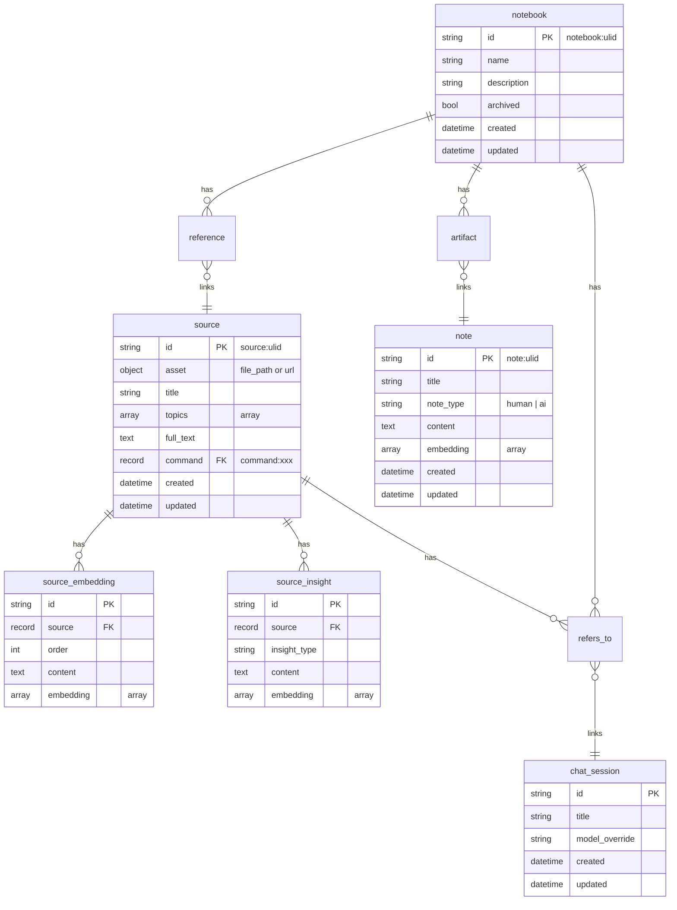
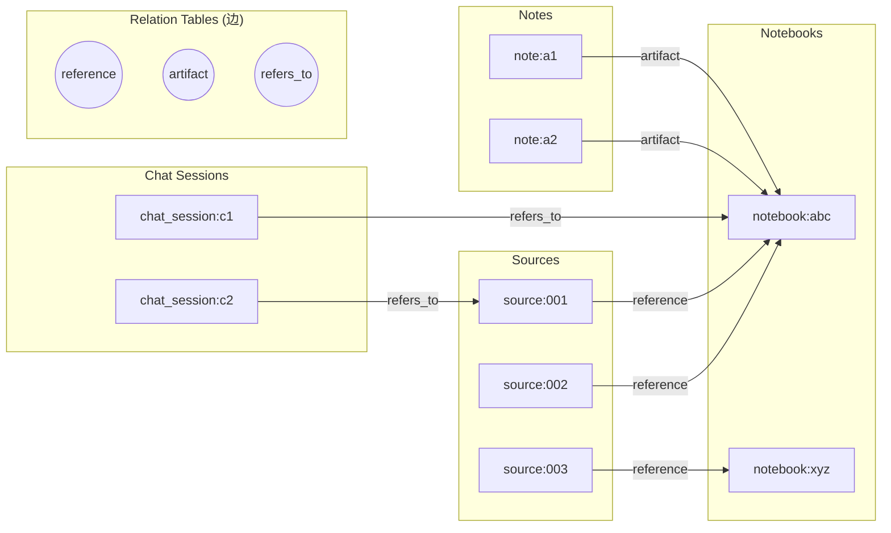
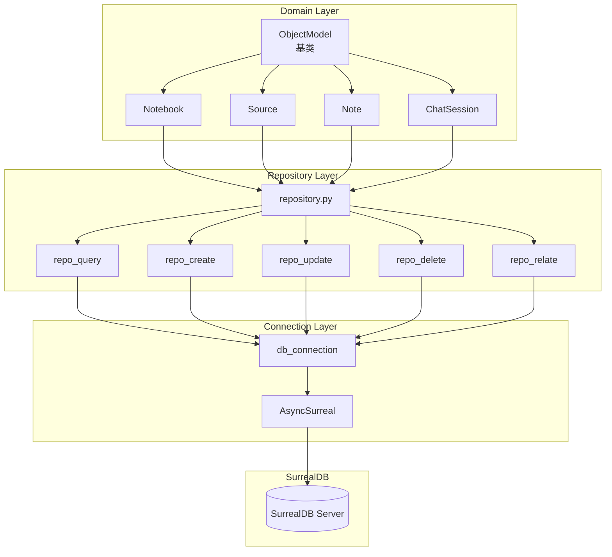
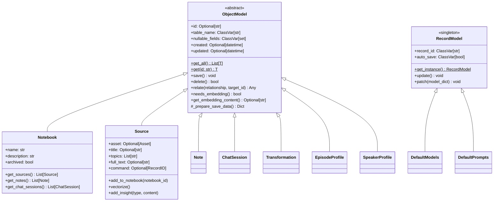
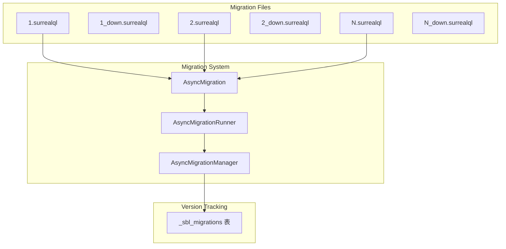
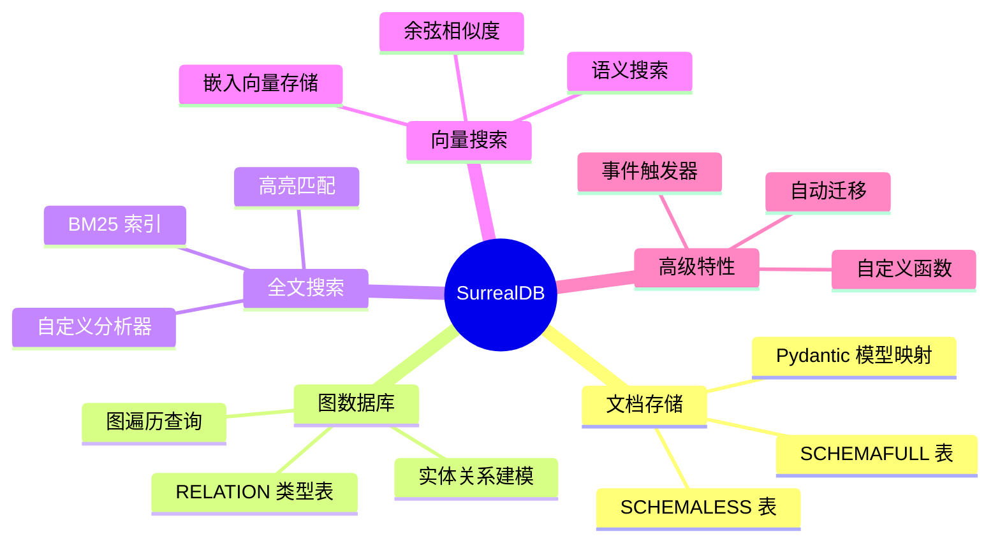

# Open Notebook: SurrealDB 使用详解

## 1. 概述

Open Notebook 使用 **SurrealDB** 作为其主要数据库，充分利用了 SurrealDB 的多模型特性：文档存储、图数据库、全文搜索和向量搜索。

### 1.1 为什么选择 SurrealDB

| 特性 | Open Notebook 中的应用 |
|------|------------------------|
| **文档数据库** | 存储 Notebook、Source、Note 等结构化数据 |
| **图数据库** | 通过 RELATION 表建立实体间的关系 |
| **全文搜索** | BM25 索引支持内容检索 |
| **向量搜索** | 余弦相似度实现语义搜索 |
| **实时订阅** | 支持数据变更通知 |
| **内置函数** | 自定义 SurrealQL 函数封装复杂查询 |

### 1.2 连接配置

```python
# 环境变量配置
SURREAL_URL = "ws://localhost:8000/rpc"  # WebSocket 连接
SURREAL_USER = "root"
SURREAL_PASSWORD = "root"
SURREAL_NAMESPACE = "open_notebook"
SURREAL_DATABASE = "open_notebook"
```

---

## 2. 数据模型定义

### 2.1 核心表结构



### 2.2 SurrealQL 表定义示例

```sql
-- 核心业务表定义
DEFINE TABLE IF NOT EXISTS source SCHEMAFULL;

DEFINE FIELD IF NOT EXISTS asset ON TABLE source FLEXIBLE TYPE option<object>;
DEFINE FIELD IF NOT EXISTS title ON TABLE source TYPE option<string>;
DEFINE FIELD IF NOT EXISTS topics ON TABLE source TYPE option<array<string>>;
DEFINE FIELD IF NOT EXISTS full_text ON TABLE source TYPE option<string>;
DEFINE FIELD IF NOT EXISTS command ON TABLE source TYPE option<record<command>>;

-- 自动时间戳
DEFINE FIELD IF NOT EXISTS created ON source DEFAULT time::now() VALUE $before OR time::now();
DEFINE FIELD IF NOT EXISTS updated ON source DEFAULT time::now() VALUE time::now();

-- 嵌入表
DEFINE TABLE IF NOT EXISTS source_embedding SCHEMAFULL;
DEFINE FIELD IF NOT EXISTS source ON TABLE source_embedding TYPE record<source>;
DEFINE FIELD IF NOT EXISTS order ON TABLE source_embedding TYPE int;
DEFINE FIELD IF NOT EXISTS content ON TABLE source_embedding TYPE string;
DEFINE FIELD IF NOT EXISTS embedding ON TABLE source_embedding TYPE array<float>;
```

### 2.3 表类型说明

| 表类型 | 关键字 | 用途 | 示例 |
|--------|--------|------|------|
| **SCHEMAFULL** | `DEFINE TABLE xxx SCHEMAFULL` | 严格模式，字段必须预定义 | `source`, `note`, `notebook` |
| **SCHEMALESS** | `DEFINE TABLE xxx SCHEMALESS` | 灵活模式，可动态添加字段 | `chat_session`, `podcast_config` |
| **RELATION** | `TYPE RELATION FROM x TO y` | 图边表，存储实体关系 | `reference`, `artifact`, `refers_to` |

---

## 3. 图结构与关系定义

### 3.1 关系表定义

Open Notebook 使用 SurrealDB 的 **RELATION 类型表** 来建立实体间的图关系：

```sql
-- Source -> Notebook 的引用关系
DEFINE TABLE IF NOT EXISTS reference
TYPE RELATION
FROM source TO notebook;

-- Note -> Notebook 的归属关系
DEFINE TABLE IF NOT EXISTS artifact
TYPE RELATION
FROM note TO notebook;

-- ChatSession -> Notebook|Source 的关联关系
DEFINE TABLE OVERWRITE refers_to
TYPE RELATION
FROM chat_session TO notebook|source;
```

### 3.2 图结构可视化



### 3.3 创建关系

**Python 代码**：

```python
# open_notebook/database/repository.py
async def repo_relate(
    source: str, relationship: str, target: str, data: Optional[Dict[str, Any]] = None
) -> List[Dict[str, Any]]:
    """Create a relationship between two records with optional data"""
    if data is None:
        data = {}
    query = f"RELATE {source}->{relationship}->{target} CONTENT $data;"
    return await repo_query(query, {"data": data})
```

**领域模型中的使用**：

```python
# open_notebook/domain/notebook.py
class Source(ObjectModel):
    async def add_to_notebook(self, notebook_id: str) -> Any:
        """将 Source 添加到 Notebook"""
        return await self.relate("reference", notebook_id)

class Note(ObjectModel):
    async def add_to_notebook(self, notebook_id: str) -> Any:
        """将 Note 添加到 Notebook"""
        return await self.relate("artifact", notebook_id)

class ChatSession(ObjectModel):
    async def relate_to_notebook(self, notebook_id: str) -> Any:
        return await self.relate("refers_to", notebook_id)

    async def relate_to_source(self, source_id: str) -> Any:
        return await self.relate("refers_to", source_id)
```

### 3.4 图遍历查询

**获取 Notebook 的所有 Sources**：

```python
async def get_sources(self) -> List["Source"]:
    srcs = await repo_query(
        """
        select * omit source.full_text from (
            select in as source from reference where out=$id
            fetch source
        ) order by source.updated desc
        """,
        {"id": ensure_record_id(self.id)},
    )
    return [Source(**src["source"]) for src in srcs] if srcs else []
```

**获取 Notebook 的所有 Notes**：

```python
async def get_notes(self) -> List["Note"]:
    srcs = await repo_query(
        """
        select * omit note.content, note.embedding from (
            select in as note from artifact where out=$id
            fetch note
        ) order by note.updated desc
        """,
        {"id": ensure_record_id(self.id)},
    )
    return [Note(**src["note"]) for src in srcs] if srcs else []
```

**获取 Notebook 的 ChatSessions（反向遍历）**：

```python
async def get_chat_sessions(self) -> List["ChatSession"]:
    srcs = await repo_query(
        """
        select * from (
            select <- chat_session as chat_session
            from refers_to
            where out=$id
            fetch chat_session
        ) order by chat_session.updated desc
        """,
        {"id": ensure_record_id(self.id)},
    )
    return [ChatSession(**src["chat_session"][0]) for src in srcs] if srcs else []
```

### 3.5 图遍历语法说明

| 语法 | 含义 | 示例 |
|------|------|------|
| `->relation->target` | 从当前记录沿关系遍历到目标 | `source:001->reference->notebook:abc` |
| `<-relation<-source` | 反向遍历，从目标回溯到源 | `notebook:abc<-reference<-source:001` |
| `in` | 关系的起始端（FROM 侧） | `select in from reference where out=$id` |
| `out` | 关系的目标端（TO 侧） | `select out from reference where in=$id` |
| `fetch` | 展开记录链接获取完整数据 | `fetch source` |

---

## 4. App 与 SurrealDB 交互

### 4.1 架构层次



### 4.2 数据库连接管理

```python
# open_notebook/database/repository.py
from surrealdb import AsyncSurreal, RecordID

@asynccontextmanager
async def db_connection():
    """异步数据库连接上下文管理器"""
    db = AsyncSurreal(get_database_url())
    await db.signin({
        "username": os.environ.get("SURREAL_USER"),
        "password": get_database_password(),
    })
    await db.use(
        os.environ.get("SURREAL_NAMESPACE"),
        os.environ.get("SURREAL_DATABASE")
    )
    try:
        yield db
    finally:
        await db.close()
```

### 4.3 Repository 层核心函数

```python
async def repo_query(query_str: str, vars: Optional[Dict] = None) -> List[Dict]:
    """执行 SurrealQL 查询"""
    async with db_connection() as connection:
        result = parse_record_ids(await connection.query(query_str, vars))
        return result

async def repo_create(table: str, data: Dict) -> Dict:
    """创建新记录"""
    data.pop("id", None)
    data["created"] = datetime.now(timezone.utc)
    data["updated"] = datetime.now(timezone.utc)
    async with db_connection() as connection:
        return parse_record_ids(await connection.insert(table, data))

async def repo_update(table: str, id: str, data: Dict) -> List[Dict]:
    """更新现有记录"""
    data["updated"] = datetime.now(timezone.utc)
    query = f"UPDATE {record_id} MERGE $data;"
    return await repo_query(query, {"data": data})

async def repo_delete(record_id: Union[str, RecordID]):
    """删除记录"""
    async with db_connection() as connection:
        return await connection.delete(ensure_record_id(record_id))

async def repo_upsert(table: str, id: str, data: Dict) -> List[Dict]:
    """创建或更新记录"""
    query = f"UPSERT {id if id else table} MERGE $data;"
    return await repo_query(query, {"data": data})

async def repo_relate(source: str, relationship: str, target: str, data: Dict = None):
    """创建关系"""
    query = f"RELATE {source}->{relationship}->{target} CONTENT $data;"
    return await repo_query(query, {"data": data or {}})
```

### 4.4 RecordID 处理

```python
def ensure_record_id(value: Union[str, RecordID]) -> RecordID:
    """确保值是 RecordID 类型"""
    if isinstance(value, RecordID):
        return value
    return RecordID.parse(value)

def parse_record_ids(obj: Any) -> Any:
    """递归将所有 RecordID 转换为字符串"""
    if isinstance(obj, dict):
        return {k: parse_record_ids(v) for k, v in obj.items()}
    elif isinstance(obj, list):
        return [parse_record_ids(item) for item in obj]
    elif isinstance(obj, RecordID):
        return str(obj)
    return obj
```

---

## 5. 领域模型与 ORM 模式

### 5.1 ObjectModel 基类



### 5.2 ObjectModel 核心实现

**静态方法 - 获取记录**：

```python
@classmethod
async def get_all(cls: Type[T], order_by=None) -> List[T]:
    """获取所有记录"""
    query = f"SELECT * FROM {cls.table_name}"
    if order_by:
        query += f" ORDER BY {order_by}"
    result = await repo_query(query)
    return [cls(**obj) for obj in result]

@classmethod
async def get(cls: Type[T], id: str) -> T:
    """根据 ID 获取单个记录"""
    result = await repo_query(
        "SELECT * FROM $id",
        {"id": ensure_record_id(id)}
    )
    if result:
        return cls(**result[0])
    raise NotFoundError(f"{cls.table_name} with id {id} not found")
```

**实例方法 - 保存记录**：

```python
async def save(self) -> None:
    """保存记录（新建或更新）"""
    data = self._prepare_save_data()
    data["updated"] = datetime.now().strftime("%Y-%m-%d %H:%M:%S")

    # 自动生成嵌入向量
    if self.needs_embedding():
        embedding_content = self.get_embedding_content()
        if embedding_content:
            EMBEDDING_MODEL = await model_manager.get_embedding_model()
            data["embedding"] = (
                (await EMBEDDING_MODEL.aembed([embedding_content]))[0]
                if EMBEDDING_MODEL else []
            )

    if self.id is None:
        # 新建
        data["created"] = datetime.now().strftime("%Y-%m-%d %H:%M:%S")
        repo_result = await repo_create(self.__class__.table_name, data)
    else:
        # 更新
        repo_result = await repo_update(self.__class__.table_name, self.id, data)

    # 更新实例属性
    for key, value in repo_result[0].items():
        if hasattr(self, key):
            setattr(self, key, value)
```

### 5.3 RecordModel - 单例记录模式

用于存储全局配置的单例记录：

```python
class DefaultModels(RecordModel):
    record_id: ClassVar[str] = "open_notebook:default_models"
    default_chat_model: Optional[str] = None
    default_embedding_model: Optional[str] = None
    default_tools_model: Optional[str] = None
    # ...

class DefaultPrompts(RecordModel):
    record_id: ClassVar[str] = "open_notebook:default_prompts"
    transformation_instructions: Optional[str] = None
```

**使用方式**：

```python
# 获取单例实例
defaults = await DefaultModels.get_instance()

# 更新配置
defaults.default_chat_model = "model:abc123"
await defaults.update()
```

---

## 6. 全文搜索

### 6.1 分析器定义

```sql
-- 定义文本分析器
DEFINE ANALYZER IF NOT EXISTS my_analyzer
    TOKENIZERS blank, class, camel, punct
    FILTERS snowball(english), lowercase;
```

| 组件 | 类型 | 功能 |
|------|------|------|
| `blank` | Tokenizer | 按空白字符分词 |
| `class` | Tokenizer | 按字符类别分词 |
| `camel` | Tokenizer | 驼峰命名分词 |
| `punct` | Tokenizer | 按标点分词 |
| `snowball(english)` | Filter | 英语词干提取 |
| `lowercase` | Filter | 转小写 |

### 6.2 全文搜索索引

```sql
-- 为多个字段创建 BM25 全文索引
DEFINE INDEX IF NOT EXISTS idx_source_title
    ON TABLE source
    COLUMNS title
    SEARCH ANALYZER my_analyzer BM25 HIGHLIGHTS;

DEFINE INDEX IF NOT EXISTS idx_source_full_text
    ON TABLE source
    COLUMNS full_text
    SEARCH ANALYZER my_analyzer BM25 HIGHLIGHTS;

DEFINE INDEX IF NOT EXISTS idx_note
    ON TABLE note
    COLUMNS content
    SEARCH ANALYZER my_analyzer BM25 HIGHLIGHTS;
```

### 6.3 全文搜索函数

```sql
DEFINE FUNCTION IF NOT EXISTS fn::text_search(
    $query_text: string,
    $match_count: int,
    $sources: bool,
    $show_notes: bool
) {
    -- 搜索 Source 标题
    let $source_title_search =
        IF $sources {(
            SELECT id, title,
                   search::highlight('`', '`', 1) as content,
                   math::max(search::score(1)) AS relevance
            FROM source
            WHERE title @1@ $query_text
            GROUP BY id
        )}
        ELSE { [] };

    -- 搜索 Source 全文
    let $source_full_search =
        IF $sources {(
            SELECT id, title,
                   search::highlight('`', '`', 1) as content,
                   math::max(search::score(1)) AS relevance
            FROM source
            WHERE full_text @1@ $query_text
            GROUP BY id
        )}
        ELSE { [] };

    -- 搜索 Note 内容
    let $note_content_search =
        IF $show_notes {(
            SELECT id, title,
                   search::highlight('`', '`', 1) as content,
                   math::max(search::score(1)) AS relevance
            FROM note
            WHERE content @1@ $query_text
            GROUP BY id
        )}
        ELSE { [] };

    -- 合并并排序结果
    let $final_results = array::union(
        array::union($source_title_search, $source_full_search),
        $note_content_search
    );

    RETURN (
        SELECT id, parent_id, title, math::max(relevance) as relevance
        FROM $final_results
        WHERE id IS NOT NONE
        GROUP BY id, parent_id, title
        ORDER BY relevance DESC
        LIMIT $match_count
    );
};
```

**关键语法**：

| 语法 | 含义 |
|------|------|
| `@1@` | 全文匹配操作符 |
| `search::score(1)` | 获取匹配分数 |
| `search::highlight('`', '`', 1)` | 高亮匹配内容 |

---

## 7. 向量搜索

### 7.1 向量存储

嵌入向量存储在以下字段中：

```sql
-- source_embedding 表：源文档的分块嵌入
DEFINE FIELD embedding ON TABLE source_embedding TYPE array<float>;

-- source_insight 表：洞察内容的嵌入
DEFINE FIELD embedding ON TABLE source_insight TYPE array<float>;

-- note 表：笔记内容的嵌入
DEFINE FIELD embedding ON TABLE note TYPE array<float>;
```

### 7.2 向量搜索函数

```sql
DEFINE FUNCTION IF NOT EXISTS fn::vector_search(
    $query: array<float>,
    $match_count: int,
    $sources: bool,
    $show_notes: bool,
    $min_similarity: float
) {
    -- 搜索源文档嵌入
    let $source_embedding_search =
        IF $sources {(
            SELECT
                source.id as id,
                source.title as title,
                content,
                vector::similarity::cosine(embedding, $query) as similarity
            FROM source_embedding
            WHERE embedding != none
              AND array::len(embedding) = array::len($query)
              AND vector::similarity::cosine(embedding, $query) >= $min_similarity
            ORDER BY similarity DESC
            LIMIT $match_count
        )}
        ELSE { [] };

    -- 搜索洞察嵌入
    let $source_insight_search =
        IF $sources {(
            SELECT
                id,
                insight_type + ' - ' + (source.title OR '') as title,
                content,
                vector::similarity::cosine(embedding, $query) as similarity
            FROM source_insight
            WHERE embedding != none
              AND array::len(embedding) = array::len($query)
              AND vector::similarity::cosine(embedding, $query) >= $min_similarity
            ORDER BY similarity DESC
            LIMIT $match_count
        )}
        ELSE { [] };

    -- 搜索笔记嵌入
    let $note_content_search =
        IF $show_notes {(
            SELECT
                id, title, content,
                vector::similarity::cosine(embedding, $query) as similarity
            FROM note
            WHERE embedding != none
              AND array::len(embedding) = array::len($query)
              AND vector::similarity::cosine(embedding, $query) >= $min_similarity
            ORDER BY similarity DESC
            LIMIT $match_count
        )}
        ELSE { [] };

    -- 合并结果
    let $all_results = array::union(
        array::union($source_embedding_search, $source_insight_search),
        $note_content_search
    );

    RETURN (
        SELECT id, parent_id, title,
               math::max(similarity) as similarity,
               array::flatten(content) as matches
        FROM $all_results
        WHERE id IS NOT NONE
        GROUP BY id, parent_id, title
        ORDER BY similarity DESC
        LIMIT $match_count
    );
};
```

### 7.3 Python 调用

```python
async def vector_search(
    keyword: str,
    results: int,
    source: bool = True,
    note: bool = True,
    minimum_score: float = 0.2,
):
    """向量相似度搜索"""
    EMBEDDING_MODEL = await model_manager.get_embedding_model()
    if EMBEDDING_MODEL is None:
        raise ValueError("EMBEDDING_MODEL is not configured")

    # 将查询文本转换为向量
    embed = (await EMBEDDING_MODEL.aembed([keyword]))[0]

    # 调用 SurrealDB 向量搜索函数
    search_results = await repo_query(
        """
        SELECT * FROM fn::vector_search($embed, $results, $source, $note, $minimum_score);
        """,
        {
            "embed": embed,
            "results": results,
            "source": source,
            "note": note,
            "minimum_score": minimum_score,
        },
    )
    return search_results
```

---

## 8. 事件触发器

### 8.1 级联删除

```sql
-- 当 Source 被删除时，自动删除相关的嵌入和洞察
DEFINE EVENT IF NOT EXISTS source_delete
ON TABLE source
WHEN ($after == NONE)
THEN {
    DELETE source_embedding WHERE source == $before.id;
    DELETE source_insight WHERE source == $before.id;
};
```

### 8.2 事件触发器说明

| 属性 | 含义 |
|------|------|
| `$before` | 操作前的记录状态 |
| `$after` | 操作后的记录状态 |
| `$after == NONE` | 表示记录被删除 |

---

## 9. 数据库迁移系统

### 9.1 迁移架构



### 9.2 迁移版本追踪

```sql
-- 迁移记录表
CREATE _sbl_migrations:1 SET version = 1, applied_at = time::now();
CREATE _sbl_migrations:2 SET version = 2, applied_at = time::now();
-- ...
```

### 9.3 迁移管理器

```python
class AsyncMigrationManager:
    def __init__(self):
        self.up_migrations = [
            AsyncMigration.from_file("migrations/1.surrealql"),
            AsyncMigration.from_file("migrations/2.surrealql"),
            # ... 最多 9 个迁移
        ]
        self.down_migrations = [
            AsyncMigration.from_file("migrations/1_down.surrealql"),
            # ...
        ]

    async def needs_migration(self) -> bool:
        """检查是否需要迁移"""
        current_version = await self.get_current_version()
        return current_version < len(self.up_migrations)

    async def run_migration_up(self):
        """执行所有待迁移"""
        await self.runner.run_all()
```

### 9.4 API 启动时自动迁移

```python
# api/main.py
@asynccontextmanager
async def lifespan(app: FastAPI):
    """API 启动时自动执行数据库迁移"""
    migration_manager = AsyncMigrationManager()

    if await migration_manager.needs_migration():
        logger.warning("Database migrations are pending. Running migrations...")
        await migration_manager.run_migration_up()
        logger.success("Migrations completed successfully")
    else:
        logger.info("Database is already at the latest version")

    yield  # 应用运行

    logger.info("API shutdown complete")
```

---

## 10. 迁移历史

| 版本 | 主要变更 |
|------|----------|
| **1** | 创建核心表（source, note, notebook）、关系表（reference, artifact）、全文搜索索引、`fn::text_search`、`fn::vector_search` |
| **2** | 添加 `note_type` 字段 |
| **3** | 创建 `chat_session` 表和 `refers_to` 关系，优化搜索函数 |
| **4** | 优化搜索函数的结果格式 |
| **5** | 创建 `transformation` 表和默认转换模板 |
| **6** | 更新模型提供商名称 |
| **7** | 创建播客相关表（`episode_profile`, `speaker_profile`, `episode`） |
| **8** | 支持 ChatSession 同时关联 Notebook 和 Source，添加 `source.command` 字段 |
| **9** | 优化向量搜索函数，添加维度检查 |

---

## 11. 最佳实践

### 11.1 查询优化

```python
# 使用 omit 排除大字段
await repo_query("""
    SELECT * omit source.full_text FROM source
""")

# 使用 fetch 展开关联记录
await repo_query("""
    SELECT in as source FROM reference
    WHERE out = $id
    FETCH source
""", {"id": notebook_id})

# 使用参数化查询防止注入
await repo_query(
    "SELECT * FROM source WHERE id = $id",
    {"id": ensure_record_id(source_id)}
)
```

### 11.2 事务处理

```python
# SurrealDB 会自动处理事务冲突
# 通过 surreal-commands 的重试机制处理
@command(
    "embed_chunk",
    retry={
        "max_attempts": 5,
        "retry_on": [RuntimeError],  # 事务冲突抛出 RuntimeError
    },
)
async def embed_chunk_command(input_data):
    try:
        await repo_query("CREATE source_embedding CONTENT {...}")
    except RuntimeError:
        # 重新抛出以触发重试
        raise
```

### 11.3 ID 处理

```python
# 始终使用 ensure_record_id 处理 ID
from open_notebook.database.repository import ensure_record_id

# 将字符串转换为 RecordID
record_id = ensure_record_id("source:abc123")

# 将 RecordID 转换回字符串（用于 JSON 序列化）
from open_notebook.database.repository import parse_record_ids
result = parse_record_ids(db_result)
```

---

## 12. 总结

### 12.1 SurrealDB 在 Open Notebook 中的应用



### 12.2 技术优势

| 特性 | 优势 |
|------|------|
| **多模型统一** | 无需维护多个数据库（文档 + 图 + 搜索 + 向量） |
| **SurrealQL** | 表达力强的查询语言，支持复杂的图遍历和聚合 |
| **内置函数** | 封装复杂查询逻辑，简化应用代码 |
| **自动迁移** | API 启动时自动执行，确保 Schema 一致性 |
| **异步支持** | 原生 AsyncIO 支持，与 FastAPI 完美集成 |
