# Open Notebook: SurrealDB 与 Worker 交互机制详解

## 1. 概述

Open Notebook 采用基于 **surreal-commands** 库的后台任务处理架构，实现了 SurrealDB 与 Worker 之间的高效协作。这种设计将耗时操作（如文档处理、向量化、播客生成）从 HTTP 请求周期中解耦，避免连接池耗尽，提供更好的用户体验。

### 1.1 核心组件

| 组件 | 职责 |
|------|------|
| **SurrealDB** | 命令队列存储、状态持久化、业务数据存储 |
| **surreal-commands** | 命令定义、注册、提交、执行、重试机制 |
| **Worker Pool** | 后台命令执行、并发控制 |
| **API Layer** | 命令提交入口、状态查询接口 |

### 1.2 设计理念

```
关键原则：
1. 异步优先 - 长时间运行的操作不阻塞用户界面
2. 可靠性 - 通过 SurrealDB 持久化确保任务不丢失
3. 可观测性 - 命令状态可查询、可追踪
4. 弹性 - 自动重试处理瞬态故障
```

---

## 2. 系统架构

### 2.1 整体架构图

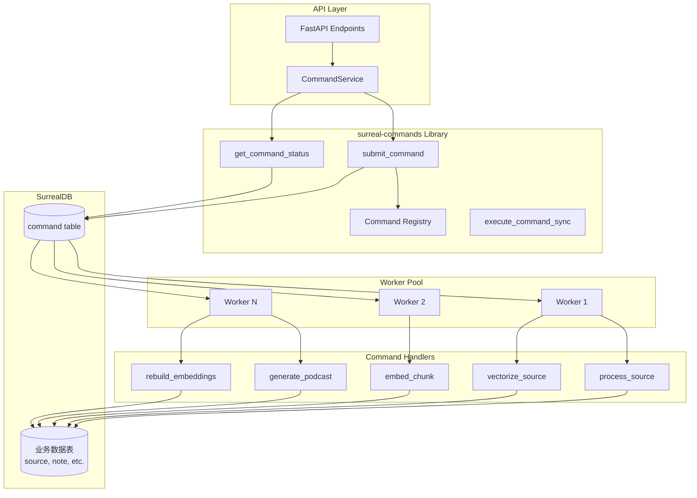

### 2.2 命令流转时序图

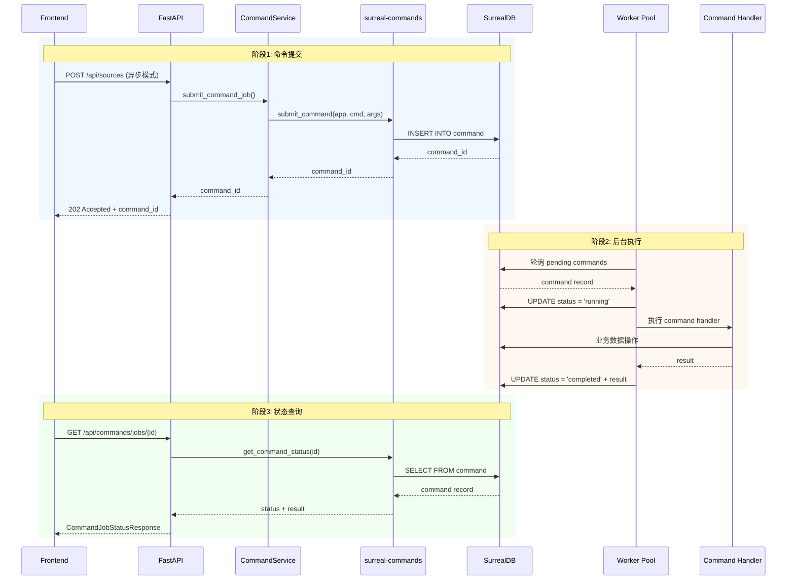

---

## 3. 核心机制详解

### 3.1 命令注册与定义

命令通过 `@command` 装饰器定义和注册：

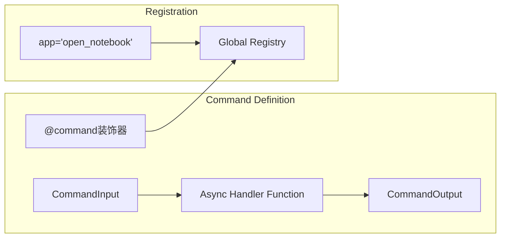

**命令定义示例**：

```python
from surreal_commands import CommandInput, CommandOutput, command

class SourceProcessingInput(CommandInput):
    source_id: str
    content_state: Dict[str, Any]
    notebook_ids: List[str]
    transformations: List[str]
    embed: bool

class SourceProcessingOutput(CommandOutput):
    success: bool
    source_id: str
    embedded_chunks: int
    insights_created: int
    processing_time: float
    error_message: Optional[str]

@command(
    "process_source",           # 命令名称
    app="open_notebook",        # 应用标识
    retry={                     # 重试配置
        "max_attempts": 5,
        "wait_strategy": "exponential_jitter",
        "wait_min": 1,
        "wait_max": 30,
        "retry_on": [RuntimeError],
    },
)
async def process_source_command(
    input_data: SourceProcessingInput,
) -> SourceProcessingOutput:
    # 命令处理逻辑
    ...
```

### 3.2 命令提交流程

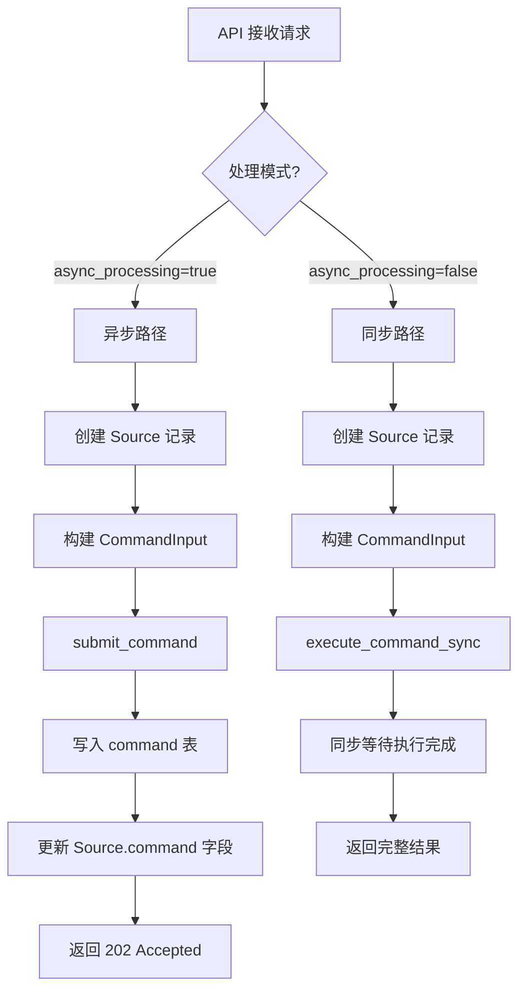

**异步提交代码示例**：

```python
# api/routers/sources.py
from surreal_commands import submit_command
from api.command_service import CommandService

# 提交异步命令
command_id = await CommandService.submit_command_job(
    "open_notebook",      # app name
    "process_source",     # command name
    command_input.model_dump(),
)

# 更新 Source 记录关联 command
source.command = ensure_record_id(command_id)
await source.save()
```

### 3.3 SurrealDB command 表结构

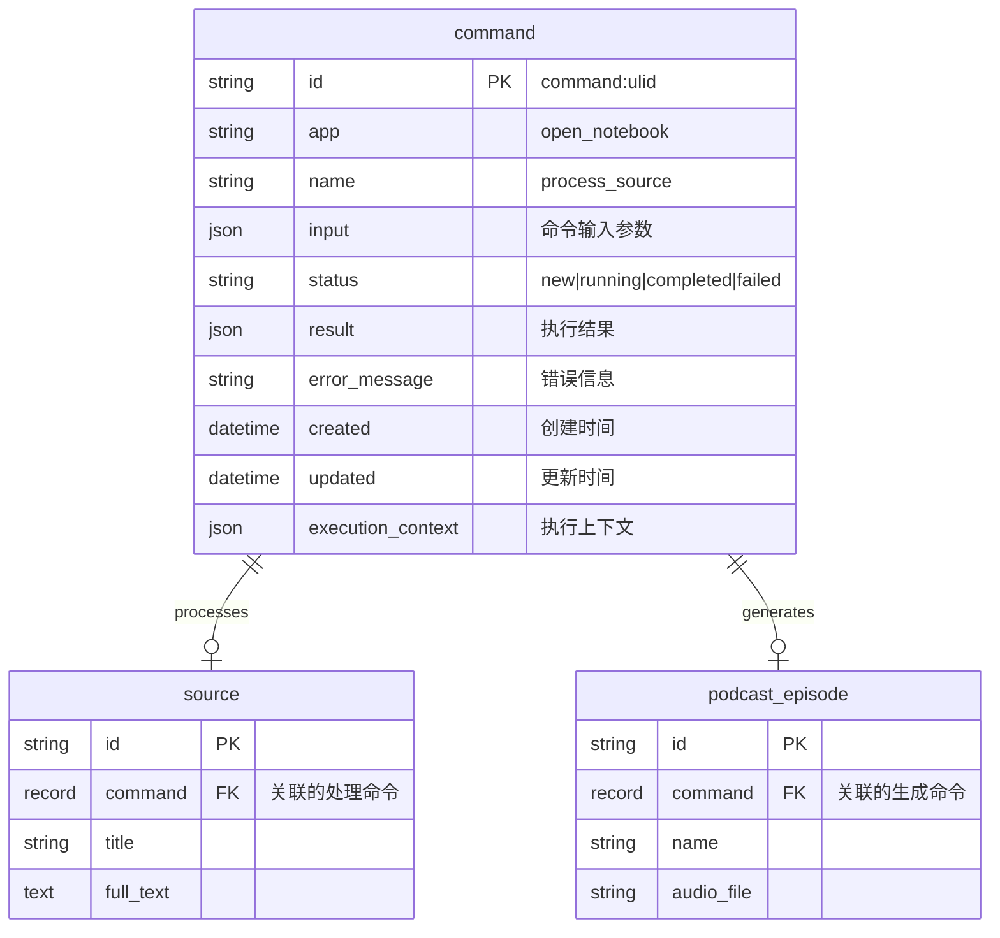

### 3.4 Worker 轮询与执行机制

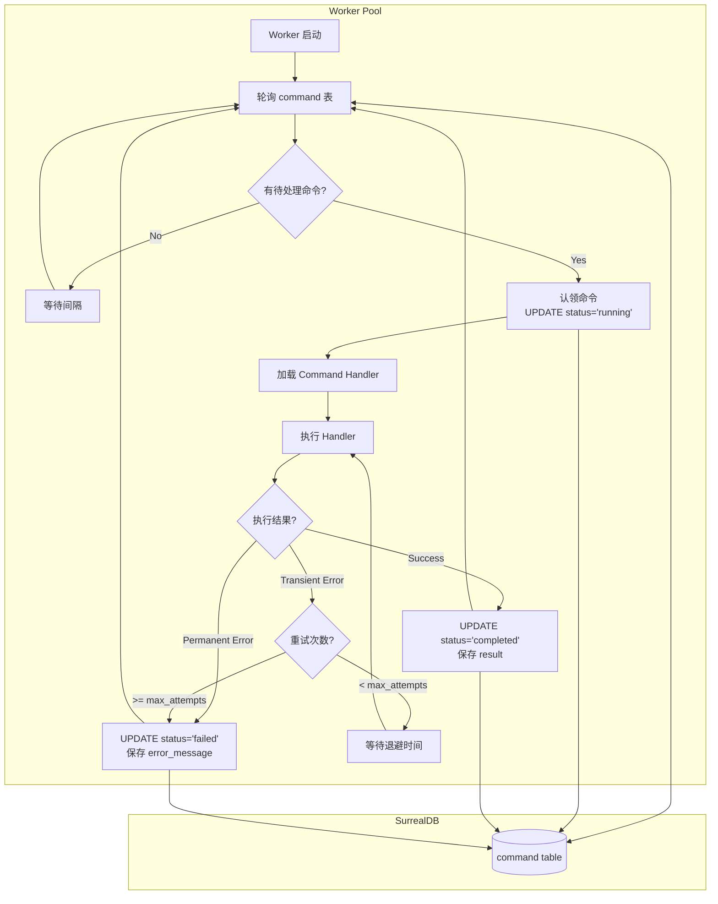

---

## 4. 重试机制

### 4.1 重试策略类型

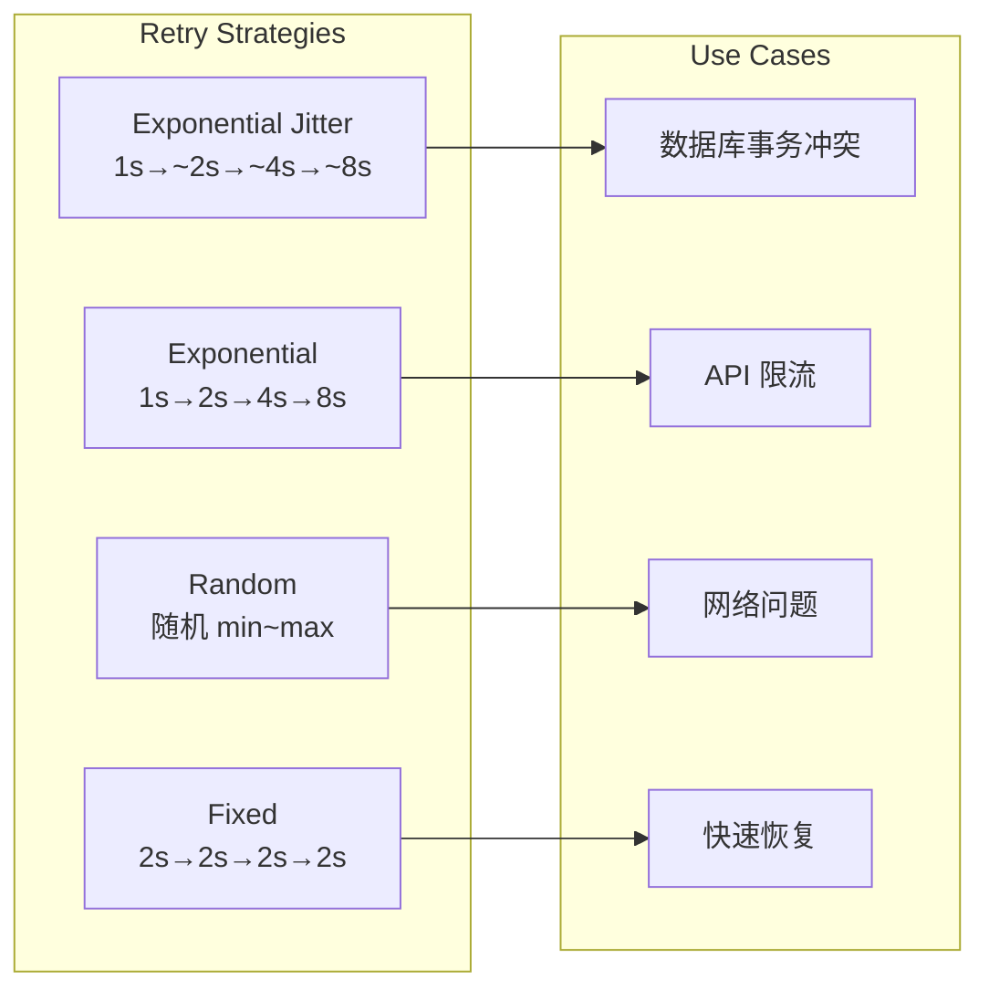

### 4.2 可重试与不可重试错误

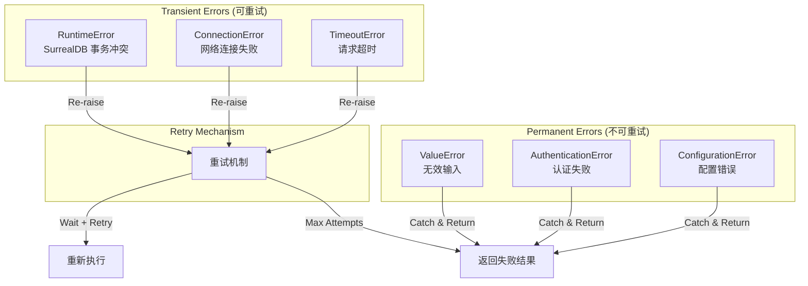

### 4.3 重试配置示例

```python
# 高并发数据库操作 - 使用 exponential_jitter
@command(
    "embed_chunk",
    app="open_notebook",
    retry={
        "max_attempts": 5,
        "wait_strategy": "exponential_jitter",
        "wait_min": 1,
        "wait_max": 30,
        "retry_on": [RuntimeError, ConnectionError, TimeoutError],
    },
)
async def embed_chunk_command(input_data):
    try:
        # 执行嵌入操作
        ...
    except RuntimeError:
        # 重新抛出以触发重试
        raise
    except ValueError as e:
        # 永久错误，直接返回失败
        return EmbedChunkOutput(success=False, error_message=str(e))

# 编排命令 - 禁用重试，快速失败
@command("vectorize_source", app="open_notebook", retry=None)
async def vectorize_source_command(input_data):
    # 子任务有自己的重试逻辑
    ...
```

---

## 5. 命令类型与数据流

### 5.1 已注册的命令

| 命令名称 | 用途 | 重试策略 |
|----------|------|----------|
| `process_source` | 处理源内容（提取文本、生成洞察） | 5次，exponential_jitter |
| `vectorize_source` | 编排向量化任务 | 禁用（快速失败） |
| `embed_chunk` | 嵌入单个文本块 | 5次，exponential_jitter |
| `embed_single_item` | 嵌入单个项目 | 默认 |
| `rebuild_embeddings` | 批量重建嵌入 | 禁用（快速失败） |
| `generate_podcast` | 生成播客音频 | 默认 |

### 5.2 源处理完整数据流

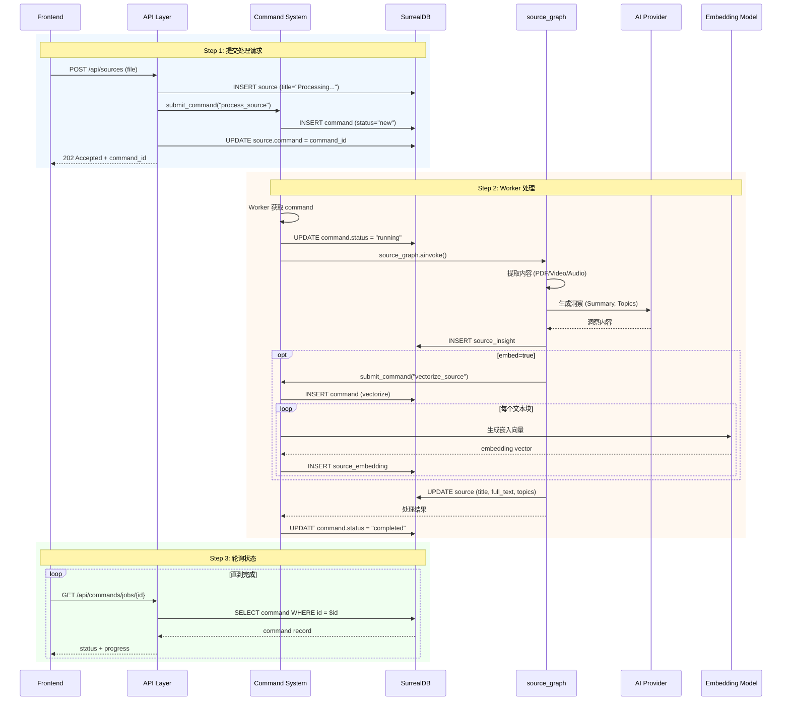

### 5.3 向量化分层任务模式

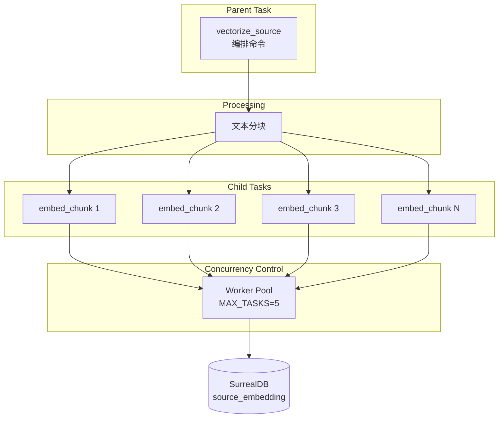

**代码实现**：

```python
@command("vectorize_source", app="open_notebook", retry=None)
async def vectorize_source_command(input_data):
    # 1. 删除现有嵌入（幂等性）
    await repo_query(
        "DELETE source_embedding WHERE source = $source_id",
        {"source_id": ensure_record_id(input_data.source_id)}
    )

    # 2. 文本分块
    chunks = split_text(source.full_text)

    # 3. 提交每个块作为独立任务
    for idx, chunk_text in enumerate(chunks):
        submit_command(
            "open_notebook",
            "embed_chunk",
            {
                "source_id": input_data.source_id,
                "chunk_index": idx,
                "chunk_text": chunk_text,
            }
        )

    return VectorizeSourceOutput(
        success=True,
        total_chunks=len(chunks),
        jobs_submitted=len(chunks),
    )
```

---

## 6. API 接口

### 6.1 命令管理接口

```mermaid
graph LR
    subgraph "Command API Endpoints"
        POST[POST /api/commands/jobs<br/>提交命令]
        GET_ONE[GET /api/commands/jobs/{id}<br/>查询单个状态]
        GET_LIST[GET /api/commands/jobs<br/>列表查询]
        DELETE[DELETE /api/commands/jobs/{id}<br/>取消命令]
        DEBUG[GET /api/commands/registry/debug<br/>调试注册表]
    end
```

### 6.2 请求与响应模型

**提交命令请求**：
```json
{
  "command": "process_source",
  "app": "open_notebook",
  "input": {
    "source_id": "source:abc123",
    "content_state": {"file_path": "/uploads/doc.pdf"},
    "notebook_ids": ["notebook:xyz"],
    "transformations": [],
    "embed": true
  }
}
```

**状态响应**：
```json
{
  "job_id": "command:01HXYZ...",
  "status": "completed",
  "result": {
    "success": true,
    "source_id": "source:abc123",
    "embedded_chunks": 42,
    "insights_created": 5,
    "processing_time": 12.34
  },
  "error_message": null,
  "created": "2025-01-03T10:00:00Z",
  "updated": "2025-01-03T10:00:12Z"
}
```

---

## 7. 状态查询与关联

### 7.1 Source 与 Command 关联

```mermaid
graph LR
    subgraph "Source Record"
        S[Source]
        S_ID[id: source:abc]
        S_CMD[command: command:xyz]
        S_TITLE[title: "Document.pdf"]
    end

    subgraph "Command Record"
        C[Command]
        C_ID[id: command:xyz]
        C_STATUS[status: completed]
        C_RESULT[result: {...}]
    end

    S_CMD -->|references| C_ID
```

### 7.2 批量状态查询优化

```python
# api/routers/sources.py - 批量获取命令状态
async def get_sources(...):
    # 收集所有 command_ids
    command_ids = [str(row["command"]) for row in result if row.get("command")]

    # 并发获取状态（限制并发数）
    semaphore = asyncio.Semaphore(10)

    async def get_status_with_limit(command_id):
        async with semaphore:
            return await get_command_status(command_id)

    # 批量获取
    status_results = await asyncio.gather(
        *[get_status_with_limit(cmd_id) for cmd_id in command_ids],
        return_exceptions=True
    )
```

---

## 8. 配置与调优

### 8.1 环境变量配置

```bash
# Worker 并发控制
SURREAL_COMMANDS_MAX_TASKS=5          # Worker 池大小

# 重试配置
SURREAL_COMMANDS_RETRY_ENABLED=true   # 启用重试
SURREAL_COMMANDS_RETRY_MAX_ATTEMPTS=3 # 最大重试次数
SURREAL_COMMANDS_RETRY_WAIT_STRATEGY=exponential_jitter  # 重试策略
SURREAL_COMMANDS_RETRY_WAIT_MIN=1     # 最小等待时间(秒)
SURREAL_COMMANDS_RETRY_WAIT_MAX=30    # 最大等待时间(秒)
```

### 8.2 调优场景

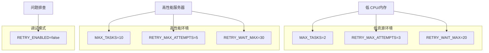

---

## 9. 事务冲突处理

### 9.1 冲突发生场景

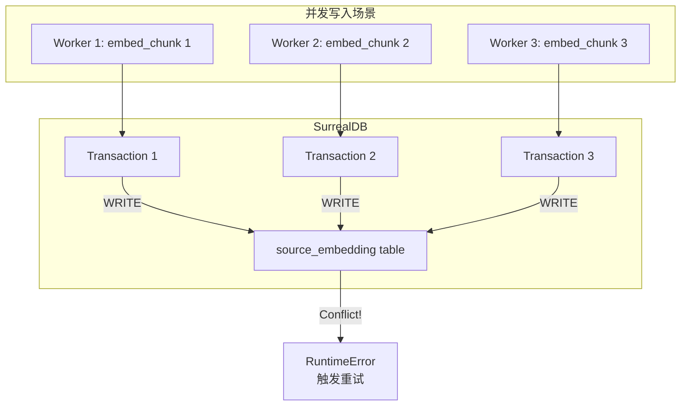

### 9.2 冲突处理流程

```mermaid
flowchart TD
    START[执行数据库写入] --> TRY[尝试提交事务]
    TRY --> CHECK{事务结果?}

    CHECK -->|Success| DONE[完成]
    CHECK -->|Conflict| ERROR[RuntimeError:<br/>"read or write conflict"]

    ERROR --> RERAISE[重新抛出异常]
    RERAISE --> RETRY_MECH[重试机制捕获]
    RETRY_MECH --> BACKOFF[等待退避时间<br/>1s → ~2s → ~4s]
    BACKOFF --> TRY

    RETRY_MECH -->|达到最大次数| FAIL[标记为失败]
```

---

## 10. 完整工作流示例

### 10.1 播客生成流程

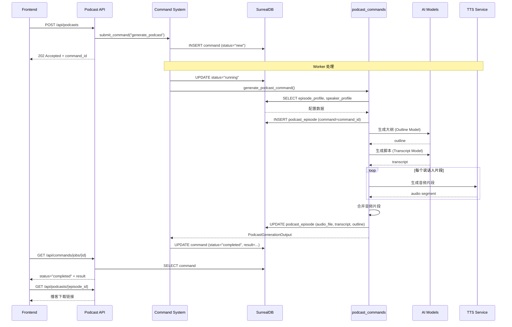

---

## 11. 监控与调试

### 11.1 日志输出示例

```
INFO     Starting source processing for source: source:abc123
INFO     Loaded 2 transformations
INFO     Updated source source:abc123 with command reference
INFO     Processing source with 1 notebooks
INFO     Starting vectorization orchestration for source:abc123
INFO     Deleting existing embeddings for source:abc123
INFO     Splitting text into chunks for source:abc123
INFO     Split into 42 chunks
INFO     Submitting 42 chunk jobs to worker queue
INFO       Submitted 42/42 chunk jobs
WARNING  Transaction conflict for chunk 15 - will be retried by retry mechanism
DEBUG    Successfully embedded chunk 15 for source source:abc123
INFO     Successfully processed source: source:abc123 in 12.34s
INFO     Created 5 insights and 42 embedded chunks
```

### 11.2 调试端点

```bash
# 查看已注册的命令
GET /api/commands/registry/debug

# 响应示例
{
  "total_commands": 6,
  "commands_by_app": {
    "open_notebook": [
      "process_source",
      "vectorize_source",
      "embed_chunk",
      "embed_single_item",
      "rebuild_embeddings",
      "generate_podcast"
    ]
  }
}
```

---

## 12. 总结

### 12.1 架构优势

| 优势 | 说明 |
|------|------|
| **解耦** | HTTP 请求与后台处理分离，避免超时 |
| **可靠** | SurrealDB 持久化确保任务不丢失 |
| **可扩展** | Worker Pool 支持水平扩展 |
| **弹性** | 自动重试处理瞬态故障 |
| **可观测** | 命令状态可查询、可追踪 |
| **并发控制** | 通过 Worker Pool 大小控制并发 |

### 12.2 交互模式总结

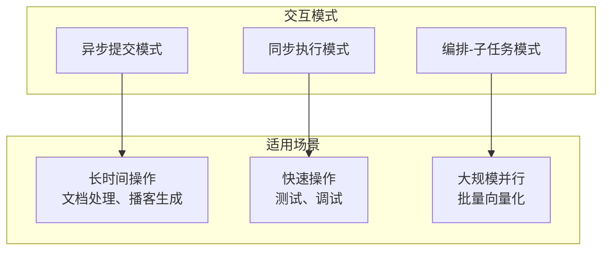

### 12.3 最佳实践

1. **使用异步模式** - 对于可能超过几秒的操作
2. **配置合理重试** - 针对操作类型选择合适的重试策略
3. **监控重试率** - 高重试率可能表示需要降低并发
4. **利用幂等性** - 编排命令删除现有数据再重建
5. **分层任务** - 大任务拆分为小任务，各自有重试逻辑
